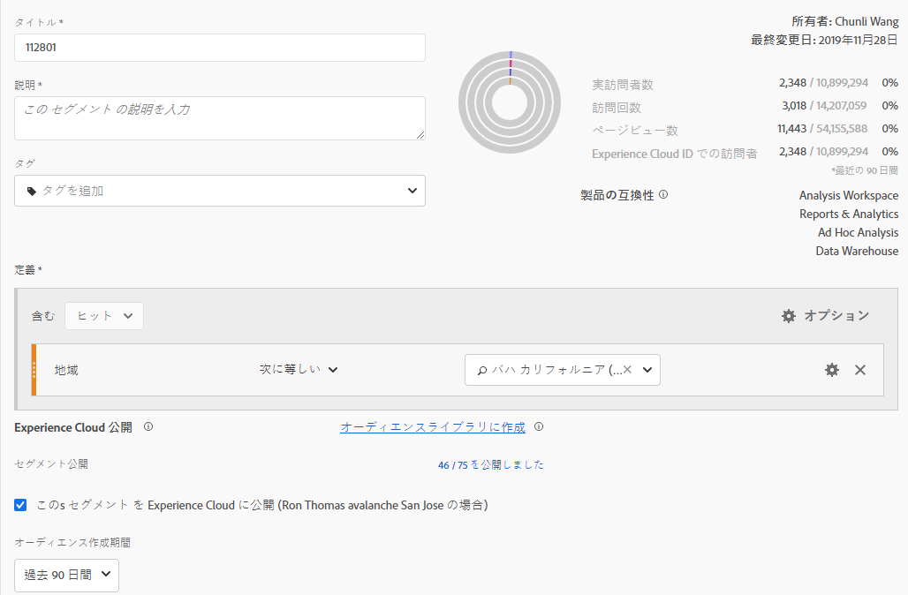
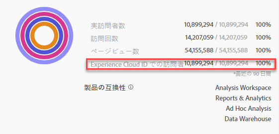
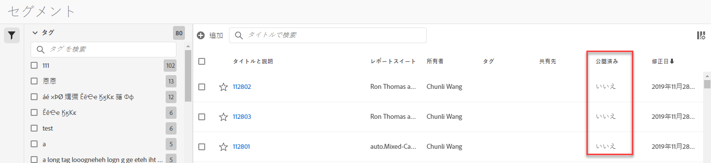
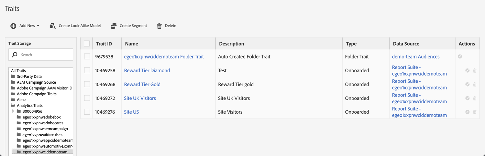

# Experience Cloud へのセグメントの公開

Adobe Analytics セグメントを Experience Cloud に公開すると、[!DNL Audience Manager] や、Adobe の [!DNL Advertising Cloud]、[!DNL Target]、[!DNL Campaign] などの他のアクティベーションチャネルでのマーケティングアクティビティでセグメントを使用できます。最近の更新で、公開ワークフローが大幅に最適化されました。Analytics のセグメントを Experience Cloud へと 8 時間以内に公開できるようになりました。これらのセグメントを使用して、Audience Manager 内のオーディエンスを、すべてのダウンストリームの宛先でアクティブ化します。

また、公開可能な Adobe Analytics セグメントの最大数を 20 から 75 に増やしました。公開したセグメントは、[!UICONTROL Analytics／Components／Segments] で表示できます。

>[!NOTE]
>
> Adobe Campaign（Classic と Standard）の動作は、8 時間の遅延に加えて 24 時間の遅延が発生する点が異なります。

## 前提条件

* このセグメントの保存先となるレポートスイートが [Experience Cloud に対して有効](https://docs.adobe.com/content/help/ja-JP/core-services/interface/audiences/t-publish-audience-segment.html)になっていることを確認します。そうしないと、Experience Cloud に公開できません。
* [Experience Cloud 組織にマッピングされた](https://docs.adobe.com/content/help/ja-JP/core-services/interface/about-core-services/report-suite-mapping.html)レポートスイートで作業していることを確認します。
* 組織が Experience Cloud ID を使用していることを確認します。
* セグメントを公開する前に、管理者は [Admin Console](https://docs.adobe.com/content/help/ja-JP/core-services/interface/manage-users-and-products/admin-getting-started.html) で製品プロファイルに[!UICONTROL セグメントの公開]権限を割り当て、製品プロファイルにユーザーを追加する必要があります。

## 注意点

* **レポートスイートの制限**：レポートスイートごとに最大 75 個のセグメントを公開できます。この制限は適用されます。既に 75 個のセグメントが公開されている場合、公開を取り消してセグメント数が 75 個のセグメントしきい値を下回るまで、追加のセグメントを公開することはできません。
* **メンバーシップの制限**：Adobe Analytics から [!DNL Experience Cloud] に共有するオーディエンスの個別メンバーの数が 2,000 万を超えてはなりません。
* **データプライバシー**：オーディエンスは、訪問者の認証状態に基づいてフィルタリングされません。訪問者が未認証状態および認証状態でサイトを閲覧できる場合、訪問者が未認証のときに生じるアクションによって、訪問者がオーディエンスに含められる可能性があります。オーディエンス共有がプライバシーに与える影響をすべて理解するには、[Adobe Experience Cloud](https://www.adobe.com/jp/privacy/experience-cloud.html) のプライバシーを確認します。
* **[!DNL Adobe Analytics] と [!DNL Audience Manager]** のセグメント間の違いについては、[こちら](https://docs.adobe.com/content/help/ja-JP/analytics/integration/audience-analytics/audience-analytics-workflow/aam-analytics-segments.html)を参照してください。

## セグメント公開タイムライン

| 利用可能な情報 | 利用可能な場合 | 利用可能な場所 |
|---|---|---|
| メタデータ（セグメントのタイトルと定義） | 公開直後 | [!DNL Audience Manager]、[!UICONTROL Experience Cloud オーディエンスライブラリ]、[!DNL Target] |
| メンバーシップを持つ使用可能なセグメント | 公開後 8 時間以内 | [!DNL Audience Manager] の訪問者プロファイルビューア |
| 特性とメンバーシップの母集団 | 24 ～ 48 時間以内 | [!DNL Audience Manager] |

>[!NOTE]
>週に 1 回、すべてのデータは、前週に取り込まれていない差分や不一致を考慮して完全に同期されます。

## [!UICONTROL セグメントビルダー]でのセグメントの公開

1. **[!UICONTROL Analytics／Workspace／コンポーネント／セグメント]／+** に移動します。
1. [!UICONTROL セグメントビルダー]でセグメントを作成します。
1. セグメントのタイトルと説明を指定します。指定しない場合は、セグメントを保存できません。
1. 「**[!UICONTROL Experience Cloud にこのセグメントを公開 (*レポートスイート*用)]**」をオンにします。

>[!IMPORTANT]
>Adobe Analytics の数値と Audience Manager の数値を比較する際には、Analytics でセグメントプレビューを確認する際に、「個別訪問者数」の合計ではなく、「Experience Cloud ID を持つ訪問者」を使用してください。
>
>

| 要素 | 説明 |
|---|---|
| **[!UICONTROL Experience Cloud にこのセグメントを公開（*`<report suite>`*)]** | このオプションを有効にすると、セグメントのタイトルと定義（例：広告プラットフォームで頻繁に使用されるシェルオーディエンス）が瞬時に Experience Cloud で共有され、セグメントのメンバーシップが 4 時間ごとに評価および共有されます。 そのオーディエンスが [!DNL Target] のアクティビティと関連付けられている場合、[!DNL Analytics] は、その Experience Cloud および [!DNL Target] オーディエンスの対象となる訪問者の ID の送信を開始します。その時点で、オーディエンス名と対応するデータが Experience Cloud オーディエンスページに表示され始めます。  |
| **[!UICONTROL オーディエンス作成期間]** | 選択した時間枠を使用して、周期的なカレンダーベースでオーディエンスが作成されます。例えば、「過去 30 日間」（デフォルト）には、今日の日付（セグメントが作成された元の日付からではない）から過去 30 日間にオーディエンス資格を持っていた訪問者が含まれます。 |
| **[!UICONTROL オーディエンスライブラリに作成]** | 作成および公開したセグメントは、Experience Cloud オーディエンスライブラリで待ち時間なく使用できます。Analytics の更新には依存しません。これらのセグメントは、公開済みの 75 個のセグメントの制限に対してはカウントされません。 |
| **[!UICONTROL x / 75 個公開済み]** | Experience Cloud に公開したセグメントの数を表示します。リンクをクリックすると、公開済みのセグメントと、関連するレポートスイートおよび所有者のリストが表示されます。 |
| **[!UICONTROL 保存]** | このセグメントを保存します。 |

## セグメントの非公開または削除

Experience Cloud に公開されているセグメントを削除するには、まず非公開にする必要があります。セグメントを非公開にするには、公開するために使用したチェックボックスの&#x200B;**チェックを解除**&#x200B;します。

>[!NOTE]
>
>次のいずれかのアドビソリューションで現在使用中のセグメントの公開を取り消すことは&#x200B;**できません**：[!DNL Analytics]（[!DNL Audience Analytics]の場合）、[!DNL Campaign]、[!DNL Advertising Cloud]（[!DNL Core Service] および [!DNL Audience Manager] 顧客の場合）、およびその他すべての外部パートナー（[!DNL Audience Manager] の顧客の場合）。[!DNL Target] で使用中のセグメントを非公開にすることが&#x200B;**できます**。

## [!UICONTROL セグメントマネージャ]でのセグメントの公開状況の表示

1. [!UICONTROL Analytics／コンポーネント／セグメント]に移動します。
1. 新しい「[!UICONTROL 公開済み]」列に注目します。はい／いいえは、セグメントが Experience Cloud に公開されたかどうかを示します。

## [!DNL Audience Manager] UUID の取得

ブラウザーに現在関連付けられている AAM UUID を取得するには、次の 2 つの方法があります。

* Adobe Experience Cloud デバッガー
* ブラウザーのネイティブ開発者ツール（Chrome Developer Tools など）

次のスクリーンショットは、ブラウザーで AAM UUID を取得し、Audience Manager 訪問者プロファイルビューアで AAM UUID を使用して特性とセグメントのメンバーシップを検証する方法を示しています。

**方法 1：Adobe Experience Cloud デバッガーの使用**

1. Chrome Web Store で [Adobe Experience Cloud Debugger](https://docs.adobe.com/content/help/ja-JP/analytics/implementation/validate/debugger.html) をダウンロードしてインストールします。
1. ページの読み込み時にデバッガーを起動します。
1. 「Audience Manager」セクションまでスクロールし、現在のブラウザーページで設定されている AAM UUID を見つけます（以下の例の `50814298273775797762943354787774730612` を参照）。

**方法 2：Chrome Developer Tools（または他のブラウザー開発者ツール）を使用する**

1. ページを読み込む前に Chrome Developer Tools を起動します。
1. ページを読み込み、アプリケーション／Cookie を確認します。AAM UUID は、サードパーティ Demdex cookie（下の例では [adobe.demdex.net](https://docs.adobe.com/content/help/ja-JP/audience-manager/user-guide/reference/demdex-calls.html) に設定する必要があります）。demdex フィールドは、ブラウザー上の AAM UUID 設定です（以下の例は `50814298273775797762943354787774730612`）。

## Audience Manager [!UICONTROL 訪問者プロファイルビューアを使用する]

[!UICONTROL 訪問者プロファイルビューア]が読み込まれると、ブラウザーの AAM UUID がデフォルトで使用されます。他のユーザーの特性の関連付けを確認する場合は、「UUID」フィールドに UUID を入力し、「[!UICONTROL 更新]」をクリックします。詳しくは、[訪問者プロファイルビューア](https://docs.adobe.com/content/help/ja-JP/audience-manager/user-guide/features/visitor-profile-viewer.html)を参照してください。

## [!DNL Audience Manager] でセグメント特性を表示する

AAM では、Analytics が Experience Cloud とセグメントを共有するので、特定のセグメントの ECID を持つ訪問者のリストがストリーミング方式で評価されます。

1. [!DNL Audience Manager] で、[!UICONTROL オーディエンスデータ／特性／Analytics 特性]に移動します。Experience Cloud 組織にマップされている各 Analytics レポートスイートのフォルダーが表示されます。これらのフォルダー（特性、セグメントおよびデータソースの場合）は、プロファイルおよび Audiences／People コアサービスが開始またはプロビジョニングされると作成されます。
1. [!DNL Audience Manager] と共有する、過去にセグメントを作成したレポートスイートのフォルダーを選択します。作成したセグメント／オーディエンスが表示されます。セグメントを共有すると、[!DNL Audience Manager] で次の 2 つがおこなわれます。
* データが入っていない特性が作成されます。セグメントが[!DNL Analytics] で公開されてから約 8 時間後に、ECID のリストがオンボードされ、[!DNL Audience Manager] および他の Experience Cloud ソリューションと共有されるようになります。

* 1 つの特性セグメントが作成されます。セグメントを公開したレポートスイートに関連付けられているデータソースを使用します。
* 特性の有効期限が 16 日に設定されました（以前は 2 日でした）。

## セグメントを [!DNL Adobe Target] で表示する

「[!UICONTROL このセグメントを Experience Cloud に公開]」チェックボックスを Adobe Analytics でセグメント作成処理中にオンにすると、Adobe Target のカスタムオーディエンスライブラリ内でセグメントを使用できるようになります。Analytics または Audience Manager で作成されたセグメントは、Target のアクティビティで使用できます。例えば、Analytics コンバージョン指標および Analytics で作成されたオーディエンスセグメントに基づいてキャンペーンアクティビティを作成できます。

1. 「[!UICONTROL オーディエンス]」をクリックします。
1. [!UICONTROL Audiences] ページで、[!DNL Experience Cloud] からのオーディエンスを探します。これらのオーディエンスは、[!DNL Target] アクティビティで使用できます。
