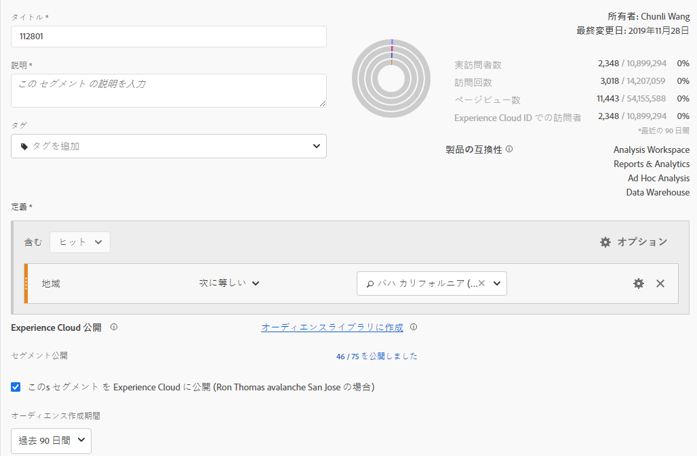

# セグメントの公開 {#publish-segments}

>[!CONTEXTUALHELP]
>id="components_segments_publishing"
>title="Experience Cloud での公開"
>abstract="オーディエンスをオーディエンスライブラリに公開し、Target やその他の Experience Cloud ソリューションでマーケティングアクティビティに使用できます。"

>[!CONTEXTUALHELP]
>id="components_segments_audiencelibrary"
>title="オーディエンスライブラリ"
>abstract="オーディエンスライブラリで作成されたセグメントは即座に利用でき、Analytics の更新には依存しません。"

Adobe Analytics セグメントをExperience Cloudに公開できます。 そのため、[!DNL Audience Manager]やその他のアクティブ化チャネル（[!DNL Advertising Cloud]、[!DNL Target]、[!DNL Campaign]など）で、マーケティング活動にセグメントを使用できます。

Analytics セグメントは、8時間以内にExperience Cloudに公開できます。 これらのセグメントを使用して、Audience Manager 内のオーディエンスを、すべてのダウンストリームの宛先でアクティブ化します。

>[!BEGINSHADEBOX]

デモ動画については、 [&#x200B; セグメントを公開](https://experienceleague.adobe.com/en/docs/analytics-learn/tutorials/integrations/experience-cloud/improved-experience-cloud-audience-publishing){target="_blank"}を参照してください。

>[!ENDSHADEBOX]

>[!NOTE]
>
> Adobe Campaign（Classic と Standard）の動作は、8 時間の遅延に加えて 24 時間の遅延が発生する点が異なります。

## 前提条件

* このセグメントを保存するレポートスイートが、Experience Cloud[に対して](/help/components/segmentation/segmentation-workflow/seg-publish.md)有効になっていることを確認してください。 それ以外の場合は、Experience Cloudに公開できません。
* 組織が Experience Cloud ID を使用していることを確認します。
* セグメントを公開する前に、管理者は [Admin Console](https://experienceleague.adobe.com/ja/docs/core-services/interface/administration/admin-tool-experience-cloud) で製品プロファイルに[!UICONTROL セグメントの公開]権限を割り当て、製品プロファイルにユーザーを追加する必要があります。

## 注意点

* **レポートスイートの制限**：レポートスイートごとに最大 75 個のセグメントを公開できます。この制限は適用されます。既に 75 個のセグメントが公開されている場合、公開を取り消してセグメント数が 75 個のセグメントしきい値を下回るまで、追加のセグメントを公開することはできません。
* **メンバーシップの制限**：Adobe Analytics から [!DNL Experience Cloud] に共有するオーディエンスの個別メンバーの数が 2,000 万を超えてはなりません。
* **データプライバシー**：オーディエンスは、訪問者の認証状態に基づいてフィルタリングされません。訪問者は、未認証の状態や認証された状態でサイトを閲覧できる可能性があります。 訪問者が未認証の場合に発生するアクションは、引き続き訪問者をオーディエンスに含めることができます。 オーディエンス共有がプライバシーに与える影響をすべて理解するには、[Adobe Experience Cloud](https://www.adobe.com/jp/privacy/experience-cloud.html) のプライバシーを確認します。
* **と[!DNL Adobe Analytics]のセグメント間の[!DNL Audience Manager]**&#x200B;相違点について詳しくは、[AnalyticsとAudience Managerのセグメントについて](/help/integrate/c-audience-analytics/aam-analytics-segments.md)を参照してください。

## セグメント公開タイムライン

| 利用可能な情報 | 利用可能な場合 | 利用可能な場所 |
|---|---|---|
| メタデータ（セグメントのタイトルと定義） | 公開直後 | [!DNL Audience Manager]、[!UICONTROL Experience Cloud オーディエンスライブラリ]、[!DNL Target] |
| メンバーシップを持つ使用可能なセグメント | 公開後 8 時間以内 | [!DNL Audience Manager] の訪問者プロファイルビューア |
| 特性とメンバーシップの母集団 | 24 ～ 48 時間以内 | [!DNL Audience Manager] |

>[!NOTE]
>週に1回、すべてのデータが完全に同期され、前週に取得されなかった差分や不一致を考慮します。

## [!UICONTROL &#x200B; セグメントビルダー]でのセグメントの公開

1. Adobe Analyticsで、**[!UICONTROL コンポーネント]** > **[!UICONTROL セグメント]**&#x200B;に移動します
1. 「**[!UICONTROL 追加]**」を選択して、新しいセグメントを作成します。
   
1. セグメントのタイトルと説明を入力します。 セグメントを保存する前に、これらのフィールドが必須です。
1. 「**[!UICONTROL Experience Cloud公開]**」セクションで、「**[!UICONTROL このセグメントをExperience Cloudに公開する（*レポートスイート*の場合）]**」オプションを選択します。

   >[!IMPORTANT]
   >
   >Adobe Analyticsの数値とAudience Managerの数値を比較する場合は、**[!UICONTROL 一意の訪問者]**&#x200B;ではなく、**[!UICONTROL データプレビュー]**&#x200B;で&#x200B;**[!UICONTROL Experience Cloud IDを持つ訪問者を必ず監視してください。]**
   >

| 要素 | 説明 |
|---|---|
| **[!UICONTROL このセグメントをExperience Cloudに公開します（*レポートスイート*の場合）]** | このオプションを有効にすると、セグメントタイトルと定義はExperience Cloudと瞬時に共有され、セグメントメンバーシップは4時間ごとに評価および共有されます。  そのオーディエンスが [!DNL Target] のアクティビティと関連付けられている場合、[!DNL Analytics] は、その Experience Cloud および [!DNL Target] オーディエンスの対象となる訪問者の ID の送信を開始します。この時点で、Experience Cloudの[!DNL Audience Library] ページにオーディエンス名と対応するデータが表示され始めます。  |
| **[!UICONTROL オーディエンス作成期間]** | 選択した時間枠は、ローリングカレンダー単位でオーディエンスを作成するために使用されます。 例えば、**[!UICONTROL 過去30日間]** （デフォルト）には、今日の日付から過去30日間にオーディエンスに選定された訪問者が含まれます（セグメントが作成された当初の日付からではありません）。 |
| **[!UICONTROL オーディエンスライブラリに作成]** | 作成して公開するセグメントは、Experience Cloudの[!DNL Audience Library] ページで待ち時間なしで利用できます。 Analytics の更新には依存しません。これらのセグメントは、公開済みの 75 個のセグメントの制限に対してはカウントされません。 |
| **[!UICONTROL x / 75 個公開済み]** | Experience Cloudに公開したセグメントの数。 リンクをクリックすると、公開済みのセグメントと、関連するレポートスイートおよび所有者のリストが表示されます。 |
| **[!UICONTROL 保存]** | このセグメントを保存します。 |

## セグメントの非公開または削除

>[!CAUTION]
>
>Experience Cloudに公開されているセグメントを削除するには、最初にセグメントを非公開にする必要があります。 セグメントを非公開にするには、「**[!UICONTROL このセグメントをExperience Cloudに公開する」（*レポートスイート*の場合）]**&#x200B;を選択解除するだけです。

>[!NOTE]
>
>次のいずれかのアドビソリューションで現在使用中のセグメントの公開を取り消すことは&#x200B;**できません**：[!DNL Analytics]（[!DNL Audience Analytics]の場合）、[!DNL Campaign]、[!DNL Advertising Cloud]（[!DNL Core Service] および [!DNL Audience Manager] 顧客の場合）、およびその他すべての外部パートナー（[!DNL Audience Manager] の顧客の場合）。[!DNL Target] で使用中のセグメントを非公開にすることが&#x200B;**できます**。

## セグメントの公開ステータスの表示

公開可能なAdobe Analytics セグメントの最大数は75です。

公開したセグメントを表示するには：

1. Adobe Analyticsで、**[!UICONTROL コンポーネント]** > **[!UICONTROL セグメント]**&#x200B;に移動します。

1. **[!UICONTROL 公開済み]**&#x200B;列を表示します。 この列の&#x200B;**[!UICONTROL Yes]**&#x200B;は、セグメントがExperience Cloudに公開されていることを示します。 **[!UICONTROL No]**&#x200B;は、セグメントが公開されていないことを示します。

## [!DNL Audience Manager] UUID の取得

現在ブラウザーに関連付けられているAdobe Audience Manager UUIDをキャプチャするには、次の2つの方法があります。

* Adobe Experience Cloud デバッガー
* ブラウザーのネイティブ開発ツール（例：Chrome開発ツール）

次のスクリーンショットは、ブラウザーでAdobe Audience Manager UUIDを取得し、Audience Manager Visitor Profile Viewerで使用して特性とセグメントメンバーシップを検証する方法を示しています。

### 方法 1：Adobe Experience Cloud デバッガーの使用

1. Chrome Web Store で [Adobe Experience Cloud Debugger](/help/implement/validate/debugger.md) をダウンロードしてインストールします。
1. ページの読み込み時にデバッガーを起動します。
1. Audience Manager セクションまでスクロールし、現在のブラウザーページで設定されているAdobe Audience Manager UUIDを見つけます
（以下の例の`35721780439475290181087231320657663953`）

   

### 方法 2：Chrome Developer Tools（または他のブラウザー開発者ツール）を使用する

1. ページを読み込む前に Chrome Developer Tools を起動します。
1. ページを読み込み、アプリケーション／Cookie を確認します。Adobe Audience ManagerのUUIDは、サードパーティの
Demdex cookie （[adobe.demdex.net](https://experienceleague.adobe.com/en/docs/audience-manager/user-guide/reference/demdex-calls)以下の例）。 フィールドのdemdexはAdobe Audience Manager UUID セットです
ブラウザー（`35721780439475290181087231320657663953`以下の例）。

   

## Audience Manager [!UICONTROL 訪問者プロファイルビューアを使用する]

[!UICONTROL 訪問者プロファイルビューア &#x200B;]が読み込まれると、ブラウザーのAdobe Audience Manager UUIDはデフォルトで使用されます。 他のユーザーの特性の実現を検証する場合は、UUID フィールドにUUIDを入力し、[!UICONTROL 更新]をクリックします。 詳しくは、 [訪問者プロファイルビューア](https://experienceleague.adobe.com/en/docs/audience-manager/user-guide/features/visitor-profile-viewer) を参照してください。

## [!DNL Audience Manager] でセグメント特性を表示する

Adobe Audience Managerでは、AnalyticsがExperience Cloudとセグメントを共有する間に、特定のセグメントのECIDを持つ訪問者のリストが評価されます。

1. [!DNL Audience Manager]で、**[!UICONTROL オーディエンスデータ]** > **[!UICONTROL 特性]** > **[!UICONTROL 分析特性]**&#x200B;に移動します。 Experience Cloud組織にマッピングされた各Analytics レポートスイートのフォルダーが表示されます。 これらのフォルダー（特性、セグメントおよびデータソースの場合）は、プロファイルおよびオーディエンス／人物コアサービスが開始またはプロビジョニングされると作成されます。
1. [!DNL Audience Manager] と共有する、過去にセグメントを作成したレポートスイートのフォルダーを選択します。作成したセグメント/オーディエンスが表示されます。 セグメントを共有すると、[!DNL Audience Manager] で次の 2 つがおこなわれます。
   * データが入っていない特性が作成されます。セグメントが[!DNL Analytics] で公開されてから約 8 時間後に、ECID のリストがオンボードされ、[!DNL Audience Manager] および他の Experience Cloud ソリューションと共有されるようになります。

     

   * 1 つの特性セグメントが作成されます。セグメントを公開したレポートスイートに関連付けられているデータソースを使用します。
   * 特性の有効期限が 16 日に設定されました（以前は 2 日でした）。

## セグメントを [!DNL Adobe Target] で表示する

**[!UICONTROL このセグメントをExperience Cloud]**&#x200B;に公開すると、セグメントをAdobe Targetのカスタムオーディエンスライブラリ内で利用できるようになります。 Analytics または Audience Manager で作成されたセグメントは、Target のアクティビティで使用できます。例えば、Analytics コンバージョン指標および Analytics で作成されたオーディエンスセグメントに基づいてキャンペーンアクティビティを作成できます。

Adobe Targetで：

1. **[!UICONTROL オーディエンス]**&#x200B;を選択します。
1. **[!UICONTROL Audiences]** ページで、[!DNL Experience Cloud] からのオーディエンスを探します。これらのオーディエンスは、[!DNL Target] アクティビティで使用できます。

   
