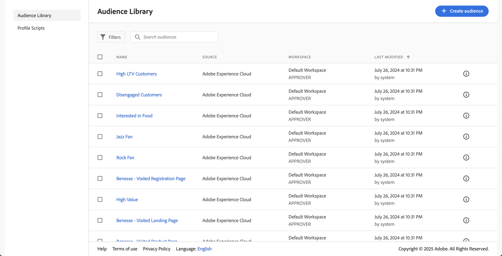

# セグメントの公開 {#publish-segments}

>[!CONTEXTUALHELP]
>id="components_segments_publishing"
>title="Experience Cloud での公開"
>abstract="オーディエンスをオーディエンスライブラリに公開し、Target やその他の Experience Cloud ソリューションでマーケティングアクティビティに使用できます。"

>[!CONTEXTUALHELP]
>id="components_segments_audiencelibrary"
>title="オーディエンスライブラリ"
>abstract="オーディエンスライブラリで作成されたセグメントは即座に利用でき、Analytics の更新には依存しません。"

Adobe Analytics セグメントをExperience Cloudに公開できます。 そのため、[!DNL Audience Manager] や、[!DNL Advertising Cloud]、[!DNL Target]、[!DNL Campaign] などの他のアクティベーションチャネルで、マーケティングアクティビティ用のセグメントを使用できます。

Analytics セグメントは、8 時間以内にExperience Cloudに公開できます。 これらのセグメントを使用して、Audience Manager 内のオーディエンスを、すべてのダウンストリームの宛先でアクティブ化します。

>[!BEGINSHADEBOX]

デモビデオについては、 [ セグメントの公開 ](https://video.tv.adobe.com/v/32842?quality=12&learn=on){target="_blank"} を参照してください。

>[!ENDSHADEBOX]

>[!NOTE]
>
> Adobe Campaign（Classic と Standard）の動作は、8 時間の遅延に加えて 24 時間の遅延が発生する点が異なります。

## 前提条件

* このセグメントの保存先のレポートスイートで [Experience Cloudが有効 ](/help/components/segmentation/segmentation-workflow/seg-publish.md) になっていることを確認します。 そうでない場合、Experience Cloudに公開することはできません。
* 組織が Experience Cloud ID を使用していることを確認します。
* セグメントを公開する前に、管理者は [Admin Console](https://experienceleague.adobe.com/ja/docs/core-services/interface/administration/admin-tool-experience-cloud) で製品プロファイルに[!UICONTROL セグメントの公開]権限を割り当て、製品プロファイルにユーザーを追加する必要があります。

## 注意点

* **レポートスイートの制限**：レポートスイートごとに最大 75 個のセグメントを公開できます。この制限は適用されます。既に 75 個のセグメントが公開されている場合、公開を取り消してセグメント数が 75 個のセグメントしきい値を下回るまで、追加のセグメントを公開することはできません。
* **メンバーシップの制限**：Adobe Analytics から [!DNL Experience Cloud] に共有するオーディエンスの個別メンバーの数が 2,000 万を超えてはなりません。
* **データプライバシー**：オーディエンスは、訪問者の認証状態に基づいてフィルタリングされません。訪問者は、未認証および認証状態でサイトを閲覧できる場合があります。 訪問者が認証されていない場合に発生するアクションによって、訪問者がオーディエンスに含まれる可能性があります。 オーディエンス共有がプライバシーに与える影響をすべて理解するには、[Adobe Experience Cloud](https://www.adobe.com/jp/privacy/experience-cloud.html) のプライバシーを確認します。
* **[!DNL Adobe Analytics] と[!DNL Audience Manager]** のセグメント間の違い [ について詳しくは、](/help/integrate/c-audience-analytics/aam-analytics-segments.md)Analytics とAudience Managerのセグメントについてを参照してください。

## セグメント公開タイムライン

| 利用可能な情報 | 利用可能な場合 | 利用可能な場所 |
|---|---|---|
| メタデータ（セグメントのタイトルと定義） | 公開直後 | [!DNL Audience Manager]、[!UICONTROL Experience Cloud オーディエンスライブラリ]、[!DNL Target] |
| メンバーシップを持つ使用可能なセグメント | 公開後 8 時間以内 | [!DNL Audience Manager] の訪問者プロファイルビューア |
| 特性とメンバーシップの母集団 | 24 ～ 48 時間以内 | [!DNL Audience Manager] |

>[!NOTE]
>週に 1 回、すべてのデータが完全に同期され、前週に取り込まれなかった差分や不一致が考慮されます。

## [!UICONTROL &#x200B; セグメントビルダー &#x200B;] でのセグメントの公開

1. Adobe Analyticsで、**[!UICONTROL コンポーネント]**/**[!UICONTROL セグメント]** に移動します。
1. 「**[!UICONTROL 追加]**」を選択して、新しいセグメントを作成します。
   
1. セグメントのタイトルと説明を入力します。 これらのフィールドは、セグメントを保存する前に必要です。
1. 「**[!UICONTROL Experience Cloudの公開]**」セクションで、「**[!UICONTROL このセグメントをExperience Cloudに公開（*レポートスイート* 用）]**」オプションを選択します。

   >[!IMPORTANT]
   >
   >Adobe Analyticsの数値をAudience Managerの数値と比較する場合は、**[!UICONTROL ユニーク訪問者]** ではなく、**[!UICONTROL データプレビュー]** で **[!UICONTROL Experience Cloud ID を持つ訪問者]** を監視していることを確認してください。
   >

| 要素 | 説明 |
|---|---|
| **[!UICONTROL このセグメントをExperience Cloudに公開する（*レポートスイート* 用）]** | このオプションを有効にすると、セグメントタイトルと定義がExperience Cloudと即座に共有され、セグメントメンバーシップが 4 時間ごとに評価および共有されます。  そのオーディエンスが [!DNL Target] のアクティビティと関連付けられている場合、[!DNL Analytics] は、その Experience Cloud および [!DNL Target] オーディエンスの対象となる訪問者の ID の送信を開始します。その時点で、オーディエンス名と対応するデータがExperience Cloudの [!DNL Audience Library] ページに表示され始めます。  |
| **[!UICONTROL オーディエンス作成期間]** | 選択した時間枠は、周期的なカレンダー単位でオーディエンスを作成するために使用されます。 例えば、**[!UICONTROL 過去 30 日間]** （デフォルト）には、今日の日付（セグメントが作成された元の日付ではない）から過去 30 日間にオーディエンスに選定された訪問者が含まれます。 |
| **[!UICONTROL オーディエンスライブラリに作成]** | 作成および公開したセグメントは、Experience Cloudの [!DNL Audience Library] ページで、待ち時間なしで使用可能にすることができます。 Analytics の更新には依存しません。これらのセグメントは、公開済みの 75 個のセグメントの制限に対してはカウントされません。 |
| **[!UICONTROL x / 75 個公開済み]** | Experience Cloudに公開したセグメントの数。 リンクをクリックすると、公開済みのセグメントと、関連するレポートスイートおよび所有者のリストが表示されます。 |
| **[!UICONTROL 保存]** | このセグメントを保存します。 |

## セグメントの非公開または削除

>[!CAUTION]
>
>Experience Cloudに公開されているセグメントを削除するには、まずセグメントを非公開にする必要があります。 セグメントを非公開にするには、**[!UICONTROL このセグメントをExperience Cloudに公開（*レポートスイート*）]** の選択を解除します。

>[!NOTE]
>
>次のいずれかのアドビソリューションで現在使用中のセグメントの公開を取り消すことは&#x200B;**できません**：[!DNL Analytics]（[!DNL Audience Analytics]の場合）、[!DNL Campaign]、[!DNL Advertising Cloud]（[!DNL Core Service] および [!DNL Audience Manager] 顧客の場合）、およびその他すべての外部パートナー（[!DNL Audience Manager] の顧客の場合）。[!DNL Target] で使用中のセグメントを非公開にすることが&#x200B;**できます**。

## セグメントの公開ステータスの表示

公開可能なAdobe Analytics セグメントの最大数は 75 です。

公開済みのセグメントを表示するには：

1. Adobe Analyticsで、**[!UICONTROL コンポーネント]**/**[!UICONTROL セグメント]** に移動します。

1. **[!UICONTROL 公開済み]** 列を表示します。 **[!UICONTROL はい]** この列は、セグメントがExperience Cloudに公開されていることを示します。 **[!UICONTROL いいえ]** は、セグメントが公開されていないことを示します。

## [!DNL Audience Manager] UUID の取得

現在ブラウザーに関連付けられているAdobe Audience Manager UUID を取得するには、次の 2 つの方法があります。

* Adobe Experience Cloud デバッガー
* ブラウザーのネイティブ開発者ツール（Chrome Developer Tools など）

次のスクリーンショットは、ブラウザーでAdobe Audience Manager UUID を取得し、Audience Manager訪問者プロファイルビューアで使用して特性とセグメントメンバーシップを検証する方法を示しています。

### 方法 1：Adobe Experience Cloud デバッガーの使用

1. Chrome Web Store で [Adobe Experience Cloud Debugger](/help/implement/validate/debugger.md) をダウンロードしてインストールします。
1. ページの読み込み時にデバッガーを起動します。
1. 「Audience Manager」セクションまでスクロールし、現在のブラウザーページで設定されているAdobe Audience Manager UUID を見つけます
（以下の例では `35721780439475290181087231320657663953`）

   

### 方法 2：Chrome Developer Tools（または他のブラウザー開発者ツール）を使用する

1. ページを読み込む前に Chrome Developer Tools を起動します。
1. ページを読み込み、アプリケーション／Cookie を確認します。Adobe Audience Manager UUID は、サードパーティで設定する必要があります
Demdex cookie （以下の例では [adobe.demdex.net](https://experienceleague.adobe.com/ja/docs/audience-manager/user-guide/reference/demdex-calls)）。 フィールド demdex はAdobe Audience Managerの UUID セットです
ブラウザーで（以下の例では `35721780439475290181087231320657663953`）。

   

## Audience Manager [!UICONTROL 訪問者プロファイルビューアを使用する]

[!UICONTROL &#x200B; 訪問者プロファイルビューア &#x200B;] が読み込まれる際、デフォルトでは、ブラウザーのAdobe Audience Manager UUID が設定されます。 他のユーザーの特性適合を確認する場合は、「UUID」フィールドに UUID を入力し、「[!UICONTROL &#x200B; 更新 &#x200B;]」をクリックします。 詳しくは、 [訪問者プロファイルビューア](https://experienceleague.adobe.com/ja/docs/audience-manager/user-guide/features/visitor-profile-viewer) を参照してください。

## [!DNL Audience Manager] でセグメント特性を表示する

Adobe Audience Managerでは、Analytics がExperience Cloudとセグメントを共有する間、特定のセグメントの ECID を持つ訪問者のリストが評価されます。

1. [!DNL Audience Manager] で、**[!UICONTROL オーディエンスデータ]**/**[!UICONTROL 特性]**/**[!UICONTROL Analytics 特性]** に移動します。 Experience Cloud組織にマッピングされた各 Analytics レポートスイートのフォルダーが表示されます。 これらのフォルダー（特性、セグメントおよびデータソースの場合）は、プロファイルおよびオーディエンス／人物コアサービスが開始またはプロビジョニングされると作成されます。
1. [!DNL Audience Manager] と共有する、過去にセグメントを作成したレポートスイートのフォルダーを選択します。作成したセグメント/オーディエンスが表示されます。 セグメントを共有すると、[!DNL Audience Manager] で次の 2 つがおこなわれます。
   * データが入っていない特性が作成されます。セグメントが[!DNL Analytics] で公開されてから約 8 時間後に、ECID のリストがオンボードされ、[!DNL Audience Manager] および他の Experience Cloud ソリューションと共有されるようになります。

     

   * 1 つの特性セグメントが作成されます。セグメントを公開したレポートスイートに関連付けられているデータソースを使用します。
   * 特性の有効期限が 16 日に設定されました（以前は 2 日でした）。

## セグメントを [!DNL Adobe Target] で表示する

**[!UICONTROL このセグメントをExperience Cloudに公開]** を使用すると、Adobe Targetのカスタムオーディエンスライブラリ内でセグメントを使用できます。 Analytics または Audience Manager で作成されたセグメントは、Target のアクティビティで使用できます。例えば、Analytics コンバージョン指標および Analytics で作成されたオーディエンスセグメントに基づいてキャンペーンアクティビティを作成できます。

Adobe Targetで：

1. **[!UICONTROL オーディエンス]** を選択します。
1. **[!UICONTROL Audiences]** ページで、[!DNL Experience Cloud] からのオーディエンスを探します。これらのオーディエンスは、[!DNL Target] アクティビティで使用できます。

   
