# 順次セグメント

コンポーネント、コンテナとコンポーネント、またはコンテナ間の[!UICONTROL Then]論理演算子を使用して、シーケンシャルセグメントを作成します。 [!UICONTROL Then]論理演算子は、1つのセグメント条件が発生し、その後に別のセグメント条件が発生することを意味します。

さらに、**[!UICONTROL After]**&#x200B;と&#x200B;**[!UICONTROL Within operators]**&#x200B;を使用して、チェックポイント間の特定の期間、粒度、カウントにシーケンシャルセグメントを制限できます。

>[!BEGINSHADEBOX]

デモ動画については、 [&#x200B; シーケンシャルセグメンテーション &#x200B;](https://experienceleague.adobe.com/ja/docs/analytics-learn/tutorials/components/segmentation/sequential-segmentation){target="_blank"}を参照してください。

>[!ENDSHADEBOX]

シーケンシャルセグメントには、いくつかの[基本機能](#basics)と、シーケンシャルセグメントをさらに複雑にするために設定できる追加オプションがあります。

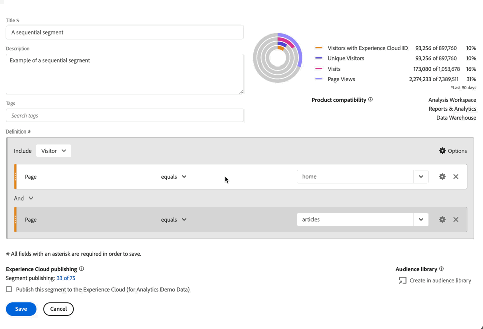

## 基本

シーケンシャルセグメントの作成の基本は、[&#x200B; セグメントビルダー](seg-build.md)を使用して通常のセグメントを作成することとは異なります。 メイン定義または[&#x200B; セグメント ビルダー](seg-build.md)内で使用するコンテナで&#x200B;**[!UICONTROL Then]**&#x200B;演算子を選択すると、通常のセグメントは自動的に連続セグメントになります。

### 例

以下の例は、さまざまなユースケースでシーケンシャルセグメントをどのように使用するかを示しています。

#### シンプルなシーケンス

ページを閲覧してから別のページを閲覧した訪問者を識別します。 ヒットレベルのデータは、このシーケンスを使用してセグメント化されます。 過去、過去、中間の訪問者の訪問回数、訪問間に発生したページビュー数に関係なく、

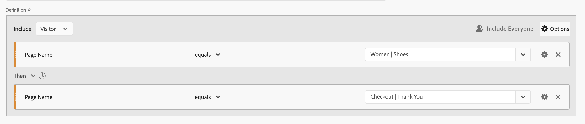

#### 訪問者数のシーケンス

ある訪問でページを閲覧し、別の訪問で別のページを閲覧した訪問者を識別します。 訪問を区別するには、コンテナを使用してシーケンスを作成し、各コンテナに **[!UICONTROL 訪問]** レベルを定義します。

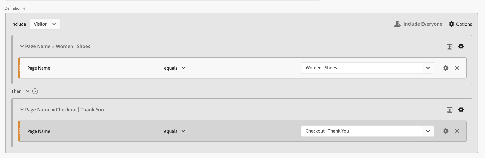

#### 混合レベルシーケンス

未確定の訪問数で2つのページを表示する訪問者を特定し、別の訪問で3番目のページを表示します。 繰り返しますが、コンテナを使用してシーケンスを作成し、個別の訪問を定義するコンテナに **[!UICONTROL 訪問]** レベルを定義します。

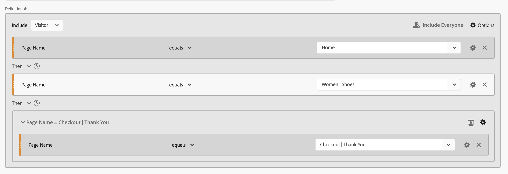

#### 集計シーケンス

最初に特定のページを訪問してから、後でほかのページを訪問した訪問者を特定します。 ヒットの順序を区別するには、コンテナを使用して、 **[!UICONTROL Visit]** コンテナレベルでロジックを分離します。

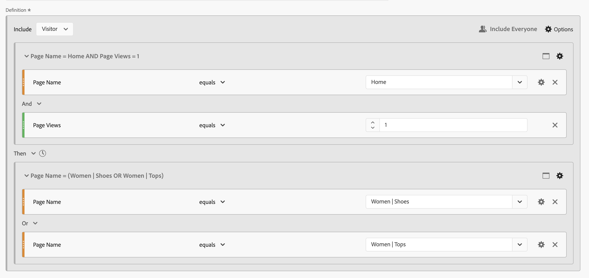

#### シーケンスのネスト

訪問者が別のページの前にあるページを訪問してから、他の2つのページを含むフォローアップ訪問を行うすべての訪問を特定します。 例えば、訪問者が最初にホームページを訪問し、次にカテゴリ 1 ページを訪問し、その後、各訪問でカテゴリ 2およびカテゴリ 3 ページを訪問する他の訪問を行うすべての訪問を特定します。

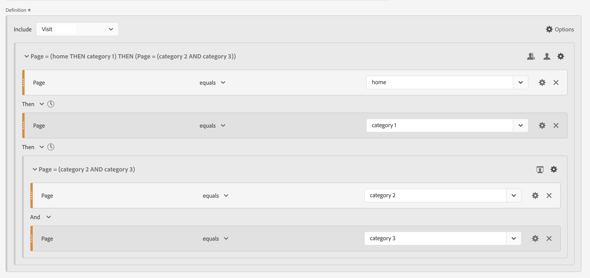

## [!UICONTROL After]および[!UICONTROL Within]

 **[!UICONTROL After]**&#x200B;および **[!UICONTROL Within]**&#x200B;の&#x200B;**[!UICONTROL Then]**&#x200B;演算子を使用して、ヒット、訪問またはディメンション [&#128279;](#event-session-and-dimension-constraints)に対する追加の[時間制約](#time-constraints)または制約を定義できます。

### 時間の制約

時間の制約を&#x200B;**[!UICONTROL Then]**&#x200B;演算子に適用するには：

1. を選択します。
1. コンテキストメニューから&#x200B;**[!UICONTROL Within]**&#x200B;または&#x200B;**[!UICONTROL After]**&#x200B;を選択します。
1. 期間（**[!UICONTROL 分]**、**[!UICONTROL 時間]**、最大&#x200B;**[!UICONTROL 年]**）を指定します。
1.  **[!UICONTROL *number *]**&#x200B;を選択して、**[!UICONTROL -]**&#x200B;または&#x200B;**[!UICONTROL +]**&#x200B;を使用して番号を入力または指定できるポップアップを開きます。

時間制約を削除するには、を使用します。

以下の表では、時間制約の演算子について詳しく説明しています。

| 演算子 | 説明 |
|--- |--- |
| **[!UICONTROL 後]** | [!UICONTROL After]演算子は、2つのチェックポイント間の時間の最小制限を指定するために使用されます。 After値を設定すると、セグメントが適用されるときに時間制限が開始されます。 例えば、[!UICONTROL After]演算子がコンテナに設定されていて、ページ Aを訪問した訪問者を識別できるのに、1日後までページ Bに戻らない場合、その日は訪問者がページ Aを離れたときに開始されます。  訪問者をセグメントに含めるには、ページ Aを離れてページ Bを表示した後、最低1,440分（1日）が経過する必要があります。 |
| **[!UICONTROL 以内]** | [!UICONTROL Within]演算子は、2つのチェックポイント間の時間の最大制限を指定するために使用されます。 例えば、[!UICONTROL Within]演算子がコンテナに設定されていて、ページ Aにアクセスした訪問者を識別し、1日以内にページ Bにアクセスするように戻った場合、その日は訪問者がページ Aを離れるときに始まります。このセグメントに含めるには、訪問者はページ Bを開く前に最大1日の時間を持ちます。訪問者をセグメントに含めるには、ページ Bを表示するには、ページ Aを終了してから最大1440分（1日）以内にページ Bを開く必要があります。 |
| **[!UICONTROL 後]**&#x200B;以内 | [!UICONTROL After]と[!UICONTROL Within]の両方の演算子を使用する場合、両方の演算子は順番ではなく並行して開始および終了します。  例えば、コンテナが`After = 1 Week(s) and Within = 2 Week(s)`に設定されたセグメントを作成します。 このセグメントの訪問者を識別する条件は、1週間から2週間の間にのみ満たされます。 両方の条件は、最初のページビューの時点から適用されます。 |

#### 例

時間制約の使用例をいくつか紹介します。

##### [!UICONTROL After]演算子

2週間後にのみ、あるページを訪問した訪問者と、別のページを訪問した訪問者を識別します。 例えば、ホームページを訪問したが、Women | Shoes ページが2週間後にのみ訪問した訪問者。

ホームのページビューが2024年6月1日00:01に発生した場合、そのページビューが2024年6月15日00:01の後に発生する限り、「Women | Shoes」ページのページビューと一致します。

##### [!UICONTROL Within]演算子

5分以内にあるページを訪問した訪問者と、別のページを訪問した訪問者を識別します。 例えば、ホームページを訪問した訪問者から、5分以内にWomen | Shoes ページを訪問した訪問者を指します。

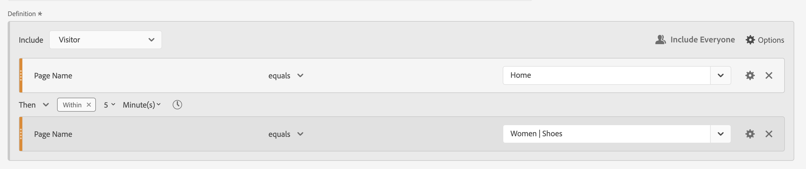内の シーケンス

ホームのページビューが2024年6月1日（12:01）に発生した場合、そのページビューが2024年6月15日（12:16）より前に発生する限り、「Women | Shoes」ページのページビューと一致します。

##### [!UICONTROL After]だが[!UICONTROL Within]演算子

1つのページを訪問し、2週間後に1 カ月以内に別のページを訪問した訪問者を特定。 例えば、ホームページを訪問し、2週間後に1か月以内にWomen | Shoes ページにアクセスした訪問者を指します。

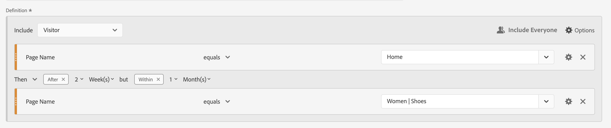以内

2024年6月1日にホームページにアクセスし、2019年6月15日以降:01にWomen | Shoes ページに戻るが、2019年7月1日以前にセグメントの対象となる訪問者。

### [!UICONTROL &#x200B; ヒット &#x200B;]、[!UICONTROL 訪問]、[!UICONTROL Dimension]の制約

 **[!UICONTROL After]**&#x200B;および **[!UICONTROL Within]**&#x200B;制約を使用すると、時間制約を指定するだけでなく、ヒット、訪問、ディメンション制約も指定できます。 **[!UICONTROL ヒット]**、**[!UICONTROL 訪問]**&#x200B;または&#x200B;**[!UICONTROL その他のディメンション]**  **[!UICONTROL *Dimension名&#x200B;*]**&#x200B;を選択します。 「[!UICONTROL *検索*]」フィールドを使用して、ディメンションを検索できます。

#### 例

次に、1つの製品カテゴリーページ（女性| シューズ）を訪問した訪問者を順次検索するセグメントの例を示し、その後、1つのページ内でチェックアウトページ（チェックアウト | サンキュー）を検索します。

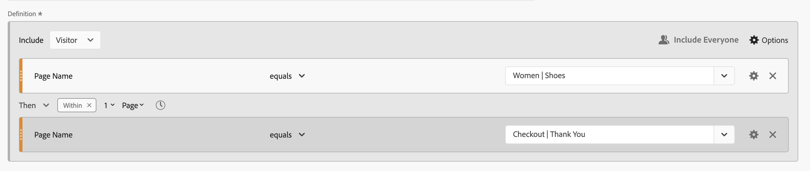内の シーケンス セグメント

次のシーケンスの例は、一致するか一致しません。

| シーケンス |  |
|--- | :---: |
| ページ `Women \| Shoes`の後にページ `Checkout \| Thank You`が続きます |  |
| ページ `Women \| Shoes`の後にページ `Women \| Tops`が続き、ページ `Checkout \| Thank You`が続きます |  |

## [!UICONTROL 含める]

シーケンシャルセグメントまたはシーケンシャルセグメントの一部であるシーケンシャルコンテナに含めるデータを指定できます。

### [!UICONTROL 全員] {#include_everyone}

全員を含むシーケンシャルセグメントを作成するには、「 **[!UICONTROL 全員を含める]**」オプションを選択します。

シーケンシャルセグメントは、与えられたパターン全体に一致するデータを識別する。  以下は、1つの製品カテゴリーページ（女性|靴）を訪問した訪問者を探す基本的なシーケンス セグメントの例で、次にチェックアウトページ（チェックアウト|ありがとうございます）を続けます。 セグメントは **[!UICONTROL 全員を含める]**&#x200B;に設定されています。

次のシーケンスの例は、一致するか一致しません。

| | シーケンス |  |
|---:|--- | --- |
| 1 | 同じ訪問の`Women \| Shoes`から`Checkout \| Thank You` |  |
| 2 | `Women \| Shoes`、`Men \| Shoes`、`Checkout \| Thank You` （異なる訪問回数） |  |
| 3 | `Checkout \| Thank You`から`Women \| Shoes` |  |

### [!UICONTROL &#x200B; シーケンス前のみ]および[!UICONTROL &#x200B; シーケンス後のみ]

オプション  **[!UICONTROL Only Before Sequence]**&#x200B;および **[!UICONTROL Only After Sequence]**&#x200B;は、指定されたシーケンスの前後のサブセットにデータをセグメント化します。

*  **Only Before Sequence**: シーケンスの前のすべてのデータと、シーケンス自体の最初のデータを含みます。 シーケンスがデータの一部として複数回表示される場合、[!UICONTROL Only Before Sequence]には、シーケンスの最後の発生の最初のヒットと、すべての前のヒットが含まれます。
*  **Only After Sequence**: シーケンスの後のすべてのヒットと、シーケンス自体の最後のデータを含みます。 シーケンスがデータの一部として複数回表示される場合、[!UICONTROL &#x200B; シーケンスの後にのみ]には、シーケンスの最初の発生の最後のヒットとそれ以降のすべてのヒットが含まれます。

Bで識別された基準を持つコンポーネントのシーケンスを指定し、次にDで識別された基準を持つコンポーネントを指定する定義を考えてみましょう。3つのオプションにより、データは次のように識別されます。

| B Then D | A | B | C | D | E | F |
|---|:---:|:---:|:---:|:---:|:---:|:---:|
| 全員を含む |  |  |  |  |  |  |
| シーケンスの前のみ |  |  |  |  |  |  |
| シーケンスの後のみ |  |  |  |  |  |  |

| B Then D （複数回発生） | A | B | C | D | B | C | D | E |
|---|:---:|:---:|:---:|:---:|:---:|:---:|:---:|:---:|
| 全員を含む |  |  |  |  |  |  |  |  |
| シーケンスの前のみ |  |  |  |  |  |  |  |  |
| シーケンスの後のみ |  |  |  |  |  |  |  |  |

#### 例

サイトセクションのシーケンシャルセグメントを3つのバージョンで定義しました。 オプション  **[!UICONTROL Include Everyone]**、オプション  **[!UICONTROL Only Before Sequence]**&#x200B;およびオプション  **[!UICONTROL Only After Sequence]**&#x200B;を持つ者。 3つのセグメントに名前を付けました。

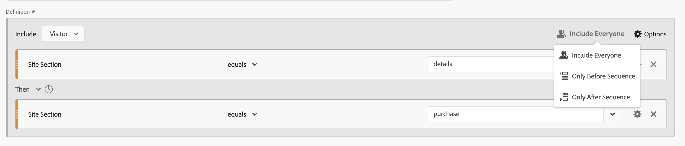

これらの3つのセグメントを使用してサイトセクションをレポートする場合、フリーフォームテーブルの出力例は次のようになります。

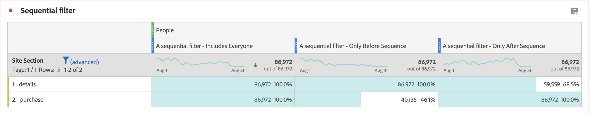

## [!UICONTROL 除外]

セグメント定義には、**[!UICONTROL Exclude]**&#x200B;を使用して [!UICONTROL Person]、 [!UICONTROL Visit]、または [!UICONTROL Hit] データを明確に除外しない限り、すべてのデータが含まれます。

[!UICONTROL 除外]を使用すると、一般的なデータを除外して、より焦点を絞ったセグメントを作成できます。 「除外」を使用すると、特定の訪問者グループを除外するセグメントを作成することもできます。 例えば、注文を行った訪問者を指定し、その訪問者のグループを除外して&#x200B;*購入者以外*&#x200B;を識別するセグメントを定義します。 ベストプラクティスは、[!UICONTROL Exclude]を使用して特定の値に一致する特定の訪問者をターゲットにするのではなく、幅広い定義を使用するルールを作成することです。

除外の定義の例を次に示します。

* **ページを除外**。 セグメント定義を使用して、レポートから特定のページ（*ホームページ*&#x200B;など）を削除し、ページが`Home Page`に等しいヒット ルールを作成してから、ルールを除外します。 この定義には、*ホームページ*&#x200B;を除くすべてのページが自動的に含まれます。
* **参照ドメインを除外**。 Google.comからの参照ドメインのみを含み、他のすべてのドメインを除外する定義を使用します。
* **購入者以外のユーザーを特定**。 注文が0より大きい場合を特定し、[!UICONTROL 人物]を除外します。

[!UICONTROL 除外]は、訪問者が特定の訪問に参加していないシーケンスを識別したり、特定のヒットを実行したりするために使用できます。 [!UICONTROL 除外]は、[!UICONTROL &#x200B; ロジックグループ &#x200B;]に含めることもできます（以下を参照）。

コンポーネントではなくコンテナを除外できます。

### 例

[!UICONTROL Exclude]の使用例については、以下を参照してください。

#### [!UICONTROL 除外]以内

あるページを訪問した訪問者、別のページを訪問しなかった訪問者、別のページを訪問した訪問者を識別します。  [!UICONTROL Exclude]を使用してコンテナを除外します。 左側の細い赤いバーは、除外されたコンテナを示します。

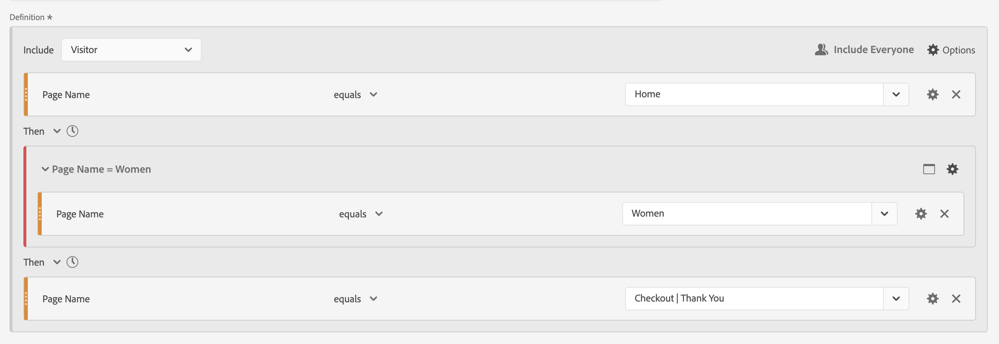

#### [!UICONTROL 開始時に]を除外

別のページに移動することなく、あるページを訪問した訪問者を識別できます。 例えば、ホームページを訪問することなく購入をチェックアウトしたオーディエンスを考えます。

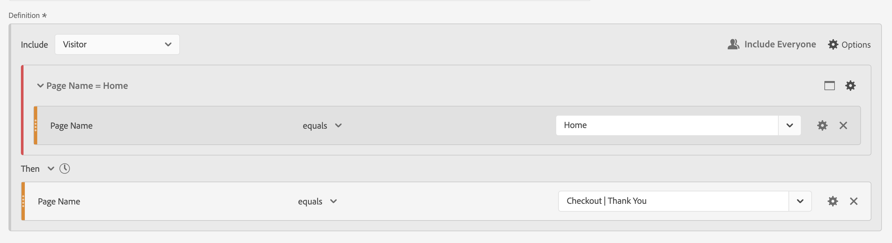

#### 末尾に[!UICONTROL Exclude]

あるページを訪問したものの、他のページを訪問しなかった訪問者を特定。 例えば、ホームページを訪問したものの、チェックアウトページを閲覧しなかった訪問者を指します。

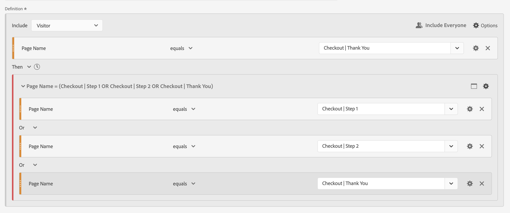

## [!UICONTROL &#x200B; ロジックグループ &#x200B;]

>[!NOTE]
>
>[!UICONTROL &#x200B; ロジックグループ &#x200B;]は、シーケンシャルセグメントでのみ定義できます。つまり、[!UICONTROL Then]演算子がコンテナ内で使用されます。

論理グループを使用すると、条件を単一の順次セグメントチェックポイントにグループ化できます。 シーケンスの一部として、ロジックグループとして識別されたコンテナで定義されたロジックは、以前のシーケンシャルチェックポイントの後に、以降のシーケンシャルチェックポイントの前に評価されます。

ロジックグループ自体の条件は、任意の順序で満たすことができます。 対照的に、非シーケンシャルコンテナ（ヒット、訪問、訪問者）は、全体的なシーケンス内で条件を満たす必要がなく、**[!UICONTROL Then]**&#x200B;演算子と一緒に使用すると、直感的でない結果が生じる可能性があります。

[!UICONTROL &#x200B; ロジックグループ &#x200B;]は、*いくつかの条件をグループとして扱うように設計されており、グループ化された条件の中に順序*&#x200B;が含まれていません。 それ以外の場合、ロジックグループ内の条件の順序は無関係です。

ロジックグループを使用するベストプラクティスには、次のようなものがあります。

* 逐次チェックポイントをグループ化します。
* シーケンシャルセグメントの構築を簡略化する。

### 例

ロジックグループコンテナの使用例を次に示します。

#### 任意の注文

あるページを訪問した訪問者を識別し、各ページを別のページから順番に表示します。 例えば、ホームページを訪問した訪問者は、順序に関係なく、男性ページ、女性ページ、子どもページをそれぞれ訪問しました。

このセグメントは[!UICONTROL &#x200B; ロジック グループ &#x200B;]を使用せずに作成できますが、作成は複雑で手間がかかります。 訪問者が表示できるページのシーケンスをすべて指定します。 明確にするために、最初のコンテナのみが開かれ、他のコンテナは閉じられます。 他のコンテナのコンテンツは、タイトルで取得できます。

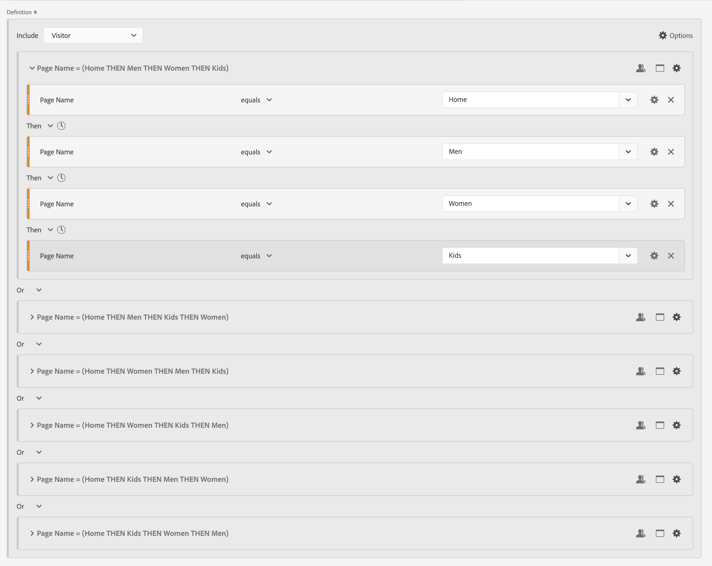

次に示すように、[!UICONTROL &#x200B; ロジックグループ &#x200B;]を使用して、このセグメントの作成を簡素化できます。 コンテナに「 **[!UICONTROL ロジックグループ]**」を選択していることを確認してください。

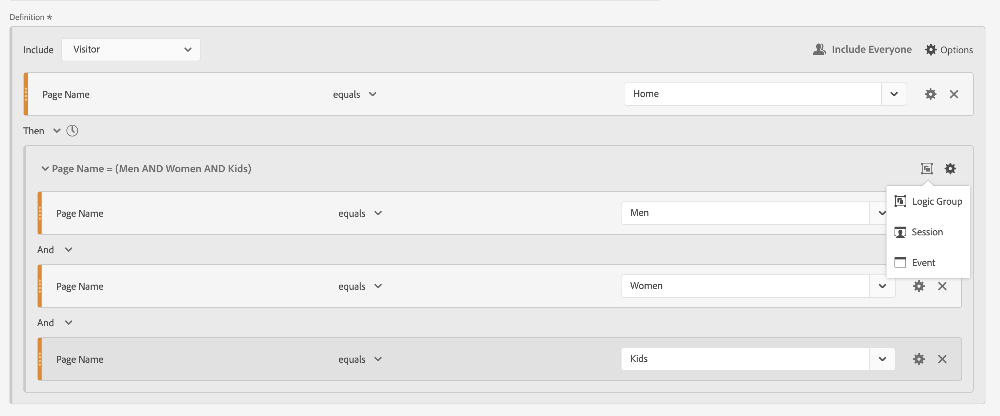

#### ファーストマッチ

あるページや別のページを訪問し、別のページを訪問した訪問者を識別できます。 例えば、女性ページまたは男性ページを訪問した訪問者は、次にチェックアウト | サンキューページを訪問しました。

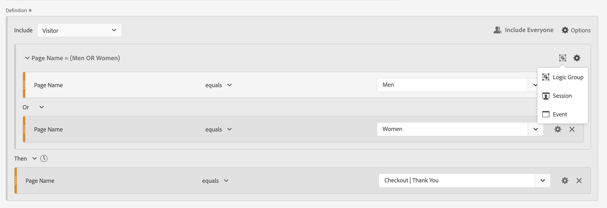

#### [!UICONTROL 除外] [!UICONTROL および]

あるページを訪問した後、他のページのセットを明示的に訪問せず、別のページを訪問した訪問者を特定します。 例えば、ホームページを訪問した訪問者は、男性ページまたは女性ページを訪問しませんでしたが、子供ページを訪問しました。

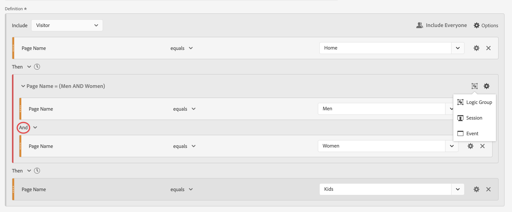

#### [!UICONTROL 除外] [!UICONTROL または]

あるページを訪問した訪問者が、一連のページのどのページにも明示的にアクセスせず、別のページにも訪問した訪問者を特定します。 例えば、ホームページを訪問し、男性と女性のページを訪問しなかったが、子供のページを訪問した訪問者。

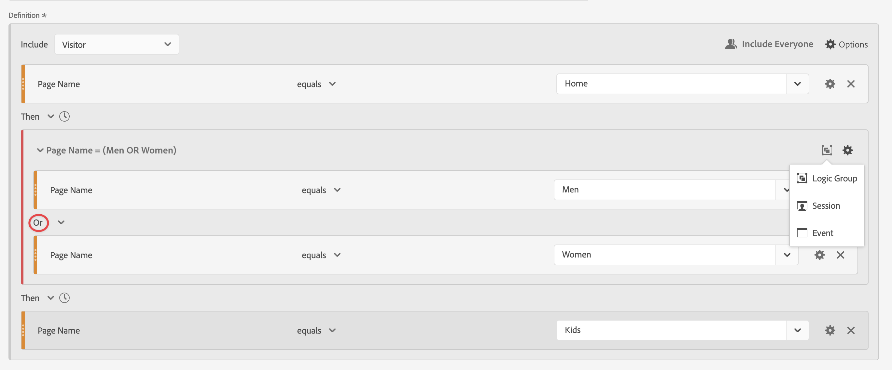

<!--
An example of a complex sequential segment if you want to find the visitors that 

| visit One | visit Two | visit Three |
| --- | --- | --- |
| The visitor went to the main landing page A, excluded the campaign page B, and then viewed the Product page C.| The visitor again went to the main landing page A, excluded the campaign page B, and went again to the Product page C, and then to a new page D. | The visitor entered and followed that same path as in the first and second visits, then excluded page F to go directly to a targeted product on page G. |
-->

## 最後に

最後の例として、Empower Your Move キャンペーンで特定の商品ページを閲覧した訪問者を、これらの訪問者が影響を受けることはなく、特定の商品ページを閲覧した訪問者を識別する必要があります。 そして、あなたのオンラインストアへの彼らの最初の訪問では、ホームページを見たが、男性カテゴリからのフィットネス（ギア）製品をさらに見ていませんでした。 しかし、その直後に次に訪問すると、ホームページを経由せずに商品ページにアクセスし、オンラインで注文しました。

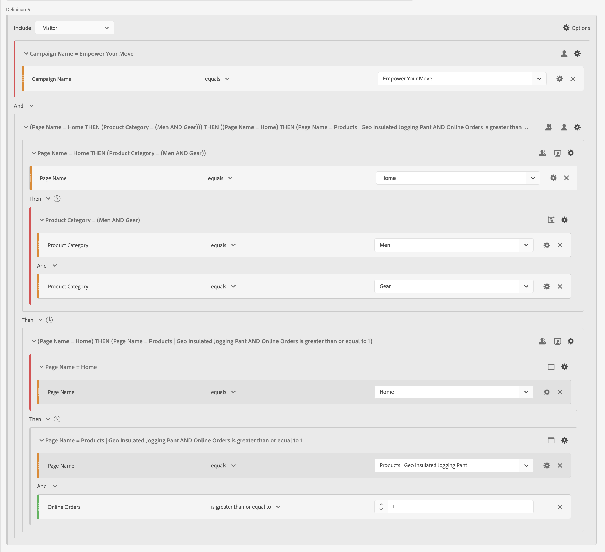

>[!MORELIKETHIS]
>
> * [AAおよびCJAでのシーケンシャルロジックの習得：THEN](https://experienceleaguecommunities.adobe.com/t5/adobe-analytics-blogs/mastering-sequential-logic-in-aa-amp-cja-introduction-to-then/ba-p/738131?profile.language=ja)の概要
