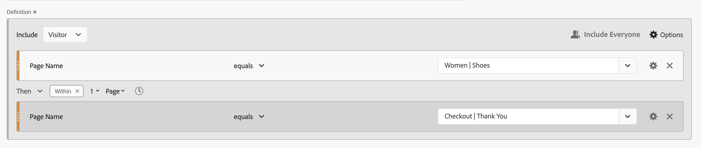
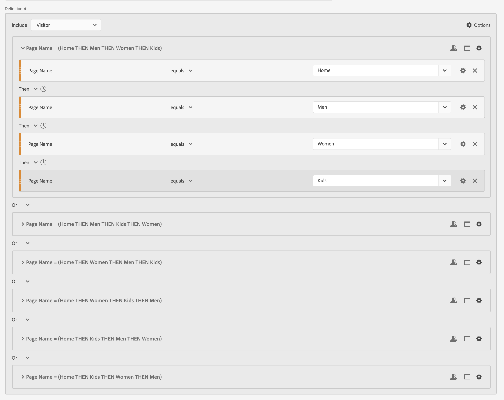

# 順次セグメント

コンポーネント、コンテナおよびコンポーネントまたはコンテナの間の [!UICONTROL Then] 論理演算子を使用して順次セグメントを作成します。 [!UICONTROL Then] 論理演算子は、セグメント条件が 1 つ、続いて別のセグメント条件が発生することを意味します。

さらに、**[!UICONTROL After]** 演算子と **[!UICONTROL Within 演算子]** を使用して、連続するセグメントをチェックポイント間の特定の期間、精度およびカウントに制限できます。

>[!BEGINSHADEBOX]

デモビデオについては、 [ 順次セグメント化 ](https://video.tv.adobe.com/v/25405?quality=12&learn=on){target="_blank"} を参照してください。

>[!ENDSHADEBOX]

順次セグメントには、いくつかの [ 基本機能 ](#basics) と、順次セグメントにより多くの複雑さを追加するように設定できる追加のオプションがあります。

## 基本

順次セグメントを作成する際の基本は、[ セグメントビルダー ](seg-build.md) を使用して通常のセグメントを作成する場合と同じです。 通常のセグメントは、メイン定義または [ セグメント化ビルダー ](seg-build.md) 内で使用する任意のコンテナで **[!UICONTROL Then]** 演算子を選択するとすぐに、自動的に順次セグメントになります。

### 例

以下の例は、様々なユースケースで順次セグメントを使用する方法を示しています。

#### 単純なシーケンス

あるページを閲覧した後に別のページを閲覧した訪問者を識別します。ヒットレベルのデータは、このシーケンスを使用してセグメント化されます。 前、過去、中間の訪問者数、または訪問間に発生したページビューの時間や数に関係なく、

#### 訪問全体のシーケンス

ある訪問でページを閲覧した訪問者を特定してから、別の訪問で別のページを閲覧した訪問者を特定します。 訪問を区別するには、コンテナを使用してシーケンスを作成し、コンテナごとに **[!UICONTROL 訪問]** レベルを定義します。

#### 混合レベルシーケンス

未決定訪問数で 2 ページを表示した訪問者を特定してから、別の訪問で 3 ページ目を表示します。 この場合も、コンテナを使用してシーケンスを作成し、個別の訪問を定義するコンテナに対して **[!UICONTROL 訪問]** レベルを定義します。

#### 集計シーケンス

最初の訪問で特定のページを訪問し、後で他のページを訪問した訪問者を特定します。 ヒットのシーケンスを区別するには、コンテナを使用して、**[!UICONTROL Visit]** コンテナレベルでロジックを区切ります。

#### シーケンスをネスト

訪問者が 1 ページ前を訪問し、次に他の 2 ページを含むフォローアップ訪問を行ったすべての訪問を特定します。 例えば、訪問者が最初にホームページを訪問したすべての訪問を特定してから、カテゴリ 1 ページを訪問し、その後、各訪問でカテゴリ 2 およびカテゴリ 3 ページを訪問した他の訪問を持ちます。

## [!UICONTROL After] and [!UICONTROL Within]

**[!UICONTROL Then]** 演算子の  **[!UICONTROL After]** および  **[!UICONTROL Within]** を使用して、追加の [ 時間制約 ](#time-constraints) または [ ヒット、訪問またはディメンションの制約 ](#event-session-and-dimension-constraints) を定義できます。

### 時間制約

**[!UICONTROL Then]** 演算子に時間制約を適用するには：

1.  を選択します。
1. コンテキストメニューから **[!UICONTROL Within]** または **[!UICONTROL After]** を選択します。
1. 期間（**[!UICONTROL 分]**、**[!UICONTROL 時間]** を **[!UICONTROL 年]**）まで指定します。
1.  **[!UICONTROL *number *]**&#x200B;を選択すると、**[!UICONTROL -]**&#x200B;または&#x200B;**[!UICONTROL +]**&#x200B;を使用して数値を入力または指定できるポップアップが開きます。

時間制約を削除するには、 を使用します。

時間制約演算子の詳細を次の表に示します。

| 演算子 | 説明 |
|--- |--- |
| **[!UICONTROL 後]** | [!UICONTROL After] 演算子は、2 つのチェックポイント間の時間の最小制限を指定するために使用されます。 「後」の値を設定すると、セグメントを適用した時点で制限時間が開始されます。 例えば、ページ A を訪問した訪問者を識別するコンテナに [!UICONTROL After] 演算子が設定されていて、1 日後までページ B に戻らない場合、訪問者がページ A を離れたときにその日が始まります。 訪問者をセグメントに含めるには、ページ A を離れた後、少なくとも 1440 分（1 日）経てページ B を表示する必要があります。 |
| **[!UICONTROL 内部]** | [!UICONTROL Within] 演算子は、2 つのチェックポイントの間隔の最大値を指定するために使用します。例えば、ページ A を訪問し、その後 1 日以内にページ B に戻った訪問者を識別するコンテナに [!UICONTROL Within] 演算子を設定した場合、その日は訪問者がページ A を離れる日から始まります。このセグメントに含める場合、訪問者がページ B を開くまでの最大時間は 1 日間です。訪問者をセグメントに含めるには、ページ B を開き、ページ A を離れてページ B を表示してから最大 1440 分（1 日）以内にする必要があります。 |
| **[!UICONTROL 後だが中]** | [!UICONTROL After] 演算子と [!UICONTROL Within] 演算子の両方を使用する場合、両方の演算子は順番ではなく、並行して開始および終了します。   例えば、コンテナを `After = 1 Week(s) and Within = 2 Week(s)` に設定してセグメントを作成します。  このセグメントで訪問者を識別するための条件が満たされるのは、1 ～ 2 週間のみです。 どちらの条件も、最初のページビューの時点から適用されます。 |

#### 例

時間制約の使用例をいくつか示します。

##### [!UICONTROL After] 演算子

2 週間後にのみ、あるページを訪問した訪問者と別のページを訪問した訪問者を識別します。 例えば、のホームページを訪問した訪問者が、女性は訪問した場合などです |靴ページは 2 週間後のみ。

ホームのページビューが 2024 年 6 月 1 日 00:01 に発生した場合、ページビューは Women に移動します | 2024 年 6 月 15 日（PT） 00:01 以降、ページビューが発生する限り、シューズは一致します。

##### [!UICONTROL Within] 演算子

5 分以内に、あるページを訪問した訪問者と別のページを訪問した訪問者を特定します。 例えば、ホームページを訪問した訪問者の後に女性ページを訪問した訪問者です |5 分以内に靴ページ。

ホームのページビューが 2024 年 6 月 1 日 12:01 に発生した場合、ページビューは Women に移動します | 2024 年 6 月 15 日（PT） 12:16 より前にページビューが発生する限り、シューズは一致します。

##### [!UICONTROL After] but [!UICONTROL Within] 演算子

2 週間後から 1 か月以内に、あるページを訪問した後に別のページを訪問した訪問者を識別します。 例えば、ホームページを訪問し、2 週間後に女性から 1 か月以内に訪問した訪問者 |靴ページ。

2024 年 6 月 1 日にホームページにアクセスし、再び女性訪問を行う訪問者 | 2019 年 6 月 15 日（PT）以降 00:01、ただし 2019 年 7 月 1 日（PT）より前のシューズページには該当するセグメントがあります。

### [!UICONTROL &#x200B; ヒット &#x200B;]、[!UICONTROL &#x200B; 訪問 &#x200B;]、[!UICONTROL Dimension] の制約

 **[!UICONTROL After]** と  **[!UICONTROL Within]** 制約を使用すると、時間制約だけでなく、ヒット、訪問、ディメンションの制約も指定できます。 **[!UICONTROL ヒット]**、**[!UICONTROL 訪問]** または **[!UICONTROL その他のディメンション]**  **[!UICONTROL *Dimension名&#x200B;*]**&#x200B;を選択します。 「[!UICONTROL *検索*]」フィールドを使用して、ディメンションを検索できます。

#### 例

以下は、ある製品カテゴリページ（女性）を訪問した訪問者を検索する順次セグメントの例です |靴）、チェックアウトページ（チェックアウト） |ありがとうございました）を 1 ページに収めました。

次のシーケンス例は、一致するか一致しません。

| シーケンス |  |
|--- | :---: |
| ページ `Women \| Shoes` の後にページ `Checkout \| Thank You` |  |
| ページ `Women \| Shoes`、ページ `Women \| Tops`、ページ `Checkout \| Thank You` |  |

## [!UICONTROL 含める]

順次セグメントまたは順次セグメントの一部である順次コンテナに含めるデータを指定できます。

### [!UICONTROL &#x200B; 全員 &#x200B;] {#include_everyone}

全員を含む順次セグメントを作成するには、「**[!UICONTROL 全員を含める]** オプションを選択します。

順次セグメントは、全体として指定されたパターンに一致するデータを識別します。  以下は、1 つの製品カテゴリページ（女性）に訪問した訪問者を検索する基本的なシーケンスセグメントの例です |靴）、チェックアウトページ（チェックアウト） |ありがとうございました）。 セグメントは **[!UICONTROL Everyone を含める]** に設定されています。

次のシーケンス例は、一致するか一致しません。

| | シーケンス |  |
|---:|--- | --- |
| 1 | `Women \| Shoes` の後、同じ訪問で `Checkout \| Thank You` |  |
| 2 | `Women \| Shoes` の後、（異な `Men \| Shoes` 訪問間で） `Checkout \| Thank You` 行されます |  |
| 3 | `Checkout \| Thank You`、`Women \| Shoes` |  |

### [!UICONTROL &#x200B; シーケンスの前のみ &#x200B;] および [!UICONTROL &#x200B; シーケンスの後のみ &#x200B;]

オプション **[!UICONTROL Only Before Sequence]** および **[!UICONTROL Only After Sequence]** は、指定したシーケンスの前または後にデータをサブセットにセグメント化します。

* **シーケンスの前のみ**：シーケンスの前のすべてのデータと、シーケンス自体の最初のデータを含みます。 シーケンスがデータの一部として複数回表示される場合、[!UICONTROL &#x200B; シーケンスの前のみ &#x200B;] には、シーケンスの最後の発生の最初のヒットとすべての前のヒットが含まれます。
* **Only After Sequence**：シーケンスとシーケンス自体の最後のデータの後のすべてのヒットを含みます。 シーケンスがデータの一部として複数回表示される場合、[!UICONTROL &#x200B; シーケンスの後にのみ &#x200B;] シーケンスの最初の発生の最後のヒットと、後続のすべてのヒットが含まれます。

B で識別される条件を持つコンポーネントのシーケンス、および D で識別される条件を持つコンポーネントの（Then）を指定する定義について考えてみます。3 つのオプションにより、データは次のように識別されます。

| B そして D | A | B | C | D | E | F |
|---|:---:|:---:|:---:|:---:|:---:|:---:|
| 全員を含む |  |  |  |  |  |  |
| シーケンスの前のみ |  |  |  |  |  |  |
| シーケンスの後のみ |  |  |  |  |  |  |

| B、D （複数回発生） | A | B | C | D | B | C | D | E |
|---|:---:|:---:|:---:|:---:|:---:|:---:|:---:|:---:|
| 全員を含む |  |  |  |  |  |  |  |  |
| シーケンスの前のみ |  |  |  |  |  |  |  |  |
| シーケンスの後のみ |  |  |  |  |  |  |  |  |

#### 例

サイトセクションに対して、3 つのバージョンの順次セグメントを定義しました。 オプション **[!UICONTROL Include Everyone]** を持つもの、オプション **[!UICONTROL Only Before Sequence]** を持つもの、オプション **[!UICONTROL Only After Sequence]** を持つもの。 3 つのセグメントに適切な名前を付けました。

これら 3 つのセグメントを使用してサイトセクションに関するレポートを作成する場合、フリーフォームテーブルの出力例は次のようになります。

## [!UICONTROL 除外]

セグメント定義には、**[!UICONTROL 除外]** を使用して  [!UICONTROL Person]、 [!UICONTROL Visit] または  [!UICONTROL Hit] データを特別に除外しない限り、すべてのデータが含まれます。

[!UICONTROL &#x200B; 除外 &#x200B;] を使用すると、一般的なデータを解除し、より焦点を当てたセグメントを作成できます。 また、除外を使用すると、特定の訪問者グループを除外するセグメントを作成できます。 例えば、注文した訪問者を指定するセグメントを定義し、その訪問者のグループを除外して *非購入者* を識別する場合などです。 ベストプラクティスは、特定の include 値に一致する特定の訪問者をターゲットに [!UICONTROL &#x200B; 除外 &#x200B;] を使用しようとするのではなく、幅広い定義を使用するルールを作成することです。

除外定義の例を次に示します。

* **ページの除外**。セグメント定義を使用して、レポートから特定のページ（「ホームページ *など* を除外し、ページが `Home Page` に等しいヒットルールを作成してから、ルールを除外します。 この定義には、「ホームページ *を除くすべてのページが自動的に含まれ* す。
* **参照ドメインの除外**。Google.comからの参照ドメインのみを含み、それ以外のドメインはすべて除外する定義を使用します。
* **非購入者の識別**。注文件数が 0 より大きい場合を識別し、[!UICONTROL &#x200B; 個人 &#x200B;] を除外します。

[!UICONTROL &#x200B; 除外 &#x200B;] を使用すると、訪問者が特定の訪問に含まれていないシーケンスや、特定のヒットを実行していないシーケンスを識別できます。 [!UICONTROL &#x200B; 除外 &#x200B;] は、[!UICONTROL &#x200B; 論理グループ &#x200B;] に含めることもできます（以下を参照）。

コンテナは除外できますが、コンポーネントは除外できません。

### 例

[!UICONTROL &#x200B; 除外 &#x200B;] の使用例については、以下を参照してください。

#### [!UICONTROL &#x200B; 除外 &#x200B;] 内

あるページを訪問し、別のページを訪問しなかった後で、さらに別のページを訪問した訪問者を特定します。  除外  を使用してコンテナを除外  ます。 除外されたコンテナは、左側の薄い赤いバーで識別されます。

#### 開始時の [!UICONTROL &#x200B; 除外 &#x200B;]

別のページに移動せずに 1 ページを訪問した訪問者を識別します。 例えば、これまでホームページを訪問したことがなく購入をチェックアウトした人などです。

#### 最後に [!UICONTROL &#x200B; 除外 &#x200B;]

あるページを訪問したが、他のページを訪問しなかった訪問者を識別します。 例えば、ホームページにアクセスしたが、チェックアウトページにはアクセスしなかった訪問者などです。

## [!UICONTROL &#x200B; 論理グループ &#x200B;]

>[!NOTE]
>
>[!UICONTROL &#x200B; 論理グループ &#x200B;] は、順次セグメントでのみ定義できます。つまり、[!UICONTROL Then] 演算子がコンテナ内で使用されます。

論理グループを使用すると、条件を 1 つの順次セグメントチェックポイントにグループ化できます。 シーケンスの一部として、論理グループとして識別されるコンテナ内で定義されるロジックは、先行する順次チェックポイントの後、後続する順次チェックポイントの前に評価されます。

論理グループ内の条件は、どのような順序でも満たすことができます。 これに対して、非順次コンテナ（ヒット、訪問、訪問者）では、シーケンス全体で条件が満たされる必要がないため、**[!UICONTROL Then]** 演算子で使用すると、直感的でない結果が生じる可能性があります。

[!UICONTROL &#x200B; 論理グループ &#x200B;] は、グループ化された条件の中で *複数の条件を、順序のないグループ* として扱うように設計されました。 それ以外の場合、論理グループ内の条件の順序は関係ありません。

論理グループを使用するためのベストプラクティスを次に示します。

* 順次チェックポイントをグループ化する。
* 順次セグメントの構成を簡単にする。

### 例

論理グループコンテナの使用例を以下に示します。

#### 任意の順序

あるページを訪問した訪問者を特定し、別のページのセットから各ページを任意の順序で表示した。 例えば、ホームページを訪問した後、注文に関係なく、男性ページ、女性ページ、子供ページを訪問した訪問者。

[!UICONTROL &#x200B; 論理グループ &#x200B;] なしでこのセグメントを作成できますが、構築は複雑で面倒になります。 訪問者が表示できるページのシーケンスをすべて指定します。 わかりやすくするために、最初のコンテナのみ  開き、その他のコンテナは閉じます 。 他のコンテナの内容は、タイトルから導き出すことができます。

[!UICONTROL &#x200B; 論理グループ &#x200B;] を使用して、次に示すように、このセグメントの作成を簡略化できます。 コンテナには、必ず  **[!UICONTROL 論理グループ]** を選択します。

#### 最初の一致

あるページまたは別のページを訪問した訪問者を特定してから、さらに別のページを訪問した訪問者を特定する。 例えば、女性ページまたは男性ページにアクセスした後にチェックアウトにアクセスした訪問者です |ありがとうページ。

#### [!UICONTROL Exclude][!UICONTROL And]

あるページを訪問した訪問者が他のページのセットを明示的に訪問せず、さらに別のページを訪問した訪問者を特定します。 例えば、ホームページを訪問した訪問者は、男性または女性ページではなく、子供ページを訪問しました。

#### [!UICONTROL Exclude][!UICONTROL Or]

あるページを訪問した訪問者を特定し、一連のページのどのページにも明示的に訪問せず、さらに別のページにも訪問した訪問者を特定します。 例えば、ホームページを訪問した訪問者は、男性および女性ページではなく、子供ページを訪問しました。

<!--
An example of a complex sequential segment if you want to find the visitors that 

| visit One | visit Two | visit Three |
| --- | --- | --- |
| The visitor went to the main landing page A, excluded the campaign page B, and then viewed the Product page C.| The visitor again went to the main landing page A, excluded the campaign page B, and went again to the Product page C, and then to a new page D. | The visitor entered and followed that same path as in the first and second visits, then excluded page F to go directly to a targeted product on page G. |
-->

## 最後の例

最後の例では、「あなたの力を与える」キャンペーンによって影響を受けない特定の製品ページについて学習した訪問者を特定します。 そして、あなたのオンラインストアへの彼らの最初の訪問では、ホームページを見ましたが、男性カテゴリからのフィットネス（ギア）製品についてはこれ以上見ませんでした。 しかし、その直後の次回の訪問では、商品ページに移動し、最初にホームページを経由せずにオンライン注文を行いました。

>[!MORELIKETHIS]
>
> * [AA と CJA でのシーケンシャルロジックの習得：THEN の概要 ](https://experienceleaguecommunities.adobe.com/t5/adobe-analytics-blogs/mastering-sequential-logic-in-aa-amp-cja-introduction-to-then/ba-p/738131)
