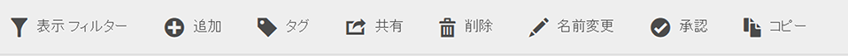
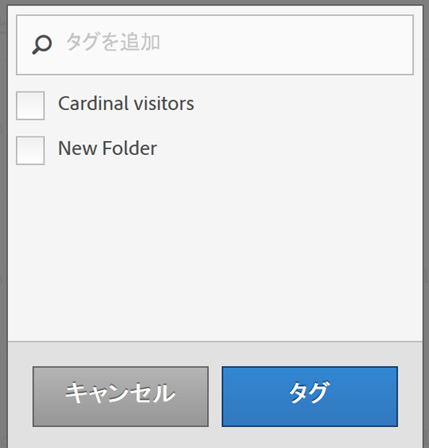

# セグメントのタグ設定

セグメントマネージャでは、セグメントにタグを付けて管理できます。

すべてのユーザーがセグメントにタグを付けることができます。セグメントには 1 つ以上のタグを適用できます。ただし、自分が所有しているまたは自分が共有していたセグメントに対するタグのみを表示できます。どのような種類のタグを作成する必要がありますか。次に、便利なタグのいくつかを示します。

* ソーシャルマーケティング、モバイルマーケティングなど、**チーム名**&#x200B;に基づくタグ。
* **プロジェクト**&#x200B;タグ（分析タグ）：入口ページ分析など。
* **カテゴリ**&#x200B;タグ：メンズ、地域。
* **ワークフロー**&#x200B;タグ：承認済み、（特定のビジネスユニット向けの）キュレーション。

1. セグメントマネージャで、タグを付けるセグメントの横にあるチェックボックスを選択します。セグメント管理ツールバーが表示されます。

   

1. 「**[!UICONTROL タグ]**」をクリックし、次のいずれかの操作を行います。

   * 既存のタグから選択するか、
   * 新しいタグを追加して、**[!UICONTROL Enter]** キーを押します。

      

1. 「**[!UICONTROL タグ]**」を再度クリックしてセグメントにタグを付けます。

これで、タグが「タグ」列に表示されます（右上のギアアイコンをクリックして列を管理します）。

また、**[!UICONTROL フィルター]**／**[!UICONTROL タグ]**&#x200B;に移動すると、タグをフィルタリングできます。
