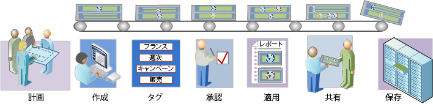

# セグメントワークフローの概要

セグメントビルダーによって作成され、セグメントマネージャによって管理されるセグメント用の推奨ワークフローについて説明します。

<!-- 

seg_workflow.xml

 -->

 [ セグメントの計画](/help/components/segmentation/segmentation-workflow/seg-plan.md)

セグメントの作成、およびセグメント管理環境の設定を行う前に、必要な質問をすべて終えておきます。意図した目的と明確な用途に従ってセグメントを設計します。

セグメントの計画および整理について詳しくは、セグメント計画のチェックリストを参照してください。

 [セグメントの構築](/help/components/segmentation/segmentation-workflow/seg-build.md)

セグメントを作成し、すべての Analytics 機能で使用できるように編集します。

THEN 演算子を使用したセグメントの作成方法については、[順次セグメントの作成](/help/components/segmentation/segmentation-workflow/seg-sequential-build.md)を参照してください。

 [ セグメントのタグ設定](/help/components/segmentation/segmentation-workflow/seg-tag.md)

整理および共有が容易に行えるようにセグメントにタグを付けます。簡易検索および詳細検索と整理について詳しくは、タグの計画および割り当て方法に関する説明を参照してください。

 [ セグメントの承認](/help/components/segmentation/segmentation-workflow/seg-approve.md)

セグメントを正当なセグメントとして承認します。

 [ セグメントの適用](/help/components/segmentation/segmentation-workflow/t-seg-apply.md)

レポートのセグメントレール（「セグメントを表示」をクリックして表示）からセグメントを直接適用できます。

 [ セグメントの共有](/help/components/segmentation/segmentation-workflow/t-seg-share.md)

他の Analytics ツールの特定の閲覧者とセグメントを共有します。また、Adobe Target および Adobe Experience Cloud と共有することもできます。

 [ セグメントのフィルタリング](/help/components/segmentation/segmentation-workflow/t-seg-filter.md)

タグ、所有者およびその他のフィルター（すべてを表示、自分が所有、自分と共有、お気に入りおよび承認済み）でフィルタリングします。

 [ セグメントのお気に入りへの登録](/help/components/segmentation/segmentation-workflow/t-seg-favorite.md)

セグメントを使いやすく整理するための 1 つの方法として、セグメントをお気に入りに登録することができます。

[セグメントの管理](/help/components/segmentation/segmentation-workflow/seg-manage.md)

セグメントマネージャでは、セグメントを様々な方法で管理できます。例えば、共有、フィルターを適用、タグ付け、承認、コピー、削除およびお気に入りへの登録が可能です。
