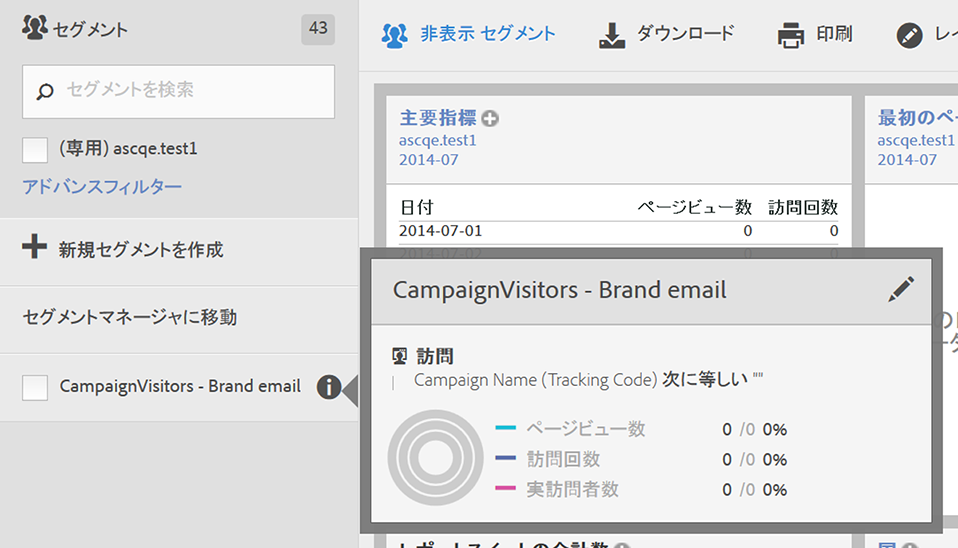
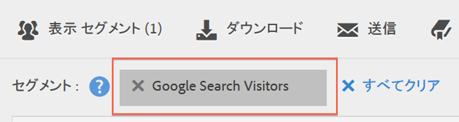

# セグメントの選択と適用

セグメントレールからレポートに 1 つ以上のセグメントを適用する方法について説明します。

1. セグメントを適用するレポートを表示します。例えば、[!UICONTROL ページレポート]を表示します。
1. レポートの上部にある「**[!UICONTROL セグメントを表示]**」をクリックします。セグメントレールが開きます。

   

1. 1 つ以上のセグメントの横にあるチェックボックスを選択するか、「**[!UICONTROL セグメントを検索]**」を使用して適切なセグメントを見つけます。

   >[!NOTE]
   >
   >1 つのレポートに複数のセグメントを適用できます（これはセグメントの積み重ねと呼ばれます）。複数のセグメントを適用すると、各セグメントの条件が「and」演算子で結合され、結合された条件が適用されます。積み重ねることができるセグメントの数に制限はありません。

   >[!NOTE]
   >
   >セグメント名の横にある情報アイコン（i）をクリックすると、主要な指標をプレビューして、有効なセグメントであるかどうかおよびセグメントの範囲を確認できます。

1. 「**[!UICONTROL (専用)`<report suite name>`]**」チェックボックスを選択して、レポートスイートでフィルタリングできます。この方法を使用すると、該当するレポートスイートに最後に保存されたセグメントのみが表示されます。
1. 「**[!UICONTROL セグメントを適用]**」をクリックします。レポートが更新されます。適用されるセグメントがレポートの上部に表示されます。

   
