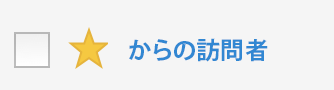

# セグメントのお気に入りへの登録

セグメントを使いやすく整理するための 1 つの方法として、セグメントをお気に入りに登録することができます。

1. セグメントマネージャで、お気に入りに登録するセグメントの横にある星をチェックします。星が黄色の星に変わります。

   

1. また、**[!UICONTROL フィルター]**／**[!UICONTROL その他のフィルター]**／**[!UICONTROL お気に入り]**&#x200B;で、お気に入りをフィルタリングすることもできます。
