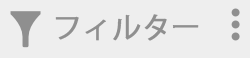
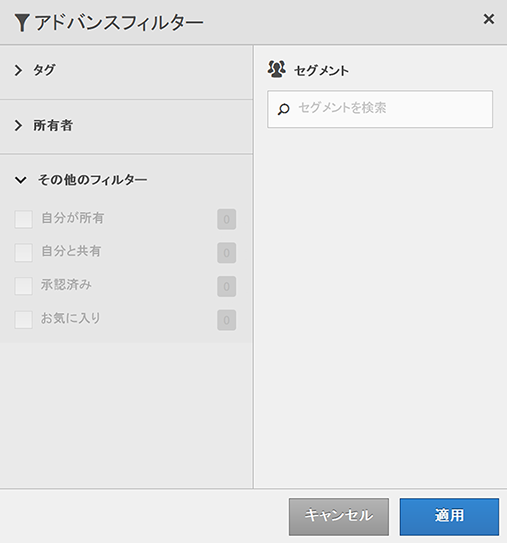

# セグメントのフィルタリング

タグ、所有者およびその他のフィルター（すべてを表示、自分が所有、自分と共有、お気に入りおよび承認済み）でフィルタリングします。

フィルタリングを使用すると、セグメントレール内でのセグメントの検索が容易になります。

1. セグメントマネージャで、**[!UICONTROL フィルター]** アイコン  をクリックします。

   

1. 次のフィルターを使用できます。

   | フィルター名 | 説明 |
   |---|---|
   | タグ | 特定の[タグ](/help/components/segmentation/segmentation-workflow/seg-tag.md)を使用してセグメントをフィルタリングできます。「タグ」列はデフォルトで表示されます。 |
   | 所有者 | セグメントを所有者でフィルタリングできます。 |
   | その他のフィルター／すべてを表示 | **（管理者のみ）**&#x200B;セグメント、所有者および最終修正日をすべて表示します。 |
   | その他のフィルター／自分が所有 | 自分が所有しているセグメントをすべて表示します。 |
   | その他のフィルター／自分と共有 | 他のユーザーが自分と[共有](/help/components/segmentation/segmentation-workflow/t-seg-share.md)しているセグメントをすべて表示します。 |
   | その他のフィルター／お気に入り |  [お気に入り](/help/components/segmentation/segmentation-workflow/t-seg-favorite.md)に登録しているセグメントをすべて表示します。 |
   | その他のフィルター／承認済み | 正式に       [承認された](/help/components/segmentation/segmentation-workflow/seg-approve.md)セグメントをすべて表示します。 |
   | セグメントを検索 | セグメントを名前で検索できます。 |
