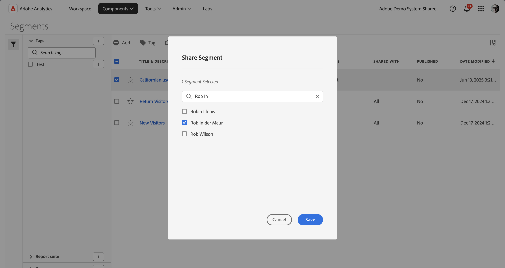

# セグメントの共有

権限に応じて、セグメントを組織全体、グループまたは個々のユーザーと共有できます。

| 管理者 | セグメントをすべてのユーザー、グループおよび特定のユーザーと共有できます。グループは、Admin Console で許可グループとして設定されます。 |
|---|---|
| 管理者以外 | セグメントを個人ユーザーとのみ共有できます。 |

セグメントを会社全体で共有する必要があるのはどのような場合でしょうか。また、セグメントをユーザーグループまたは個々のユーザーとのみ共有する必要があるのはどのような場合でしょうか。次に、いくつかのベストプラクティスを示します。

* 管理者として、セグメントを会社全体およびすべてのユーザーで使用すると良いと判断される場合は、セグメントを&#x200B;**[!UICONTROL すべて]**&#x200B;で共有します。この場合、[承認済み](/help/components/segmentation/segmentation-workflow/seg-approve.md)のセグメントにすることを検討してください。

* 管理者として、セグメントが特定のチームに対して適切なビジネス価値を提供すると判断される場合は、セグメントを特定の&#x200B;**[!UICONTROL グループ]**&#x200B;と共有します。このようなセグメントは正式に承認しないでください。
* 管理者または個人ユーザーとして、セグメントを他の個人ユーザーと共有し、セグメントを綿密に調べて確認します。役に立たないと判断される場合は破棄できます。このようなセグメントは正式に承認しないでください。

1. セグメントマネージャーで、共有するセグメントの横にあるチェックボックス SelectBox を選択します。
1. 「 共有」を選択します。
1. **[!UICONTROL セグメントを共有]** ダイアログで、次の手順を実行します。

   

   管理者は、「**[!UICONTROL すべて]**」を選択できます。また、組織内の&#x200B;**[!UICONTROL グループ]**&#x200B;または&#x200B;**[!UICONTROL ユーザー]**&#x200B;を選択することもできます。管理者以外は、個々のユーザーのみを表示できます。**[!UICONTROL 検索]**&#x200B;フィールドを使用して、グループまたはユーザーを検索します。1.

   1. （オプション）  を使用して *個人またはグループを検索* し、セグメントを共有するグループまたは個人のリストを制限します。

   1. 「**[!UICONTROL 保存]**」を選択して、セグメントを共有します。 「**[!UICONTROL キャンセル]**」を選択すると、キャンセルします。

   セグメントの横に共有アイコン  が表示されます。

1. **[!UICONTROL フィルター]**／**[!UICONTROL その他のフィルター]**／**[!UICONTROL 自分と共有]**&#x200B;に移動して、自分と共有しているセグメントをフィルタリングできます。

## ベストプラクティス

以下は、セグメントを共有する必要がある場合と誰とセグメントを共有する必要がある場合のベストプラクティスです。

* 管理者として、組織内の誰もがセグメントを快適に使用できると確信している場合にのみ、セグメントを「すべて」と共有します。 また、これらのセグメントのお気に入りを検討することもできます。 詳しくは、[ セグメントをお気に入りとしてマーク ](t-seg-favorite.md) を参照してください。

* 特定のグループに属するユーザーにビジネス価値を提供するセグメントがある場合、管理者はそのグループとセグメントを共有します。

* 管理者または個々のユーザーは、1 人または複数の個人とセグメントを共有してセグメントを検証します。 セグメントが役に立たないことが判明した場合は、セグメントを削除できます。
