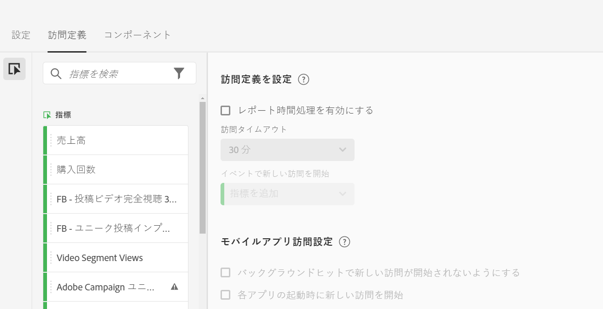
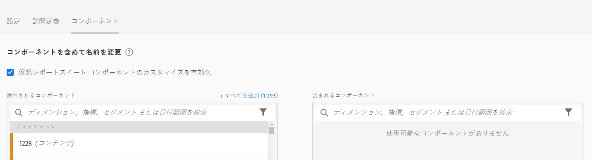

# 仮想レポートスイートの作成

仮想レポートスイートの作成を始める前に、以下に注意してください。

* 仮想レポートスイートマネージャーは管理者ユーザー以外には表示されません。
* 仮想レポートスイートは共有できません。「共有」するには、グループや権限を使用します。
* 仮想レポートスイートマネージャーには、自分が所有する仮想レポートスイートのみが表示されます。他のユーザーの仮想レポートスイートを表示するには、「すべて表示」をクリックする必要があります。

1. **[!UICONTROL コンポーネント]**／**[!UICONTROL 仮想レポートスイート]**&#x200B;に移動します。
1. 「**[!UICONTROL 追加 +]**」をクリックします。

   

## 設定の定義

「[!UICONTROL 設定]」タブで、これらの設定を定義し、「**[!UICONTROL 継続]**」をクリックします。

| 要素 | 説明 |
| --- |--- |
| 名前 | 仮想レポートスイートの名前は親レポートスイートから継承されません。別の名前を指定する必要があります。 |
| 説明 | ビジネスユーザーにとってわかりやすい説明を追加します。 |
| タグ | タグを追加してレポートスイートを整理できます。 |
| ソース | レポートスイートはこの仮想レポートスイートから次の設定を継承します。ほとんどのサービスレベルと機能（eVar 設定、処理ルール、分類など）を継承します。VRS の継承設定を変更するには、親レポートスイートを編集する必要があります（管理者／レポートスイート）。 |
| タイムゾーン | タイムゾーンの選択はオプションです。選択したタイムゾーンは VRS と共に保存されます。タイムゾーンを選択していない場合は、親レポートスイートのタイムゾーンが使用されます。VRS の編集時には、その VRS と共に保存されたタイムゾーンがドロップダウンセレクターに表示されます。タイムゾーンのサポートが追加される前に作成された VRS の場合は、その親レポートスイートのタイムゾーンがドロップダウンセレクターに表示されます。 |
| セグメント | セグメントは、1 つだけ追加することも、積み重ねることもできます。注意：2 つのセグメントを積み重ねると、それらのセグメントが AND ステートメントで結合されます。これを OR ステートメントに変更することはできません。仮想レポートスイートで現在使用中のセグメントを削除または編集しようとすると、警告が表示されます。 |

## 訪問の定義

「[!UICONTROL 訪問の定義]」タブで、これらの設定を定義し、「**[!UICONTROL 継続]**」をクリックします。

| 要素 | 説明 |
| --- |--- |
| **訪問定義を設定** |  |
| レポート時間処理を有効にする | レポート時間処理を使用して、デフォルトの訪問のタイムアウトまでの長さを変更します。これらの設定は、非破壊的で、Analysis Workspace でのみ適用します。[詳細情報](/help/components/vrs/vrs-report-time-processing.md) |
| 訪問タイムアウト | 各ユニーク訪問者がどのくらいの時間非アクティブであった場合に新しい訪問を自動的に開始するかを定義します。これは、訪問回数指標、訪問セグメントコンテナおよび訪問の期限が切れた eVar に影響します。 |
| イベントで新しい訪問を開始 | セッションがタイムアウトしているかどうかに関係なく、指定したイベントが発生したら、新しいセッションが開始されます。 |
| **モバイルアプリ訪問設定** | Adobe の Mobile SDK で収集されるモバイルアプリのヒット数について、訪問回数がどのように定義されるかを変更します。これらの設定は、非破壊的で、Analysis Workspace でのみ適用します。 |
| バックグラウンドヒットで新しい訪問が開始されないようにする | バックグラウンドヒットで、新しい訪問が開始されないようにしたり、訪問回数およびユニーク訪問者指標が水増しされないようにします。 |
| 各アプリの起動時に新しい訪問を開始 | アプリの起動が発生したら新しいセッションを開始します。[詳細情報](/help/components/vrs/vrs-mobile-visit-processing.md) |

## コンポーネントの追加と名前変更

1. 「[!UICONTROL コンポーネント]」タブで、Analysis Workspaceのこの仮想レポートスイートのコンポーネントを含める、除外する、名前を変更するキュレーションを適用するチェックボックスを選択します。
VRSキュレーションの詳細については、[仮想レポートスイートコンポーネントのキュレーション](https://experienceleague.adobe.com/docs/analytics/components/virtual-report-suites/vrs-components.html?lang=en#virtual-report-suites)を参照してください。

1. VRSに含めるコンポーネント（ディメンション、指標、セグメントまたは日付範囲）を[!UICONTROL 「含まれるコンポーネント]」セクションにドラッグします。

1. 終了したら、「**[!UICONTROL 保存]**」をクリックします。

## データのプレビュー

各タブの右側で、元のレポートスイートと比較して、この仮想レポートスイートの合計ヒット数、合計訪問回数および合計訪問者数をプレビューできます。

## 表示製品の互換性

仮想レポートスイートの一部の機能は、すべてのAdobe Analytics製品でサポートされていません。 製品の互換性リストを使用すると、現在の仮想レポートスイートの設定に基づいて、Adobe Analytics内のどの製品がサポートされているかを確認できます。
