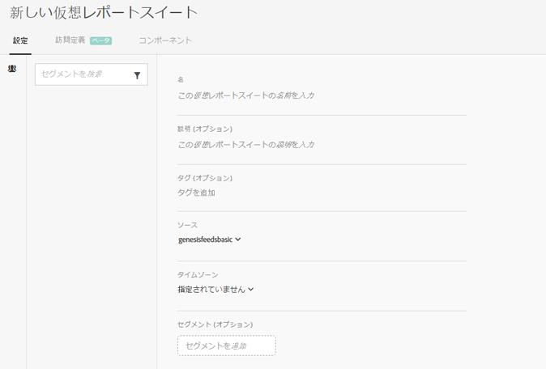

# 仮想レポートスイートの作成

仮想レポートスイートの作成を始める前に、以下に注意してください。

* 仮想レポートスイートマネージャーは管理者ユーザー以外には表示されません。
* 仮想レポートスイートは共有できません。「共有」するには、グループや権限を使用します。
* 仮想レポートスイートマネージャーには、自分が所有する仮想レポートスイートのみが表示されます。他のユーザーの仮想レポートスイートを表示するには、「すべて表示」をクリックする必要があります。

1. **[!UICONTROL コンポーネント]** / **[!UICONTROL 仮想レポートスイートに移動]**&#x200B;します。
1. **[!UICONTROL 「追加+]**」をクリックします。

   

1. 以下のフィールドを設定します。

<table id="table_0F85B56480BB46CBA5BE236BBD70156D"> 
 <thead> 
  <tr> 
   <th colname="col1" class="entry"> 要素 </th> 
   <th colname="col2" class="entry"> 説明 </th> 
  </tr> 
 </thead>
 <tbody> 
  <tr> 
   <td colname="col1"> 名前 </td> 
   <td colname="col2"> 
仮想レポートスイートの名前は親レポートスイートから継承されません。別の名前を指定する必要があります。 
 </td> 
  </tr> 
  <tr> 
   <td colname="col1"> 説明 </td> 
   <td colname="col2"> 
ビジネスユーザーにとってわかりやすい説明を追加します。 
 </td> 
  </tr> 
  <tr> 
   <td colname="col1"> タグ </td> 
   <td colname="col2"> 
タグを追加してレポートスイートを整理できます。 
 </td> 
  </tr> 
  <tr> 
   <td colname="col1"> グループ </td> 
   <td colname="col2"> 
この VRS へのアクセスを許可する権限グループを選択します（グループ権限は、管理者／ユーザー管理／グループからも管理できます）。 
 </td> 
  </tr> 
  <tr> 
   <td colname="col1"> 親レポートスイート </td> 
   <td colname="col2"> 
レポートスイートはこの仮想レポートスイートから次の設定を継承します。ほとんどのサービスレベルと機能（eVar 設定、処理ルール、分類など）を継承します。VRS の継承設定を変更するには、親レポートスイートを編集する必要があります（管理者／レポートスイート）。 
 </td> 
  </tr> 
  <tr> 
   <td colname="col1"> タイムゾーン </td> 
   <td colname="col2"> 
タイムゾーンの選択はオプションです。 
 
選択したタイムゾーンは VRS と共に保存されます。タイムゾーンを選択していない場合は、親レポートスイートのタイムゾーンが使用されます。 
 
VRS の編集時には、その VRS と共に保存されたタイムゾーンがドロップダウンセレクターに表示されます。タイムゾーンのサポートが追加される前に作成された VRS の場合は、その親レポートスイートのタイムゾーンがドロップダウンセレクターに表示されます。 
 </td> 
  </tr> 
  <tr> 
   <td colname="col1"> セグメント </td> 
   <td colname="col2"> 
セグメントは、1 つだけ追加することも、<a href="https://marketing.adobe.com/resources/help/en_US/analytics/segment/seg_stack.html" format="https" scope="external">積み重ねることもできます</a>。 
 
 
注意：2 つのセグメントを積み重ねると、それらのセグメントが AND ステートメントで結合されます。これを OR ステートメントに変更することはできません。 
 
 
仮想レポートスイートで現在使用中のセグメントを削除または編集しようとすると、警告が表示されます。 
 </td> 
  </tr> 
 </tbody> 
</table>

