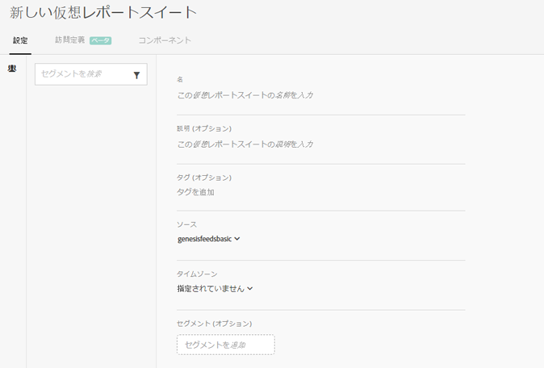
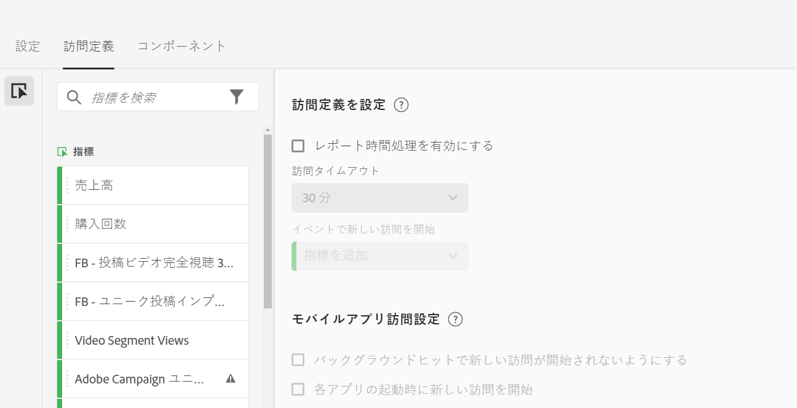
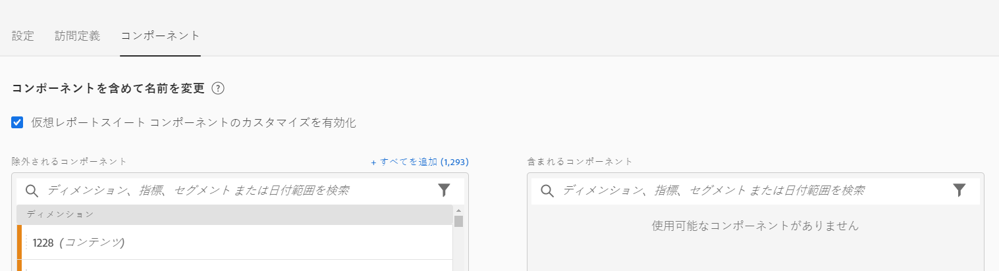

# 仮想レポートスイートの作成

仮想レポートスイートの作成を始める前に、以下に注意してください。

* 管理者以外のユーザーは、仮想レポートスーツマネージャーを表示できません。
* 仮想レポートスイートは共有できません。 「共有」は、グループ/権限を使用して行います。
* 仮想レポートスイートマネージャーでは、独自の仮想レポートスイートのみを表示できます。 他のユーザーの仮想レポートスイートを表示するには、「すべて表示」をクリックする必要があります。

1. **[!UICONTROL コンポーネント]** > **[!UICONTROL 仮想レポートスイート]**&#x200B;に移動します。
1. 「**[!UICONTROL 追加 +]**」をクリックします。

   

## 設定の定義

「[!UICONTROL 設定]」タブでこれらの設定を定義し、「**[!UICONTROL 続行]**」をクリックします。

| 要素 | 説明 |
| --- |--- |
| 名前 | 仮想レポートスイートの名前は、親レポートスイートから継承されないため、異なる名前にする必要があります。 |
| 説明 | ビジネスユーザーの利益のために適切な説明を追加します。 |
| タグ | タグを追加してレポートスイートを整理できます。 |
| ソース | この仮想レポートスイートの基となるレポートスイートは、次の設定を継承します。 ほとんどのサービスレベルと機能（eVar設定、処理ルール、分類など）は継承されます。 仮想レポートスイートでこれらの継承された設定を変更するには、親レポートスイート（管理者/レポートスイート）を編集する必要があります。 |
| タイムゾーン | タイムゾーンの選択はオプションです。 タイムゾーンを選択すると、仮想レポートスイートとともに保存されます。 タイムゾーンを選択していない場合は、親レポートスイートのタイムゾーンが使用されます。  仮想レポートスイートを編集すると、仮想レポートスイートと共に保存されたタイムゾーンがドロップダウンセレクターに表示されます。 タイムゾーンのサポートが追加される前に仮想レポートスイートが作成された場合、親レポートスイートのタイムゾーンがドロップダウンセレクターに表示されます。 |
| セグメント | セグメントは、1 つだけ追加することも、積み重ねることもできます。   メモ：2 つのセグメントを積み重ねると、それらのセグメントが AND ステートメントで結合されます。 これを OR ステートメントに変更することはできません。 仮想レポートスイートで現在使用中のセグメントを削除または編集しようとすると、警告が表示されます。 |

## 訪問の定義

「[!UICONTROL 訪問の定義]」タブでこれらの設定を定義し、「**[!UICONTROL 続行]**」をクリックします。

>[!BEGINSHADEBOX]

デモ動画については、 [訪問定義の調整](https://experienceleague.adobe.com/en/docs/analytics-learn/tutorials/components/virtual-report-suites/context-aware-sessions-in-virtual-report-suites){target="_blank"}を参照してください。

>[!ENDSHADEBOX]

| 要素 | 説明 |
| --- |--- |
| **訪問定義を設定** |  |
| レポート時間処理を有効にする | レポート時間処理を使用して、デフォルトの訪問タイムアウト長を変更します。 これらの設定は非破壊的で、Analysis Workspaceでのみ適用されます。 [詳細情報](/help/components/vrs/vrs-report-time-processing.md) |
| 訪問タイムアウト | 新しい訪問が自動的に開始されるまでのユニーク訪問者の非アクティブな量を定義します。 これは、訪問指標、訪問セグメントコンテナ、および訪問時に期限切れになるeVarに影響します。 |
| イベントで新しい訪問を開始 | セッションがタイムアウトしているかどうかに関係なく、指定したイベントが発生したら、新しいセッションが開始されます。 |
| **モバイルアプリ訪問設定** | Adobe Mobile SDKによって収集されたモバイルアプリのヒットに対する訪問の定義方法を変更します。 これらの設定は非破壊的で、Analysis Workspaceでのみ適用されます。 |
| バックグラウンドヒットで新しい訪問が開始されないようにする | バックグラウンドヒットで、新しい訪問が開始されないようにしたり、訪問回数およびユニーク訪問者指標が水増しされないようにします。 |
| 各アプリの起動時に新しい訪問を開始 | アプリの起動が発生したら新しいセッションを開始します。 [詳細情報](/help/components/vrs/vrs-mobile-visit-processing.md) |

## コンポーネントの追加と名前変更

1. 「[!UICONTROL コンポーネント]」タブで、Analysis Workspace のこの仮想レポートスイート用のキュレーションを適用するチェックボックスをオンにします。
仮想レポートスイートのキュレーションについて詳しくは、[仮想レポートスイートコンポーネントのキュレーション ](/help/components/vrs/vrs-components.md)を参照してください。

1. 仮想レポートスイートに含めるコンポーネント（ディメンション、指標、セグメント、日付範囲）を、[!UICONTROL 含まれるコンポーネント ] セクションにドラッグします。

1. 完了したら、「**[!UICONTROL 保存]**」をクリックします。

## データのプレビュー

各タブの右側では、元のレポートスイートと比較して、この仮想レポートスイートの合計ヒット数、合計訪問数、合計訪問者数をプレビューできます。

## 製品の互換性の表示

バーチャルレポートスイートの一部の機能は、すべてのAdobe Analytics製品でサポートされているわけではありません。 製品互換性リストでは、現在のバーチャルレポートスイートの設定に基づいて、Adobe Analytics内のどの製品がサポートされているかを確認できます。
