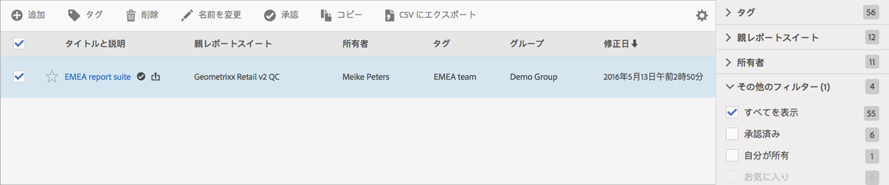

# 仮想レポートスイートの管理

管理者は、仮想レポートスイートマネージャーを使用して、仮想レポートスイートの編集、追加、タグ付け、削除、名前の変更、承認、コピー、エクスポートおよびフィルターを実行できます。仮想レポートスイートマネージャーは管理者以外には表示されません。

**[!UICONTROL Analytics]**／**[!UICONTROL コンポーネント]**／**[!UICONTROL 仮想レポートスイート]**

>[!NOTE]
>
>仮想レポートスイートマネージャーには、自分が所有する仮想レポートスイートのみが表示されます。他のユーザーの仮想レポートスイートを表示するには、「**[!UICONTROL すべて表示]**」をクリックする必要があります。

| タスク | 説明 |
|--- |--- |
| 追加 | 仮想レポートスイートビルダーに移動し、新しい仮想レポートスイートを作成できます。 |
| タグ | すべてのユーザーがセグメントにタグを付けることができます。セグメントには 1 つ以上のタグを適用できます。ただし、自分が所有するセグメントのタグのみが表示されます。どのような種類のタグを作成する必要がありますか。次に、便利なタグのいくつかを示します。<ul><li>ソーシャルマーケティング、モバイルマーケティングなど、チーム名に基づくタグ</li><li>プロジェクトタグ（分析タグ）：入口ページ分析など</li><li>カテゴリタグ：メンズ、地域</li><li>ワークフロータグ：（特定の事業単位用に）キュレーション済み、承認済み</li></ul> |
| 削除 | 仮想レポートスイートを削除しても、その仮想レポートスイートを適用している予定レポートとダッシュボードの動作に影響はありません。レポートやダッシュボードでは、予定レポートを再保存するまで、削除した仮想レポートスイートが引き続き使用されます。同じ名前を持つ仮想レポートスイートを編集しても、予定レポートは更新されません。 例：同じ名前で親レポートスイートが異なる 2 つの仮想レポートスイートがあるとします。 mainprod レポートスイートの仮想レポートスイートを参照するブックマークがあります。ここで、この仮想レポートスイートは重複しているので削除します。削除後も、このブックマークは引き続き、削除された VRS の定義を参照します。削除していない VRS の定義を変更しても、ブックマークに適用されている VRS は変更されません。このブックマークでは引き続き古い定義が使用されます。これを修正するには、新しい定義を参照するようにブックマークを更新します。ブックマーク、ダッシュボードまたは予定レポートで削除された VRS を使用しているかどうかが不明な場合は、削除していない VRS の名前を変更すると、ブックマークがその VRS を使用しているかどうかがより明確になります。 |
| 名前変更 | レポートスイートセレクターなど、仮想レポートスイートが表示されるすべての場所で、新しい名前が表示されます。 |
| 承認／未承認 | 仮想レポートスイートを承認し、「公式」または「標準」に設定します。承認を取り消すには、未承認にします。 |
| Copy | 独自の新しいレポートスイート ID を持つものの、同じ名前と定義を持つコピーを作成します。 |
| CSV に書き出し | 仮想レポートスイートの定義を .csv ファイルにエクスポートします。 |
| フィルター | タグ別、親レポートスイート別、所有者別およびその他のフィルター（すべて表示、自分が所有、お気に入り、承認済み）を使用してフィルターします。 |
