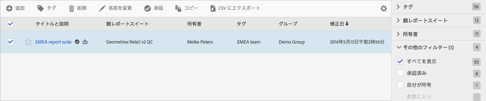

# 仮想レポートスイートの管理

仮想レポートスイートマネージャーを使用すると、管理者は仮想レポートスイートを編集、追加、タグ付け、削除、名前変更、承認、コピー、書き出し、フィルターできます。 管理者以外のユーザーには表示されません。

**[!UICONTROL Analytics]** > **[!UICONTROL コンポーネント]** > **[!UICONTROL 仮想レポートスイート]**

>[!NOTE]
>
>仮想レポートスイートマネージャーでは、独自の仮想レポートスイートのみを表示できます。 他のユーザーの仮想レポートスイートを表示するには、「**[!UICONTROL すべて表示]**」をクリックする必要があります。

| タスク | 説明 |
| --- | --- |
| 追加 | 仮想レポートスイートビルダーに移動し、新しい仮想レポートスイートを作成できます。 |
| タグ | すべてのユーザーは、仮想レポートスイートのタグを作成し、1 つ以上のタグを仮想レポートスイートに適用できます。 ただし、自分が所有する仮想レポートスイートのタグのみが表示されます。 どのようなタグを作成する必要がありますか？ ここでは、役に立つタグに関する推奨事項をいくつか紹介します。<ul><li>ソーシャルマーケティング、モバイルマーケティングなど、チーム名にもとづくタグ</li><li>エントリページ分析などのプロジェクトタグ（分析タグ）</li><li>カテゴリータグ：Men&#39;s; geography</li><li>ワークフロータグ：（特定の事業単位用に）キュレーション済み、承認済み</li></ul> |
| 削除 | 仮想レポートスイートを削除した場合、この仮想レポートスイートが適用されたスケジュールレポートとダッシュボードは引き続き正常に動作します。 スケジュールされたレポートを再度保存するまで、レポートまたはダッシュボードは、削除された仮想レポートスイートを引き続き使用します。  同じ名前を持つ仮想レポートスイートを編集しても、予定レポートは更新されません。 例：同じ名前で親レポートスイートが異なる 2 つの仮想レポートスイートがあるとします。 mainprod レポートスイートの仮想レポートスイートを参照するブックマークがあります。 ここで、この仮想レポートスイートは重複しているので削除します。 ブックマークは引き続き実行され、削除された仮想レポートスイートの定義を参照します。 残りの仮想レポートスイートの定義を変更しても、ブックマークに適用される仮想レポートスイートは変更されません。 古い定義を使っています。 これを修正するには、ブックマークを更新して新しい定義を参照します。 ブックマーク、ダッシュボード、スケジュールされたレポートが削除された仮想レポートスイートを使用しているかどうかわからない場合は、残りの仮想レポートスイートの名前を変更して、ブックマークが残りの仮想レポートスイートを使用しているかどうかをより明確にすることができます。 |
| 名前変更 | 仮想レポートスイートは、レポートスイートセレクターのように表示されるすべての場所に、新しい名前が表示されます。 |
| 承認/未承認 | 仮想レポートスイートを承認して、「公式」または「規範的」にします。 承認を取り消すことで、プロセスを元に戻すことができます。 |
| コピー | 独自の新しいレポートスイート IDを持つ個別のコピーを作成しますが、同じ名前と定義を持ちます。 |
| CSV に書き出し | 仮想レポートスイート定義を.csv ファイルに書き出します。 |
| フィルター | タグ、親レポートスイート、所有者、その他のフィルター（すべて表示、自分、お気に入り、承認済み）でフィルタリングします。 |
