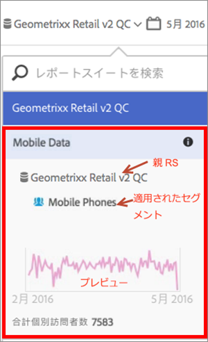

# 仮想レポートスイートの情報の表示

情報を表示するには、レポートスイート名の横にある「i」（情報）アイコンをクリックします。

## レポートスイートセレクター内{#section_74E43B60C1CA4180B5ACA57574C1FA0F}

レポートスイートセレクターで、仮想レポートスイートの横にある情報アイコンをクリックすると、以下の情報が表示されます。

* 親レポートスイートの名前。
* 適用されているセグメントの名前。
* セグメントを適用したレポートスイートの簡易プレビュー。
* 個別訪問者の合計数。

