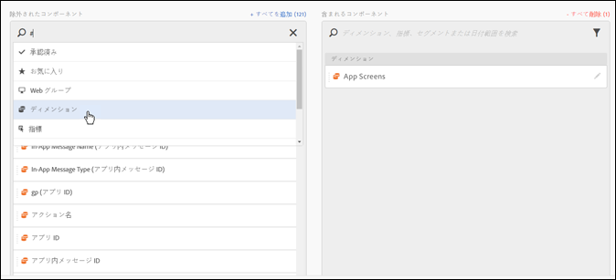
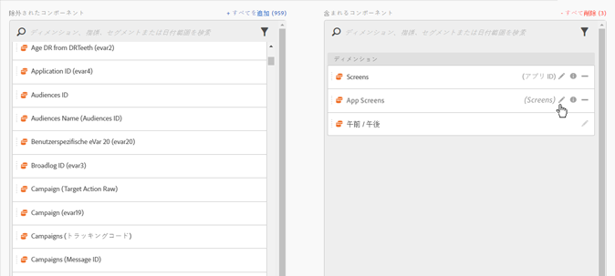
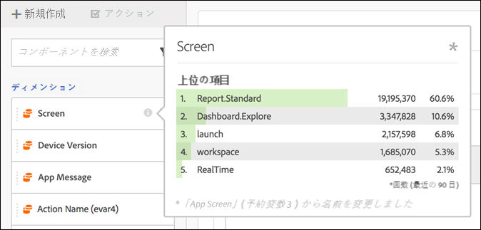
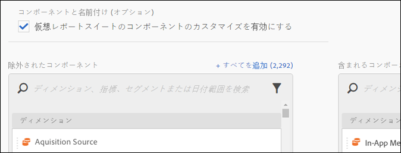

# 仮想レポートスイートコンポーネントのキュレーション

仮想レポートスイートをキュレートして、Analysis Workspace で利用可能なコンポーネントを限定できます。

>[!NOTE]
>
>キュレーションされた Workspace プロジェクトおよびキュレーションされた仮想レポートスイート（VRS）で、管理者および非管理者が表示できるコンポーネントに対して変更が加えられました。Previously, anyone could see non-curated components by clicking **[!UICONTROL Show all Components]**. [更新されたキュレーション機能](https://marketing.adobe.com/resources/help/en_US/analytics/analysis-workspace/curate-projects-vrs.html)により、どのコンポーネントを表示できるかをより詳細に制御できます。

コンポーネントのキュレーションを有効にするには、次の手順に従います。

1. **[!UICONTROL Analytics]** / **[!UICONTROL コンポーネント]** / **[!UICONTROL 仮想レポートスイート]** /新しい仮想レポートスイート **[!UICONTROL を作成に移動]**&#x200B;します。
1. **[!UICONTROL 設定]**&#x200B;を定義したら、「**コンポーネント[!UICONTROL 」タブをクリックします。]**

1. Select the checkbox **[!UICONTROL Enable Customization of Virtual Report Suite Components]**:

   

   >[!NOTE]
   >
   >If component customization is enabled, the virtual report suite is accessible **only in Analysis Workspace** and is not accessible in the following:

   * [!UICONTROL Reports &amp; Analytics]
   * [!UICONTROL Ad Hoc Analysis]
   * [!UICONTROL DataWarehouse]
   * [!UICONTROL Report Builder]
   * Analytics レポート API
   このチェックボックスを選択した後は、「除外されたコンポーネント」列から「含まれるコンポーネント」列にコンポーネントをドラッグすることで、任意のコンポーネントを仮想レポートスイートに追加できます。仮想レポートスイートに含めるかどうかを選択できるコンポーネントは次のとおりです。

   * ディメンション
   * 指標
   * セグメント
   * 日付範囲
   >[!NOTE]
   >
   >There is no need to *share* curated components (segments, calculated metrics, date ranges). 共有されていなくても、仮想レポートスイート用にキュレートされている場合は、Analysis Workspace で常に表示されます。

1. Additionally, you can filter or search the components and add the entire filtered selection to the included column by clicking **[!UICONTROL Add All]**.

   

## コンポーネントの名前の変更 {#section_0F7CD9F684FE4765BC00A2AFED56550E}

仮想レポートスイートに含まれるコンポーネントの表示名はレポートスイートごとに固有の名前に変更できます。例えば、仮想レポートスイートに「ページ名」を含めるときに、モバイルのコンテキストに応じてコンポーネント名に変更する必要がある場合は、この名前を「アプリ画面」などに変更できます。新しい名前はこの仮想レポートスイートが使用されるたびに Analysis Workspace に表示されます。

Analysis Workspace でコンポーネント名の横にある情報アイコンをクリックすると、変更前のコンポーネント名が表示されます。

## コンポーネントグループ {#section_483BEC76F49E46ADAAA03F0A12E48426}

仮想レポートスイートに一括でコンポーネントを追加するには、コンポーネントグループを使用します。例えば、モバイルアプリ分析で使用するデフォルトのコンポーネントセットをインポートするには、モバイルアプリグループを選択します。対応する一連のディメンションと指標が（既に名前が変更された状態で）自動的に仮想レポートスイートの「含む」リストに追加されます。

## ワークスペースの動作 {#section_6C32F8B642804C0097FCB14E21028D4A}

Analysis Workspace のキュレーションについて詳しくは、[プロジェクトのキュレーションおよび共有](https://marketing.adobe.com/resources/help/en_US/analytics/analysis-workspace/curate.html)を参照してください。