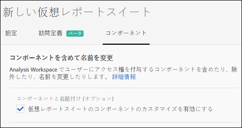
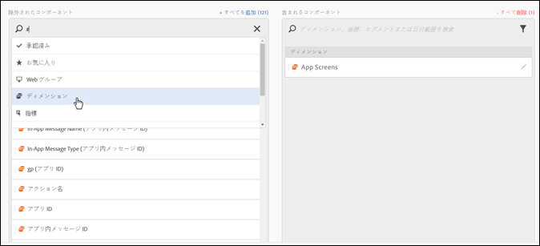
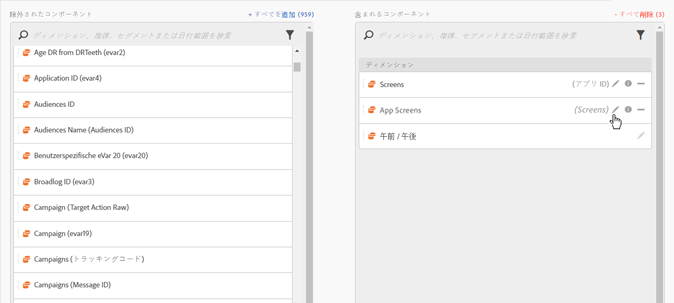
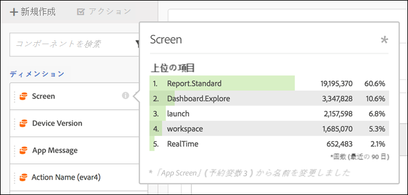
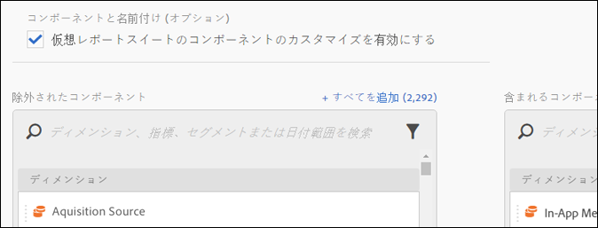

# 仮想レポートスイートコンポーネントのキュレーション

Analysis Workspaceでは、バーチャルレポートスイートをキュレーションして、コンポーネントを含めたり除外したりできます。

>[!BEGINSHADEBOX]

デモ動画については、 [ コンポーネントキュレーション ](https://experienceleague.adobe.com/en/docs/analytics-learn/tutorials/components/virtual-report-suites/component-curation-in-virtual-report-suites){target="_blank"}を参照してください。

>[!ENDSHADEBOX]

>[!NOTE]
>
>キュレーションされた Workspace プロジェクトおよびキュレーションされた仮想レポートスイートで、管理者および非管理者が表示できるコンポーネントに対して変更が加えられました。 以前は、「**[!UICONTROL すべてのコンポーネントを表示]**」ボタンをクリックすることで、誰でもキュレーションされていないコンポーネントを表示できました。 [更新されたキュレーションエクスペリエンス ](/help/analyze/analysis-workspace/curate-share/curate.md)を使用すると、表示されるコンポーネントをより細かく制御できます。

コンポーネントのキュレーションを有効にするには、次の手順に従います。

1. **[!UICONTROL Analytics]** > **[!UICONTROL コンポーネント]** > **[!UICONTROL 仮想レポートスイート]** > **[!UICONTROL 新しい仮想レポートスイートを作成]**&#x200B;に移動します。
1. **[!UICONTROL 設定]**&#x200B;を定義したら、「**[!UICONTROL コンポーネント]**」タブをクリックします。

1. チェックボックス **[!UICONTROL 仮想レポートスイートコンポーネントのカスタマイズを有効にする]**&#x200B;を選択します。

   

   >[!NOTE]
   >
   >コンポーネントのカスタマイズが有効になっている場合、仮想レポートスイートは **Analysis Workspace からのみ**&#x200B;アクセスでき、次の場所からはアクセスできません。
   >
   >* [!UICONTROL Data Warehouse]
   >* [!UICONTROL Report Builder]
   >* [!UICONTROL Activity Map]
   >* Analytics レポート API

   チェックを入れたら、該当するコンポーネントを「除外されたコンポーネント」列から「含まれたコンポーネント」列にドラッグすることで、仮想レポートスイートに含めるコンポーネントを追加できます。 含めるコンポーネントと除外できるコンポーネントは次のとおりです。

   * ディメンション
   * 指標
   * セグメント
   * 日付範囲

   >[!NOTE]
   >
   >キュレートされたコンポーネント（セグメント、計算指標、日付範囲）を&#x200B;*共有*&#x200B;する必要はありません。 共有されていなくても、仮想レポートスイート用にキュレートされている場合は、Analysis Workspace で常に表示されます。

1. コンポーネントにフィルターを適用するかコンポーネントの検索を実行して「**[!UICONTROL すべてを追加]**」をクリックすると、選択されたすべてのコンポーネントが「含む」列に追加されます。

   

## コンポーネントの名前の変更 {#section_0F7CD9F684FE4765BC00A2AFED56550E}

仮想レポートスイートに固有の、含まれるコンポーネントの表示名を変更できます。 例えば、バーチャルレポートスイートにページ名を含めたいが、よりモバイルフレンドリーなコンテキストに名前を変更したい場合は、App Screensに変更できます。 新しい名前は、このバーチャルレポートスイートを使用するたびにAnalysis Workspaceに表示されます。

Analysis Workspaceで、含まれているコンポーネントの情報アイコンをクリックすると、名前が変更されたコンポーネントの元の名前が表示されます。

## コンポーネントグループ {#section_483BEC76F49E46ADAAA03F0A12E48426}

コンポーネントグループを使用して、仮想レポートスイートにコンポーネントを一括追加します。 例えば、モバイルアプリ分析に固有のデフォルトのコンポーネントセットを読み込む場合は、モバイルアプリグループを選択します。 対応するディメンションと指標のセット（既に名前が変更されています）が、仮想レポートスイートの「含まれる」リストに自動的に追加されます。

## Workspace の動作 {#section_6C32F8B642804C0097FCB14E21028D4A}

Analysis Workspace のキュレーションについて詳しくは、[プロジェクトのキュレーションおよび共有](/help/analyze/analysis-workspace/curate-share/curate.md)を参照してください。
