# コンテキスト対応セッション

仮想レポートスイートのコンテキスト対応セッションでは、Adobe Analyticsがモバイル訪問の計算方法を変更します。この記事では、（モバイル SDK によって設定される）バックグラウンドヒットとアプリ起動イベントの処理がモバイル訪問数の定義にどのように影響するかについて説明します。

訪問の定義は、基になるデータを変更することなく、訪問者がモバイルアプリをどのように操作するかに応じて自由に変更できます。

## 顧客視点の URL パラメーター {#section_8B298006362341E3AC16A148422D1F65}

Adobe Analytics のデータ収集プロセスでは、顧客視点を指定するクエリ文字列パラメーター（「cp」クエリ文字列パラメーターと表記されます）を設定できます。このフィールドは、エンドユーザーのデジタルアプリケーションの状態を表します。これにより、ヒットが発生したときにモバイルアプリがバックグラウンド状態だったかどうかを確認できます。

## バックグラウンドヒットの処理 {#section_D47B3161B7E145B6A32AB06E9AA03FA3}

バックグラウンドヒットとは、バックグラウンド状態のアプリからトラッキングリクエストが送信されたときに Adobe Mobile SDK バージョン 4.13.6 以降から Analytics に送信されるヒットを指します。これには次のものが含まれます。

* 地域境界を越えるときに送信されるデータ
* プッシュ通知のインタラクション

次の例は、仮想レポートスイートで「バックグラウンドヒットで新しい訪問が開始されないようにする」設定が有効または無効になっているときに、各訪問者の訪問がいつから開始され、いつ終了するかを決定するために使用されるロジックを示しています。

**「バックグラウンドヒットを新しい訪問から開始できないようにする」が有効になっている場合:**

仮想レポートスイートでこの機能が有効になっていない場合、バックグラウンドヒットは他のヒットと同様に扱われ、フォアグラウンドヒットと同じように新しい訪問が開始されます。例えば、バックグラウンドヒットが発生してから 30 分（レポートスイートの標準のセッションタイムアウト）を経過せずに一連のフォアグラウンドヒットが発生した場合、そのバックグラウンドヒットはセッションの一部として扱われます。

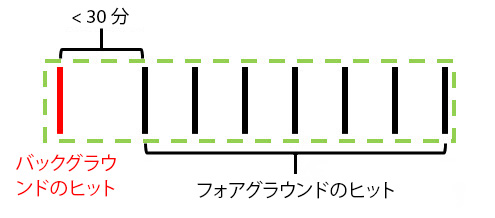

バックグラウンドヒットが発生してから 30 分を過ぎてフォアグラウンドヒットが発生した場合、そのバックグラウンドヒットは独立した訪問として扱われるため、訪問数は 2 になります。

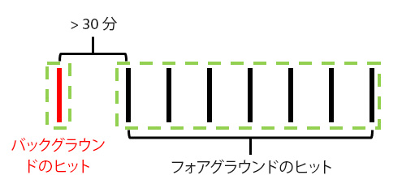

**「バックグラウンドヒットを新しい訪問から開始できないようにする」が有効になっている場合:**

次の例は、この機能が有効になっているときのバックグラウンドヒットの動作を示しています。

例 1：バックグラウンドヒットが発生してから一定時間（t）が経って一連のフォアグラウンドヒットが発生したとします。

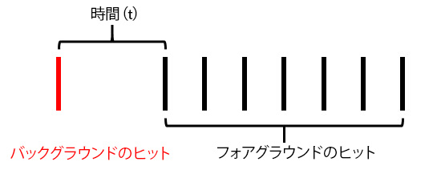

この例の場合、仮想レポートスイートで設定されている訪問タイムアウトよりも *t* の方が長いければ、フォアグラウンドヒットによって形成される訪問からバックグラウンドヒットが除外されます。例えば、仮想レポートスイートの訪問タイムアウトが 15 分に設定されていて、*t* が 20 分だった場合、バックグラウンドヒットは一連のヒットによって形成される訪問（緑の枠で囲まれている部分）には含まれません。つまり、バックグラウンドヒットで「訪問」の有効期間が設定された eVar は次の訪問に&#x200B;**引き継がれず**、訪問セグメントコンテナには緑の枠内のフォアグラウンドヒットのみが含まれます。

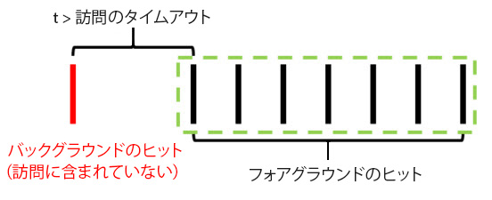

反対に、*t* が仮想レポートスイートで設定されている訪問タイムアウトよりも短い場合、バックグラウンドヒットは（緑の枠で囲まれているとおり）フォアグラウンドヒットと同様に訪問の一部として扱われます。

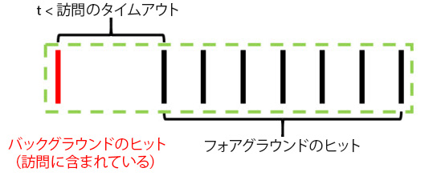

これは次のことを意味します。

* バックグラウンドヒットで「訪問」の有効期間が設定された eVar の値は同じ訪問で発生した他のヒットにも引き継がれます。
* バックグラウンドヒットで設定された値は訪問レベルのセグメントコンテナのロジック評価に使用されます。

いずれの場合も、合計訪問数は 1 になります。

例 2：一連のフォアグラウンドヒットが発生した後にバックグラウンドヒットが発生した場合の動作は次のようになります。

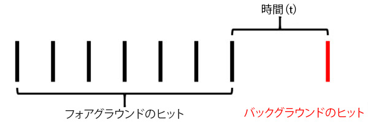

仮想レポートスイートで設定されているタイムアウトを過ぎてからバックグラウンドヒットが発生した場合、そのバックグラウンドヒットはセッション（緑の枠で囲まれている部分）の一部として扱われません。

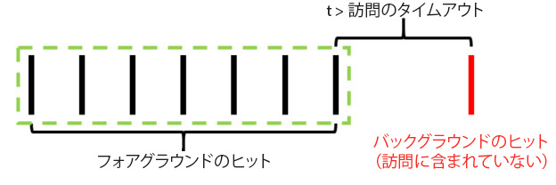

反対に、*t* の時間が仮想レポートスイートで設定されているタイムアウトよりも短かった場合、バックグラウンドヒットは前のフォアグラウンドヒットによって形成される訪問の一部として扱われます。

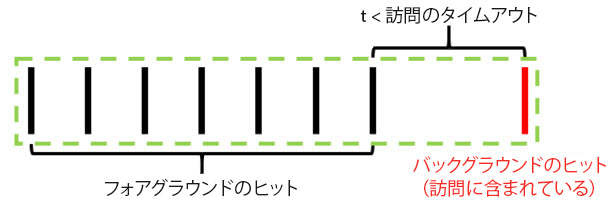

これは次のことを意味します。

* 前のフォアグラウンドヒットで「訪問」の有効期間が設定された eVar は、同じ訪問で発生したバックグラウンドヒットにも引き継がれます。
* バックグラウンドヒットで設定された値は訪問レベルのセグメントコンテナのロジック評価に使用されます。

先ほどと同様に、いずれの場合も合計訪問数は 1 になります。

例 3：状況により、バックグラウンドヒットの発生によって 2 つの訪問が 1 つの訪問にまとめられる場合があります。次のシナリオでは、バックグラウンドヒットの前後に一連のフォアグラウンドヒットが発生しています。

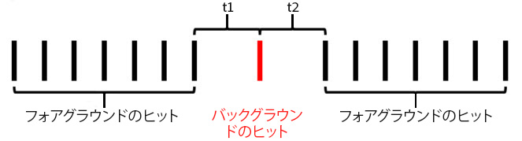

この例の場合、*t1* と *t2* がいずれも仮想レポートスイートで設定されている訪問タイムアウトより短ければ、*t1* と *t2* を合わせた時間が訪問タイムアウトより長くても、これらのヒットすべてが 1 つの訪問にまとめられます。

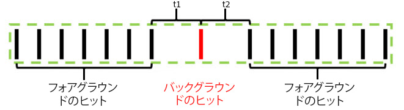

一方、*t1* と *t2* が仮想レポートスイートで設定されているタイムアウトより長い場合、これらのヒットは 2 つの独立した訪問として扱われます。

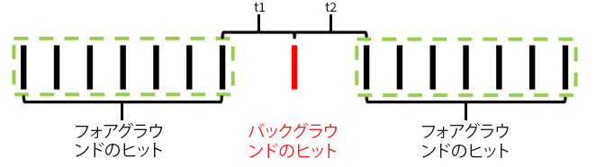

前の例と同様に、*t1* と *t2* がいずれもタイムアウトより短い場合、バックグラウンドヒットはその前の訪問の一部として扱われます。

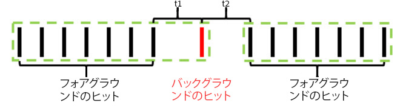

*t1* がタイムアウトより長く、*t2* がタイムアウトより短い場合、バックグラウンドヒットはその次の訪問の一部として扱われます。

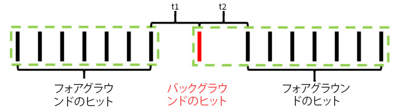

例 4：仮想レポートスイートで設定されている訪問タイムアウト期間内に一連のバックグラウンドヒットが発生した場合、バックグラウンドヒットは目に見えない「バックグラウンド訪問」を形成します。これらの訪問は訪問数にカウントされず、訪問セグメントコンテナを使用してアクセスすることもできません。

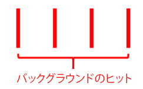

バックグラウンド訪問は訪問と見なされませんが、訪問の有効期間が設定された eVar の値は同じ「バックグラウンド訪問」で発生した他のバックグラウンドヒットにも引き継がれます。

例 5：一連のフォアグラウンドヒットが発生した後に複数のバックグラウンドヒットが連続して発生した場合、（タイムアウト設定によって異なりますが）それらのバックグラウンドヒットにより訪問タイムアウト期間を越えて 1 つの訪問が継続されることがあります。例えば、*t1* と *t2* を合わせた時間が仮想レポートスイートのタイムアウトより長くても、それぞれの時間がタイムアウトより短い場合は、両方のバックグラウンドヒットが同じ訪問の一部として扱われます。

同様に、一連のフォアグラウンドイベントの前に一連のバックグラウンドヒットが発生した場合も、同じような動作になります。

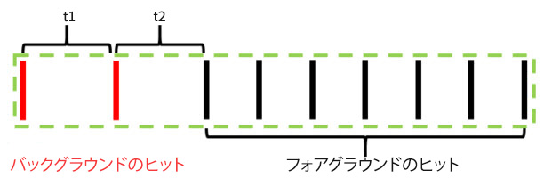

バックグラウンドヒットのこのような動作は、バックグラウンドヒットが続いている間に設定された eVar やその他の変数による属性の効果を維持することを目的としています。これにより、アプリがバックグラウンド状態のときに実行されたアクションにもダウンストリームのコンバージョンイベントを関連付けることが可能になります。また、ダウンストリームのフォアグラウンドセッションにつながったバックグラウンドヒットを訪問セグメントコンテナに含めることもできるようになるので、プッシュメッセージの効果を容易に測定できます。

## 訪問指標の動作 {#section_50B82618A39B454493B33B1450CCBD3E}

訪問数は少なくとも 1 つのフォアグラウンドヒットを含む訪問の数のみに基づいて計測されます。つまり、孤立したバックグラウンドヒットや「バックグラウンド訪問」は訪問指標にカウントされません。

## 訪問別滞在時間指標の動作 {#section_0A149ABB3E034B97BD0B3A7F3EB67383}

滞在時間は引き続き、バックグラウンドヒットを除く、ヒットからヒットまでの時間に基づきアナログ方式で計算されます。ただし、（バックグラウンドヒットとフォアグラウンドヒットの間隔が短いことにより）バックグラウンドヒットが訪問の一部として扱われている場合、それらのバックグラウンドヒットはフォアグラウンドヒットと同様に訪問別滞在時間の計算に含まれます。

## バックグラウンドヒットの処理に関連する設定 {#section_C8B1D38C06FF4ABAAFA78CE9550C0F4B}

バックグラウンドヒットの処理はレポート時間処理を使用している仮想レポートスイートでしか利用できないので、Adobe Analytics では、レポート時間処理を使用しないベースレポートスイートでも訪問数を維持できるように、2 種類のバックグラウンドヒット処理がサポートされています。この設定にアクセスするには、Adobe Analytics Admin Console に移動して、該当するベースレポートスイートの設定に移動し、「モバイル管理」メニューに移動した後、「モバイルアプリケーションレポート」サブメニューに移動します。

1. 「従来の処理をオンにする」：これがすべてのレポートスイートのデフォルト設定です。従来の処理をオンにした場合、レポート時間属性を使用しないベースレポートスイートでは、バックグラウンドヒットが通常のヒットとして処理されます。つまり、ベースレポートスイートに表示されないバックグラウンドヒットも通常のヒットとして扱われ、訪問数にカウントされます。バックグラウンドヒットをベースレポートスイートに表示しないようにするには、この設定を「オフ」に変更します。
1. 「従来の処理をオフにする」：バックグラウンドヒットに対する従来の処理をオフにすると、ベースレポートスイートに送信されたすべてのバックグラウンドヒットが無視され、そのベースレポートスイートに基づいて作成された仮想レポートスイートでレポート時間処理が使用されている場合にのみバックグラウンドヒットにアクセスできるようになります。つまり、バックグラウンドヒットによってキャプチャされ、ベースレポートスイートに送信されたデータは、レポート時間処理が有効になっている仮想レポートスイートにのみ表示されます。

   この設定は、ベースレポートスイートの訪問数を変更することなくバックグラウンドヒットに対する新しい処理方法を利用する必要があるお客様向けの設定です。

いずれの場合も、バックグラウンドヒットは請求の対象になり、その料金は Analytics に送信される他のヒットと同じ料金になります。

## アプリが起動されるたびに新しい訪問を開始 {#section_9DA9A8B9758248A6B311EFBA06AECA80}

バックグラウンドヒットの処理に加え、仮想レポートスイートでは、モバイル SDK からアプリ起動イベントが送信されるたびに新しい訪問を強制的に開始することができます。この設定を有効にすると、アプリ起動イベントが SDK から送信されるたびに、現在継続中の訪問がまだタイムアウトしていなくても、強制的に新しい訪問が開始されます。アプリ起動イベントを含むヒットは新しい訪問に含まれる最初のヒットとして扱われるので、訪問数が増加し、別個の訪問セグメントコンテナが作成されます。
