# コンテキスト対応セッション

仮想レポートスイートのコンテキストに応じたセッションは、Adobe Analytics が任意のデバイスからの訪問を計算する方法を変更します。 また、この記事では、（モバイル SDK によって設定される）バックグラウンドヒットとアプリ起動イベントの処理がモバイル訪問数の定義にどのように影響するかについて説明します。

訪問の定義は、基になるデータを変更することなく、訪問者がデジタルエクスペリエンスをどのように操作するかに応じて自由に変更できます。

>[!BEGINSHADEBOX]

デモ動画については、 [&#x200B; コンテキストに応じたセッション &#x200B;](https://experienceleague.adobe.com/ja/docs/analytics-learn/tutorials/components/virtual-report-suites/context-aware-sessions-in-virtual-report-suites){target="_blank"}を参照してください。

>[!ENDSHADEBOX]

## Customer Perspective URL パラメーター

Adobe Analytics データ収集プロセスでは、お客様の視点を指定するクエリ文字列パラメーター（「cp」クエリ文字列パラメーターと呼ばれます）を設定できます。 このフィールドは、エンドユーザーのデジタルアプリケーションの状態を指定します。 これにより、モバイルアプリがバックグラウンド状態のときにヒットが生成されたかどうかを確認できます。

## バックグラウンドヒット処理

バックグラウンドヒットとは、アプリがバックグラウンド状態でトラッキングリクエストを行ったときに、Adobe Mobile SDK バージョン 4.13.6以降からAnalyticsに送信されるヒットの一種です。 典型的な例としては、次のようなものがあります。

* ジオフェンス交差時に送信されたデータ
* プッシュ通知インタラクション

次の例では、仮想レポートスイートで「バックグラウンドヒットによる新しい訪問の開始を防止」設定が有効になっている場合または有効になっていない場合に、訪問の開始日と終了日を決定する際に使用されるロジックの概要を説明します。

**「バックグラウンドヒットで新しい訪問が開始されないようにする」が有効になっていない場合：**

この機能が仮想レポートスイートに対して有効になっていない場合、バックグラウンドヒットは他のヒットと同じように扱われます。つまり、新しい訪問を開始し、フォアグラウンドヒットと同じように動作します。 例えば、背景ヒットがフォアグラウンドヒットのセットの前に30分未満（レポートスイートの標準セッションタイムアウト）で発生した場合、背景ヒットはセッションの一部となります。

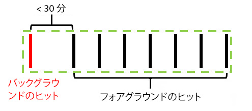

バックグラウンド ヒットがフォアグラウンド ヒットの30分以上前に発生した場合、バックグラウンド ヒットは合計訪問数が2の場合に独自の訪問を作成します。

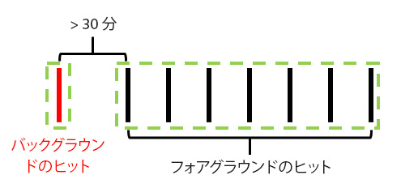

**「バックグラウンドヒットで新しい訪問が開始されないようにする」が有効になっている場合：**

次の例は、この機能が有効になっているときのバックグラウンドヒットの動作を示しています。

例 1：バックグラウンドヒットが発生してから一定時間（t）が経って一連のフォアグラウンドヒットが発生したとします。

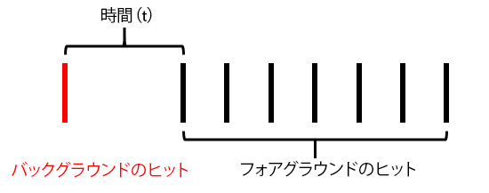

この例では、*t*&#x200B;が仮想レポートスイートの設定された訪問タイムアウトよりも大きい場合、前景ヒットによって形成された訪問から背景ヒットが除外されます。 例えば、仮想レポートスイートの訪問タイムアウトが15分に設定され、*t*&#x200B;が20分の場合、この一連のヒット（緑のアウトラインで表示）によって形成された訪問は、バックグラウンドヒットを除外します。 つまり、バックグラウンドヒットに「訪問」の有効期限が設定されているeVarは、次の訪問に&#x200B;**not**&#x200B;保持され、訪問セグメントコンテナには緑色のアウトライン内の前景ヒットのみが含まれます。

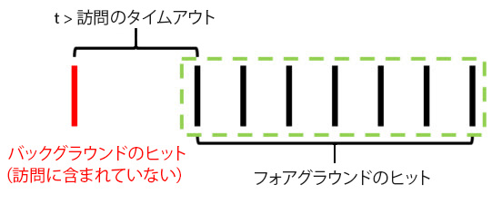

逆に、*t*&#x200B;が仮想レポートスイートの設定された訪問タイムアウトより小さい場合、背景ヒットは、前景ヒット（緑のアウトラインで表示）であるかのように、訪問の一部として含まれます。

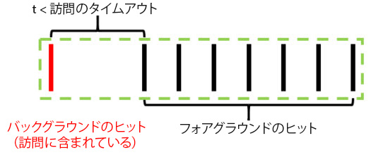

つまり、

* バックグラウンドヒットで「訪問」の有効期限が設定されているeVarは、この訪問の他のヒットにその値を保持します。
* バックグラウンドヒットで設定された値は、訪問レベルのセグメントコンテナロジック評価に含まれます。

どちらの場合も、合計訪問数は1になります。

例 2：一連のフォアグラウンドヒットが発生した後にバックグラウンドヒットが発生した場合の動作は次のようになります。

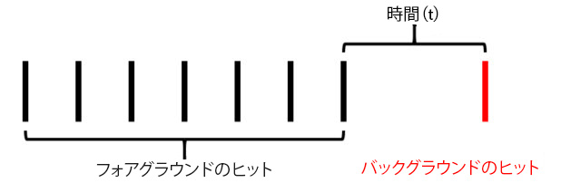

仮想レポートスイートの設定されたタイムアウトの後にバックグラウンドヒットが発生した場合、バックグラウンドヒットはセッションの一部ではありません（緑色で示されます）。

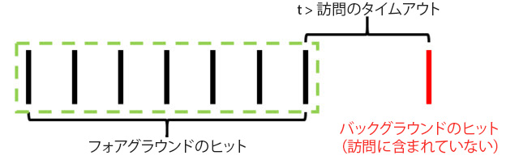

同様に、期間&#x200B;*t*&#x200B;が仮想レポートスイートの設定されたタイムアウトより小さい場合、バックグラウンドヒットは前のフォアグラウンドヒットによって形成された訪問に含まれます。

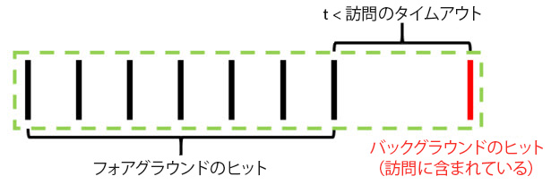

つまり、

* 以前のフォアグラウンドヒットで「訪問」の有効期限が設定されているeVarは、この訪問のバックグラウンドヒットにその値を保持します。
* バックグラウンドヒットで設定された値は、訪問レベルのセグメントコンテナロジック評価に含まれます。

以前と同様に、いずれの場合も合計訪問数は1になります。

例 3：状況により、バックグラウンドヒットの発生によって 2 つの訪問が 1 つの訪問にまとめられる場合があります。 次のシナリオでは、バックグラウンド ヒットの前に一連のフォアグラウンド ヒットが続きます。

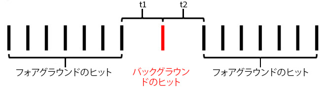

この例では、*t1*&#x200B;と&#x200B;*t2*&#x200B;の両方が訪問タイムアウトを設定した仮想レポートスイートよりも小さい場合、*t1*&#x200B;と&#x200B;*t2*&#x200B;が一緒に訪問タイムアウトよりも大きい場合でも、これらのヒットはすべて1回の訪問に組み合わされます。

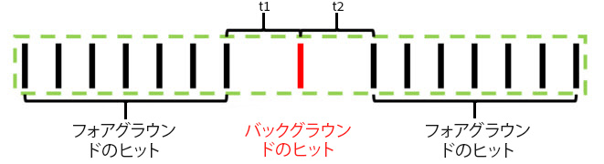

ただし、*t1*&#x200B;および&#x200B;*t2*&#x200B;が仮想レポートスイートが設定したタイムアウトよりも大きい場合、これらのヒットは2つの異なる訪問に分けられます。

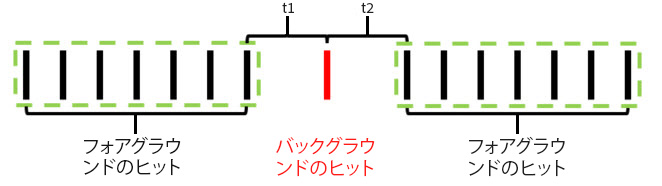

同様に（前の例と同様に）、*t1*&#x200B;がタイムアウトより小さく、*t2*&#x200B;がタイムアウトより大きい場合、バックグラウンドヒットは最初の訪問に含まれます。

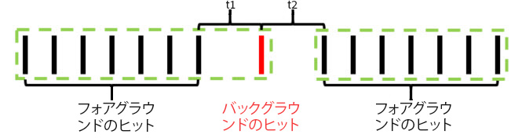

*t1*&#x200B;がタイムアウトより大きく、*t2*&#x200B;がタイムアウトより小さい場合、バックグラウンドヒットは2回目の訪問に含まれます。

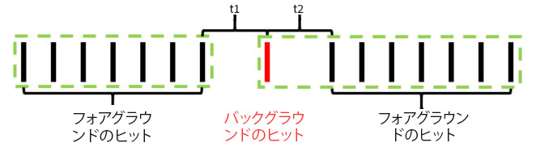

例 4：仮想レポートスイートで設定されている訪問タイムアウト期間内に一連のバックグラウンドヒットが発生した場合、バックグラウンドヒットは目に見えない「バックグラウンド訪問」を形成します。これらの訪問は訪問数にカウントされず、訪問セグメントコンテナを使用してアクセスすることもできません。

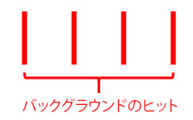

バックグラウンド訪問は訪問と見なされませんが、訪問の有効期限が設定された eVar の値は同じ「バックグラウンド訪問」で発生した他のバックグラウンドヒットにも引き継がれます。

例 5：一連のフォアグラウンドヒットが発生した後に複数のバックグラウンドヒットが連続して発生した場合、（タイムアウト設定によって異なりますが）それらのバックグラウンドヒットにより訪問タイムアウト期間を越えて 1 つの訪問が継続されることがあります。 例えば、*t1*&#x200B;と&#x200B;*t2*&#x200B;が一緒にバーチャルレポートスイートの訪問タイムアウトよりも大きく、個別にタイムアウトよりも小さい場合、訪問は引き続き両方のバックグラウンドヒットを含むように拡張されます。

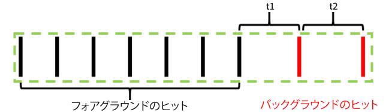

同様に、一連の前景イベントの前に一連の背景ヒットが発生した場合、同様の動作が発生します。

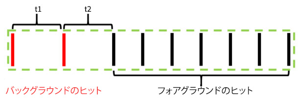

バックグラウンドヒットは、バックグラウンドヒット中に設定されたeVarまたはその他の変数からのアトリビューション効果を保持するために、この方法で動作します。 これにより、下流の前景コンバージョンイベントを、アプリがバックグラウンド状態にあるときに実行されたアクションに関連付けることができます。 また、訪問セグメントコンテナにバックグラウンドヒットを含めることもできます。これにより、プッシュメッセージの有効性を測定するのに役立つ下流の前景セッションが作成されました。

## 訪問指標の動作

訪問回数は、少なくとも1回のフォアグラウンドヒットを含む訪問回数のみに基づきます。 これは、孤立した背景ヒットまたは「背景訪問」が訪問指標にカウントされないことを意味します。

## 1訪問あたりの滞在時間指標の動作

ヒット間の時間を使用して、バックグラウンドヒットがない場合と同様の方法で滞在時間が計算されます。 ただし、訪問にバックグラウンドヒットが含まれる場合（前景ヒットに十分に近いヒットが発生したため）、これらのヒットは、前景ヒットであるかのように、訪問あたりの滞在時間の計算に含まれます。

## 背景ヒット処理設定

バックグラウンドヒットの処理はレポート時間処理を使用している仮想レポートスイートでしか利用できないので、Adobe Analytics では、レポート時間処理を使用しないベースレポートスイートでも訪問数を維持できるように、2 種類のバックグラウンドヒット処理がサポートされています。 この設定にアクセスするには、Adobe Analytics Admin Toolsに移動し、該当する基本レポートスイートの設定に移動してから、「Mobile Management」メニューに移動し、「Mobile Application Reporting」サブメニューに移動します。

1. 「レガシー処理中」：これは、すべてのレポートスイートのデフォルト設定です。 非レポート時間アトリビューションベースレポートスイートに関する限り、プロセスのバックグラウンドヒットを処理パイプラインの通常のヒットとして残します。 つまり、基本レポートスイートに表示されるバックグラウンドヒットは、通常のヒットとして訪問数が増加します。 ベースレポートスイートにバックグラウンドヒットを表示しない場合は、この設定を「オフ」に変更します。
1. 「レガシー処理オフ」：バックグラウンドヒットのレガシー処理をオフにすると、ベースレポートスイートに送信されたバックグラウンドヒットはベースレポートスイートによって無視され、このベースレポートスイートで作成された仮想レポートスイートがレポート時間処理を使用するように設定されている場合にのみアクセスできます。 つまり、この基本レポートスイートに送信されたバックグラウンドヒットによってキャプチャされたデータは、レポート時処理有効な仮想レポートスイートにのみ表示されます。

   この設定は、基本レポートスイートの訪問数を変更せずに、新しいバックグラウンドヒット処理を利用したい顧客を対象としています。

いずれの場合も、バックグラウンドヒットは、Analyticsに送信される他のヒットと同じコストで請求されます。

## アプリ起動時に新規訪問を開始する

バーチャルレポートスイートでは、バックグラウンドヒット処理に加えて、モバイルSDKがアプリ起動イベントを送信するたびに、新しい訪問を強制的に開始できます。 この設定を有効にすると、アプリ起動イベントがSDKから送信されるたびに、開いている訪問がタイムアウトに達したかどうかに関係なく、新しい訪問が強制的に開始されます。 アプリ起動イベントを含むヒットは、次の訪問の最初のヒットとして含まれ、訪問数を増やし、セグメント化のための個別の訪問コンテナを作成します。
