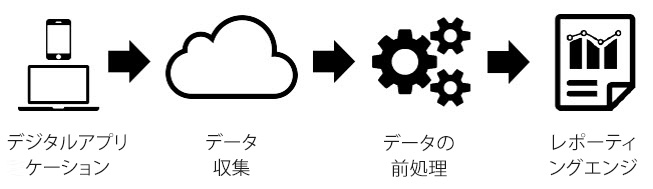
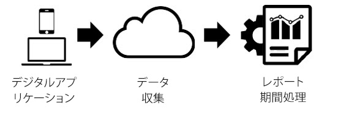

# レポート時間処理

レポートの時間処理は、データを非破壊的で遡及的な方法で処理できる仮想レポートスイート設定です。

>[!NOTE]
>
>レポートの時間処理は、Analysis Workspaceでのみ使用できます。

レポート時間処理は、仮想レポートスイートのデータのみに影響し、ベースレポートスイートのデータやデータ収集には影響しません。次の図は、レポート時間処理と Analytics の従来の処理がどのように違うかを表しています。

Analytics によるデータ処理では、データがデータ収集パイプラインを通過して前処理ステップに送られた後に、レポート用のデータが準備されます。この前処理ステップでは、収集されたデータに訪問有効期間のロジックと eVar 持続ロジック（など）が適用されます。この前処理モデルの最大の欠点は、データが収集される前に設定をおこなっておく必要がある点です。つまり、前処理設定の変更は、設定変更後の新しいデータにしか適用されません。これはデータが順番どおりに届かなかった場合や、設定に誤りがあった場合に問題を引き起こします。

レポート時間処理は Analytics によるレポート用データの処理とは根本的に異なります。データが収集される前に処理のロジックをあらかじめ決定するのではなく、前処理ステップの最中に設定されたデータを無視して、レポートが実行されるたびにロジックを適用するという点がこの機能の特徴です。

この処理アーキテクチャにより、従来よりもはるかに柔軟なレポートの作成が可能となります。例えば、訪問タイムアウト期間を非破壊的な方法で任意の長さに設定すると、それらの変更がデータの収集前に適用されていたかのように、過去に遡って eVar の持続性やセグメントコンテナに反映されます。また、ベースレポートスイートのデータを変更することなく、複数の仮想レポートスイートを作成して、同じベースレポートスイートに基づく別々のレポート時間処理オプションを仮想レポートスイートごとに設定することもできます。

さらに、レポート時間処理では、バックグラウンドヒットで新しい訪問が開始されないようにしたり、アプリ起動イベントがトリガーされるたびに[モバイル SDK](https://marketing.adobe.com/developer/get-started/mobile/c-measuring-mobile-applications) からレポートスイートに対して新しい訪問を開始するように指定したりすることもできます。

レポート時間処理が有効になっている仮想レポートスイートで現在使用できる設定オプションを次に示します。

<table id="table_C086C5FD10A84A1ABC081F5DE28F802D"> 
 <thead> 
  <tr> 
   <th colname="col1" class="entry"> 設定 </th> 
   <th colname="col2" class="entry"> 説明 </th> 
  </tr>
 </thead>
 <tbody> 
  <tr> 
   <td colname="col1"> 
 訪問タイムアウト 
 </td> 
   <td colname="col2"> 
 訪問タイムアウト設定では、各訪問者がどのくらいの時間非アクティブであった場合に新しい訪問を自動的に開始するかを定義します。デフォルト値は 30 分です。例えば、訪問タイムアウトを 15 分に設定した場合、収集された一連のヒットの後に非アクティブな時間が 15 分続くと、新しい訪問が開始されます。この設定は訪問数だけでなく、訪問セグメントコンテナの評価方法や、訪問時に期限切れになる eVar の訪問有効期間ロジックにも影響します。通常は、訪問タイムアウトを短くするとレポートに表示される訪問数が多くなり、訪問タイムアウトを長くするとレポートに表示される訪問数が少なくなります。 
 </td> 
  </tr> 
  <tr> 
   <td colname="col1"> 
 モバイルアプリ訪問設定 
 </td> 
   <td colname="col2"> 
 <a href="https://www.adobe.io/apis/cloudplatform/mobile.html" format="html" scope="external">Adobe Mobile SDK</a> を介してモバイルアプリによって生成されるデータを含むレポートスイートの場合は、さらに多くの訪問設定を使用できます。これらの設定は非破壊的であり、Mobile SDK を通じて収集されたヒットのみに影響します。これらの設定は Mobile SDK の外部で収集されたデータには影響しません。 
 </td> 
  </tr> 
  <tr> 
   <td colname="col1"> 
 バックグラウンドヒットで新しい訪問が開始されないようにする 
 </td> 
   <td colname="col2"> 
 バックグラウンドヒットは、アプリがバックグラウンド状態のときに Mobile SDK によって収集されます。 
 </td> 
  </tr> 
  <tr> 
   <td colname="col1"> 
 各アプリの起動時に新しい訪問を開始 
 </td> 
   <td colname="col2"> 
 訪問タイムアウトで設定されている非アクティブ時間とは関係なく、Mobile SDK からアプリ起動イベントが記録されるたびに新しい訪問を強制的に開始することができます。この設定は訪問指標や訪問セグメントコンテナだけでなく、eVar の訪問有効期間ロジックにも影響を与えます。 
 </td> 
  </tr> 
  <tr> 
   <td colname="col1"> 
イベントで新しい訪問を開始 
 </td> 
   <td colname="col2"> 
セッションがタイムアウトしているかどうかに関係なく、イベントの発生時に新しいセッションが開始されます。新しく作成されたセッションには、そのセッションを開始したイベントが含まれます。さらに、複数のイベントを使用して 1 つのセッションを開始できます。新しいセッションは、これらのイベントのいずれかがデータに検出された場合に開始されます。この設定は、訪問数、訪問セグメントコンテナおよび eVar の訪問有効期間ロジックにも影響します。 
 </td> 
  </tr> 
 </tbody> 
</table>

レポート時間処理では、従来の Analytics レポートで使用できる指標とディメンションの一部がサポートされていません。Virtual report suites utilizing Report Time Processing are only accessible in Analysis Workspace and will not be accessible in [!UICONTROL Reports &amp; Analytics], Ad Hoc Analysis, Data Warehouse, Report Builder, Data Feeds, or the reporting API.

また、レポート時間処理では、レポートの日付範囲（以下、「日付ウィンドウイング」と呼びます）内のデータのみが処理されます。したがって、レポートの日付範囲の前に「無期限」に設定された訪問者の eVar の値はレポート期間に持ち越されず、レポートには表示されません。また、顧客の忠誠度もレポートの日付範囲内に存在するデータのみに基づいて測定され、レポートの日付範囲の前に存在する履歴は無視されます。

レポート時間処理を使用する場合に現在のところサポートされない指標とディメンションの一覧を次に示します。

<table id="table_127AFE8FA1BE4F2BAB3975CA12A2FA47"> 
 <thead> 
  <tr> 
   <th colname="col1" class="entry"> 指標／ディメンション名 </th> 
   <th colname="col2" class="entry"> レポート時間処理の注意 </th> 
  </tr>
 </thead>
 <tbody> 
  <tr> 
   <td colname="col1"> 
 Analytics for Target 
 </td> 
   <td colname="col2"> 
 現在サポートされていません。将来サポートされる予定です。 
 </td> 
  </tr> 
  <tr> 
   <td colname="col1"> 
 Advertising Cloud予約指標/ディメンションの解析 
 </td> 
   <td colname="col2"> 
 現在サポートされていません。将来サポートされる予定です。 
 </td> 
  </tr> 
  <tr> 
   <td colname="col1"> 
 単一アクセス指標 
 </td> 
   <td colname="col2"> 
 現在サポートされておらず、将来的にもサポートされる予定はありません。 
 </td> 
  </tr> 
  <tr> 
   <td colname="col1"> 
 リスト Var 
 </td> 
   <td colname="col2"> 
 現在サポートされていません。将来サポートされる予定です。 
 </td> 
  </tr> 
  <tr> 
   <td colname="col1"> 
 カウンター eVar 
 </td> 
   <td colname="col2"> 
 現在サポートされておらず、将来的にもサポートされる予定はありません。 
 </td> 
  </tr> 
  <tr> 
   <td colname="col1"> 
 マーケティングチャネル変数 
 </td> 
   <td colname="col2"> 
 現在サポートされていません。将来サポートされる予定です。 
 </td> 
  </tr> 
  <tr> 
   <td colname="col1"> 
 前回購入からの日数ディメンション 
 </td> 
   <td colname="col2"> 
 レポート時間処理の日付ウィンドウイングの性質により、このディメンションはサポートされていません。 
 </td> 
  </tr> 
  <tr> 
   <td colname="col1"> 
 初回購入までの日数ディメンション 
 </td> 
   <td colname="col2"> 
 レポート時間処理の日付ウィンドウイングの性質により、このディメンションはサポートされていません。 
 </td> 
  </tr> 
  <tr> 
   <td colname="col1"> 
 再来訪頻度ディメンション 
 </td> 
   <td colname="col2"> 
 レポート時間処理の日付ウィンドウイングの性質により、このディメンションはサポートされていません。 
 
 訪問数指標をセグメントで使用する別のアプローチや、訪問指標をヒストグラムレポートで使用する別のアプローチもあります。 
 </td> 
  </tr> 
  <tr> 
   <td colname="col1"> 
 前回訪問からの日数ディメンション 
 </td> 
   <td colname="col2"> 
 レポート時間処理の日付ウィンドウイングの性質により、このディメンションはサポートされていません。 
 </td> 
  </tr> 
  <tr> 
   <td colname="col1"> 
 オリジナルの入口ページディメンション 
 </td> 
   <td colname="col2"> 
 レポート時間処理の日付ウィンドウイングの性質により、このディメンションはサポートされていません。 
 </td> 
  </tr> 
  <tr> 
   <td colname="col1"> 
 線形配分 eVar 
 </td> 
   <td colname="col2"> 
 現在サポートされていません。将来サポートされる予定です。 
 </td> 
  </tr> 
  <tr> 
   <td colname="col1"> 
 オリジナルの参照ドメインディメンション 
 </td> 
   <td colname="col2"> 
 現在サポートされていません。将来サポートされる予定です。 
 </td> 
  </tr> 
  <tr> 
   <td colname="col1"> 
 訪問回数 
 </td> 
   <td colname="col2"> 
 レポート時間処理の日付ウィンドウイングの性質により、この指標はサポートされていません。 
 
 モバイルアプリの新規訪問者数と再訪者数をレポートする必要がある場合は、アプリインストール指標による訪問者数／訪問数を含んだ計算指標を使用すると、新規訪問者または新規訪問を特定することができます。 
 </td> 
  </tr> 
  <tr> 
   <td colname="col1"> 
 トランザクション ID データソース 
 </td> 
   <td colname="col2"> 
 現在サポートされていません。将来サポートされる予定です。 
 </td> 
  </tr> 
 </tbody> 
</table>

次に、選択されているレポート時間処理の設定の影響を受けるディメンションと指標の一覧を示します。

<table id="table_491E48C55BC84917B4A8EACBF04C939F"> 
 <thead> 
  <tr> 
   <th colname="col1" class="entry"> 指標／ディメンション名 </th> 
   <th colname="col2" class="entry"> レポート時間処理の注意 </th> 
  </tr>
 </thead>
 <tbody> 
  <tr> 
   <td colname="col1"> 
 実訪問者数指標 
 </td> 
   <td colname="col2"> 
 「バックグラウンドヒットで新しい訪問が開始されないようにする」が有効になっている場合、レポートの日付範囲内にバックグラウンドヒットしかおこなっていない訪問者は実訪問者数にカウントされません。 
 </td> 
  </tr> 
  <tr> 
   <td colname="col1"> 
 訪問 
 </td> 
   <td colname="col2"> 
 訪問回数には仮想レポートスイートで定義されているすべての設定が反映されます。これらの設定はベースレポートスイートと異なる場合があります。 
 </td> 
  </tr> 
  <tr> 
   <td colname="col1"> 
 イベント ID でシリアル化されたイベント 
 </td> 
   <td colname="col2"> 
 イベント ID によるイベントのシリアル化を使用するイベントは、すべての日付または訪問者にわたって重複が除外されるのではなく、レポート時間処理の日付ウィンドウイングに基づくレポートの日付範囲内で発生したイベントについてのみ重複が除外されます。 
 </td> 
  </tr> 
  <tr> 
   <td colname="col1"> 
 購入／売上高／注文／数量 
 </td> 
   <td colname="col2"> 
 購入 ID が使用されている場合、これらの指標は、すべての日付または訪問者にわたって重複が除外されるのではなく、レポート時間処理の日付ウィンドウイングに基づくレポートの日付範囲内で発生し、重複している購入 ID についてのみ重複が除外されます。 
 </td> 
  </tr> 
  <tr> 
   <td colname="col1"> 
 バウンス／バウンス率 
 </td> 
   <td colname="col2"> 
 「バックグラウンドヒットで新しい訪問が開始されないようにする」が有効になっている場合、フォアグラウンドヒットが後に続かないバックグラウンドヒットはバウンスと見なされず、バウンス率にも影響しません。詳しくは <a href="../../components/vrs/vrs-mobile-visit-processing.md#concept_EC51308E4FD14E149F1B5D63C0AB34BD" format="dita" scope="local"> 、コンテキスト対応のセッション化</a> を参照してください。 
 </td> 
  </tr> 
  <tr> 
   <td colname="col1"> 
 訪問別滞在時間（秒） 
 </td> 
   <td colname="col2"> 
 「バックグラウンドヒットで新しい訪問が開始されないようにする」が有効になっている場合は、フォアグラウンドヒットを含む訪問のみがこの指標でカウントされます。詳しくは <a href="../../components/vrs/vrs-mobile-visit-processing.md#concept_EC51308E4FD14E149F1B5D63C0AB34BD" format="dita" scope="local"> 、コンテキスト対応のセッション化</a> を参照してください。 
 </td> 
  </tr> 
  <tr> 
   <td colname="col1"> 
 訪問別滞在時間 
 </td> 
   <td colname="col2"> 
 「バックグラウンドヒットで新しい訪問が開始されないようにする」が有効になっている場合は、フォアグラウンドヒットを含む訪問のみがこの指標でカウントされます。詳しくは <a href="../../components/vrs/vrs-mobile-visit-processing.md#concept_EC51308E4FD14E149F1B5D63C0AB34BD" format="dita" scope="local"> 、コンテキスト対応のセッション化</a> を参照してください。 
 </td> 
  </tr> 
  <tr> 
   <td colname="col1"> 
 入口 
 </td> 
   <td colname="col2"> 
 「バックグラウンドヒットで新しい訪問が開始されないようにする」が有効になっている場合は、フォアグラウンドヒットを含む訪問の入口のみがこの指標でカウントされます。詳しくは <a href="../../components/vrs/vrs-mobile-visit-processing.md#concept_EC51308E4FD14E149F1B5D63C0AB34BD" format="dita" scope="local"> 、コンテキスト対応のセッション化</a> を参照してください。 
 </td> 
  </tr> 
  <tr> 
   <td colname="col1"> 
 非マーチャンダイジング eVar／予約済み eVar 
 </td> 
   <td colname="col2"> 
 eVar で設定された値は、レポート時間処理の日付ウィンドウイングに基づくレポートの日付範囲内で値が設定された場合にのみ維持されます。 
 
 なお、値が維持されている間に夏時間への変更や夏時間からの変更があった場合は、時間に基づく有効期限が通常よりも 1 時間早く終了したり、1 時間遅く終了したりすることがあります。 
 </td> 
  </tr> 
  <tr> 
   <td colname="col1"> 
 マーチャンダイジング eVar／予約済み eVar 
 </td> 
   <td colname="col2"> 
 上記を参照してください。 
 
 なお、バインディングが「すべてのイベント」に設定されるコンバージョン構文については、「すべてのヒット」が代わりに使用されます。 
 </td> 
  </tr> 
  <tr> 
   <td colname="col1"> 
 入口および出口ディメンション 
 </td> 
   <td colname="col2"> 
 「バックグラウンドヒットで新しい訪問が開始されないようにする」が有効になっている場合は、フォアグラウンドヒットを含む訪問の入口および出口のみがこのディメンションに表示されます。詳しくは <a href="../../components/vrs/vrs-mobile-visit-processing.md#concept_EC51308E4FD14E149F1B5D63C0AB34BD" format="dita" scope="local"> 、コンテキスト対応のセッション化</a> を参照してください。 
 </td> 
  </tr> 
  <tr> 
   <td colname="col1"> 
 ヒットタイプ 
 </td> 
   <td colname="col2"> 
 このディメンションは、ヒットがフォアグラウンドで発生したかバックグラウンドで発生したかを示します。 
 </td> 
  </tr> 
 </tbody> 
</table>

