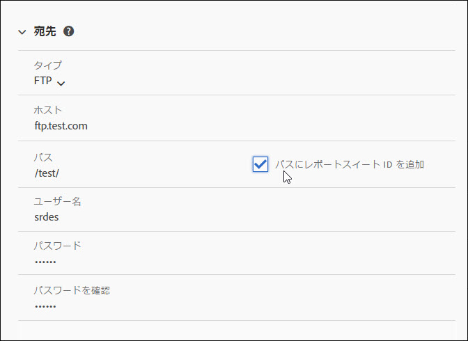
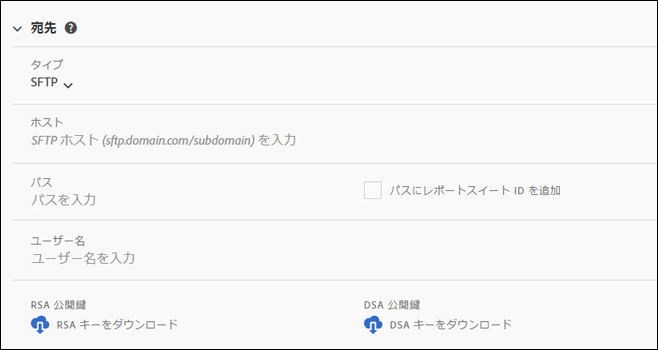
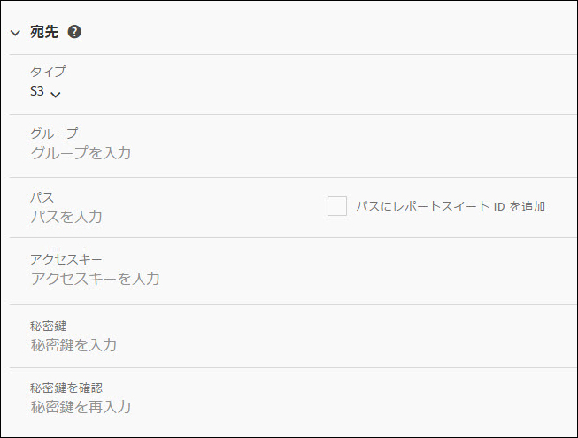
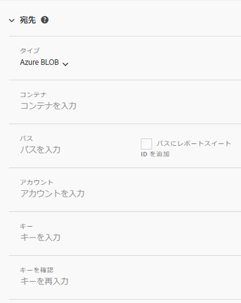

# フィード宛先

「フィード宛先」セクションは、フィードの配信方法を定義します。

次の 4 つの配信チャネルがあります。

* FTP
* SFTP
* Amazon S3
* Azure BLOB

## FTP {#section_D2B521C49BDE4F91A1999FE222CF306F}

データフィードのデータは、アドビまたは顧客のホストする FTP の場所に配信できます。

顧客のホストする FTP サーバーにデータをアップロードする場合は、該当するユーザー名、パスワード、アップロードパスをアドビに提供する必要があります。アドビ側ではサーバーのデータの削除をおこなわないため、お客様側でディスクスペースを管理する独自のプロセスを実装する必要があります。

## SFTP {#section_8D9215E441474D2BBC56228C2BC926E5}

データフィードのデータは、アドビまたはお客様がホストする SFTP の場所に配信できます。

お客様がホストする FTP サーバーにデータをアップロードする場合は、該当するユーザー名およびアップロードパスをアドビに提供する必要があります。

<!-- 

Adobe Customer Care will provide you with a Public key. Verify in recording.

 -->

アドビ側ではサーバーのデータの削除をおこなわないため、お客様側でディスクスペースを管理する独自のプロセスを実装する必要があります。

## Amazon S3 {#section_4191CD7B8D3F419EB850B286B542C14A}

Amazon S3 バケットにファイルをアップロードできます。Amazon は、（Amazon サーバー上で）保存データを自動的に暗号化します。データをダウンロードすると、自動的に復号化されます。

Amazon S3 を使用してデータをアップロードする場合、バケット名、アクセスキー ID、シークレットキーおよびフォルダー名を提供する必要があります。

データフィードは、次の 11 の標準 AWS リージョンと通信します（必要に応じて、適切な署名アルゴリズムを使用）。

* us-east-1
* us-west-1
* us-west-2
* ap-south-1
* ap-northeast-2
* ap-southeast-1
* ap-southeast-2
* ap-northeast-1
* eu-central-1
* eu-west-1
* sa-east-1

現在、中国（北京）AWS リージョン（cn-north-1）はサポートしていません。

## Azure BLOB {#section_1E9F1D0E7EAB4189A5D748FCA57D63D1}

Azure BLOB にファイルをアップロードできます。

## フィールド {#section_AD54B41BC7C945DC85F5FB8FCD4A4792}

次の表に、すべての配信チャネルのすべてのオプションを示します。使用できるオプションは、選択した配信チャネルによって異なります。

<table id="table_F743C620C82349D9943A13B99EA312BA"> 
 <thead> 
  <tr> 
   <th colname="col1" class="entry"> フィールド </th> 
   <th colname="col2" class="entry"> 説明 </th> 
  </tr> 
 </thead>
 <tbody> 
  <tr> 
   <td colname="col1"> 
アクセスキー 
 </td> 
   <td colname="col2"> 
Amazon S3 アクセスキーを入力します。 
 </td> 
  </tr> 
  <tr> 
   <td colname="col1"> 
グループ 
 </td> 
   <td colname="col2"> 
Amazon S3 バケットの場所を入力します。 
 
この値は、適切な S3 バケット形式に合致する必要があります。(See <a href="https://docs.aws.amazon.com/awscloudtrail/latest/userguide/cloudtrail-s3-bucket-naming-requirements.html" format="html" scope="external"> https://docs.aws.amazon.com/awscloudtrail/latest/userguide/cloudtrail-s3-bucket-naming-requirements.html</a>.) 
 
 
注意：Amazon S3 の設定について詳しくは、後述の <a href="../../../export/analytics-data-feed/feed-troubleshooting.md#section_6797EBBB7E6D44D4B00C7AEDF4C2EE1D" format="dita" scope="local">Amazon S3 データフィードの BucketOwnerFullControl 設定</a>を参照してください。 
 
 </td> 
  </tr> 
  <tr> 
   <td colname="col1"> 
コンテナ 
 </td> 
   <td colname="col2"> 
Azure BLOB コンテナ名を入力します。 
 </td> 
  </tr> 
  <tr> 
   <td colname="col1"> 
 ホスト 
 </td> 
   <td colname="col2"> 
FTP または SFTP ホストの場所を指定します。 
 
この値は、適切な FTP/SFTP 形式（<code>ftp.domain.com/subdomain</code> または <code>sftp.domain.com/subdomain</code>）に準拠する必要があります。 
 
 FTP および SFTP の標準ポート 21 および 22 が必要です。 
 </td> 
  </tr> 
  <tr> 
   <td colname="col1"> 
パスワード 
 
パスワードを確認 
 </td> 
   <td colname="col2"> 
FTP パスワードを入力します。確認するために再入力します。 
 </td> 
  </tr> 
  <tr> 
   <td colname="col1"> 
パス 
 </td> 
   <td colname="col2"> 
ホストまたはバケットへのパスを選択します。このパスは、フィード作成前に存在している必要があります。 
 
 
注意：Amazon S3 の設定について詳しくは、後述の <a href="../../../export/analytics-data-feed/feed-troubleshooting.md#section_6797EBBB7E6D44D4B00C7AEDF4C2EE1D" format="dita" scope="local">Amazon S3 データフィードの BucketOwnerFullControl 設定</a>を参照してください。 
 
 </td> 
  </tr> 
  <tr> 
   <td colname="col1"> 
アカウント 
 </td> 
   <td colname="col2"> 
 Azure ストレージアカウントを入力します。 
 </td> 
  </tr> 
  <tr> 
   <td colname="col1"> 
公開鍵 
 </td> 
   <td colname="col2"> 
SFTP 公開鍵を指定します。 
 
公開鍵をダウンロードして SFTP リポジトリを設定する必要があります。 
 
 
注意：フィードを作成するために公開鍵をダウンロードする必要はありません。 
 
 
以前のフィードの作成時に既にダウンロード済みの公開鍵を使用できます。 
 
詳しくは、<a href="https://marketing.adobe.com/resources/help/en_US/whitepapers/ftp/ftp_sftp_dw.html" format="html" scope="external">https://marketing.adobe.com/resources/help/ja_JP/whitepapers/ftp/ftp_sftp_dw.html</a> を参照してください。 
 </td> 
  </tr> 
  <tr> 
   <td colname="col1"> 
キー 
 
キーを確認 
 </td> 
   <td colname="col2"> 
 ストレージアクセスキーを入力します。確認のために再入力します。 
 
 
注意：アクセスキーへのアクセスについては、<a href="https://docs.microsoft.com/en-us/azure/storage/common/storage-create-storage-account#view-and-copy-storage-access-keys" format="https" scope="external">https://docs.microsoft.com/ja-JP/azure/storage/common/storage-create-storage-account#view-and-copy-storage-access-keys</a> を参照してください。 
 
 </td> 
  </tr> 
  <tr> 
   <td colname="col1"> 
シークレットキー 
 
シークレットキーを確認 
 </td> 
   <td colname="col2"> 
S3 シークレットキーを入力します。確認するために再入力します。 
 </td> 
  </tr> 
  <tr> 
   <td colname="col1"> 
タイプ 
 </td> 
   <td colname="col2"> 
送信先のタイプを選択します。 
 
 
     <ul id="ul_B893EEDA73A34DE0AEB8570BE9027F21"> 
      <li id="li_325546FCEB404C50AA6829573CCA340B">FTP（デフォルト） </li> 
      <li id="li_6A2C03115903484797485D073A610607">AmazonS3 </li> 
      <li id="li_C24540F6FCD24702B7693A515CEBE977">SFTP </li> 
      <li id="li_8E03CA78E7FE427C9F6F8B112BC76266">Azure BLOB </li> 
     </ul> 
 
送信先のタイプを選択すると、フィールドのリストが変更されて、選択した送信先に使用可能なオプションが反映されます。 
 </td> 
  </tr> 
  <tr> 
   <td colname="col1"> 
ユーザー名 
 </td> 
   <td colname="col2"> 
FTP ユーザー名を入力します。 
 </td> 
  </tr> 
 </tbody> 
</table>

