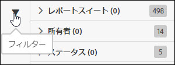
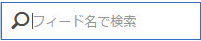

# 検索とフィルター

検索とフィルターは、リスト内でフィードを探すのに役立ちます。

1. フィルターアイコンをクリックするか、アイコンの上にマウスポインターを置いて、フィルターオプションを表示します。

   

   次の 3 つのフィルターオプションを使用できます。

   * レポートスイート
   * 所有者
   * ステータス

1. フィードリストを検索するための検索語句を入力します。

   

フィルターと検索を組み合わせて、フィードを探すことができます。組み合わされたフィルターは、AND 演算子で結合されます。
