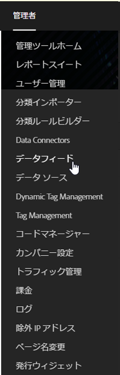
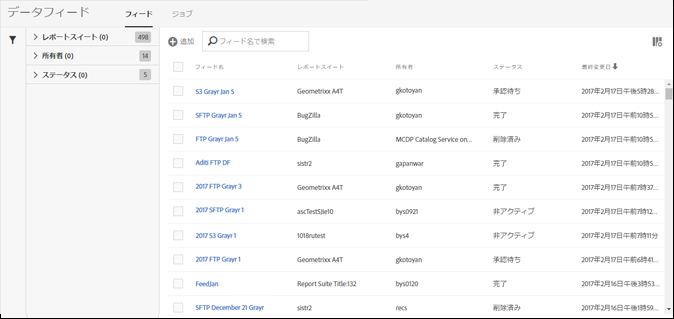

# データフィードインターフェイスを開く

データフィードのユーザーインターフェイスは、 の「管理者」タブから使用できます。

1. 「管理者」タブを開きます。
1. **[!UICONTROL 「データフィード]**」を選択します。

   

データフィードランディングページに、管理者ユーザーがアクセスできるすべてのレポートスイートに関して、現在、会社用に定義しているすべてのフィードがリストされます。

フィードが設定されていない場合、ページに「**[!UICONTROL 新しいデータフィードを作成]」ボタンが表示されます。**

[ジョブ](../../../export/analytics-data-feed/c-data-feed-actions/t-feed-job-history.md#task_0D05F2D1B41B4E4A95B570DC78014480)を表示するには **[!UICONTROL 、「ジョブ]**」をクリックします。To return to the feeds view, click **[!UICONTROL Feeds]**.