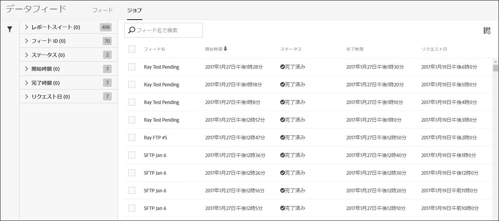
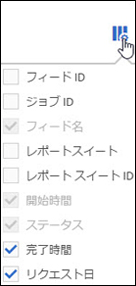

# データフィードジョブ-概要

「ジョブ」タブを使用して、ジョブ履歴を表示したり、ジョブ管理タスクを実行したりできます。

ジョブリストは、ジョブステータス、ジョブの開始および完了のタイミング、ジョブが実行されるまでの時間などの情報を提供します。

列見出しをクリックすると、ジョブが表示される順番が切り替わります。

ジョブリストに表示する情報を設定するには、設定アイコンをクリックして、目的の列名を選択します。

フィード名、開始時間、ステータスの列は必須で、ジョブリストから削除できません。

| 列 | 説明 |
|---|---|
| フィード ID | フィードの一意の識別子。 |
| ジョブ ID | ジョブの一意の識別子。 |
| フィード名 | フィードの名前。 |
| 開始時間 | タイムゾーンに表示される、ジョブの開始名。 |
| 実行時間 | ジョブを実行するまでに必要な時間。dd hh:mm:ss で表示されます。 |
| ステータス | ジョブの現在の[ステータス](../../../export/analytics-data-feed/c-df-jobs/r-job-status.md#reference_7A39A327F643447F9B5AE3A2502C72BA)。 |
| 完了時間 | ジョブが実行を終了する時間。自分のタイムゾーンで表示されます。 |
| リクエスト日 | ジョブに含まれるデータの日付スタンプ。 |

