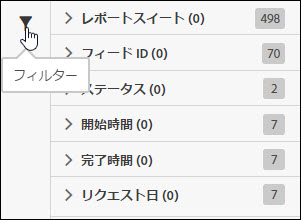
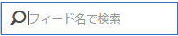

# ジョブリストのフィルタリング

検索とフィルターは、リストでジョブを探すのに役立ちます。

1. フィルターアイコンをクリックするか、アイコンの上にマウスポインターを置いて、フィルターオプションを表示します。

   

   いくつかのフィルターオプションを使用できます。

   * レポートスイート
   * フィード ID
   * ステータス
   * 開始時間
   * 完了時間
   * リクエスト日

1. ジョブリストを検索するための検索語句を入力します。

   

フィルターと検索を組み合わせて、ジョブを探すことができます。複数のフィルターおよび検索語句を、AND 演算子で結合できます。
