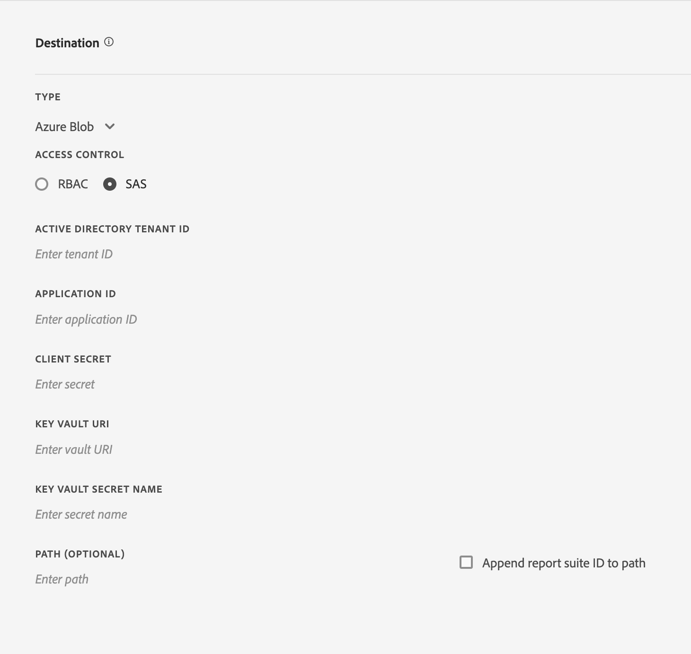

# データフィードの作成または編集

データフィードを作成すると、生データファイルの送信先と各ファイルに含めたい内容をアドビが把握できます。このページには、データフィードの作成時にカスタマイズできる個々の設定が表示されます。

このページを読む前に、データフィードの基本的な知識を身に着けることをお勧めします。データフィードを作成するための要件を満たしていることを確認するには、[データフィードの概要](data-feed-overview.md)を参照してください。

## フィード情報フィールド

* **名前**：データフィードの名前。選択したレポートスイート内で一意である必要があり、最大 255 文字まで設定できます。
* **レポートスイート**：データフィードの基になるレポートスイート。同じレポートスイートに対して複数のデータフィードを作成する場合は、異なる列定義を持つ必要があります。データフィードをサポートするのはソースレポートスイートのみです。仮想レポートスイートはサポートされていません。
* **完了時に電子メールを送信**：フィードの処理が終了したときに通知される電子メールアドレス。電子メールアドレスは正しい形式にする必要があります。
* **フィード間隔**：毎時間ごとのフィードには、1 時間分のデータが含まれます。毎日のフィードには、1 日分（レポートスイートのタイムゾーンの午前 0 時から午前 0 時まで）のデータが含まれます。
* **遅延処理**：データフィードファイルを処理する前に、所定の時間待ちます。遅延は、モバイル実装に、オフラインデバイスがオンラインになり、データを送信する機会を与えるのに役立ちます。また、以前に処理されたファイルを管理する際に、組織のサーバー側のプロセスに対応するためにも使用できます。ほとんどの場合、遅延は必要ありません。フィードは、最大 120 分遅れる可能性があります。
* **開始日と終了日**：開始日は、データフィードが必要な最初の日付を示します。過去の日付を設定すると、履歴データのデータフィードの処理が直ちに開始されます。フィードは終了日に達するまで処理を続けます。開始日と終了日は、レポートスイートのタイムゾーンに基づきます。
* **連続フィード**：このチェックボックスを選択すると、終了日が削除され、フィードが無期限に実行されます。フィードが履歴データの処理を完了すると、フィードはデータが特定の時間または日に収集を完了するのを待ちます。現在の時間または日が終わると、指定した遅延の後に処理が開始されます。

## 宛先フィールド

宛先フィールドで使用できるフィールドは、宛先のタイプによって異なります。

### Google Cloud Platform

安全な宛先としての GCP ストレージバケットへのアクセス

**フィールド**
* *タイプ：* Google Cloud Platform の宛先タイプ
* *プロジェクト ID :* ストレージバケットが存在する GCP プロジェクト ID
* *ストレージバケット名：* ドットのないバケット名は、3 ～ 63 文字に制限されます。 ドットを含む名前には、最大 222 文字を含めることができますが、各ドット区切りコンポーネントは、63 文字以下にする必要があります。
* *パス（オプション）:* &amp; *パスにレポートスイート ID を追加：* 取得または保存するリソースの場所


**サービスアカウント作成プロセス**

ユーザーは、Google Cloud Platform の宛先のサービスアカウントを作成する必要があります。

Analytics 組織ごとに 1 つの GCP サービスアカウントのみが許可されます。 データフィード用のサービスアカウントが作成されると、組織内のその他すべてのデータフィードに、サービスアカウントが事前に設定されます。


### Amazon S3

Amazon S3 バケットストレージは、信頼されたエンティティ内の IAM ロールを介してアクセスします。

**フィールド**

* *タイプ：* Amazon S3 の宛先タイプ
* *バケット：* S3 バケット名
* *信頼済みエンティティ ARN:* AWS IAM Entity ARN `arn:aws:iam::<12 digit account number>:user/<username>`
* *役割 ARN :* AWS IAM Role ARN `arn:aws:iam::<12 digit account number>:role/<role name>`
* *パス（オプション）:* &amp; *パスにレポートスイート ID を追加：* 取得または保存するリソースの場所
* *地域の指定（オプション）:* CN 地域を含む、使用可能なすべてのAWS地域のドロップダウン


**信頼済みエンティティの作成と選択**

ユーザーは、ドロップダウンに表示される任意のオプションから信頼できるエンティティを選択するか、 `Create Entity` 」ボタンをクリックします。

クリック後 `Create Entity` ボタンをクリックすると、ユーザーは認証プロセスにリダイレクトされます。 ユーザーが認証すると、信頼されたエンティティが作成され、ドロップダウンのオプションに追加されます。

ドロップダウンには、このユーザーが組織内で作成した、信頼できるエンティティがすべて一覧表示されます。


従来の方法を使用して、フィードをAmazon S3 バケットに直接送信できます。 詳しくは、Amazon S3 ドキュメント内の [Amazon S3 バケットの命名要件](https://docs.aws.amazon.com/ja_jp/awscloudtrail/latest/userguide/cloudtrail-s3-bucket-naming-requirements.html)を参照してください。

**フィールド — 非推奨**

* *タイプ：* 非推奨の S3 メソッドの宛先タイプ
* *バケット：* Amazon S3 Bucket name
* *パス（オプション）:* &amp; *パスにレポートスイート ID を追加：* 取得または保存するリソースの場所
* *アクセスキー：* AWSユーザーのアクセスキー ID
* *秘密鍵：* AWSユーザーの秘密鍵
* *秘密鍵を確認：* AWSユーザーの秘密鍵を再入力


データフィードのアップロードに使用するユーザーには、次の[権限](https://docs.aws.amazon.com/ja_jp/AmazonS3/latest/API/API_Operations_Amazon_Simple_Storage_Service.html)が必要です。

* s3:GetObject
* s3:PutObject
* s3:PutObjectAcl

Amazon S3 バケットにアップロードするたびに、[!DNL Analytics] は、バケットの所有者を BucketOwnerFullControl ACL に追加します。この ACL は、バケットに必要なポリシーがあるかどうかに関係なく追加されます。詳しくは、[Amazon S3 データフィードの BucketOwnerFullControl 設定とは何ですか？](df-faq.md#BucketOwnerFullControl)を参照してください。

**サポートされるAWS地域**:
* us-east-2
* us-east-1
* us-west-1
* us-west-2
* ap-south-1
* ap-northeast-2
* ap-southeast-1
* ap-southeast-2
* ap-northeast-1
* ca-central-1
* eu-central-1
* eu-west-1
* eu-west-2
* eu-west-3
* eu-north-1
* sa-east-1
* cn-north-1
* cn-northwest-1


### Azure BLOB

ロールベースのアクセス制御 (RBAC) または共有アクセス署名 (SAS) を使用した Azure Blob セキュア宛先。 アクセス制御を選択すると、パネルの内容が更新され、対応するフィールドが反映されます。

**フィールド — RBAC**
* *タイプ：* Azure Blob の宛先の種類
* *アクセス制御：* RBAC または SAS の使用オプション
* *Active Directory テナント ID:* Azure アカウントの組織 ID
* *アプリケーション ID :* Active Directory アダプタからのアプリケーション ID
* *クライアント秘密鍵：* Azure Client Secret
* *ストレージアカウント名：* データオブジェクトを含むアカウントの名前
* *コンテナ名：* 指定されたストレージアカウントに属するコンテナ。
* *パス（オプション）:* &amp; *パスにレポートスイート ID を追加：* 取得または保存するリソースの場所


**フィールド — SAS**
* *タイプ：* Azure Blob の宛先の種類
* *アクセス制御：* RBAC または SAS の使用オプション
* *Active Directory テナント ID:* Azure Active Directory インスタンスの ID
* *アプリケーション ID :* Active Directory アダプタからのアプリケーション ID
* *クライアント秘密鍵：* Azure Client Secret
* *キー Vault URI:* Azure Key Vault の場所
* *キー Vault の秘密鍵名：* セキュリティで保護された Key Vault にアクセスするための秘密鍵名
* *パス（オプション）:* &amp; *パスにレポートスイート ID を追加：* 取得または保存するリソースの場所



**フィールド — 非推奨**
* *タイプ：* Azure Blob の宛先の種類
* *コンテナ：* Azure コンテナの名前
* *パス（オプション）:* &amp; *パスにレポートスイート ID を追加：* 取得または保存するリソースの場所
* *アカウント：* Azure アカウントの秘密鍵
* *キー Vault URI:* Azure Key Vault の場所
* *キー Vault の秘密鍵名：* セキュリティで保護された Key Vault にアクセスするための秘密鍵名

フィード宛先のディスク領域を管理するには、独自のプロセスを実装する必要があります。アドビはサーバーからデータを削除しません。詳細については、Microsoft Azure ドキュメント内の「[ストレージアカウントの作成](https://docs.microsoft.com/ja-jp/azure/storage/common/storage-quickstart-create-account?tabs=azure-portal#view-and-copy-storage-access-keys)」を参照してください。


>[!NOTE]
>
>フィード宛先のディスク領域を管理するには、独自のプロセスを実装する必要があります。アドビはサーバーからデータを削除しません。

### FTP — 廃止

**フィールド**
* *タイプ：* FTP の宛先タイプ
* *ホスト：* ホストにアクセスするエンドポイント
* *パス（オプション）:* &amp; *パスにレポートスイート ID を追加：* 取得または保存するリソースの場所
* *ユーザー名：* ホストのユーザー名
* *パスワード：* ホストのパスワード
* *パスワードの確認：* ホストのパスワードを再入力および確認


### SFTP - 非推奨

データフィードの SFTP サポートを利用できます。SFTP ホスト、ユーザー名、および宛先サイトに有効な RSA または DSA 公開鍵が含まれている必要があります。フィードの作成時に、適切な公開キーをダウンロードできます。

**フィールド**
* *タイプ：* SFTP の宛先タイプ
* *ホスト：* ホストにアクセスするエンドポイント
* *パス（オプション）:* &amp; *パスにレポートスイート ID を追加：* 取得または保存するリソースの場所
* *RSA 公開鍵：* または *DSA 公開鍵：* ホストにアクセスするための公開鍵


## データ列の定義

すべての列は、データがあるかどうかに関係なく使用できます。データフィードには、少なくとも 1 つの列が含まれている必要があります。

* **エスケープ文字を削除**：データを収集する際に、一部の文字（改行など）が問題の原因となる場合があります。フィードファイルからこれらの文字を削除する場合は、このチェックボックスをオンにします。
* **圧縮形式**：使用する圧縮のタイプ。Gzip はファイルを `.tar.gz` 形式で出力します。Zip はファイルを `.zip` 形式で出力します。
* **パッケージの種類**：単一ファイルは、潜在的に大規模な 1 つのファイルとして `hit_data.tsv` を出力します。複数のファイルを使用すると、データが 2GB のチャンク（非圧縮）にページ分割されます。複数のファイルを選択し、レポートウィンドウの非圧縮データが 2GB 未満の場合は、1 つのファイルが送信されます。ほとんどのデータフィードでは、複数のファイルを使用することをお勧めします。
* **マニフェスト**：フィード間隔でデータが収集されなかった場合に、アドビが[マニフェストファイル](c-df-contents/datafeeds-contents.md#feed-manifest)を宛先に配信するかどうかを指定します。「マニフェストファイル」を選択すると、データが収集されなかった場合に次のようなマニフェストファイルが返されます。

```text
   Datafeed-Manifest-Version: 1.0
    Lookup-Files: 0
    Data-Files: 0
    Total-Records: 0
```

* **列テンプレート**：多数のデータフィードを作成する場合は、列テンプレートを作成することをお勧めします。列テンプレートを選択すると、指定した列が自動的にテンプレートに含まれます。また、アドビでは、デフォルトで複数のテンプレートを提供しています。
* **使用可能な列**：Adobe Analytics で使用可能なすべてのデータ列。「[!UICONTROL すべて追加]」をクリックして、データフィードにすべての列を含めます。
* **含まれる列**：データフィードに含める列。データフィードからすべての列を削除するには、[!UICONTROL すべて削除]をクリックします。
* **CSV のダウンロード**：含まれるすべての列を含む CSV ファイルをダウンロードします。
