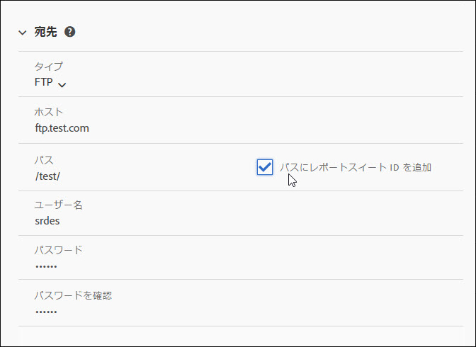
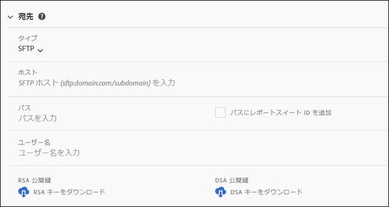
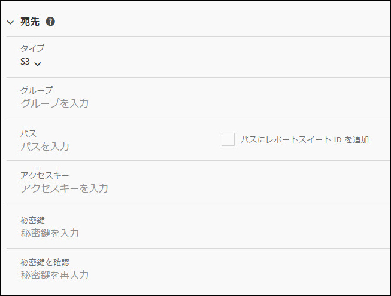
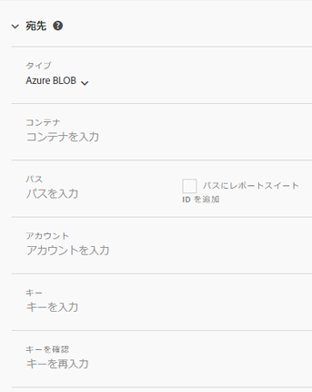

# データフィードの作成または編集

データフィードを作成すると、生データファイルの送信先と各ファイルに含めたい内容をアドビが把握できます。このページには、データフィードの作成時にカスタマイズできる個々の設定が表示されます。

このページを読む前に、データフィードの基本的な知識を身に着けることをお勧めします。データフィードを作成するための要件を満たしていることを確認するには 、[データフィードの概要](data-feed-overview.md)を参照してください。

## フィード情報フィールド

* **名前**：データフィードの名前。選択したレポートスイート内で一意である必要があり、最大 255 文字まで設定できます。
* **レポートスイート**：データフィードの基になるレポートスイート。同じレポートスイートに対して複数のデータフィードを作成する場合は、異なる列定義を持つ必要があります。データフィードをサポートするのはソースレポートスイートのみです。仮想レポートスイートはサポートされていません。
* **完了時に電子メールを送信**：フィードの処理が終了したときに通知される電子メールアドレス。電子メールアドレスは正しい形式にする必要があります。
* **フィード間隔**：毎時間ごとのフィードには、1 時間分のデータが含まれます。毎日のフィードには、1日分のデータが含まれます。レポートスイートのタイムゾーンの午前0時から午前0時までのデータが含まれます。
* **遅延処理**：データフィードファイルを処理する前に、所定の時間待ちます。遅延は、モバイル実装に、オフラインデバイスがオンラインになり、データを送信する機会を与えるのに役立ちます。また、以前に処理されたファイルを管理する際に、組織のサーバー側のプロセスに対応するためにも使用できます。ほとんどの場合、遅延は必要ありません。フィードは、最大 120 分遅れる可能性があります。
* **開始日と終了日**：開始日は、データフィードが必要な最初の日付を示します。過去の日付を設定すると、履歴データのデータフィードの処理が直ちに開始されます。フィードは終了日に達するまで処理を続けます。開始日と終了日は、レポートスイートのタイムゾーンに基づきます。
* **連続フィード**：このチェックボックスを選択すると、終了日が削除され、フィードが無期限に実行されます。フィードが履歴データの処理を完了すると、フィードはデータが特定の時間または日に収集を完了するのを待ちます。現在の時間または日が終わると、指定した遅延の後に処理が開始されます。

## 宛先フィールド

宛先フィールドで使用できるフィールドは、宛先のタイプによって異なります。

### FTP

データフィードのデータは、アドビまたは顧客のホストする FTP の場所に配信できます。FTP ホスト、ユーザー名、パスワードが必要です。パスフィールドを使用して、フィードファイルをフォルダーに配置します。フォルダーが既に存在する必要があります。指定されたパスが存在しない場合、フィードはエラーをスローします。



### SFTP

データフィードの SFTP サポートを利用できます。SFTP ホスト、ユーザー名、および宛先サイトに有効な RSA または DSA 公開鍵が含まれている必要があります。フィードの作成時に、適切な公開キーをダウンロードできます。



### S3

フィードは Amazon S3 バケットに直接送信できます。バケット名、アクセスキー ID および秘密キーが必要です。詳しくは、Amazon S3 ドキュメント内の [Amazon S3 バケットの命名要件](https://docs.aws.amazon.com/ja_jp/awscloudtrail/latest/userguide/cloudtrail-s3-bucket-naming-requirements.html)を参照してください。



以下の 16 の標準 AWS 地域がサポートされます（必要に応じて適切な署名アルゴリズムを使用）。

* us-east-2
* us-east-1
* us-west-1
* us-west-2
* ap-south-1
* ap-northeast-2
* ap-southeast-1
* ap-southeast-2
* ap-northeast-1
* ca-central-1
* eu-central-1
* eu-west-1
* eu-west-2
* eu-west-3
* eu-north-1
* sa-east-1

>[!NOTE]
>
>Cn-north-1 地域はサポートされていません。

### Azure BLOB

データフィードは Azure BLOB の宛先をサポートしています。コンテナ、アカウント、およびキーが必要です。Amazon は保存データを自動的に暗号化します。データをダウンロードすると、自動的に復号化されます。詳細については、Microsoft Azure ドキュメント内の「[ストレージアカウントの作成](https://docs.microsoft.com/ja-jp/azure/storage/common/storage-quickstart-create-account?tabs=azure-portal#view-and-copy-storage-access-keys)」を参照してください。



>[!NOTE]
>
>フィード宛先のディスク領域を管理するには、独自のプロセスを実装する必要があります。アドビはサーバーからデータを削除しません。

## データ列の定義

すべての列は、データがあるかどうかに関係なく使用できます。データフィードには、少なくとも 1 つの列が含まれている必要があります。

* **エスケープ文字を削除**：データを収集する際に、一部の文字（改行など）が問題の原因となる場合があります。フィードファイルからこれらの文字を削除する場合は、このチェックボックスをオンにします。
* **圧縮形式**：使用する圧縮のタイプ。Gzip はファイルを `.tar.gz` 形式で出力します。Zip はファイルを `.zip` 形式で出力します。
* **パッケージの種類**：単一ファイルは、潜在的に大規模な 1 つのファイルとして `hit_data.tsv` を出力します。複数のファイルを使用すると、データが 2GB のチャンク（非圧縮）にページ分割されます。複数のファイルを選択し、レポートウィンドウの非圧縮データが 2GB 未満の場合は、1 つのファイルが送信されます。ほとんどのデータフィードでは、複数のファイルを使用することをお勧めします。
* **マニフェスト**:フィード間隔でデータが収集されな [い場合](c-df-contents/datafeeds-contents.md#feed-manifest) に、Adobeがマニフェストファイルを宛先に配信するかどうかを指定します。「マニフェストファイル」を選択すると、データが収集されない場合、次のようなマニフェストファイルが返されます。

```text
   Datafeed-Manifest-Version: 1.0
    Lookup-Files: 0
    Data-Files: 0
    Total-Records: 0
```

* **列テンプレート**：多数のデータフィードを作成する場合は、列テンプレートを作成することをお勧めします。列テンプレートを選択すると、指定した列が自動的にテンプレートに含まれます。また、アドビでは、デフォルトで複数のテンプレートを提供しています。
* **使用可能な列**：Adobe Analytics で使用可能なすべてのデータ列。「[!UICONTROL すべて追加]」をクリックして、データフィードにすべての列を含めます。
* **含まれる列**：データフィードに含める列。データフィードからすべての列を削除するには、[!UICONTROL すべて削除]をクリックします。
* **CSV のダウンロード**：含まれるすべての列を含む CSV ファイルをダウンロードします。
