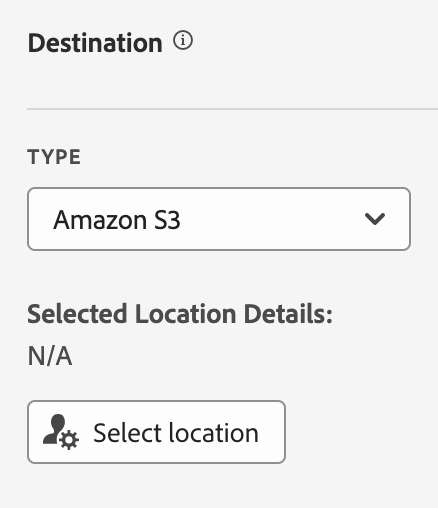

# データフィードの作成

データフィードを作成する際は、アドビに次の情報を提供します。

* 生データファイルを送信する宛先に関する情報
* 各ファイルに含めるデータ

データフィードを作成する前に、データフィードの基本を理解し、すべての前提条件を満たしていることを確認することが重要です。詳しくは、[データフィードの概要](data-feed-overview.md)を参照してください。

## データフィードの作成と設定 {#create-and-configure-data-feed}

<!-- markdownlint-disable MD034 -->

>[!CONTEXTUALHELP]
>id="aa_datafeed_os_strings"
>title="オペレーティングシステムの文字列の置換"
>abstract="このオプションは、お客様データに埋め込まれた次の文字列シーケンスを検出し、スペースに置き換えることで、データ出力をクリーンアップします。 Windows：CRLF、CR または TAB Mac および Linux：\n、\r または \t"

<!-- markdownlint-enable MD034 -->

<!-- markdownlint-disable MD034 -->

>[!CONTEXTUALHELP]
>id="aa_datafeed_export_file"
>title="マニフェスト"
>abstract="各データフィード配信にマニフェストファイルを含めるかどうかを選択します。マニフェストファイルには、データフィードに含まれる各ファイルの情報が含まれています。データフィードデータを 1 つのパッケージで送信する際は、終了ファイルを含めることも選択できますが、マニフェストファイルをお勧めします。 "

<!-- markdownlint-enable MD034 -->

<!-- markdownlint-disable MD034 -->

>[!CONTEXTUALHELP]
>id="aa_datafeed_notify"
>title="完了時に通知"
>abstract="データフィードの送信後に通知を配信する電子メールアドレスを 1 つ以上指定します。 複数のメールアドレスはコンマで区切る必要があります。"

<!-- markdownlint-enable MD034 -->

1. Adobe ID の資格情報を使用して [experiencecloud.adobe.com](https://experiencecloud.adobe.com) にログインします。
1. 右上にある 9 つの正方形のアイコンを選択し、「[!UICONTROL **Analytics**]」を選択します。
1. 上部ナビゲーションバーで、[!UICONTROL **管理者**]／[!UICONTROL **データフィード**]&#x200B;に移動します。
1. 「[!UICONTROL **追加**]」を選択します。

   

   ページで&#x200B;[!UICONTROL **フィード情報**]、[!UICONTROL **宛先**]、[!UICONTROL **データ列の定義**]&#x200B;の 3 つの主要カテゴリが表示されます。
1. 「[!UICONTROL **フィード情報**]」セクションで、次のフィールドに入力します。

   | フィールド | 関数 |
   |---------|----------|
   | [!UICONTROL **名前**] | データフィードの名前。選択したレポートスイート内で一意である必要があり、最大 255 文字まで設定できます。[詳細情報](/help/export/analytics-data-feed/df-faq.md#must-feed-names-be-unique) |
   | [!UICONTROL **レポートスイート**] | データフィードのベースとなるレポートスイート。同じレポートスイートに対して複数のデータフィードを作成する場合は、異なる列定義を持つ必要があります。データフィードをサポートするのはソースレポートスイートのみです。仮想レポートスイートはサポートされていません。 |
   | [!UICONTROL **完了時にメールを送信**] | フィードの処理が終了した際に通知されるメールアドレス。メールアドレスは正しい形式にする必要があります。 |
   | [!UICONTROL **フィード間隔**] | バックフィルまたは履歴データの場合は、「**毎日**」を選択します。毎日のフィードには、レポートスイートのタイムゾーンの午前 0 時から午前 0 時までの 1 日分のデータが含まれます。連続データの場合は、「**毎時**」を選択します（必要に応じて、連続フィードに「毎日」も選択できます）。 毎時のフィードには、1 時間分のデータが含まれます。 |
   | [!UICONTROL **遅延処理**] | データフィードファイルを処理する前に、所定の時間待ちます。遅延は、モバイル実装に、オフラインデバイスがオンラインになり、データを送信する機会を与えるのに役立ちます。また、以前に処理されたファイルを管理する際に、組織のサーバー側のプロセスに対応するためにも使用できます。ほとんどの場合、遅延は必要ありません。フィードは、最大 120 分遅れる可能性があります。 |
   | [!UICONTROL **開始日と終了日**] | 開始日は、データフィードを開始する日付を示します。 履歴データのデータフィードの処理をすぐに開始するには、データが収集されている過去の任意の日付にこの日付を設定します。開始日と終了日は、レポートスイートのタイムゾーンに基づきます。 |
   | [!UICONTROL **連続フィード**] | このチェックボックスをオンにすると、終了日が削除され、フィードが無期限に実行されます。フィードが履歴データの処理を完了すると、フィードはデータが特定の時間または日に収集を完了するのを待ちます。現在の時間または日が終わると、指定した遅延の後に処理が開始されます。 |

1. 「[!UICONTROL **宛先**]」セクションの&#x200B;[!UICONTROL **タイプ**]&#x200B;ドロップダウンメニューで、データを送信する宛先を選択します。

   >[!NOTE]
   >
   >レポートの宛先を設定する際には、次の点を考慮してください。
   >
   >* レポートの宛先には、クラウドアカウントを使用することをお勧めします。[従来の FTP および SFTP アカウント](#legacy-destinations)を使用することはできますが、推奨していません。
   >* 以前に設定したクラウドアカウントは、データフィードに使用できます。クラウドアカウントは、次のいずれかの方法で設定できます。
   >
   >   * [Data Warehouse](/help/export/data-warehouse/create-request/dw-request-report-destinations.md) のクラウドアカウントを設定する場合
   >   
   >   * [Adobe Analytics 分類データを読み込む](/help/components/locations/locations-manager.md)場合（分類データの読み込み用に設定した任意の場所は使用できません。）
   >   
   >   * 場所マネージャー（[コンポーネント／場所](/help/components/locations/configure-import-accounts.md)）から
   >
   >* クラウドアカウントは Adobe Analytics ユーザーアカウントに関連付けられています。他のユーザーは、設定したクラウドアカウントを使用したり、表示したりできません。
   >
   >* 場所マネージャー（[コンポーネント／場所](/help/components/locations/configure-import-accounts.md)）から作成した任意の場所を編集できます。

   

   データフィードを作成する際は、次のいずれかの宛先タイプを使用します。設定手順については、宛先タイプを展開します。（追加の[従来の宛先](#legacy-destinations)も使用できますが、お勧めしません）。

   +++Amazon S3

   フィードは Amazon S3 バケットに直接送信できます。この宛先タイプに必要なのは、Amazon S3 アカウントと場所（バケット）のみです。

   Adobe Analytics では、クロスアカウント認証を使用して、Adobe Analytics から Amazon S3 インスタンスの指定場所にファイルをアップロードします。

   データフィードで Amazon S3 を使用する際、SSE-S3 暗号化のみがサポートされます。

   Amazon S3 バケットをデータフィードの宛先として設定するには：

   1. [データフィードの作成と設定](#create-and-configure-a-data-feed)の説明に従って、データフィードの作成を開始します。

   1. 「[!UICONTROL **宛先**]」セクションの&#x200B;[!UICONTROL **タイプ**]&#x200B;ドロップダウンメニューで、「[!UICONTROL **Amazon S3**]」を選択します。

      

   1. 「[!UICONTROL **場所を選択**]」を選択します。

      Amazon S3 の場所を書き出しページが表示されます。

   1. （条件付き）Amazon S3 アカウント（およびそのアカウントの場所）が Adobe Analytics で既に設定されている場合は、それをデータフィードの宛先として使用できます。

      >[!NOTE]
      >
      >アカウントは、自分で設定した場合、または自分が属する組織と共有されていた場合にのみ使用できます。

      1. [!UICONTROL **アカウントを選択**]&#x200B;ドロップダウンメニューからアカウントを選択します。

         Adobe Analytics の次の領域のいずれかで設定したクラウドアカウントを使用できます。

         * [スキーマ](/help/components/classifications/sets/manage/schema.md)の説明に従って、Adobe Analytics 分類データを読み込む場合。

           ただし、分類データの読み込み用に設定されている場所は使用できません。代わりに、以下に示すように、新しい宛先を追加します。

         * [クラウドの読み込みアカウントと書き出しアカウントの設定](/help/components/locations/configure-import-accounts.md)および[クラウドの読み込み場所と書き出し場所の設定](/help/components/locations/configure-import-locations.md)の説明に従って、場所領域でアカウントと場所を設定する場合。

      1. [!UICONTROL **場所を選択**]&#x200B;ドロップダウンメニューから場所を選択します。

      1. [!UICONTROL **保存**]／[!UICONTROL **保存**]&#x200B;を選択します。

      これで、指定した Amazon S3 の場所にデータを送信するように宛先が設定されました。

   1. （条件付き）以前に Amazon S3 アカウントを追加していない場合：

      1. 「[!UICONTROL **アカウントを追加**]」を選択し、次の情報を指定します。

         | フィールド | 関数 |
         |---------|----------|
         | [!UICONTROL **アカウント名**] | アカウントの名前。任意の名前を選択できます。 |
         | [!UICONTROL **アカウントの説明**] | アカウントの説明。 |
         | [!UICONTROL **役割 ARN**] | アドビが Amazon S3 アカウントへのアクセス権を取得するために使用できる役割 ARN（Amazon リソースネーム）を指定する必要があります。これを行うには、ソースアカウントの IAM 権限ポリシーを作成し、そのポリシーをユーザーに関連付けてから、宛先アカウントの役割を作成します。詳しくは、[この AWS ドキュメント](https://repost.aws/ja/knowledge-center/cross-account-access-iam)を参照してください。 |
         | [!UICONTROL **ユーザー ARN**] | ユーザー ARN（Amazon リソースネーム）は、アドビが指定します。このユーザーを作成したポリシーに関連付ける必要があります。 |

         {style="table-layout:auto"}

      1. 「[!UICONTROL **場所を追加**]」を選択し、次の情報を指定します。

         | フィールド | 関数 |
         |---------|----------|
         | [!UICONTROL **名前**] | アカウントの名前。 |
         | [!UICONTROL **説明**] | アカウントの説明。 |
         | [!UICONTROL **バケット**] | Adobe Analytics データを送信する Amazon S3 アカウント内のバケット。 
このバケットにファイルをアップロードするには、アドビが提供したユーザー ARN に `S3:PutObject` 権限があることを確認してください。この権限により、ユーザー ARN は初期ファイルをアップロードし、以降のアップロードでファイルを上書きできます。

バケット名は、特定の命名規則を満たす必要があります。例えば、3〜63 文字までの長さで、小文字、数字、ドット（.）、ハイフン（-）のみで構成でき、先頭と末尾は文字または数字にする必要があります。[命名規則の完全なリストについて詳しくは、AWS ドキュメントを参照してください](https://docs.aws.amazon.com/ja_jp/AmazonS3/latest/userguide/bucketnamingrules.html)。 
 |
         | [!UICONTROL **接頭辞**] | データを配置するバケット内のフォルダー。フォルダー名を指定し、名前の後にバックスラッシュを追加してフォルダーを作成します。例：`folder_name/` |

         {style="table-layout:auto"}

      1. [!UICONTROL **作成**]／[!UICONTROL **保存**]&#x200B;を選択します。

         これで、指定した Amazon S3 の場所にデータを送信するように宛先が設定されました。

      1. （条件付き）作成したばかりの宛先（アカウントと場所）を管理する必要がある場合は、[場所マネージャー](/help/components/locations/locations-manager.md)で使用できます。

   +++

   +++Azure RBAC

   RBAC 認証を使用して、フィードを Azure コンテナに直接送信できます。この宛先タイプには、アプリケーション ID、テナント ID および秘密鍵が必要です。

   Azure RBAC アカウントをデータフィードの宛先として設定するには：

   1. まだ作成していない場合は、Adobe Analytics が認証に使用できる Azure アプリケーションを作成し、アクセス制御（IAM）でアクセス権を付与します。

      詳しくは、[Azure Active Directory アプリケーションを作成する方法に関する Microsoft Azure ドキュメント](https://learn.microsoft.com/ja-jp/azure/active-directory/develop/howto-create-service-principal-portal)を参照してください。

   1. Adobe Analytics Admin Console の「[!UICONTROL **宛先**]」セクションの&#x200B;[!UICONTROL **タイプ**]&#x200B;ドロップダウンメニューで、「[!UICONTROL **Azure RBAC**]」を選択します。

      

   1. 「[!UICONTROL **場所を選択**]」を選択します。

      Azure RBAC の場所を書き出しページが表示されます。

   1. （条件付き）Azure RBAC アカウント（およびそのアカウントの場所）が Adobe Analytics で既に設定されている場合は、それをデータフィードの宛先として使用できます。

      >[!NOTE]
      >
      >アカウントは、自分で設定した場合、または自分が属する組織と共有されていた場合にのみ使用できます。

      1. [!UICONTROL **アカウントを選択**]&#x200B;ドロップダウンメニューからアカウントを選択します。

      Adobe Analytics の次の領域のいずれかで設定したクラウドアカウントを使用できます。

      * [スキーマ](/help/components/classifications/sets/manage/schema.md)の説明に従って、Adobe Analytics 分類データを読み込む場合。

        ただし、分類データの読み込み用に設定されている場所は使用できません。代わりに、以下に示すように、新しい宛先を追加します。

      * [クラウドの読み込みアカウントと書き出しアカウントの設定](/help/components/locations/configure-import-accounts.md)および[クラウドの読み込み場所と書き出し場所の設定](/help/components/locations/configure-import-locations.md)の説明に従って、場所領域でアカウントと場所を設定する場合。

      1. [!UICONTROL **場所を選択**]&#x200B;ドロップダウンメニューから場所を選択します。

      1. [!UICONTROL **保存**]／[!UICONTROL **保存**]&#x200B;を選択します。

         これで、指定した Azure RBAC の場所にデータを送信するように宛先が設定されました。

   1. （条件付き）以前に Azure RBAC アカウントを追加していない場合：

      1. 「[!UICONTROL **アカウントを追加**]」を選択し、次の情報を指定します。

         | フィールド | 関数 |
         |---------|----------|
         | [!UICONTROL **アカウント名**] | Azure RBAC アカウントの名前。この名前は、「[!UICONTROL **アカウントを選択**]」ドロップダウンフィールドに表示され、任意の名前を選択できます。 |
         | [!UICONTROL **アカウントの説明**] | Azure RBAC アカウントの説明。この説明は、「[!UICONTROL **アカウントを選択**]」ドロップダウンフィールドに表示され、任意の名前を選択できます。 |
         | [!UICONTROL **アプリケーション ID**] | 作成した Azure アプリケーションからこの ID をコピーします。Microsoft Azure では、この情報はアプリケーション内の「**概要**」タブにあります。詳しくは、[Microsoft ID プラットフォームにアプリケーションを登録する方法に関する Microsoft Azure ドキュメント](https://learn.microsoft.com/ja-jp/entra/identity-platform/quickstart-register-app)を参照してください。 |
         | [!UICONTROL **テナント ID**] | 作成した Azure アプリケーションからこの ID をコピーします。Microsoft Azure では、この情報はアプリケーション内の「**概要**」タブにあります。詳しくは、[Microsoft ID プラットフォームでのアプリケーションの登録方法に関する Microsoft Azure ドキュメント](https://learn.microsoft.com/ja-jp/entra/identity-platform/quickstart-register-app)を参照してください。 |
         | [!UICONTROL **シークレット**] | 作成した Azure アプリケーションからシークレットをコピーします。Microsoft Azure では、この情報はアプリケーション内の「**証明書とシークレット**」タブにあります。詳しくは、[Microsoft ID プラットフォームでのアプリケーション登録方法に関する Microsoft Azure ドキュメント](https://learn.microsoft.com/ja-jp/entra/identity-platform/quickstart-register-app)を参照してください。 |

         {style="table-layout:auto"}

      1. 「[!UICONTROL **場所を追加**]」を選択し、次の情報を指定します。

         | フィールド | 関数 |
         |---------|----------|
         | [!UICONTROL **名前**] | 場所の名前。この名前は、「[!UICONTROL **場所を選択**]」ドロップダウンフィールドに表示され、任意の名前を選択できます。 |
         | [!UICONTROL **説明**] | 場所の説明。この説明は、「[!UICONTROL **場所を選択**]」ドロップダウンフィールドに表示され、任意の名前を選択できます。 |
         | [!UICONTROL **アカウント**] | Azure ストレージアカウント。 |
         | [!UICONTROL **コンテナ**] | Adobe Analytics データの送信先として指定したアカウント内のコンテナ。以前に作成した Azure アプリケーションにファイルをアップロードする権限を付与します。 |
         | [!UICONTROL **接頭辞**] | データを配置するコンテナ内のフォルダー。フォルダー名を指定し、名前の後にバックスラッシュを追加してフォルダーを作成します。例：`folder_name/`
Azure RBAC アカウントの設定時に指定したアプリケーション ID に、コンテナ（フォルダー）にアクセスするための `Storage Blob Data Contributor` の役割が付与されていることを確認します。
 
詳しくは、[Azure のビルトインの役割](https://learn.microsoft.com/ja-jp/azure/role-based-access-control/built-in-roles)を参照してください。
 |

         {style="table-layout:auto"}

      1. [!UICONTROL **作成**]／[!UICONTROL **保存**]&#x200B;を選択します。

         これで、指定した Azure RBAC の場所にデータを送信するように宛先が設定されました。

      1. （条件付き）作成したばかりの宛先（アカウントと場所）を管理する必要がある場合は、[場所マネージャー](/help/components/locations/locations-manager.md)で使用できます。

   +++

   +++Azure SAS

   SAS 認証を使用して、フィードを Azure コンテナに直接送信できます。この宛先タイプには、アプリケーション ID、テナント ID、Key Vault URI、Key Vault 秘密鍵名および秘密鍵が必要です。

   Azure SAS をデータフィードの宛先として設定するには：

   1. まだ作成していない場合は、Adobe Analytics が認証に使用できる Azure アプリケーションを作成します。

      詳しくは、[Azure Active Directory アプリケーションを作成する方法に関する Microsoft Azure ドキュメント](https://learn.microsoft.com/ja-jp/azure/active-directory/develop/howto-create-service-principal-portal)を参照してください。

   1. Adobe Analytics Admin Console の「[!UICONTROL **宛先**]」セクションで、「[!UICONTROL **Azure SAS**]」を選択します。

      

   1. 「[!UICONTROL **場所を選択**]」を選択します。

      Azure SAS の場所を書き出しページが表示されます。

   1. （条件付き）Azure SAS アカウント（およびそのアカウントの場所）が Adobe Analytics で既に設定されている場合は、それをデータフィードの宛先として使用できます。

      >[!NOTE]
      >
      >アカウントは、自分で設定した場合、または自分が属する組織と共有されていた場合にのみ使用できます。

      1. [!UICONTROL **アカウントを選択**]&#x200B;ドロップダウンメニューからアカウントを選択します。

         Adobe Analytics の次の領域のいずれかで設定したクラウドアカウントを使用できます。

         * [スキーマ](/help/components/classifications/sets/manage/schema.md)の説明に従って、Adobe Analytics 分類データを読み込む場合。

           ただし、分類データの読み込み用に設定されている場所は使用できません。代わりに、以下に示すように、新しい宛先を追加します。

         * [クラウドの読み込みアカウントと書き出しアカウントの設定](/help/components/locations/configure-import-accounts.md)および[クラウドの読み込み場所と書き出し場所の設定](/help/components/locations/configure-import-locations.md)の説明に従って、場所領域でアカウントと場所を設定する場合。

      1. [!UICONTROL **場所を選択**]&#x200B;ドロップダウンメニューから場所を選択します。

      1. [!UICONTROL **保存**]／[!UICONTROL **保存**]&#x200B;を選択します。

         これで、指定した Azure SAS の場所にデータを送信するように宛先が設定されました。

   1. （条件付き）以前に Azure SAS アカウントを追加していない場合：

      1. 「[!UICONTROL **アカウントを追加**]」を選択し、次の情報を指定します。

         | フィールド | 関数 |
         |---------|----------|
         | [!UICONTROL **アカウント名**] | Azure SAS アカウントの名前。 この名前は、「[!UICONTROL **アカウントを選択**]」ドロップダウンフィールドに表示され、任意の名前を選択できます。 |
         | [!UICONTROL **アカウントの説明**] | Azure SAS アカウントの説明。 この説明は、「[!UICONTROL **アカウントを選択**]」ドロップダウンフィールドに表示され、任意の名前を選択できます。 |
         | [!UICONTROL **アプリケーション ID**] | 作成した Azure アプリケーションからこの ID をコピーします。Microsoft Azure では、この情報はアプリケーション内の「**概要**」タブにあります。詳しくは、[Microsoft ID プラットフォームにアプリケーションを登録する方法に関する Microsoft Azure ドキュメント](https://learn.microsoft.com/ja-jp/entra/identity-platform/quickstart-register-app)を参照してください。 |
         | [!UICONTROL **テナント ID**] | 作成した Azure アプリケーションからこの ID をコピーします。Microsoft Azure では、この情報はアプリケーション内の「**概要**」タブにあります。詳しくは、[Microsoft ID プラットフォームにアプリケーションを登録する方法に関する Microsoft Azure ドキュメント](https://learn.microsoft.com/ja-jp/entra/identity-platform/quickstart-register-app)を参照してください。 |
         | [!UICONTROL **Key Vault URI**] | 
Azure Key Vault 内の SAS URI へのパス。Azure SAS を設定するには、Azure Key Vault を使用して SAS URI を秘密鍵として保存する必要があります。詳しくは、[Azure Key Vault で秘密鍵を設定および取得する方法に関する Microsoft Azure ドキュメント](https://learn.microsoft.com/ja-jp/azure/key-vault/secrets/quick-create-portal?source=recommendations)を参照してください。

Key Vault URI の作成後：<ul><li>作成した Azure アプリケーションに権限を付与するために、Key Vault にアクセスポリシーを追加します。
詳しくは、[Key Vault アクセスポリシーの割り当て方法に関する Microsoft Azure ドキュメント](https://learn.microsoft.com/ja-jp/azure/key-vault/general/assign-access-policy?tabs=azure-portal)を参照してください。

または

アクセスポリシーを作成せずにアクセスの役割を直接付与する場合は、[Azure portal を使用して Azure の役割を割り当てる方法に関する Microsoft Azure ドキュメント](https://learn.microsoft.com/ja-jp/azure/role-based-access-control/role-assignments-portal)を参照してください。これにより、Key Vault URI にアクセスするアプリケーション ID の役割の割り当てが追加されます。 
</li><li>Key Vault URI にアクセスするには、アプリケーション ID に `Key Vault Certificate User` ビルトインの役割が付与されていることを確認してください。 
詳しくは、[Azure のビルトインの役割](https://learn.microsoft.com/ja-jp/azure/role-based-access-control/built-in-roles)を参照してください。
</li></ul> |
         | [!UICONTROL **Key Vault シークレット名**] | Azure Key Vault にシークレットを追加する際に作成したシークレット名。Microsoft Azure では、この情報は、作成した Key Vault の **Key Vault** 設定ページにあります。詳しくは、[Azure Key Vault からシークレットを設定および取得する方法に関する Microsoft Azure ドキュメント](https://learn.microsoft.com/ja-jp/azure/key-vault/secrets/quick-create-portal?source=recommendations)を参照してください。 |
         | [!UICONTROL **シークレット**] | 作成した Azure アプリケーションからシークレットをコピーします。Microsoft Azure では、この情報はアプリケーション内の「**証明書とシークレット**」タブにあります。詳しくは、[Microsoft ID プラットフォームでのアプリケーション登録方法に関する Microsoft Azure ドキュメント](https://learn.microsoft.com/ja-jp/entra/identity-platform/quickstart-register-app)を参照してください。 |

         {style="table-layout:auto"}

      1. 「[!UICONTROL **場所を追加**]」を選択し、次の情報を指定します。

         | フィールド | 関数 |
         |---------|----------|
         | [!UICONTROL **名前**] | 場所の名前。この名前は、「[!UICONTROL **場所を選択**]」ドロップダウンフィールドに表示され、任意の名前を選択できます。 |
         | [!UICONTROL **説明**] | 場所の説明。この説明は、「[!UICONTROL **場所を選択**]」ドロップダウンフィールドに表示され、任意の名前を選択できます。 |
         | [!UICONTROL **コンテナ**] | Adobe Analytics データの送信先として指定したアカウント内のコンテナ。 |
         | [!UICONTROL **接頭辞**] | データを配置するコンテナ内のフォルダー。フォルダー名を指定し、名前の後にバックスラッシュを追加してフォルダーを作成します。例：`folder_name/`
Azure SAS アカウントを設定する際に、Key Vault 秘密鍵名フィールドに指定した SAS URI ストアに `Write` 権限があることを確認します。これにより、SAS URI で Azure コンテナにファイルを作成できます。 
SAS URI でファイルも上書きする場合は、SAS URI ストアに `Delete` 権限があることを確認します。

詳しくは、Azure Blob Storage ドキュメントの [Blob Storage のリソース](https://learn.microsoft.com/ja-jp/azure/storage/blobs/storage-blobs-introduction#blob-storage-resources)を参照してください。
 |

         {style="table-layout:auto"}

      1. [!UICONTROL **作成**]／[!UICONTROL **保存**]&#x200B;を選択します。

         これで、指定した Azure SAS の場所にデータを送信するように宛先が設定されました。

      1. （条件付き）作成したばかりの宛先（アカウントと場所）を管理する必要がある場合は、[場所マネージャー](/help/components/locations/locations-manager.md)で使用できます。

   +++

   +++Google Cloud Platform

   フィードは Google Cloud Platform（GCP）バケットに直接送信できます。この宛先タイプに必要なのは、GCP アカウント名と場所（バケット）名のみです。

   Adobe Analytics では、クロスアカウント認証を使用して、Adobe Analytics から GCP インスタンスの指定場所にファイルをアップロードします。

   GCP バケットをデータフィードの宛先として設定するには：

   1. Adobe Analytics Admin Console の「[!UICONTROL **宛先**]」セクションで、「[!UICONTROL **Google Cloud Platform**]」を選択します。

      

   1. 「[!UICONTROL **場所を選択**]」を選択します。

      GCP の場所を書き出しページが表示されます。

   1. （条件付き）Google Cloud Platform アカウント（およびそのアカウントの場所）が Adobe Analytics で既に設定されている場合は、それをデータフィードの宛先として使用できます。

      >[!NOTE]
      >
      >アカウントは、自分で設定した場合、または自分が属する組織と共有されていた場合にのみ使用できます。

      1. [!UICONTROL **アカウントを選択**]&#x200B;ドロップダウンメニューからアカウントを選択します。

         Adobe Analytics の次の領域のいずれかで設定したクラウドアカウントを使用できます。

         * [スキーマ](/help/components/classifications/sets/manage/schema.md)の説明に従って、Adobe Analytics 分類データを読み込む場合。

           ただし、分類データの読み込み用に設定されている場所は使用できません。代わりに、以下に示すように、新しい宛先を追加します。

         * [クラウドの読み込みアカウントと書き出しアカウントの設定](/help/components/locations/configure-import-accounts.md)および[クラウドの読み込み場所と書き出し場所の設定](/help/components/locations/configure-import-locations.md)の説明に従って、場所領域でアカウントと場所を設定する場合。

      1. [!UICONTROL **場所を選択**]&#x200B;ドロップダウンメニューから場所を選択します。

      1. [!UICONTROL **保存**]／[!UICONTROL **保存**]&#x200B;を選択します。

         これで、指定した Google Cloud Platform の場所にデータを送信するように宛先が設定されました。

   1. （条件付き）以前に GCP アカウントを追加していない場合：

      1. 「[!UICONTROL **アカウントを追加**]」を選択し、次の情報を指定します。

         | フィールド | 関数 |
         |---------|----------|
         | [!UICONTROL **アカウント名**] | アカウントの名前。任意の名前を選択できます。 |
         | [!UICONTROL **アカウントの説明**] | アカウントの説明。 |
         | [!UICONTROL **プロジェクト ID**] | お客様の Google Cloud プロジェクト ID。[プロジェクト ID の取得に関する Google Cloud ドキュメント](https://cloud.google.com/resource-manager/docs/creating-managing-projects?hl=ja#identifying_projects)を参照してください。 |

         {style="table-layout:auto"}

      1. 「[!UICONTROL **場所を追加**]」を選択し、次の情報を指定します。

         | フィールド | 関数 |
         |---------|----------|
         | [!UICONTROL **プリンシパル**] | プリンシパルは、アドビにより提供されます。 このプリンシパルにフィードを受信する権限を付与する必要があります。 |
         | [!UICONTROL **名前**] | アカウントの名前。 |
         | [!UICONTROL **説明**] | アカウントの説明。 |
         | [!UICONTROL **バケット**] | Adobe Analytics データを送信する GCP アカウント内のバケット。 
アドビが提供するプリンシパルに次のいずれかの権限を付与していることを確認します（権限の付与について詳しくは、Google Cloud ドキュメントの[バケットレベルのポリシーにプリンシパルを追加する](https://cloud.google.com/storage/docs/access-control/using-iam-permissions?hl=ja#bucket-add)を参照してください）。<ul><li>`roles/storage.objectCreator`：プリンシパルで GCP アカウント内のファイルの作成にのみ制限する場合は、この権限を使用します。 **重要：**&#x200B;定期レポートでこの権限を使用する場合は、新たに定期エクスポートごとに一意のファイル名を使用する必要があります。そうしないと、プリンシパルには既存のファイルを上書きするアクセス権がないので、レポートの生成は失敗します。</li><li>（推奨）`roles/storage.objectUser`：プリンシパルで GCP アカウント内のファイルの表示、一覧表示、更新、削除へのアクセス権を付与する場合は、この権限を使用します。 この権限により、プリンシパルで、新たに定期エクスポートごとに一意のファイル名を自動生成することなく、以降のアップロードにおいて既存のファイルを上書きできます。</li></ul>
組織が[組織ポリシーの制約](https://cloud.google.com/storage/docs/org-policy-constraints)を使用して許可リスト内の Google Cloud Platform アカウントのみを許可している場合は、次のアドビ所有の Google Cloud Platform 組織 ID が必要です。 <ul><li>`DISPLAY_NAME`：`adobe.com`</li><li>`ID`：`178012854243`</li><li>`DIRECTORY_CUSTOMER_ID`：`C02jo8puj`</li></ul> 
 |
         | [!UICONTROL **接頭辞**] | データを配置するバケット内のフォルダー。フォルダー名を指定し、名前の後にバックスラッシュを追加してフォルダーを作成します。例：`folder_name/` |

         {style="table-layout:auto"}

      1. [!UICONTROL **作成**]／[!UICONTROL **保存**]&#x200B;を選択します。

         これで、指定した GCP の場所にデータを送信するように宛先が設定されました。

      1. （条件付き）作成したばかりの宛先（アカウントと場所）を管理する必要がある場合は、[場所マネージャー](/help/components/locations/locations-manager.md)で使用できます。

   +++

1. 「[!UICONTROL **データ列の定義**]」セクションで、ドロップダウンメニューから最新の&#x200B;[!UICONTROL **すべての Adobe 列**]&#x200B;テンプレートを選択し、次のフィールドに入力します。

   | フィールド | 関数 |
   |---------|----------|
   | [!UICONTROL **エスケープ文字を削除**] | データを収集する際に、一部の文字（改行など）が問題の原因となる場合があります。フィードファイルからこれらの文字を削除する場合は、このチェックボックスをオンにします。 |
   | [!UICONTROL **圧縮形式**] | 使用する圧縮のタイプ。**Gzip** はファイルを `.tar.gz` 形式で出力します。**Zip** はファイルを `.zip` 形式で出力します。 |
   | [!UICONTROL **パッケージタイプ**] | ほとんどのデータフィードでは、「[!UICONTROL **複数のファイル**]」を選択します。このオプションは、データを非圧縮の 2 GB チャンクにページ分割します。（「[!UICONTROL **複数のファイル**]」オプションを選択して、レポートウィンドウの非圧縮データが 2 GB 未満の場合、1 つのファイルが送信されます）。「**1 つのファイル**」を選択すると、`hit_data.tsv` ファイルが 1 つのファイルに出力されますが、ファイルサイズが大きくなる可能性があります。 |
   | [!UICONTROL **マニフェスト**] | フィード間隔でデータが収集されなかった場合に、アドビが[マニフェストファイル](c-df-contents/datafeeds-contents.md#feed-manifest)を宛先に配信するかどうかを決定します。「**マニフェストファイル**」を選択すると、データが収集されなかった場合に次のようなマニフェストファイルが返されます。
`text`

`Datafeed-Manifest-Version: 1.0`

`Lookup-Files: 0`

`Data-Files: 0`

 `Total-Records: 0`
 |
   | [!UICONTROL **列テンプレート**] | 多数のデータフィードを作成する場合は、列テンプレートを作成することをお勧めします。列テンプレートを選択すると、指定した列が自動的にテンプレートに含まれます。また、アドビでは、デフォルトで複数のテンプレートを提供しています。 |
   | [!UICONTROL **使用可能な列**] | Adobe Analytics で使用可能なすべてのデータ列。「[!UICONTROL すべて追加]」をクリックして、データフィードにすべての列を含めます。 |
   | [!UICONTROL **含まれる列**] | データフィードに含める列。データフィードからすべての列を削除するには、「[!UICONTROL すべて削除]」をクリックします。 |
   | [!UICONTROL **CSV をダウンロード**] | 含まれるすべての列を含む CSV ファイルをダウンロードします。 |

1. 右上の「[!UICONTROL **保存**]」を選択します。

   履歴データの処理がすぐに開始されます。1 日分のデータの処理が完了すると、ファイルは設定した宛先に送信されます。

   データフィードにアクセスし、その内容をより深く理解する方法について詳しくは、[データフィードの内容 - 概要](/help/export/analytics-data-feed/c-df-contents/datafeeds-contents.md)を参照してください。

## 従来の宛先

>[!IMPORTANT]
>
>この節で説明する宛先は従来のもので、お勧めしません。データフィードの宛先を作成する際は、代わりに、Amazon S3、Google Cloud Platform、Azure RBAC または Azure SASのいずれかの宛先を使用してください。これらの推奨される各宛先について詳しくは、[データフィードの作成と設定](#create-and-configure-a-data-feed)を参照してください。

次の情報は、従来の各宛先の設定情報を示します。

### FTP

データフィードのデータは、アドビまたは顧客のホストする FTP の場所に配信できます。FTP ホスト、ユーザー名、パスワードが必要です。パスフィールドを使用して、フィードファイルをフォルダーに配置します。フォルダーが既に存在する必要があります。指定されたパスが存在しない場合、フィードはエラーをスローします。

使用可能フィールドに入力する際は、次の情報を使用してください。

* [!UICONTROL **ホスト**]：目的の FTP 宛先 URL を入力します。例：`ftp://ftp.omniture.com`。
* [!UICONTROL **パス**]：空白のままにすることができます
* [!UICONTROL **ユーザー名**]：FTP サイトにログインするためのユーザー名を入力します。
* [!UICONTROL **パスワードとパスワードの確認**]：FTP サイトにログインするためのパスワードを入力します。

### SFTP

データフィードの SFTP サポートを利用できます。SFTP ホスト、ユーザー名、および宛先サイトに有効な RSA または DSA 公開鍵が含まれている必要があります。フィードの作成時に、適切な公開キーをダウンロードできます。

### S3

フィードは Amazon S3 バケットに直接送信できます。この宛先タイプには、バケット名、アクセスキー ID および秘密キーが必要です。詳しくは、Amazon S3 ドキュメント内の [Amazon S3 バケットの命名要件](https://docs.aws.amazon.com/ja_jp/awscloudtrail/latest/userguide/cloudtrail-s3-bucket-naming-requirements.html)を参照してください。

データフィードのアップロードに使用するユーザーには、次の[権限](https://docs.aws.amazon.com/ja_jp/AmazonS3/latest/API/API_Operations_Amazon_Simple_Storage_Service.html)が必要です。

* s3:GetObject
* s3:PutObject
* s3:PutObjectAcl

  >[!NOTE]
  >
  >Amazon S3 バケットにアップロードするたびに、[!DNL Analytics] は、バケットの所有者を BucketOwnerFullControl ACL に追加します。この ACL は、バケットに必要なポリシーがあるかどうかに関係なく追加されます。詳しくは、[Amazon S3 データフィードの BucketOwnerFullControl 設定とは何ですか？](df-faq.md#BucketOwnerFullControl)を参照してください。

以下の 16 の標準 AWS 地域がサポートされます（必要に応じて適切な署名アルゴリズムを使用）。

* us-east-2
* us-east-1
* us-west-1
* us-west-2
* ap-south-1
* ap-northeast-2
* ap-southeast-1
* ap-southeast-2
* ap-northeast-1
* ca-central-1
* eu-central-1
* eu-west-1
* eu-west-2
* eu-west-3
* eu-north-1
* sa-east-1

>[!NOTE]
>
>Cn-north-1 地域はサポートされていません。

### Azure BLOB

データフィードは Azure BLOB の宛先をサポートしています。コンテナ、アカウント、およびキーが必要です。Amazon は保存データを自動的に暗号化します。データをダウンロードすると、自動的に復号化されます。詳細については、Microsoft Azure ドキュメント内の「[ストレージアカウントの作成](https://docs.microsoft.com/ja-jp/azure/storage/common/storage-quickstart-create-account?tabs=azure-portal#view-and-copy-storage-access-keys)」を参照してください。

>[!NOTE]
>
>フィード宛先のディスク領域を管理するには、独自のプロセスを実装する必要があります。アドビはサーバーからデータを削除しません。
