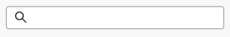

# データフィードの管理 {#manage-data-feeds}

データフィードマネージャーを使用すると、組織のデータフィードを作成、編集および削除できます。 データフィードマネージャーにアクセスする権限を持っている場合は、表示されているすべてのレポートスイートのデータフィードを管理できます。

>[!BEGINSHADEBOX]

デモ動画については、 [&#x200B; データフィード管理](https://experienceleague.adobe.com/ja/docs/analytics-learn/tutorials/exporting/data-feeds/data-feeds-management-ui){target="_blank"}を参照してください。

>[!ENDSHADEBOX]

<!-- markdownlint-disable MD034 -->

>[!CONTEXTUALHELP]
>id="aa_datafeed_manager"
>title="データフィードの管理"
>abstract="このページからデータフィードを表示、作成および管理できます。 名前または ID でフィードを検索するか、フィルターアイコンを選択して使用可能なフィルターを表示します。"

<!-- markdownlint-enable MD034 -->

## データフィードを表示

1. Adobe ID の資格情報を使用して [experiencecloud.adobe.com](https://experiencecloud.adobe.com) にログインします。
1. 右上にある 9 つの正方形のアイコンを選択し、「[!UICONTROL **Analytics**]」を選択します。
1. 上部ナビゲーションバーで、[!UICONTROL **管理者**]／[!UICONTROL **データフィード**]&#x200B;に移動します。

   アクセス権のあるすべてのレポートスイートのデータフィードが表示されます。 または、フィードが設定されていない場合、ページに「**[!UICONTROL データフィードを作成]**」ボタンが表示されます。

   

## データフィードの作成

「**[!UICONTROL データフィードを作成]**」ボタンを使用すると、新しいフィードを作成できます。 詳しくは、[&#x200B; データフィードの作成](create-feed.md)を参照してください。

## データフィードの編集

1. Adobe Analyticsで、[!UICONTROL **管理者**] > [!UICONTROL **データフィード**]&#x200B;を選択します。

1. 編集するデータフィードを探します。 データフィードを検索するには、[&#x200B; フィルターを実行して、データフィードのリストを検索します](#filter-and-search-the-list-of-data-feeds)。

1. [!UICONTROL **フィード名**]&#x200B;列でデータフィードを選択します。

1. データフィードに変更を加えます。

   データフィードのオプションについて詳しくは、[&#x200B; データフィードの作成](/help/export/analytics-data-feed/create-feed.md)の[&#x200B; データフィードの作成と設定](/help/export/analytics-data-feed/create-feed.md#create-and-configure-a-data-feed)を参照してください。

   編集中のデータフィードの&#x200B;[!UICONTROL **宛先**] セクションを更新する場合、[!UICONTROL **アカウント**]&#x200B;と&#x200B;[!UICONTROL **場所**] ドロップダウンフィールドで、新しいデータフィードに使用する別のアカウントと場所を選択できます。

   アカウントと場所は、[&#x200B; クラウドの読み込みと書き出しのアカウントの設定](/help/components/locations/configure-import-accounts.md)および[&#x200B; クラウドの読み込みと書き出しの場所の設定](/help/components/locations/configure-import-locations.md)の説明に従って編集できます。 アカウントまたは場所を編集すると、そのアカウントまたは場所に関連付けられているすべての項目に影響します。

   以前のバージョンのdata feeds managerでは、FTP、SFTP、S3、Azure blobの宛先を作成できました。 これらの以前のバージョンのデータフィード マネージャーで作成された宛先は、編集またはコピーできません。

1. 「[!UICONTROL **保存**]」を選択します。

## データフィードのリストをフィルタリングして検索します

1. Adobe Analyticsで、[!UICONTROL **管理者**] > [!UICONTROL **データフィード**]&#x200B;を選択します。

1. 検索やフィルターを使用して、特定のフィードを見つけます。

   * 検索フィールドで、フィードの名前またはIDの入力を開始します。 一致するフィードのみが、使用可能なフィードのリストに表示されます。

     

   * 左端のフィルターアイコンを選択して、フィルターオプションを表示または非表示にします。 フィルターは、**[!UICONTROL レポートスイート]**、**[!UICONTROL 所有者]**、**[!UICONTROL ステータス]**、**[!UICONTROL タグ]**&#x200B;など、カテゴリ別に整理されます。 フィルターカテゴリを折りたたんだり展開したりできます。 適用するフィルターの横にあるチェックボックスを選択します。

     

## データフィードのジョブの表示

1. Adobe Analyticsで、[!UICONTROL **管理者**] > [!UICONTROL **データフィード**]&#x200B;を選択します。

1. 「[!UICONTROL **ジョブ**]」タブを選択して、各フィードが作成する個々のジョブを表示します。

1. （オプション）特定のデータフィードのジョブ履歴を表示するには、データフィードの横にあるチェックボックスを選択し、[!UICONTROL **ジョブ履歴**]&#x200B;を選択します。

   詳しくは、[&#x200B; データフィードのジョブの管理](df-manage-jobs.md)を参照してください。

## データフィードのコピー

1. Adobe Analyticsで、[!UICONTROL **管理者**] > [!UICONTROL **データフィード**]&#x200B;を選択します。

1. コピーするデータフィードの横にあるチェックボックスを選択し、[!UICONTROL **コピー**]&#x200B;を選択します。

   これにより、現在のフィードのすべての設定を含む新しいフィード [&#128279;](create-feed.md)を作成できます。 複数のデータフィードが選択されている場合、コピーするオプションは表示されません。

   コピー中のデータフィードの&#x200B;[!UICONTROL **宛先**] セクションを更新する場合、[!UICONTROL **アカウント**]&#x200B;と&#x200B;[!UICONTROL **場所**] ドロップダウンフィールドで、新しいデータフィードに使用する別のアカウントと場所を選択できます。

   アカウントと場所は、[&#x200B; クラウドの読み込みと書き出しのアカウントの設定](/help/components/locations/configure-import-accounts.md)および[&#x200B; クラウドの読み込みと書き出しの場所の設定](/help/components/locations/configure-import-locations.md)の説明に従って編集できます。 アカウントまたは場所を編集すると、そのアカウントまたは場所に関連付けられているすべての項目に影響します。

   以前のバージョンのdata feeds managerでは、FTP、SFTP、S3、Azure blobの宛先を作成できました。 これらの以前のバージョンのデータフィード マネージャーで作成された宛先は、編集またはコピーできません。

## データフィードの一時停止

データフィードを一時停止すると、フィードの処理が停止し、ステータスが&#x200B;**[!UICONTROL 非アクティブ]**&#x200B;に設定されます。

フィードを一時停止した後にフィードを再アクティブ化すると、フィードを一時停止した時点のデータは、バックフィルフィードでは処理されますが、ライブフィードでは処理されません。 詳しくは、[&#x200B; データフィードの有効化](#activate-a-data-feed)を参照してください。

データフィードを一時停止するには：

1. Adobe Analyticsで、[!UICONTROL **管理者**] > [!UICONTROL **データフィード**]&#x200B;を選択します。

1. 一時停止するデータフィードの横にあるチェックボックスを選択し、[!UICONTROL **一時停止**]&#x200B;を選択します。

## データフィードのアクティベート

非アクティブなフィードをアクティブ化することもできます。

フィードが再アクティブ化されると、フィードが非アクティブになっている間、データが自動的に処理されない場合があります。 データが処理されるかどうかは、バックフィルフィードかライブフィードかによって異なります。

* **バックフィルフィード** （過去のデータのみを処理するフィード）は、停止した場所からデータの処理を再開し、必要に応じて任意の日付をバックフィルします。

* **ライブフィード**&#x200B;は、データがアクティブ化された時点から処理を再開します。 つまり、フィードがアクティブ化された時間まで一時停止された間、データは処理されません。 この期間にデータが必要な場合は、バックフィルを設定する必要があります。

データフィードをアクティベートするには：

1. Adobe Analyticsで、[!UICONTROL **管理者**] > [!UICONTROL **データフィード**]&#x200B;を選択します。

1. アクティブ化する非アクティブなデータフィードの横にあるチェックボックスを選択し、[!UICONTROL **アクティブ化**]&#x200B;を選択します。

## データフィードの削除

データフィードを削除すると、そのステータスは[!UICONTROL 削除済み]に設定されます。 データフィードを削除するには、ステータスが[!UICONTROL Active]である必要があります。

データフィードを削除するには：

1. Adobe Analyticsで、[!UICONTROL **管理者**] > [!UICONTROL **データフィード**]&#x200B;を選択します。

1. 削除するデータフィードの横にあるチェックボックスを選択し、[!UICONTROL **削除**]&#x200B;を選択します。

## データフィードマネージャーでの列の並べ替えとカスタマイズ

各データフィードには、フィードに関する情報を提供する複数の列が表示されます。 各列の情報を並べ替え、表示される列をカスタマイズできます。

### 列を並べ替え

列ヘッダーを選択して、昇順で並べ替えます。 列ヘッダーをもう一度選択して、降順で並べ替えます。

### 列のカスタマイズ

表の表示列を調整するには、次の手順に従います。

1. 右上の列アイコン を選択します。

1. 表をカスタマイズ ダイアログで、表示する各列を選択し、非表示にする各列の選択を解除します。

   次の列を表示できます。

   * **フィード名**：必須の列。 フィード名を表示します。
   * **フィード ID**：フィード ID（一意の ID）を表示します。
   * **レポートスイート**: フィードがデータを参照するレポートスイートです。
   * **レポートスイート ID**: レポートスイートの一意のID。
   * **間隔**：フィードが 1 時間ごとか 1 日ごとかを示します。
   * **宛先の種類**：フィードの宛先タイプ。 例：Amazon S3、GCP、Azure
   * **宛先**: ファイルが配置される場所。
   * **所有者**：フィードを作成したユーザーアカウント。
   * **ステータス**：フィードのステータス。
      * アクティブ：フィードは稼動中です。
      * 承認待ち：状況によっては、ジョブの生成を開始する前に、フィードにアドビの承認が必要になる場合があります。
      * 削除済み：フィードが削除されます。
      * 完了：フィードの処理が完了しました。 完成したフィードは、編集、保留、またはキャンセルできます。
      * 保留中：フィードが作成されましたが、まだアクティブではありません。 フィードは短い移行時間、この状態のままになります。
      * 非アクティブ：「一時停止中」または「保留中」の状態と同じです。 非アクティブなフィードが再アクティブ化された場合のバックフィルフィードとライブフィードの処理について詳しくは、[&#x200B; データフィードのアクティブ化](#activate-a-data-feed)を参照してください。
   * **最終変更日**: フィードが最後に変更された日付。 日付と時刻は、GMT オフセットを含むレポートスイートのタイムゾーンに表示されます。
   * **開始日**：このフィードの最初のジョブの日付。 日付と時刻は、GMT オフセットを含むレポートスイートのタイムゾーンに表示されます。
   * **終了日**：このフィードの最後のジョブの日付。 進行中のデータフィードに終了日がありません。

