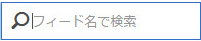

# データフィードの管理

データフィードマネージャーを使用すると、組織のデータフィードを作成、編集および削除できます。データフィードマネージャーにアクセスする権限を持っている場合は、表示されているすべてのレポートスイートのデータフィードを管理できます。

次の手順に従って、データフィード管理にアクセスします。

1. [experiencecloud.adobe.com ](https://experiencecloud.adobe.com)にログインします。
2. 右上の 9 グリッドメニューをクリックし、「[!UICONTROL Analytics]」をクリックします。
3. 上部のメニューで、[!UICONTROL 管理者]／[!UICONTROL データフィード]をクリックします。

## インターフェイスのナビゲーション

データフィードマネージャーページに到達すると、インターフェイスは次のようになります。

フィードが設定されていない場合、ページに「[!UICONTROL 新しいデータフィードを作成]」ボタンが表示されます。

### フィルターと検索

フィルターと検索を使用して、探しているフィードを見つけます。

左端のフィルターアイコンをクリックして、フィルターオプションの表示／非表示を切り替えます。フィルターはカテゴリ別に整理されます。フィルタリングカテゴリを折りたたみや展開をおこなうには、山形をクリックします。チェックボックスをクリックして、そのフィルターを適用します。

検索を使用して、フィードを名前で検索します。

### フィードとジョブ

「ジョブ」タブをクリックして、各フィードで作成される個々のジョブを表示します。詳しくは、[データフィードジョブの管理](df-manage-jobs.md)を参照してください。

### 追加

「フィード」タブと「ジョブ」タブの近くで、「+[!UICONTROL 追加]」ボタンをクリックし、新しいフィードを作成します。詳しくは、[フィードの追加](create-feed.md)を参照してください。

### 列

作成された各フィードには、その情報を示す列が複数表示されます。昇順に並べ替えるには、列見出しをクリックします。列見出しをもう一度クリックすると、降順に並べ替えられます。特定の列が表示されない場合は、右上の列アイコンをクリックします。

* **フィード名**：必須列。フィード名を表示します。
* **フィード ID**：フィード ID（一意の ID）を表示します。
* **レポートスイート**：フィードが参照するデータのレポートスイート。
* **レポートスイート ID**：レポートスイートの一意の ID。
* **データ列**：フィードに対してアクティブなデータ列。ほとんどの場合、列数が多すぎてこの形式で表示できません。
* **間隔**：フィードが 1 時間ごとか 1 日ごとかを示します。
* **宛先の種類**：フィードの宛先タイプ。例えば、FTP、Amazon S3、Azure などです。
* **宛先ホスト**：ファイルを配置する場所。例：`ftp.example.com`。
* **所有者**：フィードを作成したユーザーアカウント。
* **ステータス**：フィードのステータス。
   * アクティブ：フィードは稼動中です。
   * 承認待ち：状況によっては、ジョブの生成を開始する前に、フィードにアドビの承認が必要になる場合があります。
   * 削除済み：フィードが削除されます。
   * 完了：フィードの処理が完了しました。完了したフィードは、編集、保留またはキャンセルできます。
   * 保留中：フィードが作成されましたが、まだアクティブではありません。フィードは短い移行時間、この状態のままになります。
   * 非アクティブ：「一時停止中」または「保留中」の状態と同じです。フィードが再アクティブ化されると、停止した時点からジョブの配信が再開されます。
* **最終変更日**：フィードが最後に変更された日付。日付と時刻は、GMT オフセットでレポートスイートのタイムゾーンに表示されます。
* **開始日**：このフィードの最初のジョブの日付。日付と時刻は、GMT オフセットでレポートスイートのタイムゾーンに表示されます。
* **終了日**：このフィードの最後のジョブの日付。進行中のデータフィードに終了日がありません。

## データフィードアクション

使用可能なアクションを表示するには、データフィードの横にあるチェックボックスをクリックします。

* **ジョブ履歴**：このデータフィードに関連付けられているすべてのジョブを表示します。自動的に[ジョブ管理インターフェイス](df-manage-jobs.md)に移動します。
* **削除**：データフィードを削除し、ステータスを[!UICONTROL 削除済み]に設定します。
* **コピー**：現在のフィードのすべての設定を含む[新しいフィード](create-feed.md)を作成します。複数のデータフィードが選択されている場合は、データフィードをコピーできません。
* **一時停止**：フィードの処理を停止し、ステータスを[!UICONTROL 非アクティブ]に設定します。
* **アクティベート**：非アクティブなフィードでのみ使用できます。処理データを取得し、必要に応じて日付をバックフィルします。
