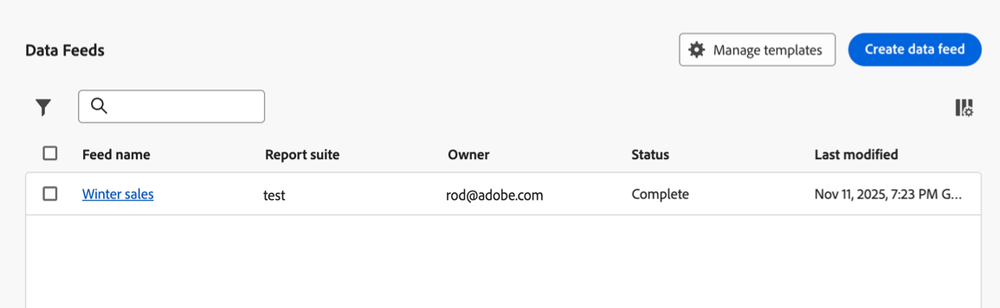

# データフィードジョブの管理 {#manage-data-feed-jobs}

ジョブとは、圧縮ファイルを出力する個々のタスクです。 ジョブはフィードによって作成および管理されます。

各データフィード、ジョブの再送信またはジョブの再処理のジョブ履歴を表示できます。

<!-- markdownlint-disable MD034 -->

>[!CONTEXTUALHELP]
>id="aa_datafeed_job_history"
>title="データフィードジョブ履歴"
>abstract="このページでは、特定のデータフィードのデータフィードジョブのリストを表示できます。 リクエスト ID またはリクエスト期間の開始日でジョブを検索します。 使用可能な列には、各ジョブに関する情報が表示されます。 同じデータでジョブを再送信したり、ジョブのソース データを再送信前に再処理することもできます。"

<!-- markdownlint-enable MD034 -->

## データフィードのジョブ履歴の表示

特定のデータフィードのデータフィードジョブのリストを、各ジョブに関する情報と共に表示できます。

データフィードのジョブ履歴を表示するには：

1. Adobe ID の資格情報を使用して [experiencecloud.adobe.com](https://experiencecloud.adobe.com) にログインします。

1. 右上にある 9 つの正方形のアイコンを選択し、「[!UICONTROL **Analytics**]」を選択します。

1. 上部ナビゲーションバーで、[!UICONTROL **管理者**]／[!UICONTROL **データフィード**]&#x200B;に移動します。

   アクセス権のあるすべてのレポートスイートのデータフィードが表示されます。 または、フィードが設定されていない場合は、「データフィードを作成 **[!UICONTROL ボタンがページに表示さ]** ます。

   

1. 表示するジョブを含むデータフィードの横にあるチェックボックスをオンにし、「[!UICONTROL **ジョブ履歴**]」を選択します。

   データフィードジョブ履歴と、各ジョブに関する情報が使用可能な列に表示されます。

1. （オプション）テーブル内の表示されている列を調整するには、右上の列アイコン  を選択し、テーブルをカスタマイズダイアログで、表示する各列を選択し、非表示にする各列の選択を解除します。

   次の列を表示できます。

   * **[!UICONTROL リクエスト期間の開始]**

   * **[!UICONTROL リクエスト期間の終了]**

   * **[!UICONTROL スケジュール済み]**

   * **[!UICONTROL 開始]**

   * **[!UICONTROL 完了]**

   * **[!UICONTROL 実行#]**

   * **[!UICONTROL ステータス]**

   * **[!UICONTROL エラーコード]**

   * **[!UICONTROL エラーメッセージ]**

## データフィードジョブの再送信

データフィードジョブを再送信すると、データフィードファイルは最初に送信されたときと同じデータおよび処理で再び送信されます。 または、[&#x200B; データフィードジョブを再処理 &#x200B;](#reprocess-data-feed-jobs) することもできます。

1 つ以上のデータフィードジョブを再送信するには：

1. Adobe Analyticsで、[!UICONTROL **管理者**] / [!UICONTROL **データフィード**] を選択します。

1. 再送信するジョブを含むデータフィードの横にあるチェックボックスをオンにし、「[!UICONTROL **ジョブ履歴**]」を選択します。

1. （オプション）検索フィールドで、リクエスト ID またはリクエスト期間の開始日で検索して、データフィードジョブのリストを検索します。

1. 1 つ以上のデータフィードジョブの横にあるチェックボックスをオンにし、「**[!UICONTROL 再送信]**」を選択します <!-- What does the status need to be? Error, ... -->。

   

## データフィードジョブの再処理

データフィードジョブを再処理すると、データフィードジョブのソースデータが再処理され、再処理されたデータと共に再度送信されます。 または、[&#x200B; データフィードジョブを再送信 &#x200B;](#resend-data-feed-jobs) することもできます。

1 つ以上のデータフィードジョブを再処理するには：

1. Adobe Analyticsで、[!UICONTROL **管理者**] / [!UICONTROL **データフィード**] を選択します。

1. 再処理するジョブを含むデータフィードの横にあるチェックボックスをオンにし、「[!UICONTROL **ジョブ履歴**]」を選択します。

1. （オプション）検索フィールドで、リクエスト ID またはリクエスト期間の開始日で検索して、データフィードジョブのリストを検索します。

1. 1 つ以上のデータフィードジョブの横にあるチェックボックスを選択してから、「**[!UICONTROL 再処理]**」を選択します。<!-- What does the status need to be? Error, ... -->

   
