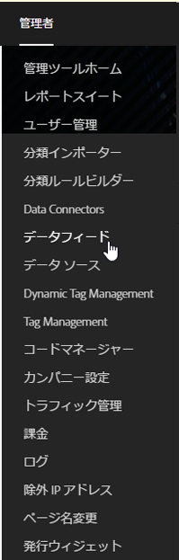

# データフィードジョブの管理

ジョブは、圧縮ファイルを出力する個々のタスクです。ジョブはフィードによって作成および管理されます。

次の手順に従って、データフィードジョブ管理にアクセスします。

1. [experiencecloud.adobe.com ](https://experiencecloud.adobe.com)にログインします。
2. 右上の 9 グリッドメニューをクリックし、「[!UICONTROL Analytics]」をクリックします。
3. 上部のメニューで、[!UICONTROL 管理者]／[!UICONTROL データフィード]をクリックします。
4. 上部近くにある「ジョブ」タブをクリックします。

## インターフェイスのナビゲーション

データフィードジョブは、アドビが特定のレポートウィンドウ用に圧縮ファイルを処理して出力する単一のインスタンスです。ジョブマネージャーは、個々のジョブのステータスを確認するための詳細なビューを提供します。

### フィルターと検索

フィルターと検索を使用して、探しているジョブを見つけます。

左端のフィルターアイコンをクリックして、フィルターオプションの表示／非表示を切り替えます。フィルターはカテゴリ別に整理されます。フィルタリングカテゴリを折りたたみや展開をおこなうには、山形をクリックします。チェックボックスをクリックして、そのフィルターを適用します。

検索を使用して、ジョブを名前で検索します。

### フィードとジョブ

「フィード」タブをクリックして、これらのジョブを作成する包括的なフィードを表示します。[データソースの管理](df-manage-feeds.md)を参照してください。

### 列

各ジョブには、その情報を示す列が複数表示されます。昇順に並べ替えるには、列見出しをクリックします。列見出しをもう一度クリックすると、降順に並べ替えられます。特定の列が表示されない場合は、右上の列アイコンをクリックします。

* **フィード ID**：フィード ID（一意の識別子）を表示します。同じフィードで作成されたジョブは、同じフィード ID を持ちます。
* **ジョブ ID：ジョブの一意の識別子。**：ジョブの一意の識別子。すべてのジョブには異なるジョブ ID が割り当てられます。
* **フィード名**：必須列。フィード名を表示します。同じフィードで作成されたジョブは、同じフィード名を持ちます。
* **レポートスイート**：ジョブがデータを参照するレポートスイート。
* **レポートスイート ID**：レポートスイートの一意の識別子。
* **開始時間**：ジョブが開始された時間。日付と時刻は、GMT オフセットでレポートスイートのタイムゾーンに表示されます。毎日のフィードは通常、レポートスイートのタイムゾーンの午前 0 時近くに開始します。
* **ステータス**：フィードのステータス。
   * データを待機中：ジョブは操作可能で、レポートウィンドウのデータを収集中です。
   * 処理中：ジョブは、データファイルを作成中で、送信する準備をしています。
   * 完了：ジョブは問題なく完了しました。
   * 失敗：ジョブが完了しませんでした。エラーの原因の特定については、[ジョブのトラブルシューティング](jobs-troubleshooting.md)を参照してください。
   * エクスポートを待機中：レポートウィンドウのデータはまだ完全に処理されていません。
   * データなし：リクエストされたレポートウィンドウのデータがレポートスイートにありません。
* **完了時間**：ジョブが終了した時間。日付と時刻は、GMT オフセットでレポートスイートのタイムゾーンに表示されます。
* **要求日**：ファイルのレポートウィンドウ。日別フィードでは通常、00:00 ～ 23:59 が GMT オフセットで表示され、レポートスイートのタイムゾーンに基づいて 1 日を示します。時間別フィードは、ジョブの対象となる個々の時間を表示します。
