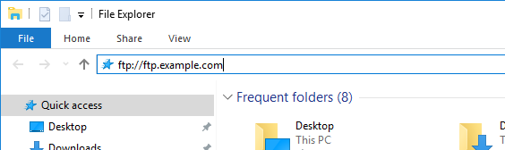

# ジョブのトラブルシューティング

FTP サイトにデータフィードを表示する際に問題が発生した場合は、このページを使用して理由を確認してください。

## エラーコード

エラーが発生した場合、エラーはジョブステータス列にレポートされます。

### FTP chdir エラー

フィードは、指定されたフォルダーに移動または書き込みできません。FTP サイトに宛先フォルダーが存在し、指定した資格情報にそのフォルダーに対する正しい読み取り権限と書き込み権限があることを確認します。

### FTP 接続エラー

フィードが FTP の宛先に接続できません。FTP の宛先が正しく、有効であることを確認します。

### FTP エラー

フィードが最終的にファイルを FTP サイトに書き込めないという一般的なエラー。このエラーは、FTP サーバーのディスクがいっぱいか、ディスクの割り当てを超過したことが原因の可能性があります。このエラーは、ネットワークまたは宛先サーバーの障害が原因で発生する場合もあります。

### FTP ログインエラー

指定された資格情報を使用してフィードがログインできません。FTP のユーザー名とパスワードが正しいことを確認します。

### FTP Put エラー

フィードは FTP サイトにファイルを書き込めません。FTP ログインに、FTP サイト上のデータの読み取りと書き込みの両方に対する適切な権限があることを確認します。このエラーも、FTP サーバー上のディスクがいっぱいか、ディスクの割り当てを超過したことが原因の可能性があります。

## トラブルシューティングの手順

FTP サイトにログインし、そのサイトにファイルをアップロードします。ほとんどの場合、これらの手順を使用することで障害の発生地点を判断できます。

1. エクスプローラー（Windows）または Finder（Mac）を使用して FTP サイトにログインします。FTP プロトコル（`ftp://`）を使用していることを確認します。FTP サイトにアクセスできない場合は、FTP サイトの所有者と協力して、正しい宛先を判断できます。

   

2. ユーザー名とパスワードの入力を求めるポップアップが表示されます。認証資格情報を入力します。資格情報が承認されると、ウィンドウに FTP サイトの現在のコンテンツが表示されます。資格情報が承認されない場合は、FTP の所有者と協力して、ユーザー名とパスワードが正しいことを確認できます。
3. ファイルを認証ウィンドウにドラッグして、FTP サイトにアップロードします。どの画像やテキストドキュメントでもかまいません。FTP サイトにファイルを配置しようとしてエラーが発生した場合は、FTP の所有者に問い合わせて、十分なディスク容量があり、ユーザー名に FTP サイトへの書き込み権限があることを確認します。
4. ファイルが FTP サイト上に存在することを確認したら、以前の手順でアップロードしたファイルを削除できます。
5. 上記の手順がすべて正常に動作し、それでも FTP エラーが発生する場合は、カスタマーサポートからカスタマーケアに問い合わせてもらってください。
