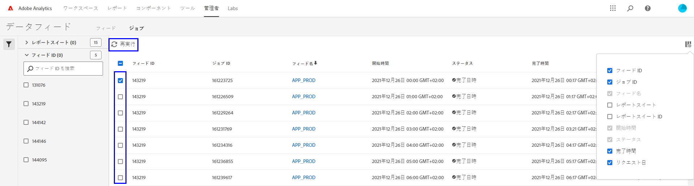

# データフィードのトラブルシューティング

ジョブの処理または配信に失敗する可能性がある潜在的な理由を特定します。

## 既存のデータフィードのトラブルシューティング

時間単位または日単位で正常に動作しているが最近失敗したデータフィードがある場合は、次の各項目を確認してください。

* [Adobe Status ツール](https://status.adobe.com/ja/experience_cloud) を使用して、予定されているメンテナンスウィンドウや可用性に関する問題があるかどうかを確認します。その時点で既知の問題がある場合、サービスが復元されると、アドビはスケジュールされたデータフィードを自動的に処理します。
* FTP サイトに十分な空き容量があることを確認します。FTP サイトのディスク容量が不足した場合は、新しいファイルの領域を確保するために、サーバーからいくつかのファイルを削除します。
* 既知の問題がなく、FTP サイトに十分なディスク容量がある場合は、データフィードを再送信できます。

   1. Adobe Analytics にログインし、 **[!UICONTROL 管理者]**／**[!UICONTROL データフィード]** に移動します。
   2. 目的のデータフィードを見つけ、再実行する各フィードの横にあるチェックボックスをクリックします。
   3. 「**[!UICONTROL 再実行]**」をクリックします。

   

再実行してもデータフィードファイルが届かない場合は、カスタマーケアにお問い合わせください。

## 新規データフィードのトラブルシューティング

新規データフィードでエラーが発生した場合は、FTP サイトにテストファイルを手動でアップロードして、問題のトラブルシューティングを行います。ほとんどの場合、これらの手順を使用することで障害の発生地点を判断できます。

1. エクスプローラー（Windows）または Finder（Mac）を使用して FTP サイトにログインします。FTP プロトコル（`ftp://`）を使用し、組織のファイアウォールで [アドビの IP アドレス](/help/technotes/ip-addresses.md) を許可していることを確認してください。FTP サイトに到達できない場合は、FTP サイトの所有者と協力して正しい接続先を確認してください。

   

2. ユーザー名とパスワードの入力を求めるポップアップが表示されます。認証資格情報を入力します。資格情報が承認されると、ウィンドウに FTP サイトの現在のコンテンツが表示されます。資格情報が承認されない場合は、FTP の所有者と協力して、ユーザー名とパスワードが正しいことを確認してください。SFTP を使用している場合は、 [SFTP ガイド](../ftp-and-sftp/c-sftp/ftp-sftp.md) の各手順に必ず従ってください。なお、アドビではすべての SFTP ユースケースをサポートしているわけではありません。
3. ファイルを認証ウィンドウにドラッグして、FTP サイトにアップロードします。どの画像やテキストドキュメントでもかまいません。FTP サイトにファイルを配置しようとしてエラーが発生した場合は、FTP の所有者に問い合わせて、十分なディスク容量があり、ユーザー名に FTP サイトへの書き込み権限があることを確認します。
4. ファイルが FTP サイト上に存在することを確認したら、以前の手順でアップロードしたファイルを削除できます。

上記の手順をすべて実行しても FTP エラーが発生する場合は、カスタマーケアにお問い合わせください。
