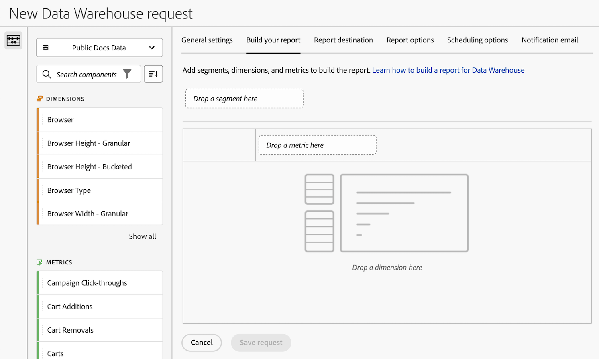

# Data Warehouse要求用のレポートの作成

{{release-limited-testing}}

設定リクエストを作成する際には、様々な設定オプションをData Warehouseできます。 次の情報では、リクエストのレポートを作成する方法を説明します。

リクエストの作成を開始する方法と、その他の重要な設定オプションへのリンクについて詳しくは、 [Data Warehouseリクエストの作成](/help/export/data-warehouse/create-request/t-dw-create-request.md).

Data Warehouse・リクエストのレポートを作成するには：

1. Adobe Analyticsでのリクエストの作成を開始するには、「 **[!UICONTROL ツール]** > **[!UICONTROL Data Warehouse]** > [!UICONTROL **追加**].

   詳しくは、 [Data Warehouseリクエストの作成](/help/export/data-warehouse/create-request/t-dw-create-request.md).

1. 新しいData Warehouseリクエストページで、 [!UICONTROL **レポートの作成**] タブをクリックします。

   

1. 任意のセグメント、指標およびディメンションをビルダーにドラッグします。 作成するレポートによって、Data Warehouseリクエストに含まれるデータが決まります。

1. 引き続き、 [!UICONTROL **レポートの送信先**] タブをクリックします。 詳しくは、 [レポートの送信先の設定リクエストのData Warehouse](/help/export/data-warehouse/create-request/dw-request-report-destinations.md).

<!--

Keep any of this? It was in the Overview article:

The following table describes the fields and options on the [!UICONTROL Data Warehouse Request] tab.

<table id="table_7325A2466866460E8B0AF7D696152713"> 
 <thead> 
  <tr> 
   <th colname="col1" class="entry"> Element </th> 
   <th colname="col2" class="entry"> Description </th> 
  </tr> 
 </thead>
 <tbody> 
  <tr> 
   <td colname="col1">  Request Name </td> 
   <td colname="col2"> Identifies the request. </td> 
  </tr> 
  <tr> 
   <td colname="col1">  Reporting Date </td> 
   <td colname="col2"> 
The date and granularity of the request. 
 
    <ul id="ul_C00F4529BD9E4113B517A61751B1DD5C"> 
     <li id="li_4D7C26812DF94ED7B64F985309541F46">  Custom: A date range you configure in the calendar. </li> 
     <li id="li_2B272087006847148A936350D1B2D523">  Preset: A preset range. The preset range is relative to the report date. </li> 
     <li id="li_745989965BB94D489FF7046587E13C42">  Granularity: The time granularity. Valid values are None, Hour, Day, Week, Month, Quarter, and Year. </li> 
    </ul> 
Data Warehouse reporting on virtual report suites supports the alternative time zone configured on the virtual report suite. 
 </td> 
  </tr> 
  <tr> 
   <td colname="col1">  Available Segments </td> 
   <td colname="col2"> 
Lets you select the part of the visitor population you want to examine and generate complex segments. You can load pre-configured segments, create new segments, and store segment components in a library to use in building additional segments. 
 
You can now stack segments. When selecting multiple segments, the preview area, the Request Manager, and the Request Detail popup show a comma-separated list of names (e.g., Segment1, Segment2). 
 
See the <a href="/help/components/segmentation/seg-home.md"> Segmentation Guide</a> for more information. 
 
Note:  You cannot include both a segment filter and a breakdown on the same segment, in the same Data Warehouse report. Doing so will result in an error. 
 </td> 
  </tr> 
  <tr> 
   <td colname="col1">  Breakdowns </td> 
   <td colname="col2"> 
Lets you categorize data using breakdowns. Segments and breakdowns differ in that a segment filters data out of a data set, while a breakdown compartmentalizes data across all valid values for the breakdown. 
 You can also break down a report by one or more segments. However, you cannot include both a segment filter and a breakdown on the same segment, in the same Data Warehouse report. Doing so will result in an error. 
 For example, use segments to remove a gender from the data set, and use a breakdown to see data separated by gender. 
 
When a Data Warehouse request is submitted with multiple multi-value dimensions (e.g., various Mobile Reports), an exponential number of rows can be generated from a single hit. The number of rows that can be output from a single hit is capped at 100 (previously 1,000). 
 </td> 
  </tr> 
  <tr> 
   <td colname="col1">  Metrics </td> 
   <td colname="col2">Lets you add metrics that you want to report on. </td> 
  </tr> 
  <tr> 
   <td colname="col1"> Metrics Sort </td> 
   <td colname="col2">Provides ranked breakdown reports, sorted by descending metric value, similar to what is displayed in the Reports &amp; Analytics user interface, Data Workbench, etc. <a href="/help/export/data-warehouse/sorting-by-metric.md"  > More...</a> </td> 
  </tr> 
  <tr> 
   <td colname="col1">  Schedule Delivery </td> 
   <td colname="col2"> 
Lets you schedule requests for automatic delivery at selected intervals, or as a one-time report. If you use the default format, the report arrives in an email as a .csv file. 
 
To add the date range, include  %R in the filename. This value represents the date values requested in the report. For example, if you request data from May 1, 2013 through May 7, 2013, the  %R shows a filename including the date range of 20130501 - 20130507. 
 </td> 
  </tr> 
 </tbody> 
</table>

-->