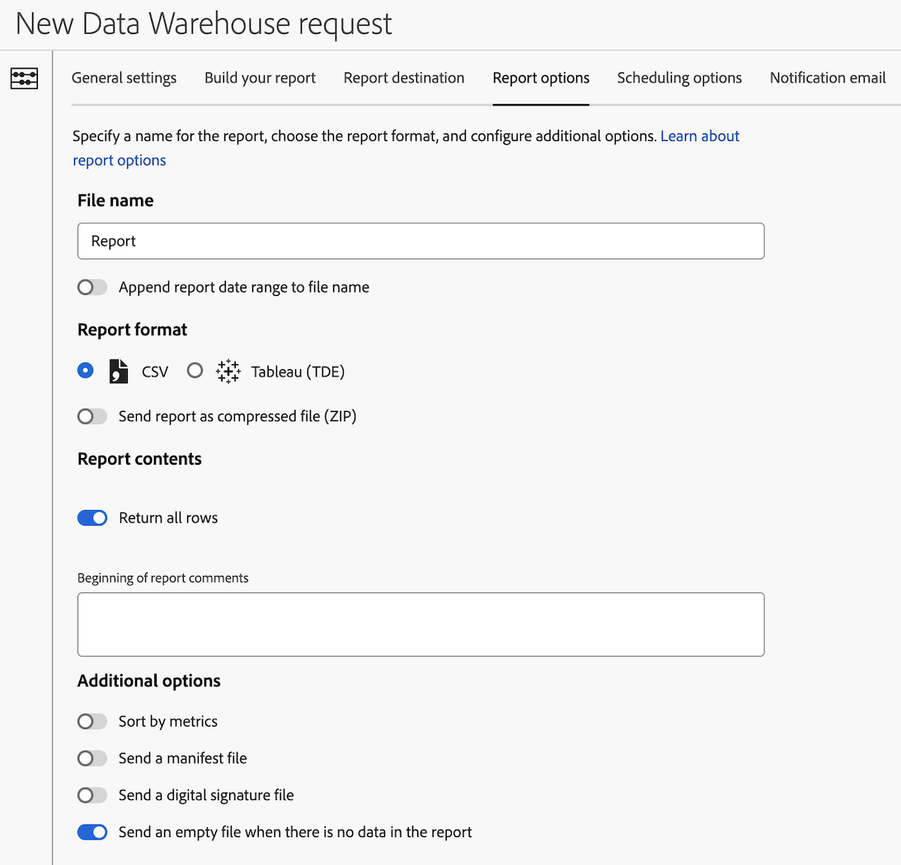

# レポートリクエストのレポートオプションのData Warehouseを設定する

>[!AVAILABILITY]
>
>この記事 ( およびこの節の他のData Warehouse記事 ) で説明するData Warehouse機能の一部は、リリースの制限付きテスト段階でのみ使用でき、お使いの環境ではまだ使用できない場合があります。
>
>すべてのお客様がまだ利用できない機能について、およびこれらの機能のリリースのタイムラインについて詳しくは、 [リリースノート](/help/release-notes/latest.md).
>
>このメモは、機能が一般入手可能になったら削除されます。Analytics リリースプロセスについて詳しくは、[Adobe Analytics 機能リリース](/help/release-notes/releases.md)を参照してください。

設定リクエストを作成する際には、様々な設定オプションをData Warehouseできます。 次の情報では、リクエストのレポートオプションを設定する方法を説明します。

リクエストの作成を開始する方法と、その他の重要な設定オプションへのリンクについて詳しくは、 [Data Warehouseリクエストの作成](/help/export/data-warehouse/create-request/t-dw-create-request.md).

レポート・リクエストのレポート・オプションをData Warehouseするには、次の手順に従います。

1. Adobe Analyticsでのリクエストの作成を開始するには、「 **[!UICONTROL ツール]** > **[!UICONTROL Data Warehouse]** > [!UICONTROL **追加**].

   詳しくは、 [Data Warehouseリクエストの作成](/help/export/data-warehouse/create-request/t-dw-create-request.md).

1. 新しいData Warehouseリクエストページで、 [!UICONTROL **レポートのオプション**] タブをクリックします。

    <!-- update screenshot to include Sort by metrics -->

1. 以下のフィールドに入力します。

   | オプション | 関数 |
   |---------|----------|
   | [!UICONTROL **ファイル名**] | レポートを識別します。 
ファイル名に次の特殊文字が使用されている場合、リクエストは保存できません。 <code>! &quot; # $ &amp; &#39; ( ) * + , / : ; > = &lt; ?@ [ ] \ ^ ` {  } \| ~</code> 

%文字は、次のように、「R」、「rsid」、「id」の後に付く場合にのみ使用できます。 <code>%R</code>, <code>%rsid</code>、および <code>%id</code>。
 |
   | [!UICONTROL **ファイル名にレポートの日付範囲を追加**] | レポートファイル名に日付範囲を追加します。 
例えば、2024 年 5 月 1 日から 2024 年 5 月 7 日までのデータを要求した場合、ファイル名には20240501 ～ 20240507の日付範囲が含まれます。
 |
   | [!UICONTROL **CSV**] | レポートを CSV ファイル形式で配信し、データをスプレッドシートで表示します。 |
   | [!UICONTROL **Tableau(TDE)**] | レポートを Tableau Data Extract(TDE) ファイル形式で配信します。この形式は、Tableau 内の追加データのデータやレイヤーを視覚化するために使用できます。 |
   | [!UICONTROL **レポートを圧縮ファイル (ZIP) として送信**] | レポートを圧縮 (ZIP) ファイル形式で配信します。 電子メールを [レポートの宛先](/help/export/data-warehouse/create-request/dw-request-report-destinations.md). |
   | [!UICONTROL **すべての行を返す**] | 有効にすると、すべての行がレポートに含まれます。 このオプションを無効にして、含める行数を指定します。 |
   | [!UICONTROL **レポートのコメントの先頭**] | レポートに含めるコメントを追加します。 レポートの先頭にコメントが表示されます。 |
   | [!UICONTROL **指標で並べ替え**] | 指標値を降順で並べ替えた、Data Warehouse のランク分類レポートを提供します。指標で並べ替えると、Data Warehouse レポートが解釈しやすくなり、他の Analytics 分類レポート表示と比較しやすくなります。
詳しくは、 [指標で並べ替え](/help/export/data-warehouse/sorting-by-metric.md).
 |
   | [!UICONTROL **マニフェストファイルを送信**] | レポートに含まれるファイルに関するメタデータが含まれます。<!-- What kind of metadata is included in the manifest file? --> |
   | [!UICONTROL **デジタル署名ファイルを送信**] | レポートの受信者は、ファイルがAdobeから送信されたもので、変更されていないことを確認できます。 |
   | [!UICONTROL **レポートにデータがない場合は空のファイルを送信**] | レポートにデータが含まれていない場合でもレポートを送信します。 |

   {style="table-layout:auto"}

1. 引き続き、 [!UICONTROL **スケジュールオプション**] タブをクリックします。 詳しくは、 [スケジュールリクエストのData Warehouseオプションの設定](/help/export/data-warehouse/create-request/dw-request-scheduling.md).
