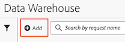

# Data Warehouse リクエストの作成

Data Warehouse を作成する際には、様々な設定オプションを使用できます。次の情報では、リクエストの作成を開始する方法を説明し、リクエストを完了するためのより詳細な情報へのリンクを提供します。

## リクエストの作成を開始

1. Adobe Analyticsで、「**[!UICONTROL ツール]**/**[!UICONTROL Data Warehouse]**」を選択します。

1. [!UICONTROL **Data Warehouse**] ページで、「[!UICONTROL **追加**]」を選択します。

   

   新しいData Warehouseリクエスト ページが表示されます。

   

## リクエストの完了

Data Warehouseリクエストを作成する際には、様々なタブを使用できます。 各タブの様々な設定オプションについて詳しくは、次の記事を参照してください。

* [一般設定](/help/export/data-warehouse/create-request/dw-general-settings.md)

* [レポートを作成](/help/export/data-warehouse/create-request/dw-request-build-report.md)

* [レポートの宛先](/help/export/data-warehouse/create-request/dw-request-report-destinations.md)

* [レポートオプション](/help/export/data-warehouse/create-request/dw-request-report-options.md)

* [スケジュールオプション](/help/export/data-warehouse/create-request/dw-request-scheduling.md)

* [通知メール](/help/export/data-warehouse/create-request/dw-request-email.md)
