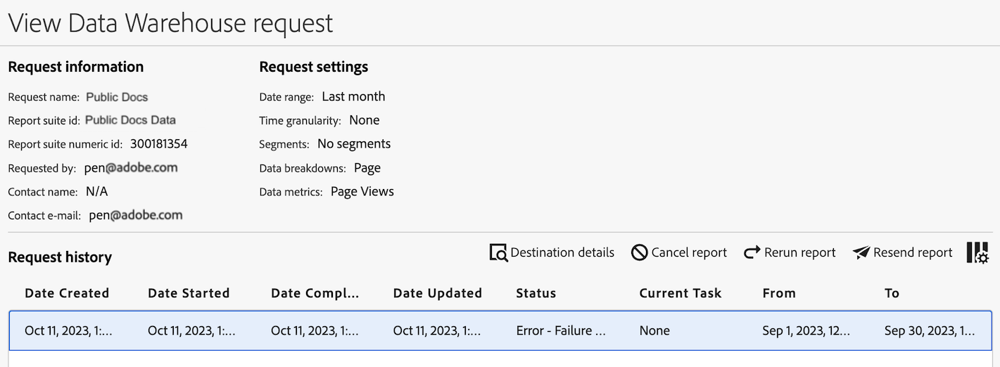

# Data Warehouse リクエストの管理

自分が行ったData Warehouseリクエストを表示および管理できます。 組織内の他のユーザーが行ったリクエストを表示および管理できるのは、管理者のみです。

次の節では、リクエストを管理する際に実行できるアクティビティについて説明します。

## リクエストの表示

既定では、自分が作成した要求のみを表示できます。ただし、[Data Warehouse要求の一般設定 ](/help/export/data-warehouse/create-request/dw-general-settings.md) に記載されているように、自分の要求を組織内の他のユーザーに表示するように選択したユーザーは例外です。 システム管理者は、すべてのリクエストを表示できます。

Data Warehouseリクエストを表示するには：

1. Adobe Analyticsで、「[!UICONTROL **ツール**]/[!UICONTROL **Data Warehouse**]」を選択します。

   Data Warehouseページには、行ったすべてのリクエストが表示されます。 データは各列に表示されます。 表示する [ 列を設定 ](#configure-columns) できます。

   <!-- add screenshot of main page -->

<!-- describe columns? -->

1. （オプション）リクエスト名をクリックして、次の情報を表示するダイアログを表示します。<!-- Check this -->

   * リクエストの処理を開始したタイミング

   * 料率が制限されています：実行中のData Warehouseリクエストが多すぎます。 他のデータリクエストが完了するまで、リクエストは一時停止されます。

## リクエストを編集

リクエストを編集する際は、次の点を考慮してください。

* 編集できるリクエストは、スケジュールに従って実行するように設定されているリクエストのみです。

* リクエストに関連付けられているすべてのフィールドが編集できるわけではありません。 編集できないフィールドは、グレー表示されます。

* 別のユーザーのリクエストを編集する管理者は、アクセスできる新しいアカウントと場所を選択する必要があります。

スケジュールされたリクエストを編集するには：

1. Adobe Analyticsで、「[!UICONTROL **ツール**]/[!UICONTROL **Data Warehouse**]」を選択します。

1. Data Warehouseページで、編集するリクエストを選択します。

   

1. 「[!UICONTROL **編集**]」を選択します。

1. 必要に応じてリクエストを編集します。 グレー表示されている設定オプションは編集できません。

   各Data Warehouseオプションについて詳しくは、[ 設定リクエストの作成 ](/help/export/data-warehouse/create-request/t-dw-create-request.md) を参照してください。

1. 「[!UICONTROL **変更を保存**]」を選択します。

## リクエストの履歴の表示

実行したData Warehouseリクエストの履歴を確認できます。

1. Adobe Analyticsで、「[!UICONTROL **ツール**]/[!UICONTROL **Data Warehouse**]」を選択します。

1. Data Warehouseページで、履歴を表示するリクエストを選択します。

   

1. [!UICONTROL **履歴を表示**] を選択します。

   [!UICONTROL **Data Warehouseリクエストを表示**] ページには、リクエストに関連付けられている個々のレポート配信のリストが表示されます。

   **列を設定** アイコン  を選択して、デフォルトでは表示されていない列を非表示にしたり表示したりします。

   

   以下の列を表示できます。

   | 列 | 説明 |
   |---------|----------|
   | [!UICONTROL **作成日**] | レポートが作成された日時。
これは、リクエストを開始したユーザーのタイムゾーンで表示されます。
 |
   | [!UICONTROL **開始日**] | レポートが開始された日時。
これは、リクエストを開始したユーザーのタイムゾーンで表示されます。
 |
   | [!UICONTROL **完了日**] | レポートが完了した日時。
これは、リクエストを開始したユーザーのタイムゾーンで表示されます。
 |
   | [!UICONTROL **更新日**] | レポートが最後に更新された日時。
これは、リクエストを開始したユーザーのタイムゾーンで表示されます。
 |
   | [!UICONTROL **ステータス**] | レポート配信のステータス。 考えられるステータスは次のとおりです。<ul><li>[!UICONTROL **作成済み**]：レポートは作成されましたが、まだ処理されていません。</li><li>[!UICONTROL **保留中**]：報告書は処理待ちの状態です。</li><li>[!UICONTROL **処理中**]：レポートは現在処理中です。</li><li>[!UICONTROL **完了**]：レポートが完了し、使用可能になりました。</li><li>[!UICONTROL **スケジュール済み**]：レポートはスケジュールされていますが、まだ開始されていません。</li><li>[!UICONTROL **キャンセル**]：レポートはユーザーによってキャンセルされました。</li><li>[!UICONTROL **エラー – 処理中**:] レポートでエラーが発生し、処理できませんでした。</li><li>[!UICONTROL **エラー – 送信に失敗**]：レポートは正常に生成されましたが、配信できませんでした。 [ 宛先の設定 ](/help/export/data-warehouse/create-request/dw-request-report-destinations.md) を確認し、レポートを再送信します。</li></ul>。 |
   | [!UICONTROL **送信元**] | レポートに含まれる時間枠全体の開始日。
これは、レポートスイートのタイムゾーンで表示されます。
 |
   | [!UICONTROL **設定値**] | レポートに含まれる期間全体の終了日。 
これは、レポートスイートのタイムゾーンで表示されます。
 |
   | [!UICONTROL **従来のリクエスト ID**] | 従来のData Warehouseインターフェイスでレポートを識別するために使用される ID。 この ID は、Adobeカスタマーケアに問い合わせる際に必要になる場合があります。 |
   | [!UICONTROL **報告書 ID**] | 現在のData Warehouseインターフェイスでレポートを識別するために使用される ID。 この ID は、Adobeカスタマーケアに問い合わせる際に必要になる場合があります。 |

1. レポート配信を選択し、次のいずれかのオプションを選択します。

   | オプション | 関数 |
   |---------|----------|
   | [!UICONTROL **宛先の詳細**] | リクエストに関連付けられているアカウントと場所の詳細を表示します。 [Data Warehouseリクエストのレポート先の設定 ](/help/export/data-warehouse/create-request/dw-request-report-destinations.md) で説明したように、これは以前に設定されたアカウントと場所です。 |
   | [!UICONTROL **レポートをキャンセル**] | レポートをキャンセルします。 ステータスが [!UICONTROL **完了**] または [!UICONTROL **キャンセル**] の報告書をキャンセルすることはできません。 |
   | [!UICONTROL **レポートの再実行**] | 最初に送信されたときのデータでレポートを再度実行します。 ステータスが「[!UICONTROL **キャンセル済み**]」、「[!UICONTROL **完了**]」、「[!UICONTROL **エラー – 処理中**]」、「[!UICONTROL **エラー – 送信に失敗**] のいずれかのレポートを再実行できます。 |
   | [!UICONTROL **レポートを再送信**] | 以前に生成されたレポート ファイルを再送信します。 次のいずれかのステータスを持つレポートを再送信できます：[!UICONTROL **完了**] または [!UICONTROL **エラー – 送信できませんでした**]。 |

## リクエストのコピー

リクエストをコピーすると、設定オプションはすべて元のリクエストからコピーされます。

1. Adobe Analyticsで、「[!UICONTROL **ツール**]/[!UICONTROL **Data Warehouse**]」を選択します。

1. Data Warehouseページで、コピーするリクエストを選択します。

   

1. 「[!UICONTROL **コピー**]」を選択します。

   Data Warehouseリクエストをコピーページが表示されます。 すべての設定オプションは元のリクエストからコピーされます。

1. リクエストに関連付けられている設定オプションを更新します。

   各Data Warehouseオプションについて詳しくは、[ 設定リクエストの作成 ](/help/export/data-warehouse/create-request/t-dw-create-request.md) を参照してください。

1. 「[!UICONTROL **変更を保存**]」を選択します。

## リクエストをキャンセル

スケジュールに従って実行するように設定されたリクエストのみをキャンセルできます。

スケジュールされたリクエストをキャンセルするには：

1. Adobe Analyticsで、「[!UICONTROL **ツール**]/[!UICONTROL **Data Warehouse**]」を選択します。

1. Data Warehouseページで、編集するリクエストを選択します。

   

1. [!UICONTROL **キャンセル**] を選択します。

   このリクエストは、スケジュールされた時間に実行されなくなります。

## 列を設定

列を追加または削除することで、各リクエストに表示される情報を設定できます。

1. Data Warehouseページの右上にある **列を設定** アイコンを選択します。

   

   以下の列を表示できます。

   | 使用可能な列 | 説明 |
   |---------|----------|
   | リクエスト名 | リクエストを作成したユーザーの名前。 |
   | レポートスイート | リクエストに関連付けられたレポートスイート。 |
   | リクエスト発信者 | リクエストを作成したユーザー。 |
   | リクエスト日 | リクエストが行われた日付。 |
   | ステータス | 次のステータスを使用できます。<ul><li>
**完了**: リクエストは正常に実行されました。
</li><li>
**キャンセル**：リクエストはユーザーによってキャンセルされました。
</li><li>
**スケジュール済み**：リクエストは、スケジュールに従って実行されるように設定されています。
</li><li>
**失敗**：リクエストを完了できませんでした。 リクエストが引き続き失敗する場合は、カスタマーサポートにお問い合わせください。
</li></ul> |

   {style="table-layout:auto"}

1. 表示する列が選択されていることを確認します。 選択した列はData Warehouseページに表示され、関連情報が表示されます。

## リクエストのフィルタリングと並べ替え

1. Data Warehouseページの左側のパネルにある「**フィルター**」アイコンを選択します。

   

1. 「[!UICONTROL **レポートスイート**]」、「[!UICONTROL **所有者**]」または「[!UICONTROL **ステータス**]」セクションを展開し、リクエストをフィルタリングする方法を選択します。

## リクエストを検索

1. Data Warehouseページの上部にある検索フィールドで、表示するリクエスト名を指定します。

   要求は入力中にフィルタリングされます。