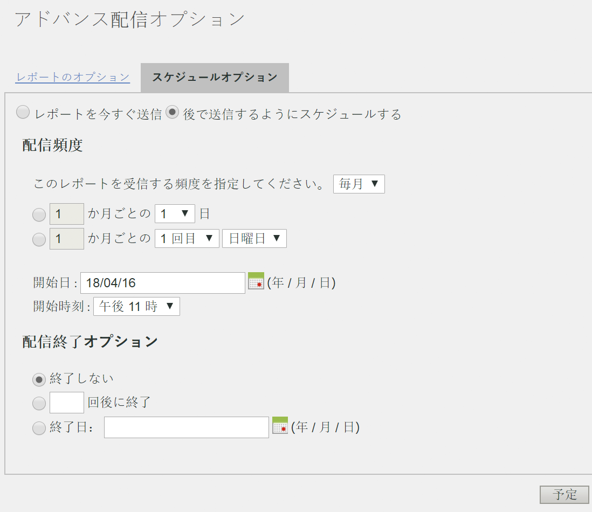

# 定期的なリクエストのスケジュール設定

## 定期的なリクエストのスケジュール設定 {#topic_8C3CE0CE8A584F80946D24B377CB51BE}

日、月、年単位で Data Warehouse リクエストのスケジュールを設定するには、*プリセット* が適切に選択されていることを確認します。

1. 「[!UICONTROL レポート日]」で「**[!UICONTROL プリセット]**」を選択します。

1. 「[!UICONTROL 配信の予定]」で「**[!UICONTROL アドバンス配信オプション]**」をクリックします。

1. 「スケジュールオプション」タブに移動し、「**[!UICONTROL 後で送信するようにスケジュールする]**」を選択します。
1. 「[!UICONTROL 配信頻度]」と「[!UICONTROL 配信終了オプション]」で必要な設定を選択します。

   

1. 「**[!UICONTROL スケジュール]**」をクリックします。
