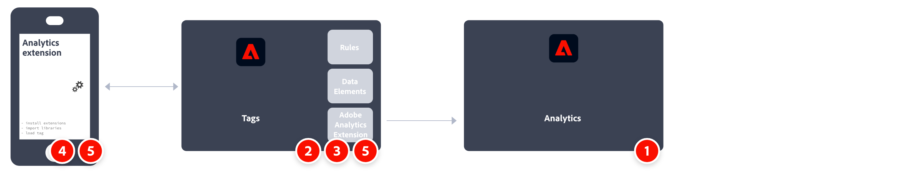

# Adobe Experience Platform Mobile SDK を使用した Adobe Analytics の実装

Adobe Experience Platform Mobile SDK は、モバイルアプリでの Adobe Experience Cloud のソリューションとサービスを強化するのに役立ちます。Android™、iOS、および様々なクロスプラットフォーム開発フレームワークで使用できます。 設定は、Adobe Experience Platform データ収集を通じて処理されます。
>[!IMPORTANT]
>
>Adobe Analytics 拡張機能は、Adobe Experience Platform データ収集でも使用できます。この拡張機能をインストールする場合、XDM や Edge ネットワークを利用することはできません。

## Adobe Experience Platform SDK

実装タスクの概要です。

| |タスク |詳細情報 | |-| —|—| | 1 |以下をお持ちであることを確認してください： **レポートスイートの定義**. | [Report Suite Manager](../../../admin/admin/c-manage-report-suites/report-suites-admin.md) | | 2 | **スキーマとデータセットの設定**. Adobe Experience Platformを利用するアプリケーション間で使用するデータ収集を標準化するために、Adobeはオープンで公式に文書化された標準である Experience Data Model(XDM) を作成しました。 | [スキーマとデータセットの設定](https://developer.adobe.com/client-sdks/documentation/getting-started/set-up-schemas-and-datasets/) | | 3 | **データストリームの設定**. datastream は、Adobe Experience Platform Web SDK を実装する際のサーバー側の設定を表します。 | [データストリームの設定](https://experienceleague.adobe.com/docs/experience-platform/edge/datastreams/configure.html?lang=en) | | 4 | **Adobe Analyticsサービスの追加** をデータストリームに追加します。 このサービスは、データをAdobe Analyticsに送信するかどうかと方法を制御します。 | [Adobe Analyticsサービスをデータストリームに追加する](https://experienceleague.adobe.com/docs/experience-platform/edge/datastreams/configure.html?lang=en#analytics) | | 5 | **モバイルプロパティの作成**. プロパティは、拡張機能、ルール、データ要素およびライブラリを入力するコンテナです。 | [モバイルプロパティの設定](https://developer.adobe.com/client-sdks/documentation/getting-started/create-a-mobile-property/) | | 6 | **Adobe Experience Platform Edge Network 拡張機能のインストール** モバイルタグのプロパティを開き、拡張機能で datastream を設定します。 | [Adobe Experience Platform Edge Network](https://developer.adobe.com/client-sdks/documentation/edge-network/) | | 7 | **アプリでのコードの使用** 必要な拡張機能を登録し、タグ設定を読み込む。 | [設定のセットアップ](https://developer.adobe.com/client-sdks/documentation/user-guides/getting-started-with-platform/overview/#set-up-the-configuration) | | 8 | **機能の実装とテスト** アプリ内でタグのデータ要素、ルール、追加の拡張機能、SDK API 呼び出しの組み合わせを使用する。 モバイルアプリケーションのデータ収集およびエクスペリエンスのInspect、検証およびデバッグをおこないます。 | [サンプルアプリケーションの使用](https://developer.adobe.com/client-sdks/documentation/user-guides/getting-started-with-platform/overview/#use-the-sample-application) | | 9 | **モバイルアプリの実装を拡張および検証します** 実稼動環境にプッシュする前に | |

## Adobe Analytics 拡張機能.

実装タスクの概要です。

| |タスク |詳細情報 | |-| —|—| | 1 |以下をお持ちであることを確認してください： **レポートスイートの定義**. | [Report Suite Manager](../../../admin/admin/c-manage-report-suites/report-suites-admin.md) | | 2 | **モバイルプロパティの作成**. プロパティは、拡張機能、ルール、データ要素およびライブラリを入力するコンテナです。 | [モバイルプロパティの設定](https://developer.adobe.com/client-sdks/documentation/getting-started/create-a-mobile-property/) | | 3 | **Adobe Analytics拡張機能のインストール** モバイルタグプロパティで、拡張機能を設定して、レポートスイートを指すようにします。 | [モバイルプロパティ用Adobe Analytics拡張機能](https://developer.adobe.com/client-sdks/documentation/adobe-analytics/) | | 4 | **アプリでのコードの使用** 必要な拡張機能を登録し、タグ設定を読み込む。 | [設定のセットアップ](https://developer.adobe.com/client-sdks/documentation/user-guides/getting-started-with-platform/overview/#set-up-the-configuration) | | 5 | **機能の実装とテスト** アプリ内でタグのデータ要素、ルール、追加の拡張機能、SDK API 呼び出しの組み合わせを使用する。 モバイルアプリケーションのデータ収集およびエクスペリエンスのInspect、検証およびデバッグをおこないます。 | [サンプルアプリケーションの使用](https://developer.adobe.com/client-sdks/documentation/user-guides/getting-started-with-platform/overview/#use-the-sample-application) | | 6 | **モバイルアプリの実装を拡張および検証します** 実稼動環境にプッシュする前に | |

## その他のリソース

- [タグドキュメント](https://experienceleague.adobe.com/docs/experience-platform/tags/home.html?lang=ja#)

- [Mobile SDK ドキュメント](https://developer.adobe.com/client-sdks/documentation/)

