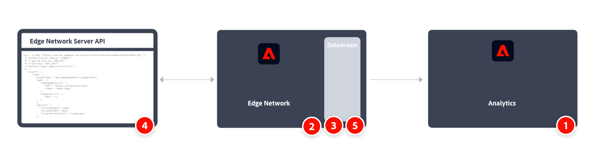

# Adobe Analytics Implement Server API を使用したAdobe Experience PlatformのEdge Network

通常、Experience PlatformEdge Networkサーバー API はクライアントサイドではなくサーバーサイドでデータを収集するために使用します。 その後、そのデータをEdge ネットワークとAdobe Analyticsなどのサービスに送信します。

また、機密データを安全に収集し、ネットワーク全体で認証する必要がある場合は、Edge Networkサーバー API も検討してください。 詳しくは、[ 認証 ](https://experienceleague.adobe.com/docs/experience-platform/edge-network-server-api/authentication.html?lang=ja) を参照してください。

実装タスクの大まかな概要：

<table style="width:100%">

<tr>
<th style="width:5%"></th><th style="width:60%"><b>タスク</b></th><th style="width:35%"><b>詳細情報</b></th>
</tr>

<tr>
<td>1</td>
<td><b>レポートスイートを定義</b>したことを確認します。</td>
<td><a href="../../../admin/admin/c-manage-report-suites/report-suites-admin.md">レポートスイートマネージャー</a></td>
</tr>

<tr>
<td>2</td>
<td><b> スキーマを設定 </b>. Adobe Experience Platform を活用するアプリケーション間で使用するデータ収集を標準化するために、アドビはオープンで公的に文書化された標準である Experience Data Model（XDM）を作成しました。</td>
<td><a href="https://experienceleague.adobe.com/docs/experience-platform/xdm/ui/overview.html?lang=ja">スキーマ UI の概要</a></td>
</tr>

<tr>
<td>3</td>
<td><b>データストリームを設定します</b>。 データストリームは、Adobe Experience Platform設定 API から API を使用する場合のサーバーサイドEdge Networkを表します。</td>
<td><a href="https://experienceleague.adobe.com/docs/experience-platform/datastreams/configure.html?lang=ja">データストリームの設定<a></td> 
</tr>

<tr>
<td>4</td>
<td>単一イベントデータおよびバッチイベントデータ収集 API を使用して </b> データ収集を実装およびテスト <b> ます。</td>
<td><a href="https://experienceleague.adobe.com/docs/experience-platform/edge-network-server-api/data-collection/interactive-data-collection.html?lang=ja"> 単一イベントデータ収集 </a> <a href="https://experienceleague.adobe.com/docs/experience-platform/edge-network-server-api/data-collection/non-interactive-data-collection.html?lang=ja"> バッチイベントデータ収集 </a>
</tr>

<td>5</td>
<td>データストリームに <b>Adobe Analytics サービスを追加します</b>。 このサービスは、Adobe Analytics にデータを送信するかどうかと、どのように送信するかを制御します。</td>
<td><a href="https://experienceleague.adobe.com/docs/experience-platform/edge-network-server-api/interacting-other-adobe-solutions/interacting-adobe-analytics.html?lang=ja">Adobe Analytics の操作</a></td>
</tr>

</table>

詳しくは、[Edge Networkサーバー API ドキュメント ](https://experienceleague.adobe.com/docs/experience-platform/edge-network-server-api/overview.html?lang=ja) および例 [Adobe Analyticsとの統合 ](https://experienceleague.adobe.com/docs/experience-platform/edge-network-server-api/interacting-other-adobe-solutions/interacting-adobe-analytics.html?lang=ja) を参照してください。

