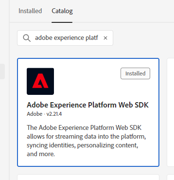
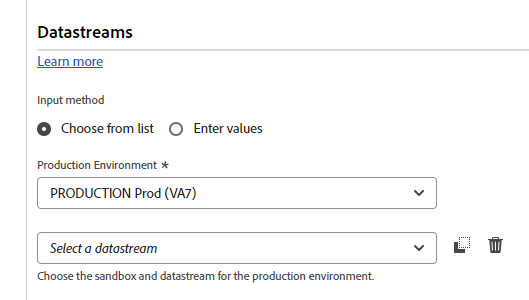
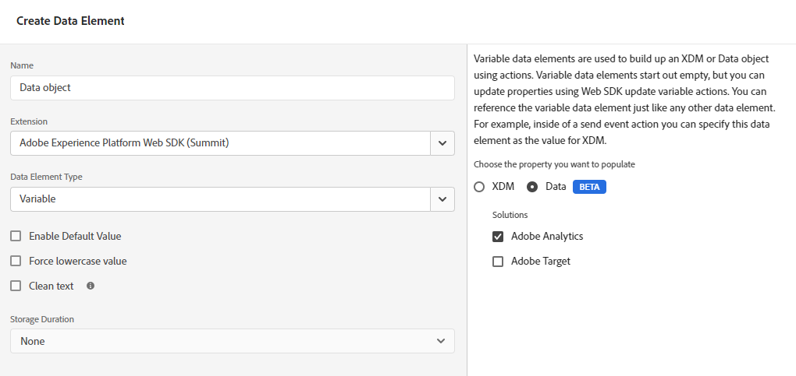
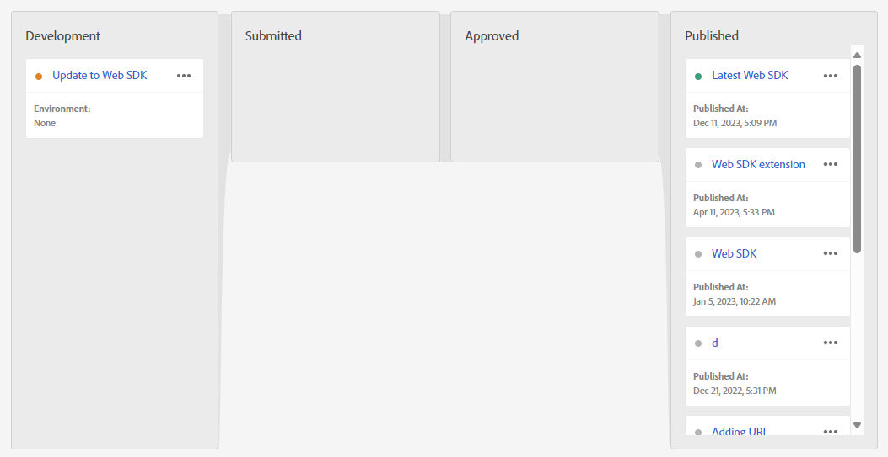

# Adobe Analytics タグ拡張機能からWeb SDK タグ拡張機能への移行

この実装パスでは、Adobe Analytics タグ拡張機能からWeb SDK タグ拡張機能に移行するための体系的な移行アプローチを行います。 その他の実装パスについては、別のページで説明しています。

* [AppMeasurementからWeb SDKへのJavaScript ライブラリ ](appmeasurement-to-web-sdk.md): タグを使用しない場合を除き、Web SDKにスムーズかつ計画的に移行するアプローチです。 代わりに、Adobe Analytics データ収集ライブラリ （`AppMeasurement.js`）を手動で削除し、Web SDK JavaScript ライブラリ （`alloy.js`）に置き換えます。
* [Web SDK タグ拡張機能](web-sdk-tag-extension.md): Adobe Experience Platform Data Collectionのタグを使用して実装を管理する新しいWeb SDK インストール。 XDM スキーマに含める一般的なAnalytics変数を含むAdobe Analytics ExperienceEvent フィールドグループが必要です。
* [Web SDK JavaScript ライブラリ ](web-sdk-javascript-library.md): Web SDK JavaScript ライブラリ （`alloy.js`）を使用した新しいWeb SDK インストール。 タグ UIを使用する代わりに、実装を自分で管理します。 XDM スキーマに含める一般的なAnalytics変数を含むAdobe Analytics ExperienceEvent フィールドグループが必要です。

## この実装パスの利点と欠点

この移行アプローチを使用すると、利点と欠点の両方があります。 各オプションを慎重に検討し、自社に最適なアプローチを選びましょう。

| メリット | デメリット |
| --- | --- |
| <ul><li>**サイトでコードの変更はありません**：実装には既にタグがインストールされているため、すべての移行の更新はタグインターフェイスで行うことができます。</li><li>**既存の実装を使用**：このアプローチでは、新たに実装する必要はありません。 新しいルールアクションは必要ですが、既存のデータ要素とルール条件を最小限の変更で再利用できます。</li><li>**スキーマは必要ありません**: Web SDKに移行するこの段階では、XDM スキーマは必要ありません。 代わりに、`data` オブジェクトを設定して、データをAdobe Analyticsに直接送信できます。 Web SDKへの移行が完了したら、組織のスキーマを作成し、データストリームマッピングを使用して該当するXDM フィールドに入力できます。 移行プロセスのこの段階でスキーマが必要な場合、Adobe Analytics XDM スキーマの使用が強制されます。 このスキーマを使用すると、組織が将来、独自のスキーマを使用することがより困難になります。</li></ul> | <ul><li>**実装の技術的負債**：このアプローチでは、既存の実装の変更された形式を使用するため、実装ロジックを追跡したり、必要に応じて変更を実行したりすることが困難になる可能性があります。 カスタムコードは、特にデバッグが難しい場合があります。</li><li>**Platform にデータを送信するにはマッピングが必要**：組織で Customer Journey Analytics を使用する準備が整ったら、Adobe Experience Platform のデータセットにデータを送信する必要があります。 このアクションでは、`data` オブジェクトのすべてのフィールドが、XDM スキーマフィールドに割り当てるデータストリームマッピングツールのエントリである必要があります。 このワークフローではマッピングを 1 回行うだけで済み、実装を変更する必要ありません。 ただし、これは、XDM オブジェクトでデータを送信する際には必要ない追加の手順です。</li></ul> |

Adobeでは、次のシナリオでこの実装パスに従うことをお勧めします。

* Adobe Analytics タグ拡張機能を使用した既存の実装があります。 AppMeasurementを使用して実装を行う場合は、[AppMeasurementからWeb SDKへの移行](appmeasurement-to-web-sdk.md)に従ってください。
* 今後はCustomer Journey Analyticsを使用する予定ですが、Analyticsの実装をゼロからWeb SDKの実装に置き換えることはお勧めしません。 Web SDKの実装をゼロから置き換えるには、最も多くの労力が必要ですが、長期にわたって実行可能な実装アーキテクチャも提供します。 クリーンなWeb SDKの導入を進める場合は、Customer Journey Analytics ユーザーガイドの「[Adobe Experience Platform Web SDKを介してデータを取り込む](https://experienceleague.adobe.com/ja/docs/analytics-platform/using/cja-data-ingestion/ingest-use-guides/edge-network/aepwebsdk)」を参照してください。

## Web SDKへの移行に必要な手順

次のステップは、取り組むべき具体的な目標を含んでいます。 各ステップをクリックすると、その方法の詳細な手順が表示されます。

+++**1. データストリームの作成と設定**

Adobe Experience Platform Data Collectionでデータストリームを作成します。 このデータストリームにデータを送信すると、データはAdobe Analyticsに転送されます。 将来的には、このデータストリームがデータをCustomer Journey Analyticsに転送します。

1. [Adobe CX Enterprise](https://experience.adobe.com)に移動し、資格情報を使用してログインします。
1. 右上のホームページまたは製品セレクターを使用して、**[!UICONTROL データ収集]**&#x200B;に移動します。
1. 左側のナビゲーションで、**[!UICONTROL データストリーム]**&#x200B;を選択します。
1. **[!UICONTROL 新しいデータストリーム]**&#x200B;を選択します。
1. 目的の名前を入力し、**[!UICONTROL 保存]**&#x200B;を選択します。
1. データストリームを作成したら、**[!UICONTROL サービスを追加]**&#x200B;を選択します。
1. サービス ドロップダウンメニューで、**[!UICONTROL Adobe Analytics]**&#x200B;を選択します。
1. 現在Analytics データを送信しているサイトと同じレポートスイート IDを入力します。 「**[!UICONTROL 保存]**」をクリックします。

 {style="border:1px solid lightslategray"}

これで、データストリームがAdobe Analyticsにデータを受け取って渡す準備が整いました。

+++

+++**2. Web SDK拡張機能をタグプロパティ**&#x200B;に追加します

このセクションでは、次のステップで行われる移行作業の大部分に対してタグを準備します。

1. Adobe Experience Platform インターフェイスの左上にあるハンバーガーアイコンをクリックし、「**[!UICONTROL タグ]**」を選択します。
1. 目的のタグプロパティを選択します。
1. タグプロパティの左側のナビゲーションで、**[!UICONTROL 拡張機能]**&#x200B;を選択します。
1. 上部の&#x200B;**[!UICONTROL カタログ]**&#x200B;を選択すると、使用可能なすべての拡張機能のリストが表示されます。
1. **[!UICONTROL Adobe Experience Platform Web SDK]**&#x200B;拡張機能を検索して選択し、右側の&#x200B;**[!UICONTROL インストール]**&#x200B;をクリックします。

    {style="border:1px solid lightslategray"}

1. 拡張機能の設定が表示されます。 「データストリーム」セクションを探し、前の手順で作成したデータストリームを選択します。

    {style="border:1px solid lightslategray"}

1. 「**[!UICONTROL 保存]**」を選択します。

タグプロパティにWeb SDKがインストールされました。

+++

+++**3. データ オブジェクト データ要素**&#x200B;を作成します

データオブジェクトデータ要素は、Web SDKがデータストリームに送信するために使用するペイロードを設定するための直感的なフレームワークを提供します。 次の手順で更新するほとんどのルールは、このデータ要素を操作します。

1. タグインターフェイスの左側のナビゲーションで、**[!UICONTROL データ要素]**&#x200B;を選択します。
1. 「**[!UICONTROL データ要素を追加]**」を選択
1. データ要素に次の設定を指定します。
   * [!UICONTROL 名前]: 「データレイヤー」や「データオブジェクト」など、必要なものをすべて選択します
   * [!UICONTROL 拡張機能]: [!UICONTROL Adobe Experience Platform Web SDK]
   * [!UICONTROL  データ要素タイプ ]: [!UICONTROL 変数]
   * チェックボックスをそのまま使用できます
1. 右側で、次の設定を選択します。
   * プロパティ ラジオ ボタン：[!UICONTROL  データ ]
   * 解決策：[!UICONTROL Adobe Analytics]
1. 「**[!UICONTROL 保存]**」を選択します。

 {style="border:1px solid lightslategray"}

タグプロパティには、各ルールの更新に必要なあらゆる情報が含まれています。

+++

+++**4. Analytics拡張機能の代わりにWeb SDK拡張機能を使用するようにルールを更新します**

この手順では、Web SDKへの移行に必要な労力の大部分を確認できます。また、導入の仕組みについても把握する必要があります。 典型的なタグルールの編集方法の例として、次に例を示します。 実装内のすべてのタグルールを更新して、Adobe Analytics拡張機能へのすべての参照をWeb SDK拡張機能に置き換えます。

1. タグインターフェイスの左側のナビゲーションで、**[!UICONTROL ルール]**&#x200B;を選択します。
1. 編集するルールを選択します。
1. アクション **[!UICONTROL Adobe Analytics - Set Variables]**&#x200B;を選択します
1. このルール内で設定されたすべてのAnalytics変数を記録します。 ドロップダウンメニューに設定された変数とカスタムコード内に設定された変数の両方を含めます。
1. [!UICONTROL  アクション設定]を次の設定に変更します。
   * [!UICONTROL 拡張機能]: [!UICONTROL Adobe Experience Platform Web SDK]
   * [!UICONTROL  アクションの種類]：変数を更新
1. 右側のドロップダウンでデータオブジェクトが選択されていることを確認します。
1. Analytics変数を、Analytics拡張機能で設定した値と同じ値に設定します。
   * タグインターフェイス内で設定された変数は、同じ値に直接変換できます。
   * カスタムコード内で設定された文字列変数は、最小限の調整で済みます。 `s` オブジェクトを使用する代わりに、`data.__adobe.analytics`を使用してください。 例えば、`s.eVar1`は`data.__adobe.analytics.eVar1`に変換されます。
   * カスタムコード内のAnalytics設定変数とメソッド呼び出しには、変更された実装ロジックが必要になる場合があります。 Web SDKを使用して同等の値を達成する方法については、それぞれの[変数](/help/implement/vars/overview.md)を参照してください。
1. Web SDK拡張機能を使用してすべてのルールロジックをレプリケートしたら、**[!UICONTROL 変更を保持]**&#x200B;を選択します。
1. Adobe Analytics拡張機能を使用して値を設定するアクション設定ごとに、これらの手順を繰り返します。 この手順には、タグインターフェイスを使用して設定された変数と、カスタムコードを使用して設定された変数の両方が含まれます。 カスタムコードブロックは、どこでも`s` オブジェクトを参照することはできません。

上記の手順は、値を設定するルールにのみ適用されます。 次の手順は、[!UICONTROL  アクション設定] [!UICONTROL 送信ビーコン ]を使用するすべてのアクションを置き換えます。

1. ビーコンを送信するルールを選択します。
1. 「**[!UICONTROL Adobe Analytics - ビーコンを送信]**」アクションを選択します。
1. 右側（[`s.t()`](../../vars/functions/t-method.md)または[`s.tl()`](../../vars/functions/tl-method.md)）の[!UICONTROL  トラッキング ] ラジオボタンの現在の値に注意してください。
1. [!UICONTROL  アクション設定]を次の設定に変更します。
   * [!UICONTROL 拡張機能]: [!UICONTROL Adobe Experience Platform Web SDK]
   * [!UICONTROL  アクションの種類]: [!UICONTROL  イベントの送信]
1. 右側で、アクション設定を次のように変更します。
   * [!UICONTROL  タイプ ]: `s.t()`の場合、**[!UICONTROL Web Web Web ページの詳細ページビュー]**&#x200B;を使用します。 `s.tl()`の場合、**[!UICONTROL Web Web Web インタラクション リンク クリック]**&#x200B;を使用します。 [`s.tl()`](../../vars/functions/tl-method.md)を使用する場合は、データオブジェクトに次のフィールドも含める必要があります。 これらのフィールドは、[!UICONTROL 変数の更新] アクション設定を実行する際の[!UICONTROL 追加プロパティ ]に一覧表示されます。
      * [リンク名](../../vars/functions/tl-method.md)
      * [リンクタイプ](../../vars/functions/tl-method.md)
      * [リンク URL](../../vars/config-vars/linkurl.md)
1. 「**[!UICONTROL 変更を保持]**」を選択します。
1. Adobe Analyticsを使用してビーコンを送信するアクション設定ごとに、これらの手順を繰り返します。

+++

+++**5. 更新されたルールを公開**

更新されたルールの公開は、タグ設定に対する他の変更と同じワークフローに従います。

1. タグインターフェイスの左側のナビゲーションで、**[!UICONTROL 公開フロー]**&#x200B;を選択します。
1. 「**[!UICONTROL ライブラリを追加]**」を選択します。
1. このタグに「Web SDKにアップグレード」などの名前を付けます。
1. 「**[!UICONTROL 変更されたすべてのリソースを追加]**」を選択します。
1. 「**[!UICONTROL 保存]**」を選択します。
1. 公開ワークフローには、ビルド中であることを示すオレンジ色のドットが表示されます。 ドットが緑色に変わると、変更内容が開発環境で使用できるようになります。
1. 開発環境の変更をテストして、すべてのルールが適切に実行され、データオブジェクトに期待される値が入力されていることを確認します。
1. 準備ができたら、ライブラリを承認用に送信し、ステージング用にビルドし、最終的に承認して実稼動用に公開します。

 {style="border:1px solid lightslategray"}

+++

+++**6. Analytics拡張機能を無効にする**

タグの実装がWeb SDKで完全に完了したら、Adobe Analytics拡張機能を無効にできます。

1. タグインターフェイスの左側のナビゲーションで、**[!UICONTROL 拡張機能]**&#x200B;を選択します。
1. [!UICONTROL Adobe Analytics]拡張機能を探して選択します。 右側の「**[!UICONTROL 無効化]**」を選択します。
1. 上記と同じ公開ワークフローに従って、[!UICONTROL Adobe Analytics]拡張機能の削除を公開します。
1. 拡張機能を実稼動環境で無効にすると、完全にアンインストールできます。 拡張機能を選択し、右側の3点メニューを選択し、**[!UICONTROL アンインストール]**&#x200B;を選択します。
1. 上記と同じ公開ワークフローに従って、これらの変更を実稼動環境に公開します。

+++

現時点では、Adobe Analyticsの実装はWeb SDK上で完了しており、今後Customer Journey Analyticsに移行するための準備は十分に整っています。
