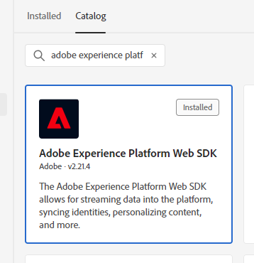

# Adobe Analyticsのタグ拡張機能から Web SDK のタグ拡張機能への移行

この実装パスには、Adobe Analytics タグ拡張機能から Web SDK タグ拡張機能に移行する系統的な移行アプローチが含まれます。 その他の実装パスについては、次の別のページで説明しています。

* [Web SDK JavaScript ライブラリのAppMeasurement](appmeasurement-to-web-sdk.md)：タグを使用しない点を除き、Web SDK に移行するためのスムーズで系統立ったアプローチ。 代わりに、手動でAdobe Analytics データ収集ライブラリ（`AppMeasurement.js`）を選択し、Web SDK JavaScript ライブラリ（`alloy.js`）に設定します。
* [Web SDK タグ拡張機能](web-sdk-tag-extension.md):Adobe Experience Platform Data Collection のタグを使用して実装を管理する、新しい Web SDK インストール。 これには、XDM スキーマに含める一般的な Analytics 変数を含むAdobe Analytics ExperienceEvent フィールドグループが必要です。
* [Web SDK JavaScript ライブラリ](web-sdk-javascript-library.md):Web SDK JavaScript ライブラリを使用した新規 Web SDK インストール（`alloy.js`）に設定します。 タグ UI を使用する代わりに、自分で実装を管理します。 これには、XDM スキーマに含める一般的な Analytics 変数を含むAdobe Analytics ExperienceEvent フィールドグループが必要です。

## この実装パスのメリットとデメリット

この移行アプローチを使用すると、メリットとデメリットの両方が生じます。 各オプションを慎重に検討し、組織に最適なアプローチを決定します。

| メリット | デメリット |
| --- | --- |
| <ul><li>**サイトにコードの変更はありません**：実装には既にタグがインストールされているので、移行に関するすべての更新をタグインターフェイスで行えます。</li><li>**既存の実装を使用**：このアプローチでは、まったく新しい実装は必要ありません。 新しいルールのアクションが必要になる場合でも、最小限の変更で、既存のデータ要素とルール条件を再利用できます。</li><li>**スキーマは必要ありません**:Web SDK への移行のこの段階では、XDM スキーマは必要ありません。 代わりに、にデータを入力できます `data` オブジェクト。Adobe Analyticsにデータを直接送信します。 Web SDK への移行が完了したら、組織のスキーマを作成し、データストリームマッピングを使用して適用可能な XDM フィールドを入力できます。 移行プロセスのこの段階でスキーマが必要だった場合、組織はAdobe Analytics XDM スキーマの使用を強制されます。 このスキーマを使用すると、組織が今後独自のスキーマを使用するのが難しくなります。</li></ul> | <ul><li>**技術的債務の履行**：このアプローチは既存の実装の変更済み形式を使用するので、実装ロジックを追跡し、必要に応じて変更を実行するのが難しい場合があります。 カスタムコードは特にデバッグが困難な場合があります。</li><li>**Platform にデータを送信するには、マッピングが必要です**:Customer Journey Analyticsを使用する準備が整ったら、Adobe Experience Platformのデータセットにデータを送信する必要があります。 このアクションでは、のすべてのフィールドが `data` オブジェクトは、XDM スキーマフィールドに割り当てるデータストリームマッピングツールのエントリです。 マッピングは、このワークフローに対して 1 回だけ行う必要があります。実装の変更は必要ありません。 ただし、XDM オブジェクトでデータを送信する場合に必要ない追加の手順です。</li></ul> |

Adobeでは、次のシナリオでこの実装パスを使用することをお勧めします。

* 既存の実装がある場合は、Adobe Analytics タグ拡張機能を使用します。 AppMeasurementを使用した実装がある場合は、次の手順に従います [AppMeasurementから Web SDK への移行](appmeasurement-to-web-sdk.md) その代わり。
* 今後Customer Journey Analyticsを使用するが、Analytics 実装を Web SDK 実装に最初から置き換える必要がない。 Web SDK で実装をゼロから置き換えることは最も努力が必要ですが、最も実行可能な長期的な実装アーキテクチャも提供します。 組織がクリーンな Web SDK 実装の作業を進んで行う場合は、を参照してください。 [Adobe Experience Platform Web SDK を使用したデータの取り込み](https://experienceleague.adobe.com/en/docs/analytics-platform/using/cja-data-ingestion/ingest-use-guides/edge-network/aepwebsdk) （Customer Journey Analyticsユーザーガイド）を参照してください。

## Web SDK への移行に必要な手順

以下の手順には、取り組むべき具体的な目標が含まれています。 各手順をクリックすると、実行方法に関する詳細な手順が表示されます。

+++**1.データストリームの作成と設定**

Adobe Experience Platform Data Collection にデータストリームを作成します。 このデータストリームにデータを送信すると、データがAdobe Analyticsに転送されます。 今後、この同じデータストリームがCustomer Journey Analyticsにデータを転送します。

1. に移動します。 [experience.adobe.com](https://experience.adobe.com) 認証情報を使用してログインします。
1. 右上のホームページまたは製品セレクターを使用して、に移動します **[!UICONTROL データ収集]**.
1. 左側のナビゲーションで、を選択します。 **[!UICONTROL データストリーム]**.
1. **[!UICONTROL 新しいデータストリーム]**&#x200B;を選択します。
1. 目的の名前を入力し、を選択します **[!UICONTROL 保存]**.
1. データストリームを作成したら、次を選択します。 **[!UICONTROL サービスを追加]**.
1. サービスのドロップダウンメニューで、を選択します **[!UICONTROL Adobe Analytics]**.
1. 分析データを現在送信しているサイトと同じレポートスイート ID を入力します。 「**[!UICONTROL 保存]**」をクリックします。

 {style="border:1px solid gray"}

これで、データストリームがデータを受け取り、Adobe Analyticsに渡す準備が整いました。

+++

+++**2. タグプロパティに Web SDK 拡張機能を追加します**

この節では、次の手順で行われる移行作業の大部分のためにタグを準備します。

1. Adobe Experience Platform インターフェイスの左上にあるハンバーガーアイコンをクリックし、選択します。 **[!UICONTROL タグ]**.
1. 目的のタグプロパティを選択します。
1. タグプロパティの左側のナビゲーションで、 **[!UICONTROL 拡張機能]**.
1. を選択 **[!UICONTROL カタログ]** 上部の近くに、使用可能なすべての拡張機能のリストが表示されます。
1. を検索して選択します。 **[!UICONTROL Adobe Experience Platform Web SDK]** 拡張機能をクリックしてから、 **[!UICONTROL インストール]** 右です。

    {style="border:1px solid gray"}

1. 拡張機能の設定が表示されます。 「データストリーム」セクションを見つけ、前の手順で作成したデータストリームを選択します。

    {style="border:1px solid gray"}

1. 「**[!UICONTROL 保存]**」を選択します。

これで、タグプロパティに Web SDK がインストールされました。

+++

+++**3.データオブジェクトデータ要素の作成**

データオブジェクトデータ要素は、Web SDK がデータストリームに送信するために使用するペイロードを設定するための直感的なフレームワークを提供します。 次の手順で更新するほとんどのルールは、このデータ要素とやり取りします。

1. タグインターフェイスの左側のナビゲーションで、 **[!UICONTROL データ要素]**.
1. を選択 **[!UICONTROL データ要素を追加]**
1. データ要素に次の設定を指定します。
   * [!UICONTROL 名前]:「データレイヤー」や「データオブジェクト」など、必要なもの
   * [!UICONTROL 拡張機能]: [!UICONTROL Adobe Experience Platform Web SDK]
   * [!UICONTROL 変数]: [!UICONTROL 変数]
   * チェックボックスは現状のままでもかまいません
1. 右側で、次の設定を選択します。
   * プロパティラジオボタン： [!UICONTROL データ]
   * 解決策： [!UICONTROL Adobe Analytics]
1. 「**[!UICONTROL 保存]**」を選択します。

 {style="border:1px solid gray"}

これで、タグプロパティに、各ルールを更新するために必要なすべてが揃いました。

+++

+++**4. Analytics 拡張機能ではなく Web SDK 拡張機能を使用するようにルールを更新します**

この手順には、Web SDK への移行に必要な作業の大部分が含まれており、実装の仕組みに関する知識が必要です。 一般的なタグルールの編集方法の例を以下に示します。 Adobe Analytics拡張機能へのすべての参照を Web SDK 拡張機能に置き換えるために、実装内のすべてのタグルールを更新します。

1. タグインターフェイスの左側のナビゲーションで、 **[!UICONTROL ルール]**.
1. 編集するルールを選択します。
1. アクションを選択 **[!UICONTROL Adobe Analytics – 変数を設定]**
1. このルール内で設定されたすべての Analytics 変数に注意してください。 ドロップダウンメニューで設定された変数と、カスタムコード内で設定された変数の両方に注意してください。
1. 変更： [!UICONTROL アクションの設定] を次の設定に変更します。
   * [!UICONTROL 拡張機能]: [!UICONTROL Adobe Experience Platform Web SDK]
   * [!UICONTROL アクションタイプ]：変数を更新
1. データオブジェクトが右側のドロップダウンで選択されていることを確認します。
1. Analytics 変数を、Analytics 拡張機能で設定したのと同じそれぞれの値に設定します。
   * タグインターフェイス内で設定された変数は、同じ値に直接変換できます。
   * カスタムコード内で設定される文字列変数では、最小限の調整が必要です。 を使用する代わりに `s` オブジェクト、使用する `data.__adobe.analytics` その代わり。 例： `s.eVar1` はに変換されます `data.__adobe.analytics.eVar1`.
   * カスタムコードの Analytics 設定変数とメソッド呼び出しには、変更された実装ロジックが必要な場合があります。 それぞれ参照してください [変数](/help/implement/vars/overview.md) web SDK を使用して同等の機能を実現する方法を決定します。
1. Web SDK 拡張機能を使用してすべてのルールロジックをレプリケートしたら、次を選択します。 **[!UICONTROL 変更を保持]**.
1. Adobe Analytics拡張機能を使用して値を設定するアクション設定ごとに、これらの手順を繰り返します。 この手順には、タグインターフェイスを使用して設定された変数と、カスタムコードを使用して設定された変数の両方が含まれます。 カスタムコードブロックでは、 `s` オブジェクトをどこにでも配置します。

上記の手順は、値を設定するルールにのみ適用されます。 以下の手順は、 [!UICONTROL アクションの設定] [!UICONTROL ビーコンを送信].

1. ビーコンを送信するルールを選択します。
1. アクションを選択 **[!UICONTROL Adobe Analytics - ビーコンを送信]**.
1. の現在の値に注意してください [!UICONTROL トラッキング] 右側のラジオボタン（[`s.t()`](../../vars/functions/t-method.md) または [`s.tl()`](../../vars/functions/tl-method.md)）に設定します。
1. 変更： [!UICONTROL アクションの設定] を次の設定に変更します。
   * [!UICONTROL 拡張機能]: [!UICONTROL Adobe Experience Platform Web SDK]
   * [!UICONTROL アクションタイプ]: [!UICONTROL イベントを送信]
1. 右側で、アクション設定を次のように変更します。
   * [!UICONTROL タイプ]：の場合 `s.t()`、を使用 **[!UICONTROL Web Webpagedetails ページビュー]**. の場合 `s.tl()`、を使用 **[!UICONTROL Web Webinteraction リンククリック数]**. を使用する場合 [`s.tl()`](../../vars/functions/tl-method.md)また、データオブジェクトに次のフィールドを含める必要もあります。 これらのフィールドは、の下にリストされます。 [!UICONTROL 追加のプロパティ] を実行する場合 [!UICONTROL 変数を更新] アクションの設定：
      * [リンク名](../../vars/functions/tl-method.md)
      * [リンクタイプ](../../vars/functions/tl-method.md)
      * [リンク URL](../../vars/config-vars/linkurl.md)
1. 「**[!UICONTROL 変更を保持]**」を選択します。
1. Adobe Analyticsを使用してビーコンを送信するすべてのアクション設定について、これらの手順を繰り返します。

+++

+++**5. 更新されたルールの公開**

更新されたルールの公開は、タグ設定に対する他の変更と同じワークフローに従います。

1. タグインターフェイスの左側のナビゲーションで、 **[!UICONTROL 公開フロー]**.
1. を選択 **[!UICONTROL ライブラリを追加]**.
1. このタグコミットに「Web SDK にアップグレード」などの名前を付けます。
1. を選択 **[!UICONTROL 変更されたリソースをすべて追加]**.
1. 「**[!UICONTROL 保存]**」を選択します。
1. 公開ワークフローには、オレンジ色の点が表示され、ビルド中であることを示します。 ドットが緑色に変わると、変更を開発環境で使用できるようになります。
1. 開発環境で変更をテストし、すべてのルールが適切に実行され、データオブジェクトに想定される値が入力されていることを確認します。
1. 準備が整ったら、ライブラリを承認用に送信し、ステージング環境にビルドしてから、最終的に承認して実稼動環境に公開します。

 {style="border:1px solid gray"}

+++

+++**6.Analytics 拡張機能の無効化**

タグの実装が Web SDK に完全に含まれたら、Adobe Analytics拡張機能を無効にできます。

1. タグインターフェイスの左側のナビゲーションで、 **[!UICONTROL 拡張機能]**.
1. を見つけて選択します。 [!UICONTROL Adobe Analytics] 拡張機能。 右側で、を選択します **[!UICONTROL 無効]**.
1. 上記と同じ公開ワークフローに従って、の削除を公開します [!UICONTROL Adobe Analytics] 拡張機能。
1. 実稼動環境で拡張機能を無効にすると、その拡張機能を完全にアンインストールできます。 拡張機能を選択し、右側の「。..」メニューを選択してから、を選択します **[!UICONTROL Uninstall]**.
1. 上記と同じ公開ワークフローに従って、変更を実稼動環境に公開します。

+++

この時点で、Analytics 実装は Web SDK に完全に依存しており、将来Customer Journey Analyticsに移行するための準備が十分にあります。
