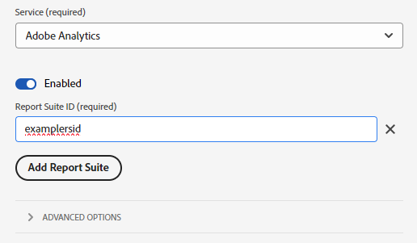

# AppMeasurementからWeb SDKへの移行

この実装パスには、AppMeasurementの実装からWeb SDK JavaScript ライブラリの実装に移行するための体系的な移行アプローチが含まれます。 その他の実装パスについては、別のページで説明しています。

* [Analytics拡張機能からWeb SDK拡張機能](analytics-extension-to-web-sdk.md): Adobe Analytics タグ拡張機能からWeb SDK タグ拡張機能に移動するには、スムーズで体系的なアプローチを採用してください。 このアプローチにより、Customer Journey AnalyticsなどのAdobe Experience Platformサービスを利用する準備が整うまでXDMを使用する必要がなくなります。 Adobeにデータを送信するには、`xdm` オブジェクトの代わりに`data` オブジェクトを使用します。
* [Web SDK JavaScript ライブラリ ](web-sdk-javascript-library.md): Web SDK JavaScript ライブラリ （`alloy.js`）を使用した新しいWeb SDK インストール。 タグ UIを使用する代わりに、実装を自分で管理します。 XDM スキーマに含める一般的なAnalytics変数を含むAdobe Analytics ExperienceEvent フィールドグループが必要です。
* [Web SDK タグ拡張機能](web-sdk-tag-extension.md): Adobe Experience Platform Data Collectionのタグを使用して実装を管理する新しいWeb SDK インストール。 XDM スキーマに含める一般的なAnalytics変数を含むAdobe Analytics ExperienceEvent フィールドグループが必要です。

## この実装パスの利点と欠点

この移行アプローチを使用すると、利点と欠点の両方があります。 各オプションを慎重に検討し、自社に最適なアプローチを選びましょう。

| メリット | デメリット |
| --- | --- |
| <ul><li>**既存の実装を使用**：このアプローチには実装の変更が必要ですが、完全に新しい実装をゼロから行う必要はありません。 実装ロジックの変更を最小限に抑えながら、既存のデータレイヤーとコードを使用できます。</li><li>**スキーマは必要ありません**: Web SDKに移行するこの段階では、XDM スキーマは必要ありません。 代わりに、`data` オブジェクトを設定して、データをAdobe Analyticsに直接送信できます。 Web SDKへの移行が完了したら、組織のスキーマを作成し、データストリームマッピングを使用して該当するXDM フィールドに入力できます。 移行プロセスのこの段階でスキーマが必要な場合、Adobe Analytics XDM スキーマの使用が強制されます。 このスキーマを使用すると、組織が将来、独自のスキーマを使用することがより困難になります。</li></ul> | <ul><li>**実装の変更には開発者の操作が必要です**: Web SDKの実装を変更する場合は、開発チームと協力してサイトのコードを編集する必要があります。 Web SDK タグ拡張機能](analytics-extension-to-web-sdk.md)に[移行するアプローチは、この欠点を回避します。</li><li>**実装の技術的負債**：このアプローチでは、既存の実装の変更された形式を使用するため、実装ロジックを追跡したり、必要に応じて将来の変更を実行したりすることが困難になる可能性があります。</li><li>**Platform にデータを送信するにはマッピングが必要**：組織で Customer Journey Analytics を使用する準備が整ったら、Adobe Experience Platform のデータセットにデータを送信する必要があります。 このアクションでは、`data` オブジェクトのすべてのフィールドが、XDM スキーマフィールドに割り当てるデータストリームマッピングツールのエントリである必要があります。 このワークフローではマッピングを 1 回行うだけで済み、実装を変更する必要ありません。 ただし、これは、XDM オブジェクトでデータを送信する際には必要ない追加の手順です。</li></ul> |

Adobeでは、次のシナリオでこの実装パスに従うことをお勧めします。

* Adobe Analytics AppMeasurement JavaScript ライブラリを使用した既存の実装があります。 Adobe Analytics タグ拡張機能を使用して実装を行う場合は、代わりに[Adobe Analytics タグ拡張機能からWeb SDK タグ拡張機能](analytics-extension-to-web-sdk.md)に移行します。
* 今後はCustomer Journey Analyticsを使用する予定ですが、Analyticsの実装をゼロからWeb SDKの実装に置き換えることはお勧めしません。 Web SDKの実装をゼロから置き換えるには、最も多くの労力が必要ですが、長期にわたって実行可能な実装アーキテクチャも提供します。 クリーンなWeb SDKの導入を進める場合は、Customer Journey Analytics ユーザーガイドの「[Adobe Experience Platform Web SDKを介してデータを取り込む](https://experienceleague.adobe.com/ja/docs/analytics-platform/using/cja-data-ingestion/ingest-use-guides/edge-network/aepwebsdk)」を参照してください。

## Web SDKへの移行に必要な手順

次のステップは、取り組むべき具体的な目標を含んでいます。 各ステップをクリックすると、その方法の詳細な手順が表示されます。

+++**1. データストリームの作成と設定**

Adobe Experience Platform Data Collectionでデータストリームを作成します。 このデータストリームにデータを送信すると、データはAdobe Analyticsに転送されます。 将来的には、このデータストリームがデータをCustomer Journey Analyticsに転送します。

1. [Adobe CX Enterprise](https://experience.adobe.com)に移動し、資格情報を使用してログインします。
1. 右上のホームページまたは製品セレクターを使用して、**[!UICONTROL データ収集]**&#x200B;に移動します。
1. 左側のナビゲーションで、**[!UICONTROL データストリーム]**&#x200B;を選択します。
1. **[!UICONTROL 新しいデータストリーム]**&#x200B;を選択します。
1. 目的の名前を入力し、**[!UICONTROL 保存]**&#x200B;を選択します。
1. データストリームを作成したら、**[!UICONTROL サービスを追加]**&#x200B;を選択します。
1. サービス ドロップダウンメニューで、**[!UICONTROL Adobe Analytics]**&#x200B;を選択します。
1. 現在Analytics データを送信しているサイトと同じレポートスイート IDを入力します。 「**[!UICONTROL 保存]**」をクリックします。

 {style="border:1px solid lightslategray"}

これで、データストリームがAdobe Analyticsにデータを受け取って渡す準備が整いました。 コードでWeb SDKを設定する場合は、このIDが必要なので、データストリーム IDに注意してください。

+++

+++**2. Web SDK JavaScript ライブラリのインストール**

メソッド呼び出しを使用できるように、最新バージョンの`alloy.js`を参照してください。 使用する詳細とコードブロックについては、[JavaScript ライブラリを使用したWeb SDKのインストール ](https://experienceleague.adobe.com/ja/docs/experience-platform/web-sdk/install/library)を参照してください。

+++

+++**3. Web SDK**&#x200B;の設定

Web SDK [`configure`](https://experienceleague.adobe.com/en/docs/experience-platform/web-sdk/commands/configure/overview) コマンドを使用して、前の手順で作成したデータストリームを指すように実装を設定します。 `configure` コマンドは、すべてのページで設定する必要があります。これにより、ライブラリのインストールコードと一緒に含めることができます。

Web SDK `configure` コマンド内で[`datastreamId`](https://experienceleague.adobe.com/en/docs/experience-platform/web-sdk/commands/configure/datastreamid)および[`orgId`](https://experienceleague.adobe.com/en/docs/experience-platform/web-sdk/commands/configure/orgid) プロパティを使用します。

* `datastreamId`を、前の手順で取得したデータストリーム IDに設定します。
* 組織のIMS組織に`orgId`を設定します。

```js
alloy("configure", {
    datastreamId: "ebebf826-a01f-4458-8cec-ef61de241c93",
    orgId: "ADB3LETTERSANDNUMBERS@AdobeOrg"
});
```

組織の実装要件に応じて、[`configure`](https://experienceleague.adobe.com/en/docs/experience-platform/web-sdk/commands/configure/overview) コマンドで他のプロパティをオプションで設定できます。

+++

+++**4. JSON ペイロードを使用するようにコードロジックを更新します**

Analyticsの実装を変更して、`AppMeasurement.js`または`s` オブジェクトに依存しないようにします。 代わりに、変数を正しい形式のJavaScript オブジェクトに設定し、Adobeに送信するとJSON オブジェクトに変換します。 サイトに[ データレイヤー](../../prepare/data-layer.md)を設定すると、同じ値を引き続き参照できるため、値を設定する際に非常に役立ちます。

Adobe Analyticsにデータを送信するには、Web SDK ペイロードで、このオブジェクト内で設定されているすべての分析変数で`data.__adobe.analytics`を使用する必要があります。 このオブジェクト内の変数は、AppMeasurement変数と同じ名前と形式を共有します。 例えば、`products`変数を設定する場合は、XDMと同様に個々のオブジェクトに分割しないでください。 代わりに、`s.products`変数を設定する場合は、文字列として正確に含めます。

```json
{
  "data": {
    "__adobe": {
      "analytics": {
        "products": "Shoes,Men's sneakers,1,49.99"
      }
    }
  }
}
```

最終的には、このペイロードにはすべての必要な値が含まれ、実装内の`s` オブジェクトへのすべての参照が削除されます。 このペイロードオブジェクトを設定するには、JavaScriptの任意のリソース（個々の値を設定するためのドット表記法を含む）を使用できます。

```js
// Define the payload and set objects within it
var dataObj = {data: {__adobe: {analytics: {}}}};
dataObj.data.__adobe.analytics.pageName = window.document.title;
dataObj.data.__adobe.analytics.eVar1 = "Example value";

// Alternatively, set values in an object and use a spread operator to achieve identical results
var a = new Object;
a.pageName = window.document.title;
a.eVar1 = "Example value";
var dataObj = {data:{__adobe:{analytics:{...a}}}};
```

+++

+++**5. Web SDK**&#x200B;を使用するためのメソッド呼び出しの更新

[`s.t()`](../../vars/functions/t-method.md)と[`s.tl()`](../../vars/functions/tl-method.md)を呼び出すすべてのインスタンスを更新し、[`sendEvent`](https://experienceleague.adobe.com/en/docs/experience-platform/web-sdk/commands/sendevent/overview) コマンドに置き換えます。 考慮すべきシナリオは3つあります。

* **ページビュートラッキング**: ページビュートラッキング呼び出しをWeb SDK `sendEvent` コマンドに置き換えます。

  ```js
  // If your current implementation has this line of code:
  s.t();
  
  // Replace it with this line of code. The dataObj object contains the variables to send.
  alloy("sendEvent", dataObj);
  ```

* **自動リンクトラッキング**: [`clickCollectionEnabled`](https://experienceleague.adobe.com/ja/docs/experience-platform/web-sdk/commands/configure/clickcollectionenabled)設定プロパティはデフォルトで有効になっています。 Adobe Analyticsにデータを送信するための正しいリンクトラッキング変数が自動的に設定されます。 自動リンクトラッキングを無効にする場合は、[`configure`](https://experienceleague.adobe.com/en/docs/experience-platform/web-sdk/commands/configure/overview) コマンド内でこのプロパティを`false`に設定します。

* **手動リンクトラッキング**: Web SDKには、ページビュー呼び出しと非ページビュー呼び出しの間に個別のコマンドがありません。 ペイロードオブジェクト内でその区別を提供します。

  ```js
  // If your current implementation has this line of code:
  s.tl(true,"o","Example custom link");
  
  // Replace it with these lines of code. Add the required fields to the dataObj object.
  dataObj.data.__adobe.analytics.linkName = "Example custom link";
  dataObj.data.__adobe.analytics.linkType = "o";
  dataObj.data.__adobe.analytics.linkURL = "https://example.com";
  alloy("sendEvent", dataObj);
  ```

+++

+++**6. 変更を検証して公開**

AppMeasurementと`s` オブジェクトへの参照をすべて削除したら、変更内容を開発環境に公開して、新しい実装が機能することを検証します。 すべてが正しく機能することを検証したら、更新を実稼動環境に公開できます。

正しく移行された場合、`AppMeasurement.js`はサイト上で不要になり、このスクリプトへのすべての参照を削除できます。

+++

現時点では、Adobe Analyticsの実装はWeb SDK上で完了しており、今後Customer Journey Analyticsに移行するための準備は十分に整っています。
