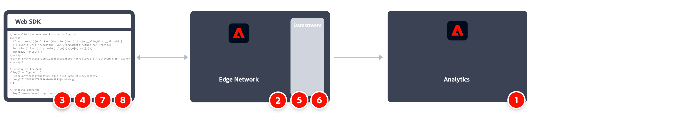

# Web SDK JavaScript ライブラリを使用してAdobe Analyticsにデータを送信する

この実装パスには、Web SDK JavaScript ライブラリを使用した新しいWeb SDKのインストールが含まれます。 その他の実装パスについては、別のページで説明しています。

* [Web SDK タグ拡張機能](web-sdk-tag-extension.md): Web SDK タグ拡張機能を使用した新鮮なWeb SDK インストール。 Web SDK JavaScript ライブラリアプローチ（このページ）と同様ですが、Adobe Experience Platform Data Collectionのタグを使用して実装を管理する場合を除きます。 XDM スキーマに含める一般的なAnalytics変数を含むAdobe Analytics ExperienceEvent フィールドグループが必要です。
* [Analytics拡張機能からWeb SDK拡張機能](analytics-extension-to-web-sdk.md): Adobe Analytics タグ拡張機能からWeb SDK タグ拡張機能に移動するには、スムーズで体系的なアプローチを採用してください。 このアプローチにより、Customer Journey AnalyticsなどのAdobe Experience Platformサービスを利用する準備が整うまでXDMを使用する必要がなくなります。 Adobeにデータを送信するには、`xdm` オブジェクトの代わりに`data` オブジェクトを使用します。
* [AppMeasurementからWeb SDKへのJavaScript ライブラリ &#x200B;](appmeasurement-to-web-sdk.md): タグを使用しない場合を除き、Web SDKにスムーズかつ計画的に移行するアプローチです。 代わりに、Adobe Analytics データ収集ライブラリ （`AppMeasurement.js`）を手動で削除し、Web SDK JavaScript ライブラリ （`alloy.js`）に置き換えることができます。

## この実装パスの利点と欠点

Web SDK JavaScript ライブラリを使用してデータをAdobe Analyticsに送信する場合は、長所と短所の両方があります。 各オプションを慎重に検討し、自社に最適なアプローチを選びましょう。

| メリット | デメリット |
| --- | --- |
| <ul><li>**直接アプローチ**：この実装パスは、既存のAdobe Analytics実装を移動するアプローチよりも簡単です。 現在のAdobe Analyticsの実装を心配する必要がない場合は、該当するWeb SDK XDM フィールドを入力します。</li><li>**定義済みのスキーマ**：自社に独自のスキーマが必要ない場合は、Adobe Analytics向けのスキーマを使用できます。 このコンセプトは、Customer Journey Analyticsに向かって進む場合でも適用されます。propとeVarのコンセプトはCustomer Journey Analyticsには適用されませんが、propとeVarをシンプルなカスタムディメンションとして引き続き使用できます。</li></ul> | <ul><li>**実装の変更には開発者の操作が必要です**: Web SDKの実装を変更する場合は、開発チームと協力してサイトのコードを編集する必要があります。 [Web SDK タグ拡張機能](web-sdk-tag-extension.md)を使用するアプローチは、この欠点を回避します。</li><li>**特定のスキーマを使用してロックイン**：組織がCustomer Journey Analyticsに移行する場合は、Adobe Analytics スキーマを引き続き使用するか、独自の組織のスキーマ（別のデータセット）に移行するかを選択する必要があります。 Customer Journey Analyticsに移行する際に、Adobe Analytics スキーマと別のデータセットへの移行の両方を避けたい場合は、Adobeで次の2つの方法のいずれかを推奨します。</li><ul><li>`data` オブジェクトを使用：`data` オブジェクトを使用すると、XDM スキーマに準拠せずにAdobe Analyticsにデータを送信できます。 組織のスキーマを作成したら、データストリームマッピングを使用して`data` オブジェクトフィールドをXDMにマッピングできます。 Web SDK拡張機能[Analytics拡張機能](analytics-extension-to-web-sdk.md)と[AppMeasurement web SDK JavaScript ライブラリ &#x200B;](appmeasurement-to-web-sdk.md)の両方がこの`data` オブジェクトを使用します。</li><li>Adobe Analyticsを完全にスキップする：Web SDKを実装している場合は、そのデータをAdobe Experience Platformのデータセットに送信してCustomer Journey Analyticsで使用できます。 任意のスキーマを使用できます。Adobe Analyticsはこのワークフローにまったく関与していないため、Adobe Analytics ExperienceEvent フィールドグループは必要ありません。 この手法では、技術的負債は最小限に抑えられますが、Adobe Analyticsは全体像を把握できなくなります。</li></ul></ul> |

>[!IMPORTANT]
>
>この実装方法では、Adobe Analytics用に設定されたスキーマを使用する必要があります。 組織が今後Customer Journey Analyticsで独自のスキーマを使用する予定の場合、Adobe Analytics スキーマを使用すると、データ管理者やアーキテクトに混乱が生じる可能性があります。 この障害を軽減するには、いくつかのオプションがあります。
>
>* CJAのAdobe Analytics スキーマを使用できます。 CJAにはpropやeVarの概念はなく、他のスキーマフィールドとして扱われます。 また、CJAでAdobe Analytics スキーマを使用すると、Adobe Journey OptimizerやReal-Time Customer Data Platformなどの他のプラットフォームサービスの使用がより困難になる可能性があります。
>* 移行ワークフローと同様に、データオブジェクトを使用できます。 データオブジェクトを使用するには、各データオブジェクトフィールドをXDM スキーマフィールドにマッピングする必要があります。
>* Adobe Analyticsの実装を完全にスキップし、独自のスキーマを使用してAdobe Experience Platformにデータを送信できます。 このアプローチは、理想的な長期的なアプローチであり、Customer Journey Analyticsの利用を開始することができます。

## Web SDK JavaScript ライブラリを実装するために必要な手順

実装タスクの大まかな概要：

<table style="width:100%">

<tr>
<th style="width:5%"></th><th style="width:60%"><b>タスク</b></th><th style="width:35%"><b>詳細情報</b></th>
</tr>

<tr>
<td>1</td>
<td><b>レポートスイートを定義</b>したことを確認します。</td>
<td><a href="/help/admin/tools/manage-rs/report-suites-admin.md">レポートスイートマネージャー</a></td>
</tr>

<tr>
<td>2</td>
<td><b> スキーマの設定</b>。 Adobe Experience Platform を活用するアプリケーション間で使用するデータ収集を標準化するために、アドビはオープンで公的に文書化された標準であるエクスペリエンスデータモデル（XDM）を作成しました。</td>
<td><a href="https://experienceleague.adobe.com/docs/experience-platform/xdm/ui/overview.html?lang=ja">スキーマ UIの概要</a></td>
</tr>

<tr>
<td>3</td>
<td><b>データレイヤーを作成</b>して、web サイト上のデータのトラッキングを管理します。</td>
<td><a href="../../prepare/data-layer.md">データレイヤーの作成</a></td>
</tr>

<tr>
<td> 4</td>
<td><b>事前ビルドスタンドアロンバージョンをインストールします</b>。 CDN のライブラリ（<code>alloy.js</code>）をページで直接参照するか、ダウンロードして独自のインフラストラクチャにホストすることができます。 または、NPM パッケージを使用することもできます。</td>
<td><a href="https://experienceleague.adobe.com/docs/experience-platform/web-sdk/install/library.html?lang=ja">事前ビルドスタンドアロンバージョンのインストール</a>および<a href="https://experienceleague.adobe.com/docs/experience-platform/web-sdk/install/npm.html?lang=ja">NPM パッケージの使用</a></td>
</tr>

<tr>
<td>5</td>
<td><b>データストリームを設定します</b>。 データストリームは、Adobe Experience Platform Web SDK を実装する際のサーバーサイド設定を表します。</td>
<td><a href="https://experienceleague.adobe.com/docs/experience-platform/edge/datastreams/configure.html?lang=ja">データストリームの設定<a></td> 
</tr>

<td>6</td>
<td>データストリームに <b>Adobe Analytics サービスを追加します</b>。 このサービスは、Adobe Analyticsにデータを送信するかどうか、どのように送信するか、どのレポートスイートに送信するかを制御します。</td>
<td><a href="https://experienceleague.adobe.com/docs/experience-platform/edge/datastreams/configure.html?lang=ja#analytics">データストリームへの Adobe Analytics サービスの追加</a></td>
</tr>

<tr>
<td>7</td>
<td><b>Web SDK を設定</b>します。 手順4でインストールしたライブラリが、データストリーム ID （旧称エッジ設定ID （<code>datastreamId</code>）、組織ID （<code>orgId</code>）、およびその他の使用可能なオプションで正しく設定されていることを確認します。 変数の適切なマッピングを確保する： </td>
<td><a href="https://experienceleague.adobe.com/docs/experience-platform/web-sdk/commands/configure/overview.html?lang=ja">Web SDKの設定</a> <a href="../xdm-var-mapping.md">XDM オブジェクト変数マッピング </a></td>
</tr>

<tr>
<td>8</td>
<td><b>コマンドを実行</b>したり、<b>イベントを追跡</b>したりします。 Web ページにベースコードが実装されたら、SDK を使用してコマンドの実行とイベントの追跡を開始できます。
</td>
<td><a href="https://experienceleague.adobe.com/docs/experience-platform/web-sdk/commands/sendevent/overview.html?lang=ja">イベントを送信</a></td>
</tr>

<tr>
<td>9</td><td>実装を実稼動環境にプッシュする前に、<b>実装を拡張して検証します</b>。</td><td></td> 
</tr>
</table>
