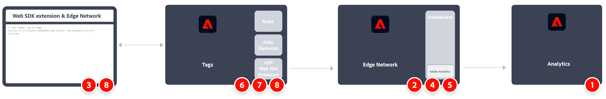

# Web SDK タグ拡張機能を使用してAdobe Analyticsにデータを送信する

この実装パスには、Adobe Experience Platform Data Collectionのタグを使用した新しいWeb SDK インストールが含まれます。 その他の実装パスについては、別のページで説明しています。

* [Web SDK JavaScript ライブラリ &#x200B;](web-sdk-javascript-library.md): Web SDK JavaScript ライブラリ （`alloy.js`）を使用した新しいWeb SDK インストール。 Web SDKのタグ拡張機能アプローチ（このページ）と同様ですが、タグ UIを使用する代わりに、実装を自分で管理する必要があります。 XDM スキーマに含める一般的なAnalytics変数を含むAdobe Analytics ExperienceEvent フィールドグループが必要です。
* [Analytics拡張機能からWeb SDK拡張機能](analytics-extension-to-web-sdk.md): Adobe Analytics タグ拡張機能からWeb SDK タグ拡張機能に移動するには、スムーズで体系的なアプローチを採用してください。 このアプローチにより、Customer Journey AnalyticsなどのAdobe Experience Platformサービスを利用する準備が整うまでXDMを使用する必要がなくなります。 Adobeにデータを送信するには、`xdm` オブジェクトの代わりに`data` オブジェクトを使用します。
* [AppMeasurementからWeb SDKへのJavaScript ライブラリ &#x200B;](appmeasurement-to-web-sdk.md): タグを使用しない場合を除き、Web SDKにスムーズかつ計画的に移行するアプローチです。 代わりに、Adobe Analytics データ収集ライブラリ （`AppMeasurement.js`）を手動で削除し、Web SDK JavaScript ライブラリ （`alloy.js`）に置き換えます。

## この実装パスの利点と欠点

Web SDK拡張機能を使用してAdobe Analyticsにデータを送信する方法には、長所と短所の両方があります。 各オプションを慎重に検討し、自社に最適なアプローチを選びましょう。

| メリット | デメリット |
| --- | --- |
| <ul><li>**最も直接的なアプローチ**：この実装パスは、最も簡単で、通常、新しいWeb SDK実装に推奨されるパスです。 現在のAdobe Analyticsの実装を心配する必要がない場合は、該当するWeb SDK XDM フィールドを入力します。</li><li>**定義済みのスキーマ**：自社に独自のスキーマが必要ない場合は、Adobe Analytics向けのスキーマを使用できます。 このコンセプトは、Customer Journey Analyticsに向かって進む場合でも適用されます。propとeVarのコンセプトはCustomer Journey Analyticsには適用されませんが、propとeVarをシンプルなカスタムディメンションとして引き続き使用できます。</li><li>**開発者の介入なしでタグを管理**: タグを使用すると、開発者に実装のコード変更を依頼することなく、実装を管理できます。 開発者がタグローダースクリプトをインストールすると、データの収集方法を完全に制御できます。</li></ul> | <ul><li>**特定のスキーマを使用してロックイン**：組織がCustomer Journey Analyticsに移行する場合は、Adobe Analytics スキーマを引き続き使用するか、独自の組織のスキーマ（別のデータセット）に移行するかを選択する必要があります。 Customer Journey Analyticsに移行する際に、Adobe Analytics スキーマと別のデータセットへの移行の両方を避けたい場合は、Adobeで次の2つの方法のいずれかを推奨します。<ul><li>`data` オブジェクトを使用：`data` オブジェクトを使用すると、XDM スキーマに準拠せずにAdobe Analyticsにデータを送信できます。 組織のスキーマを作成したら、データストリームマッピングを使用して`data` オブジェクトフィールドをXDMにマッピングできます。 Web SDK拡張機能[Analytics拡張機能](analytics-extension-to-web-sdk.md)と[AppMeasurement web SDK JavaScript ライブラリ &#x200B;](appmeasurement-to-web-sdk.md)の両方がこの`data` オブジェクトを使用します。</li><li>Adobe Analyticsを完全にスキップする：Web SDKを実装している場合は、そのデータをAdobe Experience Platformのデータセットに送信してCustomer Journey Analyticsで使用できます。 任意のスキーマを使用できます。Adobe Analyticsはこのワークフローにまったく関与していないため、Adobe Analytics ExperienceEvent フィールドグループは必要ありません。 この手法では、技術的負債は最小限に抑えられますが、Adobe Analyticsは全体像を把握できなくなります。</li></ul></ul> |

>[!IMPORTANT]
>
>この実装方法では、Adobe Analytics用に設定されたスキーマを使用する必要があります。 組織が今後Customer Journey Analyticsで独自のスキーマを使用する予定の場合、Adobe Analytics スキーマを使用すると、データ管理者やアーキテクトに混乱が生じる可能性があります。 この障害を軽減するには、いくつかのオプションがあります。
>
>* CJAのAdobe Analytics スキーマを使用できます。 CJAにはpropやeVarの概念はなく、他のスキーマフィールドとして扱われます。 また、CJAでAdobe Analytics スキーマを使用すると、Adobe Journey OptimizerやReal-Time Customer Data Platformなどの他のプラットフォームサービスの使用がより困難になる可能性があります。
>* 移行ワークフローと同様に、データオブジェクトを使用できます。 データオブジェクトを使用するには、各データオブジェクトフィールドをXDM スキーマフィールドにマッピングする必要があります。
>* Adobe Analyticsの実装を完全にスキップし、独自のスキーマを使用してAdobe Experience Platformにデータを送信できます。 このアプローチは、理想的な長期的なアプローチであり、Customer Journey Analyticsの利用を開始することができます。

## Web SDK タグ拡張機能を実装するために必要な手順

実装タスクの大まかな概要：

<table style="width:100%">

<tr>
<th style="width:5%"></th><th style="width:60%"><b>タスク</b></th><th style="width:35%"><b>詳細情報</b></th>
</tr>

<tr>
<td>1</td>
<td><b>レポートスイートを定義</b>したことを確認します。</td>
<td><a href="/help/admin/tools/manage-rs/report-suites-admin.md">レポートスイートマネージャー</a></td>
</tr>

<tr>
<td>2</td>
<td><b> スキーマの設定</b>。 Adobe Experience Platform を活用するアプリケーション間で使用するデータ収集を標準化するために、アドビはオープンで公的に文書化された標準であるエクスペリエンスデータモデル（XDM）を作成しました。</td>
<td><a href="https://experienceleague.adobe.com/docs/experience-platform/xdm/ui/overview.html?lang=ja">スキーマ UIの概要</a></td>
</tr>

<tr>
<td>3</td>
<td><b>データレイヤーを作成</b>して、web サイト上のデータのトラッキングを管理します。</td>
<td><a href="../../prepare/data-layer.md">データレイヤーの作成</a></td>
</tr>

<tr>
<td>4</td>
<td><b>データストリームを設定します</b>。 データストリームは、Adobe Experience Platform Web SDK を実装する際のサーバーサイド設定を表します。</td>
<td><a href="https://experienceleague.adobe.com/docs/experience-platform/edge/datastreams/configure.html?lang=ja">データストリームの設定<a></td> 
</tr>

<tr>
<td>5</td> 
<td>データストリームに <b>Adobe Analytics サービスを追加します</b>。 このサービスは、Adobe Analyticsにデータを送信するかどうか、どのように送信するか、どのレポートスイートに送信するかを制御します。</td>
<td><a href="https://experienceleague.adobe.com/docs/experience-platform/edge/datastreams/configure.html?lang=ja#analytics">データストリームへの Adobe Analytics サービスの追加</a></td>
</tr>

<tr>
<td>6</td>
<td><b> タグプロパティを作成</b>。 プロパティは、タグ管理データを参照するために使用される包括的なコンテナです。</td>
<td><a href="https://experienceleague.adobe.com/docs/experience-platform/tags/admin/companies-and-properties.html?lang=ja#for-web">Web 用のタグプロパティの作成または設定</a></td>
</tr>

<tr>
<td>7</td> 
<td>タグプロパティに <b>Web SDK 拡張機能をインストールして設定します</b>。 手順 4 で設定したデータストリームにデータを送信するように Web SDK 拡張機能を設定します。</td>
<td><a href="https://experienceleague.adobe.com/docs/experience-platform/tags/extensions/client/sdk/overview.html?lang=ja">Adobe Experience Platform Web SDK 拡張機能の概要</a></td>
</tr>

<tr>
<td>8</td>
<td><b>反復し、検証して実稼動環境に公開します</b>。 タグプロパティをweb サイトページに含めるコードを埋め込みます。 次に、データ要素、ルールなどを使用して、実装をカスタマイズします。</td>
<td><a href="https://experienceleague.adobe.com/docs/experience-platform/tags/publish/environments/environments.html?lang=ja#embed-code">埋め込みコード </a> <a href="https://experienceleague.adobe.com/docs/experience-platform/tags/publish/overview.html?lang=ja">公開の概要</a></td>
</tr>

</table>
