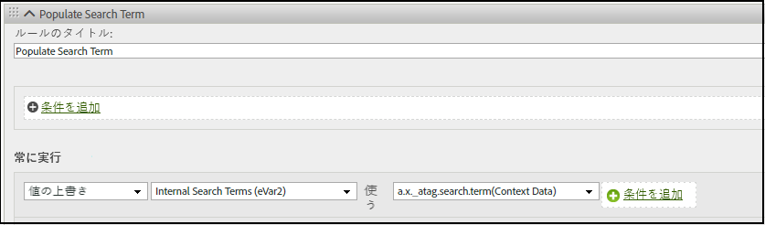

# XDM データの Analytics への手動マッピング

Adobe Experience Platform（AEP）Web SDK には、Platform と Analytics の間でデータを手動でマッピングするのに役立つツールが含まれています。

XDM データが自動的に Analytics にマッピングされない場合は、[コンテキストデータ](https://docs.adobe.com/content/help/ja-JP/analytics/implementation/vars/page-vars/contextdata.html)を追加して、[スキーマ](https://docs.adobe.com/content/help/ja-JP/experience-platform/xdm/schema/composition.html)に合わせることができます。その後、Analytics の[処理ルール](https://docs.adobe.com/content/help/ja-JP/analytics/admin/admin-tools/processing-rules/processing-rules-configuration/t-processing-rules.html)で Analytics 変数を設定するために使用できます 。

また、デフォルトのアクションと製品リストのセットを使用して、AEP Web SDK でデータを送信または取得できます。これをおこなうには、「[製品](https://docs.adobe.com/content/help/ja-JP/experience-platform/edge/implement/commerce.html)」を参照してください。

## コンテキストデータ

Analytics が使用するために、XDM データはドット表記を使用してフラット化され、`contextData` として使用できます。次の値のペアのリストは、`context data` の例を示しています。

```javascript
{
          "bh": "900",
          "bw": "1680",
          "c": "24",
          "c.a.d.key.[0]": "value1",
          "c.a.d.key.[1]": "value2",
          "c.a.d.object.key1": "value1",
          "c.a.d.object.key2.[0]": "value2",
          "c.a.x.environment.browserdetails.javascriptenabled": "true",
          "c.a.x.environment.type": "browser",
          "cust_hit_time_gmt": "1579781427",
          "g": "http://example.com/home",
          "gn": "home",
          "j": "1.8.5",
          "k": "Y",
          "s": "1680x1050",
          "tnta": "218287:1:0|0,218287:1:0|2,218287:1:0|1,218287:1:0|32767,218287:1:0|1,218287:1:0|0,218287:1:0|1,218287:1:0|0,218287:1:0|1",
          "user_agent": "Mozilla/5.0 AppleWebKit/537.36 Safari/537.36",
          "v": "Y"
        }
```

## 処理ルール

エッジネットワークによって収集されたすべてのデータへは、[処理ルール](https://docs.adobe.com/content/help/ja-JP/analytics/admin/admin-tools/processing-rules/processing-rules-configuration/t-processing-rules.html)を介してアクセスできます。Analytics では、処理ルールを使用して、コンテキストデータを Analytics 変数に組み込むことができます。

例えば、次のルールでは、Analytics を設定して&#x200B;**内部検索用語（eVar2）** に **a.x_atag.search.term(Context Data)**&#x200B;に関連付けられたデータを入力します。




## XDM スキーマ

Experience Platform では、スキーマを使用して、一貫した再利用可能な方法でデータの構造を記述します。システム間で一貫したデータを定義することで、意味を保持しやすくなり、データから価値を得ることができます。Analytics のコンテキストデータは、スキーマで定義された構造と連携します。

次の例は、AEP Web SDK でデータを送信および取得するために [`event` コマンド](https://docs.adobe.com/content/help/ja-JP/experience-platform/edge/fundamentals/tracking-events.html)を `xdm` オプションで使用する方法を示しています。この例では、`event` コマンドは [ExperienceEvent Commerce 詳細スキーマ](https://github.com/adobe/xdm/blob/1c22180490558e3c13352fe3e0540cb7e93c69ca/docs/reference/context/experienceevent-commerce.schema.md)に一致し、productListItems の `name` と `SKU` 値が追跡されるようにします。


```
alloy("event",{
  "xdm":{
    "commerce":{
      "productViews":{
        "value":1
      }
    },
    "productListItems":[
      {
        "SKU":"HT105",
        "name":"Large Field Hat",
      },
      {
        "SKU":"HT104",
        "name":"Small Field Hat",
      }
    ]
  }
});
```

AEP Web SDK を使用したイベントのトラッキングについて詳しくは、「[トラッキングイベント](https://docs.adobe.com/content/help/ja-JP/experience-platform/edge/fundamentals/tracking-events.html)」を参照してください。
