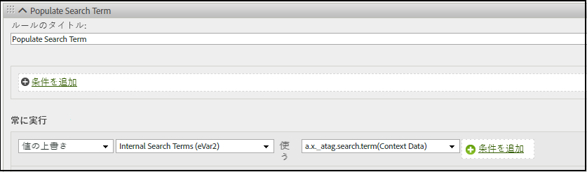

# Adobe Analyticsへの XDM オブジェクトフィールドのマッピング

次の表に、Adobe Experience Platform Edge Network が Adobe Analytics に自動的にマッピングする XDM 変数を示します。これらの XDM フィールドパスを使用する場合、Adobe Analytics にデータを送信するための追加設定は必要ありません。これらのフィールドは、**[!UICONTROL Adobe Analytics ExperienceEvent テンプレート]**&#x200B;フィールドグループに含まれています。Adobe Analytics と Adobe Experience Platform の両方にデータを送信する場合は、これらのフィールドの使用をお勧めします。

組織が Customer Journey Analytics に移行する予定がある場合、アドビでは、代わりに `data` オブジェクトを使用して、スキーマに準拠せずにデータを Adobe Analytics に直接送信することをお勧めします。この戦略により、組織は [!UICONTROL Adobe Analytics ExperienceEvent テンプレート]（Customer Journey Analytics にはあまり適していません）を使用する代わりに、独自のスキーマを使用できます。類似のマッピングテーブルについて詳しくは、[Adobe Analytics へのデータオブジェクト変数のマッピング](data-var-mapping.md)を参照してください。

## 値の優先度

このテーブル内のほとんどの XDM オブジェクトフィールドは、[&#x200B; マッピングされたデータオブジェクトフィールド &#x200B;](data-var-mapping.md) に対応しています。 Adobe Analyticsの取り込み時に、値は最初に XDM から Analytics 変数にマッピングされます。 認識されたデータオブジェクトフィールドはマッピングされ、同じ Analytics 変数にマッピングされると、以前に設定された値が上書きされます。 例えば、`data.__adobe.analytics.events` が存在する場合、XDM から派生するイベントのセット全体が置き換えられます。イベントは両方のソースで組み合わされません。

## XDM オブジェクトフィールドのマッピング

このテーブルの以前の更新は、このページの [GitHub のコミット履歴](https://github.com/AdobeDocs/analytics.ja-JP/commits/main/help/implement/aep-edge/xdm-var-mapping.md)で確認できます。

| XDM フィールドパス | Analytics の変数と説明 |
| --- | --- |
| `xdm.application.isClose` | モバイルライフサイクル指標である[クラッシュ回数](https://developer.adobe.com/client-sdks/home/base/mobile-core/lifecycle/metrics/)の定義に役立ちます。 |
| `xdm.application.isInstall` | モバイルライフサイクル指標である[初回起動数](https://developer.adobe.com/client-sdks/home/base/mobile-core/lifecycle/metrics/)を増やすタイミングを判断するのに役立ちます。 |
| `xdm.application.closeType` | 終了イベントがクラッシュであるかどうかを判断します。有効な値は `close`（ライフサイクルセッションが終了し、前のセッションで一時停止イベントを受け取った場合）、`unknown`（ライフサイクルセッションは一時停止イベントなしで終了する）です。モバイルライフサイクル指標である[クラッシュ回数](https://developer.adobe.com/client-sdks/home/base/mobile-core/lifecycle/metrics/)の設定に役立ちます。 |
| `xdm.application.isInstall` | モバイルライフサイクル指標である[インストール数](https://developer.adobe.com/client-sdks/home/base/mobile-core/lifecycle/metrics/)。 |
| `xdm.application.isLaunch` | モバイルライフサイクル指標である[起動回数](https://developer.adobe.com/client-sdks/home/base/mobile-core/lifecycle/metrics/)。 |
| `xdm.application.name` | モバイルライフサイクルディメンションである[アプリ ID](https://developer.adobe.com/client-sdks/home/base/mobile-core/lifecycle/metrics/) の設定に役立ちます。 |
| `xdm.application.isUpgrade` | モバイルライフサイクル指標である[アップグレード回数](https://developer.adobe.com/client-sdks/home/base/mobile-core/lifecycle/metrics/)。 |
| `xdm.application.version` | モバイルライフサイクルディメンションである[アプリ ID](https://developer.adobe.com/client-sdks/home/base/mobile-core/lifecycle/metrics/) の設定に役立ちます。 |
| `xdm.application.sessionLength` | モバイルライフサイクル指標である[前のセッションの長さ](https://developer.adobe.com/client-sdks/home/base/mobile-core/lifecycle/metrics/)。 |
| `xdm.commerce.checkouts.id` | [イベントのシリアル化](../vars/page-vars/events/event-serialization.md)を「[チェックアウト](/help/components/metrics/checkouts.md)」指標に適用します。 |
| `xdm.commerce.checkouts.value` | 「[チェックアウト](/help/components/metrics/checkouts.md)」指標を必要な量だけ増分します。 |
| `xdm.commerce.order.currencyCode` | [currencyCode](../vars/config-vars/currencycode.md) 設定変数を設定します。 |
| `xdm.commerce.order.purchaseID` | [purchaseID](../vars/page-vars/purchaseid.md) ページ変数を設定します。 |
| `xdm.commerce.order.payments[0].transactionID` | [transactionID](../vars/page-vars/transactionid.md) ページ変数を設定します。 |
| `xdm.commerce.productListAdds.id` | [イベントのシリアル化](../vars/page-vars/events/event-serialization.md)を「[買い物かごへの追加](/help/components/metrics/cart-additions.md)」指標に適用します。 |
| `xdm.commerce.productListAdds.value` | 「[買い物かごへの追加件数](/help/components/metrics/cart-additions.md)」指標を増分します。 |
| `xdm.commerce.productListOpens.id` | [イベントのシリアル化](../vars/page-vars/events/event-serialization.md)を「[買い物かご](/help/components/metrics/carts.md)」指標に適用します。 |
| `xdm.commerce.productListOpens.value` | 「[買い物かご](/help/components/metrics/carts.md)」指標を増分します。 |
| `xdm.commerce.productListRemovals.id` | [イベントのシリアル化](../vars/page-vars/events/event-serialization.md)を「[買い物かごからの削除件数](/help/components/metrics/cart-removals.md)」指標に適用します。 |
| `xdm.commerce.productListRemovals.value` | 「[買い物かごからの削除件数](/help/components/metrics/cart-removals.md)」指標を増分します。 |
| `xdm.commerce.productListViews.id` | [イベントのシリアル化](../vars/page-vars/events/event-serialization.md)を「[買い物かごの表示回数](/help/components/metrics/cart-views.md)」指標に適用します。 |
| `xdm.commerce.productListViews.value` | 「[買い物かごの表示回数](/help/components/metrics/cart-views.md)」指標を増分します。 |
| `xdm.commerce.productViews.id` | [イベントのシリアル化](../vars/page-vars/events/event-serialization.md)を「[製品表示回数](/help/components/metrics/product-views.md)」指標に適用します。 |
| `xdm.commerce.productViews.value` | 「[製品表示回数](/help/components/metrics/product-views.md)」指標を増分します。 |
| `xdm.commerce.purchases.value` | 「[注文件数](/help/components/metrics/orders.md)」指標を増分します。 |
| `xdm.device.model` | モバイルライフサイクルディメンションである[デバイス名](https://developer.adobe.com/client-sdks/home/base/mobile-core/lifecycle/metrics/)。 |
| `xdm.device.colorDepth` | 「[色深度](/help/components/dimensions/color-depth.md)」ディメンションの設定に役立ちます。 |
| `xdm.device.screenHeight` | 「[画面の解像度](/help/components/dimensions/monitor-resolution.md)」ディメンションの設定に役立ちます。 |
| `xdm.device.screenWidth` | 「[画面の解像度](/help/components/dimensions/monitor-resolution.md)」ディメンションの設定に役立ちます。 |
| `xdm.device.type` | モバイルデバイスのタイプ。 |
| `xdm.environment.browserDetails.acceptLanguage` | [言語](/help/components/dimensions/language.md)ディメンションの設定に役立ちます。 |
| `xdm.environment.browserDetails.cookiesEnabled` | [cookie サポート](/help/components/dimensions/cookie-support.md)ディメンションを設定します。有効な値は `Y` （ブラウザーが cookie を受け入れる）および `N` （ブラウザーが cookie を拒否する）です。 |
| `xdm.environment.browserDetails.javaEnabled` | [Java 対応](/help/components/dimensions/java-enabled.md)ディメンションを設定します。有効な値は `Y` (Java が有効) と `N` (Java が無効) です。 |
| `xdm.environment.browserDetails.userAgent` | フォールバックの[ユニーク訪問者](/help/components/metrics/unique-visitors.md)識別方法として使用します。通常、`User-Agent` HTTP リクエストヘッダーを使用して生成します。このフィールドをレポートで使用する場合は、eVar にマッピングできます。 |
| `xdm.environment.browserDetails.viewportHeight` | [ブラウザーの高さ](/help/components/dimensions/browser-height.md)ディメンションを設定します。 |
| `xdm.environment.browserDetails.viewportWidth` | [ブラウザーの幅](/help/components/dimensions/browser-width.md)ディメンションを設定します。 |
| `xdm.environment.carrier` | モバイルライフサイクルディメンションである[通信事業者名](https://developer.adobe.com/client-sdks/home/base/mobile-core/lifecycle/metrics/)。 |
| `xdm.environment.connectionType` | [接続タイプ](/help/components/dimensions/connection-type.md)ディメンションの設定に役立ちます。 |
| `xdm.environment._dc.language` | コンテキストデータ変数 `a.locale` を設定します。`xdm.environment.language` を設定していない場合にのみ使用されます。アドビでは、`xdm.environment.language` よりもこのフィールドの使用をお勧めします。 |
| `xdm.environment.ipV4` | フォールバックの[ユニーク訪問者](/help/components/metrics/unique-visitors.md)識別方法として使用します。通常、`X-Forwarded-For` HTTP ヘッダーを使用して生成します。 |
| `xdm.environment.language` | コンテキストデータ変数 `a.locale` を設定します。アドビでは、代わりに `xdm.environment._dc.language` の使用をお勧めします。 |
| `xdm.environment.operatingSystem` | モバイルライフサイクルディメンションである[オペレーティングシステム](https://developer.adobe.com/client-sdks/home/base/mobile-core/lifecycle/metrics/)。 |
| `xdm.environment.operatingSystemVersion` | モバイルライフサイクルディメンションである[オペレーティングシステムのバージョン](https://developer.adobe.com/client-sdks/home/base/mobile-core/lifecycle/metrics/)の設定に役立ちます。 |
| `xdm._experience.analytics.customDimensions.`<br/>`eVars.eVar1`<br/>`[...]`<br/>`xdm._experience.analytics.customDimensions.`<br/>`eVars.eVar250` | それぞれの [eVar](/help/components/dimensions/evar.md) ディメンションを設定します。 |
| `xdm._experience.analytics.customDimensions.`<br/>`hierarchies.hier1`<br/>`[...]`<br/>`xdm._experience.analytics.customDimensions.`<br/>`hierarchies.hier5` | それぞれの[階層](/help/components/dimensions/hierarchy.md)ディメンションを設定します。 |
| `xdm._experience.analytics.customDimensions.`<br/>`listProps.prop1.delimiter`<br/>`[...]`<br/>`xdm._experience.analytics.customDimensions.`<br/>`listProps.prop75.delimiter` | リスト prop の区切り文字の上書き。区切り文字はレポートスイート設定の[トラフィック変数管理](/help/admin/tools/manage-rs/edit-settings/c-traffic-variables/traffic-var.md)から自動的に取得されるので、このフィールドの使用はお勧めしません。このフィールドを使用すると、使用される区切り文字と Analytics が想定する区切り文字との間に不一致が発生する可能性があります。 |
| `xdm._experience.analytics.customDimensions.`<br/>`listProps.prop1.values`<br/>`[...]`<br/>`xdm._experience.analytics.customDimensions.`<br/>`listProps.prop75.values` | それぞれの[リスト prop](../vars/page-vars/prop.md#list-props) 値を含んだ文字列配列。 |
| `xdm._experience.analytics.customDimensions.`<br/>`lists.list1.list[].value`<br/>`[...]`<br/>`xdm._experience.analytics.customDimensions.`<br/>`lists.list3.list[].value` | それぞれの `value` 配列内のすべての `list[]` 文字列をそれぞれの[リスト変数](../vars/page-vars/list.md)に連結します。区切り文字は、[レポートスイート設定](/help/admin/tools/manage-rs/edit-settings/conversion-var-admin/list-var-admin.md)で設定された値に基づいて自動的に選択されます。 |
| `xdm._experience.analytics.customDimensions.`<br/>`props.prop1`<br/>`[...]`<br/>`xdm._experience.analytics.customDimensions.`<br/>`props.prop75` | それぞれの [prop](/help/components/dimensions/prop.md) ディメンションを設定します。 |
| `xdm._experience.analytics.event1to100.`<br/>`event1.id`<br/>`[...]`<br/>`xdm._experience.analytics.event901to1000.`<br/>`event1000.id` | それぞれの[カスタムイベント](/help/components/metrics/custom-events.md)指標に[イベントのシリアル化](../vars/page-vars/events/event-serialization.md)を適用します。各イベント ID は、それに対応する 100 グループの親に存在します。例えば、`event678` にシリアル化を適用するには、`xdm._experience.analytics.event601to700.event678.id` を使用します。 |
| `xdm._experience.analytics.event1to100.`<br/>`event1.value`<br/>`[...]`<br/>`xdm._experience.analytics.event901to1000.`<br/>`event1000.value` | それぞれの[カスタムイベント](/help/components/metrics/custom-events.md)指標を必要な量だけ増分します。各イベントは、それに対応する 100 グループの親に存在します。例えば、`event567` のフィールドは `xdm._experience.analytics.event501to600.event567.value` です。 |
| `xdm.identityMap.ECID[0].id` | [Adobe Experience Cloud ID サービスの ID](https://experienceleague.adobe.com/ja/docs/id-service/using/home)。 |
| `xdm.marketing.trackingCode` | [トラッキングコード](/help/components/dimensions/tracking-code.md)ディメンションを設定します。 |
| `xdm.media.mediaTimed.completes.value` | ストリーミングメディアサービス指標「[コンテンツ完了](https://experienceleague.adobe.com/ja/docs/media-analytics/using/implementation/variables/audio-video-parameters#content-complete)」。 |
| `xdm.media.mediaTimed.dropBeforeStart.value` | `a.media.view`、`a.media.timePlayed`、`a.media.play` |
| `xdm.media.mediaTimed.federated.value` | ストリーミングメディアサービス指標「[連合データ](https://experienceleague.adobe.com/ja/docs/media-analytics/using/implementation/variables/audio-video-parameters#federated-data)」。 |
| `xdm.media.mediaTimed.firstQuartiles.value` | ストリーミングメディアサービス指標「[25％進捗マーカー](https://experienceleague.adobe.com/ja/docs/media-analytics/using/implementation/variables/audio-video-parameters#twenty-five--progress-marker)」。 |
| `xdm.media.mediaTimed.mediaSegmentView.value` | ストリーミングメディアサービス指標「[コンテンツセグメント閲覧回数](https://experienceleague.adobe.com/ja/docs/media-analytics/using/implementation/variables/audio-video-parameters#content-segment-views)」。 |
| `xdm.media.mediaTimed.midpoints.value` | ストリーミングメディアサービス指標「[50％進捗マーカー](https://experienceleague.adobe.com/ja/docs/media-analytics/using/implementation/variables/audio-video-parameters#progress-marker)」。 |
| `xdm.media.mediaTimed.pauseTime.value` | ストリーミングメディアサービス指標「[一時停止時間合計](https://experienceleague.adobe.com/ja/docs/media-analytics/using/implementation/variables/audio-video-parameters#total-pause-duration)」。 |
| `xdm.media.mediaTimed.pauses.value` | ストリーミングメディアサービス指標「[一時停止イベント](https://experienceleague.adobe.com/ja/docs/media-analytics/using/implementation/variables/audio-video-parameters#pause-events)」。 |
| `xdm.mediaCollection.sessionDetails.assetID` | ストリーミングメディアサービスディメンション「[アセット ID](https://experienceleague.adobe.com/ja/docs/media-analytics/using/implementation/variables/audio-video-parameters#asset-id)」。 |
| `xdm.mediaCollection.sessionDetails.friendlyName` | ストリーミングメディアサービスディメンション「[ビデオ名](https://experienceleague.adobe.com/ja/docs/media-analytics/using/implementation/variables/audio-video-parameters#video-name)」。 |
| `xdm.mediaCollection.sessionDetails.originator` | ストリーミングメディアサービス ディメンション「[作成者](https://experienceleague.adobe.com/ja/docs/media-analytics/using/implementation/variables/audio-video-parameters#originator)」。 |
| `xdm.mediaCollection.sessionDetails.episode` | ストリーミングメディアサービスディメンション「[エピソード](https://experienceleague.adobe.com/ja/docs/media-analytics/using/implementation/variables/audio-video-parameters#episode)」。 |
| `xdm.mediaCollection.sessionDetails.genre` | ストリーミングメディアサービスディメンション「[ジャンル](https://experienceleague.adobe.com/ja/docs/media-analytics/using/implementation/variables/audio-video-parameters#genre)」。 |
| `xdm.mediaCollection.sessionDetails.rating` | ストリーミングメディアサービスディメンション「[コンテンツ評価](https://experienceleague.adobe.com/ja/docs/media-analytics/using/implementation/variables/audio-video-parameters#content-rating)」。 |
| `xdm.mediaCollection.sessionDetails.season` | ストリーミングメディアサービスディメンション「[シーズン](https://experienceleague.adobe.com/ja/docs/media-analytics/using/implementation/variables/audio-video-parameters#season)」。 |
| `xdm.mediaCollection.sessionDetails.name` | ストリーミングメディアサービスディメンション「[コンテンツ ID](https://experienceleague.adobe.com/ja/docs/media-analytics/using/implementation/variables/audio-video-parameters#content-id)」。 |
| `xdm.mediaCollection.sessionDetails.show` | ストリーミングメディアサービスディメンション「[番組](https://experienceleague.adobe.com/ja/docs/media-analytics/using/implementation/variables/audio-video-parameters#show)」。 |
| `xdm.mediaCollection.sessionDetails.showType` | ストリーミングメディアサービスディメンション「[番組タイプ](https://experienceleague.adobe.com/ja/docs/media-analytics/using/implementation/variables/audio-video-parameters#show-type)」。 |
| `xdm.mediaCollection.sessionDetails.length` | ストリーミングメディアサービスディメンション「[ビデオの長さ](https://experienceleague.adobe.com/ja/docs/media-analytics/using/implementation/variables/audio-video-parameters#video-length)」。 |
| `xdm.media.mediaTimed.primaryAssetViewDetails.@id` | ストリーミングメディアサービスディメンション「[メディアセッション ID](https://experienceleague.adobe.com/ja/docs/media-analytics/using/implementation/variables/audio-video-parameters#media-session-id)」。 |
| `xdm.mediaCollection.sessionDetails.channel` | ストリーミングメディアサービスディメンション「[コンテンツチャネル](https://experienceleague.adobe.com/ja/docs/media-analytics/using/implementation/variables/audio-video-parameters#content-channel)」。 |
| `xdm.mediaCollection.sessionDetails.contentType` | ストリーミングメディアサービスディメンション「[コンテンツタイプ](https://experienceleague.adobe.com/ja/docs/media-analytics/using/implementation/variables/audio-video-parameters#content-type)」。 |
| `xdm.mediaCollection.sessionDetails.network` | ストリーミングメディアサービスディメンション「[ネットワーク](https://experienceleague.adobe.com/ja/docs/media-analytics/using/implementation/variables/audio-video-parameters#network)」。 |
| `xdm.media.mediaTimed.primaryAssetViewDetails.`<br/>`mediaSegmentView.value` | ストリーミングメディアサービスディメンション「[コンテンツセグメント](https://experienceleague.adobe.com/ja/docs/media-analytics/using/implementation/variables/audio-video-parameters#content-segment)」。 |
| `xdm.mediaCollection.sessionDetails.playerName` | ストリーミングメディアサービスディメンション「[コンテンツプレイヤー名](https://experienceleague.adobe.com/ja/docs/media-analytics/using/implementation/variables/audio-video-parameters#content-player-name)」。 |
| `xdm.mediaCollection.sessionDetails.appVersion` | ストリーミングメディアサービスディメンション「[SDK バージョン](https://experienceleague.adobe.com/ja/docs/media-analytics/using/implementation/variables/audio-video-parameters#sdk-version)」。 |
| `xdm.mediaCollection.sessionDetails.feed` | ストリーミングメディアサービスディメンション「[メディアフィードのタイプ](https://experienceleague.adobe.com/ja/docs/media-analytics/using/implementation/variables/audio-video-parameters#media-feed-type)」。 |
| `xdm.mediaCollection.sessionDetails.streamFormat` | ストリーミングメディアサービスディメンション「[ストリーム形式](https://experienceleague.adobe.com/ja/docs/media-analytics/using/implementation/variables/audio-video-parameters#stream-format)」。 |
| `xdm.media.mediaTimed.progress10.value` | ストリーミングメディアサービス指標「[10％進捗マーカー](https://experienceleague.adobe.com/ja/docs/media-analytics/using/implementation/variables/audio-video-parameters#ten--progress-marker)」。 |
| `xdm.media.mediaTimed.progress95.value` | ストリーミングメディアサービス指標「[95％進捗マーカー](https://experienceleague.adobe.com/ja/docs/media-analytics/using/implementation/variables/audio-video-parameters#ninety-five--progress-marker)」。 |
| `xdm.mediaCollection.sessionDetails.hasResume` | ストリーミングメディアサービス指標「[コンテンツ再開](https://experienceleague.adobe.com/ja/docs/media-analytics/using/implementation/variables/audio-video-parameters#content-resumes)」。 |
| `xdm.media.mediaTimed.starts.value` | ストリーミングメディアサービス指標「[メディア開始](https://experienceleague.adobe.com/ja/docs/media-analytics/using/implementation/variables/audio-video-parameters#media-starts)」。 |
| `xdm.media.mediaTimed.thirdQuartiles.value` | ストリーミングメディアサービス指標「[75％進捗マーカー](https://experienceleague.adobe.com/ja/docs/media-analytics/using/implementation/variables/audio-video-parameters#seventy-five--progress-marker)」。 |
| `xdm.media.mediaTimed.timePlayed.value` | ストリーミングメディアサービス指標「[コンテンツ視聴時間](https://experienceleague.adobe.com/ja/docs/media-analytics/using/implementation/variables/audio-video-parameters#content-time-spent)」。 |
| `xdm.media.mediaTimed.totalTimePlayed.value` | ストリーミングメディアサービス指標「[メディア視聴時間](https://experienceleague.adobe.com/ja/docs/media-analytics/using/implementation/variables/audio-video-parameters#media-time-spent)」。 |
| `xdm.placeContext.geo._schema.latitude` | 訪問者の緯度の場所。「[モバイルライフサイクルの場所](/help/components/dimensions/lifecycle-dimensions.md)」ディメンションの設定に役立ちます。 |
| `xdm.placeContext.geo._schema.longitude` | 訪問者の経度の場所。「[モバイルライフサイクルの場所](/help/components/dimensions/lifecycle-dimensions.md)」ディメンションの設定に役立ちます。 |
| `xdm.placeContext.geo.postalCode` | 「[郵便番号](/help/components/dimensions/zip-code.md)」ディメンション。 |
| `xdm.placeContext.geo.stateProvince` | 「[米国の州](/help/components/dimensions/us-states.md)」ディメンション。 |
| `xdm.placeContext.localTime` | [データフィード](/help/export/analytics-data-feed/c-df-contents/datafeeds-reference.md)では `t_time_info` として表示されます。 |
| `xdm.productListItems[]._experience.analytics.`<br/>`customDimensions.eVars.eVar1`<br/>`[...]`<br/>`xdm.productListItems[]._experience.analytics.`<br/>`customDimensions.eVars.eVar250` | eVar に [製品構文](../vars/page-vars/products.md)マーチャンダイジングを適用します。 |
| `xdm.productListItems[]._experience.analytics.`<br/>`event1to100.event1.value`<br/>`[...]`<br/>`xdm.productListItems[]._experience.analytics.`<br/>`event901-1000.event1000.value` | イベントに [product 構文](../vars/page-vars/products.md)マーチャンダイジングを適用します。 |
| `xdm.productListItems[].productCategories[].categoryID` | 「[カテゴリ](/help/components/dimensions/category.md)」ディメンション。[product](../vars/page-vars/products.md) ページ変数も参照してください。 |
| `xdm.productListItems[].name` | 「[製品](/help/components/dimensions/product.md)」ディメンション。[product](../vars/page-vars/products.md) ページ変数も参照してください。`xdm.productListItems[].SKU` と `xdm.productListItems[].name` の両方にデータが含まれている場合、`xdm.productListItems[].SKU` の値が使用されます。 |
| `xdm.productListItems[].priceTotal` | 「[売上高](/help/components/metrics/revenue.md)」指標を判断するのに役立ちます。[product](../vars/page-vars/products.md) ページ変数も参照してください。 |
| `xdm.productListItems[].quantity` | 「[単位](/help/components/metrics/units.md)」指標を判断するのに役立ちます。[product](../vars/page-vars/products.md) ページ変数も参照してください。 |
| `xdm.productListItems[].SKU` | 「[製品](/help/components/dimensions/product.md)」ディメンション。[product](../vars/page-vars/products.md) ページ変数も参照してください。`xdm.productListItems[].SKU` と `xdm.productListItems[].name` の両方にデータが含まれている場合、`xdm.productListItems[].SKU` の値が使用されます。 |
| `xdm.web.webInteraction.URL` | [linkURL](../vars/config-vars/linkurl.md) 実装変数。 |
| `xdm.web.webInteraction.name` | [カスタムリンク](/help/components/dimensions/custom-link.md)、[ダウンロードリンク](/help/components/dimensions/download-link.md)、または[離脱リンク](/help/components/dimensions/exit-link.md)ディメンション（`xdm.web.webInteraction.type` の値によって異なります）。 |
| `xdm.web.webInteraction.type` | クリックされたリンクのタイプを判断します。有効な値は `other`（カスタムリンク）、`download`（ダウンロードリンク）、`exit`（離脱リンク）です。 |
| `xdm.web.webPageDetails.URL` | 「[ページ URL](/help/components/dimensions/page-url.md)」ディメンション。 |
| `xdm.web.webPageDetails.isErrorPage` | 「ページが見つかりませんでした」[ディメンション](/help/components/dimensions/pages-not-found.md)および[指標](/help/components/metrics/pages-not-found.md)を判断するのに役立つフラグ。 |
| `xdm.web.webPageDetails.name` | 「[ページ](/help/components/dimensions/page.md)」ディメンション。 |
| `xdm.web.webPageDetails.server` | 「[サーバー](/help/components/dimensions/server.md)」ディメンション。 |
| `xdm.web.webPageDetails.siteSection` | 「[サイトセクション](/help/components/dimensions/site-section.md)」ディメンション。 |
| `xdm.web.webReferrer.URL` | 「[リファラー](/help/components/dimensions/referrer.md)」ディメンション。 |

{style="table-layout:auto"}

<!-- `environment.browserDetails.javaScriptVersion` and `web.webPageDetails.homePage` were included in the original table, but they no longer exist in Analytics. | -->

## 他の XDM フィールドを Analytics 変数にマッピング

Adobe Analytics に追加するディメンションまたは指標がある場合は、[コンテキストデータ変数](../vars/page-vars/contextdata.md)を通じて行うことができます。

### 暗黙的マッピング

自動的にマッピングされない XDM フィールド要素は、接頭辞 `a.x.` を持つコンテキストデータとして Adobe Analytics に送信されます。その後、[処理ルール](/help/admin/tools/manage-rs/edit-settings/general/processing-rules/pr-overview.md)を使用すると、このコンテキストデータ変数を目的の Analytics 変数にマッピングできます。例えば、次のイベントを送信した場合：

```js
alloy("event",{
    "xdm":{
        "_atag":{
            "search":{
                "term":"Example search term"
            }
        }
    }
})
```

Web SDK は、そのデータをコンテキストデータ変数 `a.x._atag.search.term` として Adobe Analytics に送信します。その後、処理ルールを使用すると、そのコンテキスト `eVar` 変数値を目的の Analytics 変数（データなど）に割り当てることができます。



## 明示的マッピング

また、XDM フィールド要素をコンテキストデータとして明示的にマッピングすることもできます。`contextData` 要素を使用して明示的にマッピングされた XDM フィールド要素は、接頭辞なしのコンテキストデータとして Adobe Analytics に送信されます。その後、[処理ルール](/help/admin/tools/manage-rs/edit-settings/general/processing-rules/pr-overview.md)を使用すると、このコンテキストデータ変数を目的の Analytics 変数にマッピングできます。例えば、次のイベントを送信した場合：

```js
alloy("event",{
    "xdm":{
        "_atag":{
            "analytics": {
                "contextData" : {
                    "someValue" : "1"
                }
            }
        }
    }
})
```

Web SDK は、そのデータを、値が `1` であるコンテキストデータ変数 `somevalue` として Adobe Analytics に送信します。その後、処理ルールを使用すると、そのコンテキスト `eVar` 変数値を目的の Analytics 変数（データなど）に割り当てることができます。


